                    
---                       
#141013             
> 2014년 41주차 **HOT DEVICE EVERY WEEK**                       
                       
             
---                      
  
  
  
  
1. 펜글씨를 디지털로 옮겨 주는 스마트펜 + 센서    
http://techcrunch.com/2014/10/07/the-equil-smartpen-puts-your-physical-notes-and-doodles-in-the-cloud/  
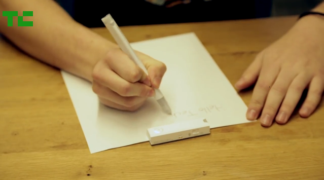  
  
2. 쓰지않는 스마트폰을 스마트홈 허브로 만들어주는 기기  
http://www.digitaltrends.com/home/turn-old-smartphone-smart-home-hub-rico/?sf32156421=1  
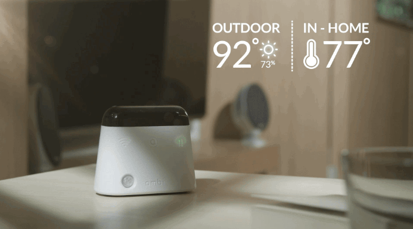  
  
3. 양말에 착용하는 피트니스 트래커  
http://www.theverge.com/2014/10/9/6951929/sensoria-running-fitness-tracker  
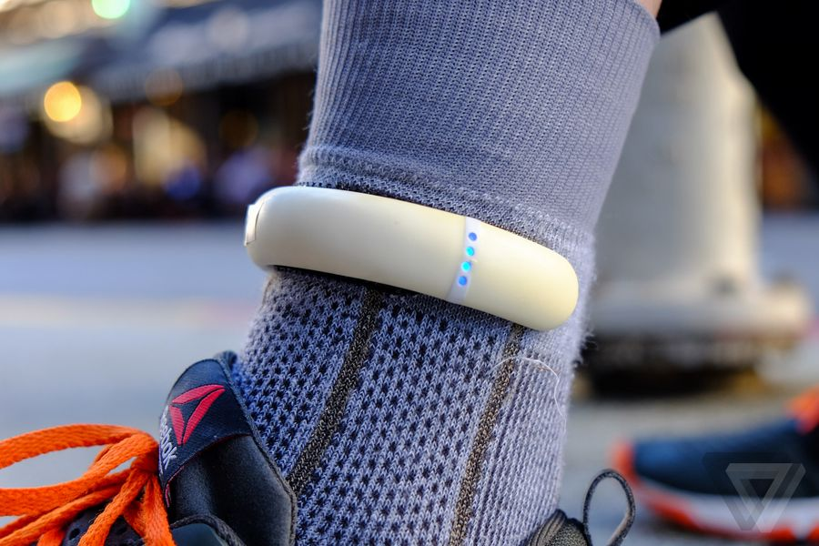  
  
4. 에어컨을 스마트하게 바꿔주는 기기. 실내온도 자동 조절.  
https://www.kickstarter.com/projects/ambi-labs/ambi-climate-the-smart-add-on-for-your-air-conditi  
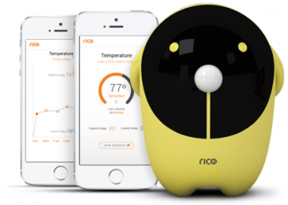  
  
  
  
5. 엄지부분을 좌/우로 비틀면서 방향을 알려주는 네비게이션 기기  
http://www.engadget.com/2014/10/10/ntt-docomo-yubi-navi/?ncid=rss_truncated  
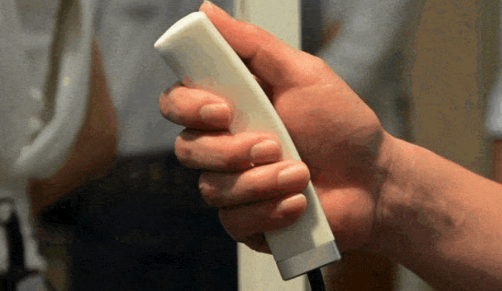  
  
6. 쿨러와 히터로 사용 가능한 손목 밴드 형태의 웨어러블 디바이스   
http://www.cnet.com/news/regulate-your-bodys-temperature-with-this-wearable-bracelet/  
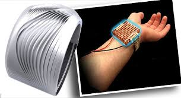  
  
  
  
7. 간단한 혈액검사만으로 암을 발견하는 기기  
http://www.wired.com/2014/10/miroculus/?mbid=social_fb  
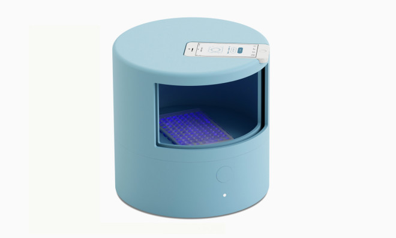  
  
8. 터치 감각을 느낄 수 있는 인공 팔  
http://www.engadget.com/2014/10/10/prosthetic-limbs-sense-of-touch/?ncid=rss_truncated  
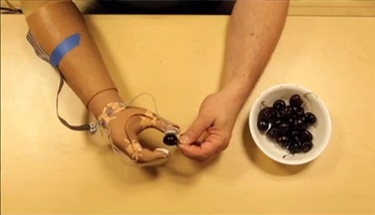  
  
9. 빔 프로젝터가 달려있는 태블릿 PC  
http://thenextweb.com/gadgets/2014/10/09/lenovo-unveils-trio-new-yoga-tablets-8-inch-10-inch-lte-13-3-inch-model/  
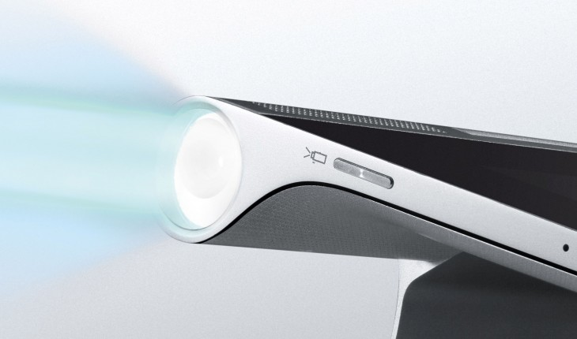  
  
10. HTC 에서 출시한 액션 카메라.  
http://www.engadget.com/2014/10/08/htc-re-camera/?ncid=rss_truncated  
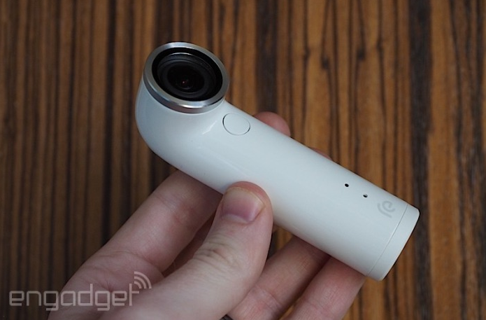  
  
11. 제스쳐로 자신의 기기를 제어할 수 있는 반지형 웨어러블 제품.  
http://www.cnet.com/news/16lab-concept-smart-ring-keeps-all-of-your-devices-within-reach/  
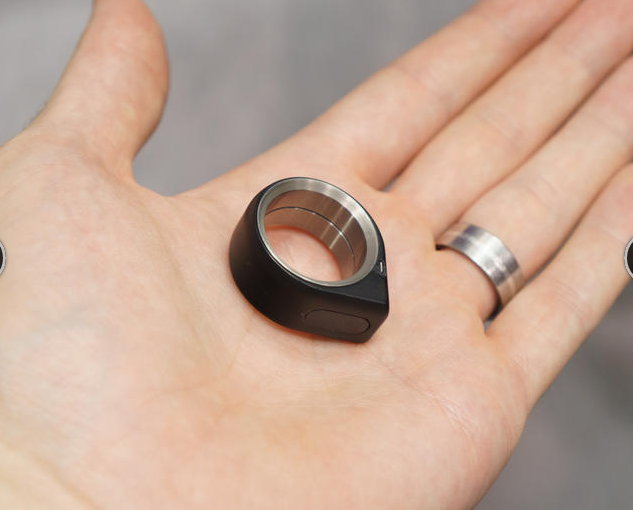  
  
12. 가상현실 헤드셋으로 제어하는 로봇.  
http://www.engadget.com/2014/10/08/robot-oculus-project-ceatec2014/?ncid=rss_truncated  
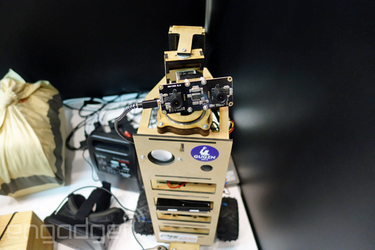  
  
  
13. 작은 스크린을 이용해서 자신이 필요한 다양한 디바이스를 만들 수 있음.  
http://techcrunch.com/2014/10/07/tinyscreen-lets-you-put-a-tiny-screen-on-it/?ncid=rss&utm_source=feedburner&utm_medium=feed&utm_campaign=Feed%3A+Techcrunch+%28TechCrunch%29&utm_content=FaceBook  
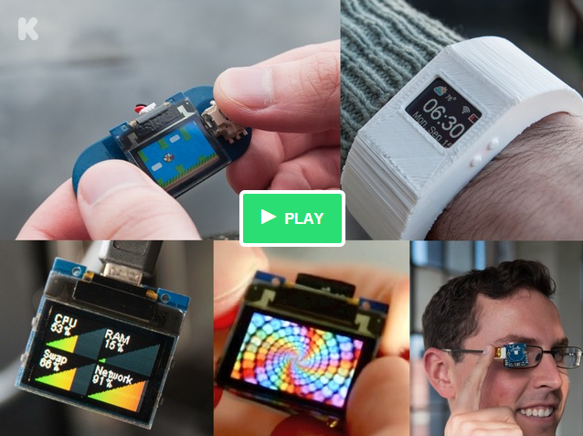  
  
14. 바닥에 쏘는 프로젝터를 이용 실내공간을 비디오 게임으로.  
(1) http://www.engadget.com/2014/10/07/romocart-turns-your-living-room-into-a-video-game/?ncid=rss_truncated  
(2) http://www.earlyadopter.co.kr/7527  
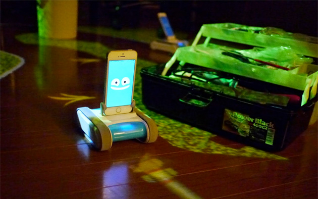  
  
  
