                
---                   
#141027                 
> 2014년 43주차 **HOT DEVICE EVERY WEEK**                   
                   
         
---                  
  
  
  
1. 스티커 형식의 블루투스 전등 스위치. 집안의 원하는 위치에 부착시켜 점/소등.  
http://www.engadget.com/2014/10/21/avi-on-dimmer-switch/?ncid=rss_truncated  
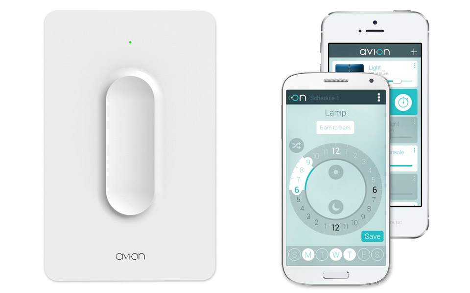  
  
2. 놀이기구를 게임컨트롤러로 만들어주는 기기.  
놀이 기구에 부착시켜 실제 물리적인 움직임을 통해 모바일에서 게임이 가능.  
http://www.engadget.com/2014/10/23/hybrid-play-indiegogo/?ncid=rss_truncated  
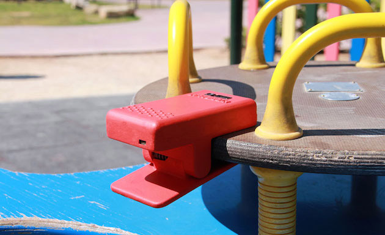  
  
3. 살균이 필요없는 가습기 (Dyson 주의)  
http://www.huffingtonpost.kr/2014/10/20/story_n_6012688.html?utm_hp_ref=korea  
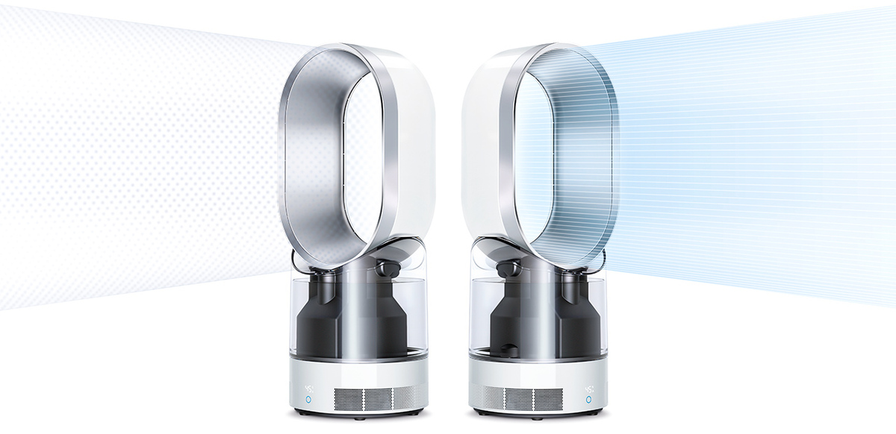  
  
4. 케이블 위에 질량이 있는 추를 이동시키는 방식으로 매우 편리하게 사용할 수 있는 USB 충전 케이블.   
http://www.cnet.com/news/finally-the-phone-charging-cable-youve-been-waiting-for/  
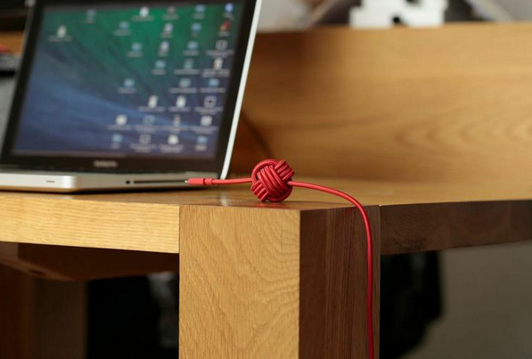  
  
5. 스마트  캐리어 백.  
위치 추적/배터리내장-스마트폰충전/디지털락/여행 데이터 기록  
http://www.engadget.com/2014/10/20/bluesmart-connected-luggage-indiegogo-campaign/?ncid=rss_truncated  
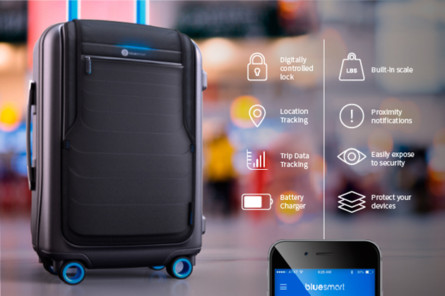  
  
6#. 심장에 부착하여 환자의 상태를 모니터링 할 수 있는 디바이스  
http://venturebeat.com/2014/10/20/how-a-small-wearable-device-is-improving-care-and-saving-money-for-hospitals/  
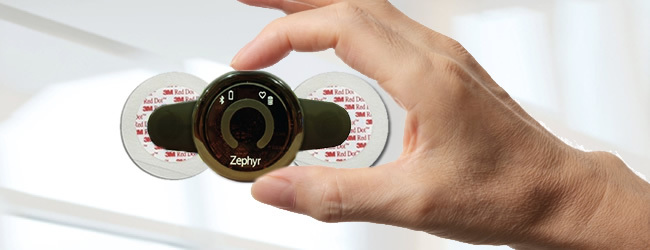  
  
6. 냄비 하단에 가상의 불꽃을 그려주는 인덕션  
http://www.theverge.com/2014/10/26/7070865/samsungs-new-stovetop-projects-virtual-flames-onto-pots-and-pans  
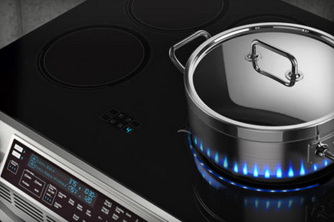  
  
7. 작고 간편한 기능을 사용할 수 있는 휴대폰 이 포함되어 있는 스마트폰 케이스.  
http://www.cnet.com/news/huh-mini-phone-attaches-to-the-phone-you-already-have/  
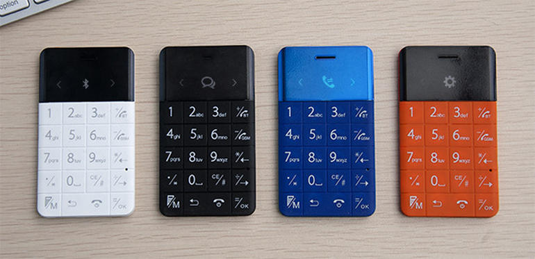  
  
  
8. 가상현실 헤드셋 + 헤드폰  
평상시엔 헤드폰으로 사용 하다가 영상이 보고싶을때 내리면됨.  
http://www.engadget.com/2014/10/22/avegant-glyph-personal-theater-headset/?ncid=rss_truncated  
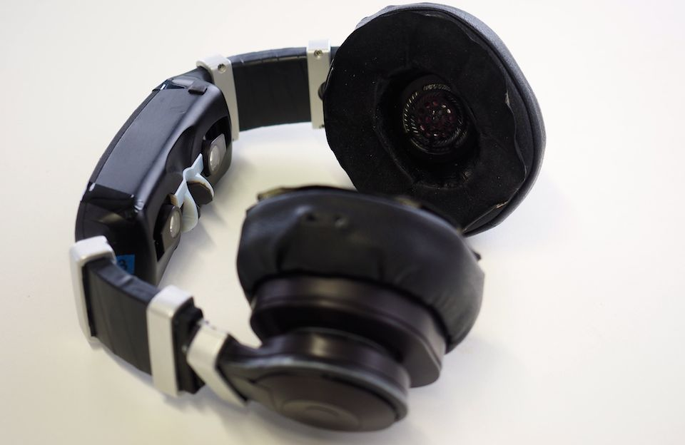  
  
9. 자석으로 원하는 위치에 쉽게 설치가 가능한 보안 카메라.  
http://www.theverge.com/2014/10/21/7026079/homeboy-the-magnetic-security-camera  
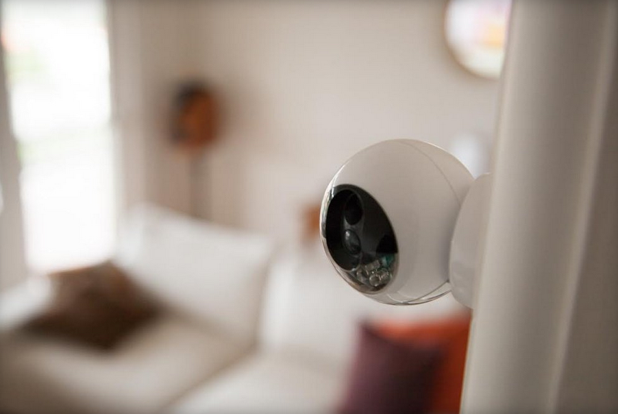  
  
  
10. 오픈소스 스마트 칫솔  
http://www.engadget.com/2014/10/22/goodwell-smart-toothbrush/?ncid=rss_truncated  
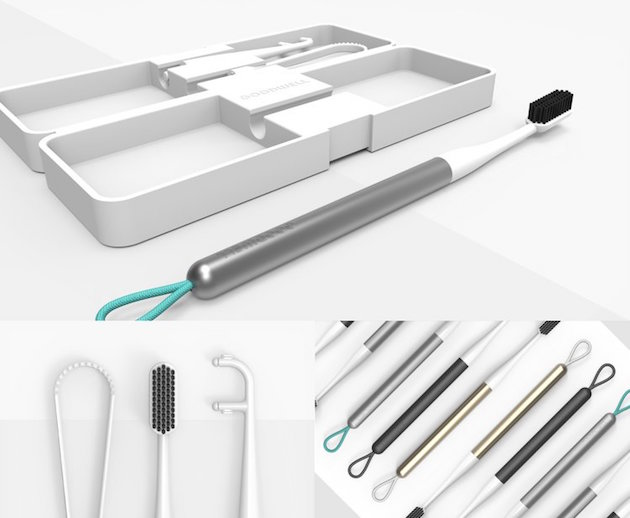  
  
  
11. 유져의 사용 패턴을 학습하는 뮤직 플레이어  
https://www.kickstarter.com/projects/prizm/prizm-turn-your-speakers-into-a-learning-music-pla  
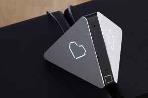  
  
  
12. 모바일용 신용 카드 리더기.  
http://www.engadget.com/2014/10/23/etsy-card-reader/?ncid=rss_truncated  
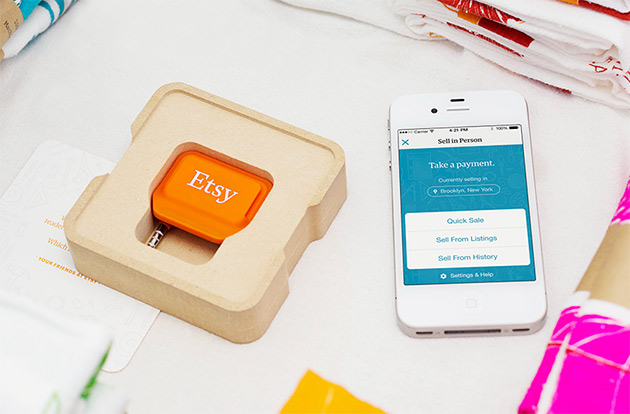  
  
  
13. 휴대용(?) 레이져 커팅 기계  
http://www.cnet.com/news/torch-through-stuff-on-the-fly-with-portable-laser-cutter/  
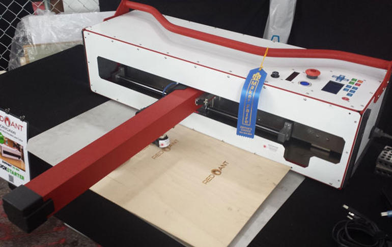  
  
14. 새로운 방식의 잡는(grab) 매커니즘이 적용된 로봇  
http://www.engadget.com/2014/10/25/robotic-hand-electrostatic-attraction/?ncid=rss_truncated  
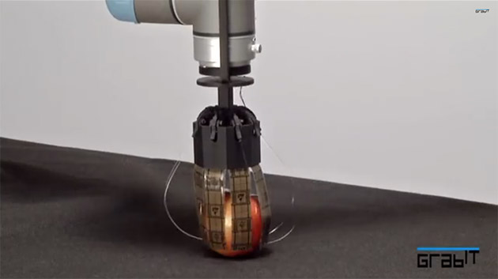  
  
  
  
