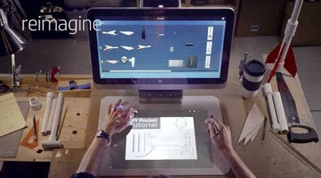
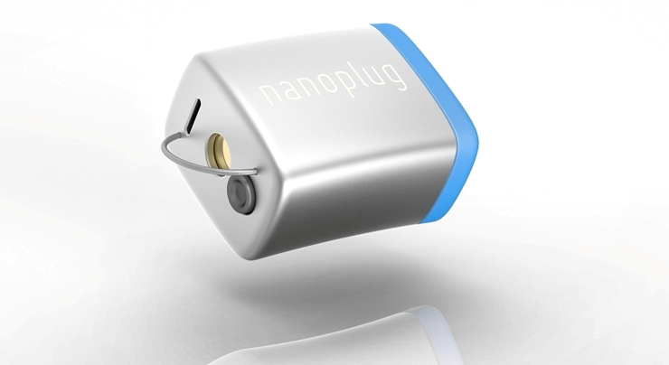
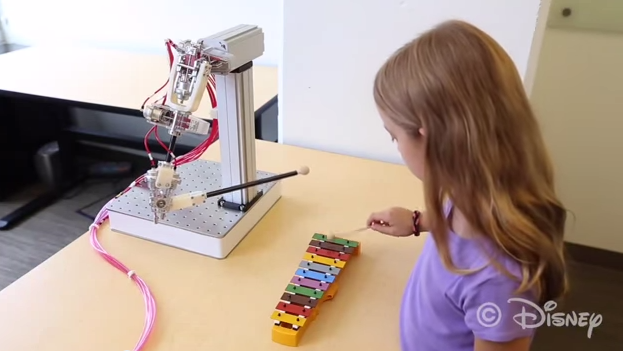
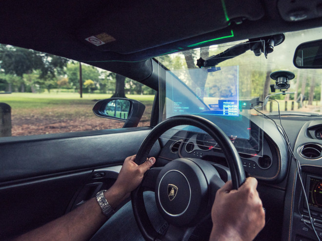
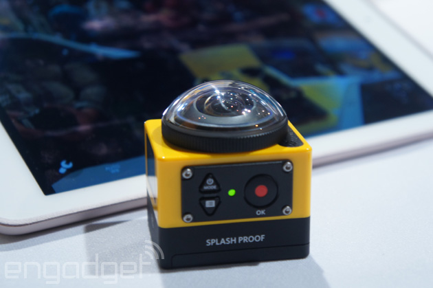
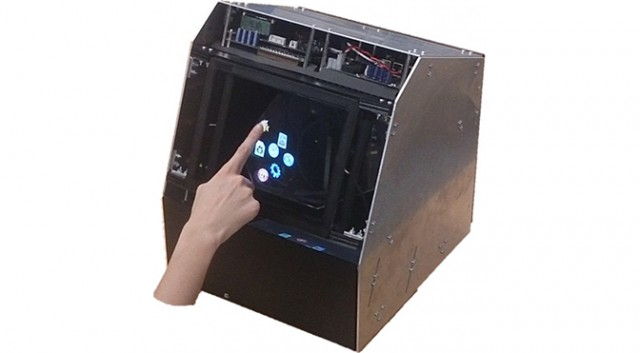
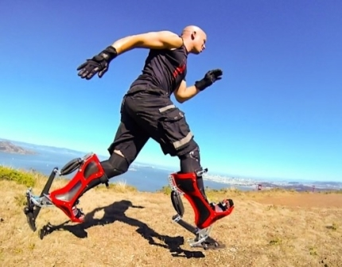
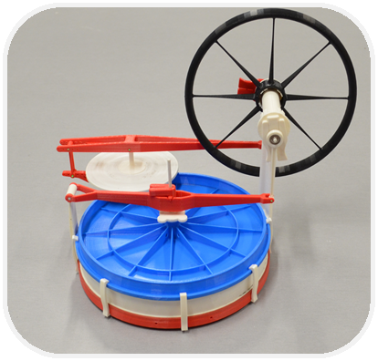

              
---                 
#141104                 
> 2014년 44주차 **HOT DEVICE EVERY WEEK**                 
                 
       
---                
  
  
  
1. 모니터 + 빔프로젝터 + 카메라 가 합쳐지면? (HP)  
새로운 형태의 입/출력 장치를 가진 PC.  
모니터 하단에 빔프로젝터를 쏘고 손이나 펜 등등 제스쳐등을 카메라로 인식함.   
일단 영상 ㄱㄱ  
http://www.engadget.com/2014/10/29/hp-reveals-sprout/?ncid=rss_truncated  
  
  
2. 귀에 꽂아도 보이지 않는 세계 최소 크기 보청기 프로젝트  
https://www.indiegogo.com/projects/nanoplug-the-world-s-first-invisible-hearing-aid  
  
  
3. 모터가 아닌 공기 압력을 이용해 움직이는 로봇 팔 (Disney 주의)  
http://www.youtube.com/watch?v=p3XAi-yR73w&feature=youtu.be  
  
  
4. Vision시스템과 AR(증강현실) 이용한 능동형 자동차 HUD(Head Up Display)   
실제 자동차의 HUD 정보가 운전자의 시야를 방해한다는 연구가 있음.  
더 큰문제는 눈의 초점은 가까이 있는 HUD정보와 유리창 밖의 사물과 동시에 초점이 맞지 않는다는 점.  
이런 문제들을 해결해야 진정한 능동형 자동차 HUD가 될 수 있을 듯.  
http://www.wired.com/2014/10/hud-brings-ghost-cars-to-the-track/?mbid=social_fb  
  
비슷하게 아래 프로젝트는 AR을 이용한 실내용 HUD (참고)  
[영상] http://www.youtube.com/watch?v=cTAYJBfbOCE&list=UU0ME4Nbp4a-9Vdo9GlKr0VQ  
  
  
  
5. 360도 방향이 촬영되는 액션 카메라 (코닥)  
http://www.engadget.com/2014/10/30/kodak-pixpro-sp360-action-cam/?ncid=rss_truncated  
  
  
6. 홀로그램 터치 디스플레이 기술.  
실제로는 공기중에 터치하지만 실제 디스플레이를 터치하는것 같이 느낄 수 있음.  
전혀 보지 못했던 새로운 기술 등장.  
http://www.extremetech.com/extreme/193032-haptic-holographic-display-turns-thin-air-into-a-touchscreen  
  
  
7. 최대 시속 40km 로 달릴 수 있는 생체공학 신발.  
http://m.news.naver.com/read.nhn?mode=LSD&sid1=001&oid=081&aid=0002479456  
  
  
8. 찬물과 뜨거운 물의 이동속도 차이를 이용해 만든 엔진.  
http://blog.naver.com/anatzblog/220165577890  
  
  
  
  
