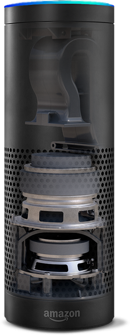
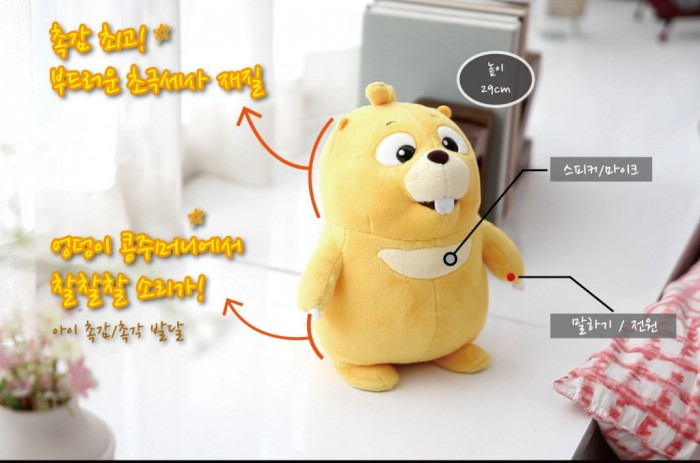
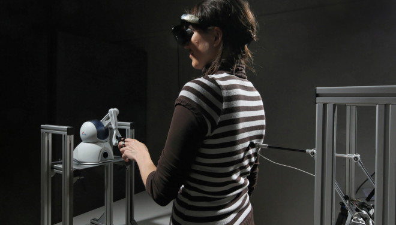
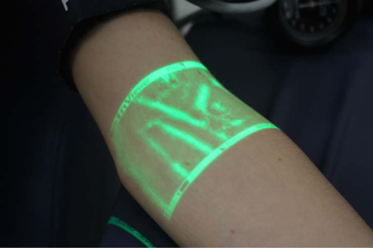
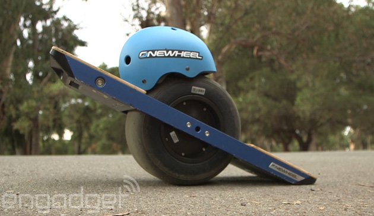

            
---               
#141110               
> 2014년 45주차 **HOT DEVICE EVERY WEEK**               
               
     
---              
  
  
1. 집에서 사용하는 음성인식 로봇 (아마존 에코)  
http://www.earlyadopter.co.kr/8163  
  
  
2. 새처럼 날아다니는 드론  
http://techcrunch.com/2014/11/05/bionic-bird/  
  
  
3. 아이에게 말을 가르치는 인형  
http://www.earlyadopter.co.kr/8137  
  
  
4. 원격으로 물체의 표면 형태와 질감을 느낄 수 있는 기기  
http://www.wired.com/2014/11/robot-ghost/?mbid=social_fb  
  
  
5. 쉽게 핏줄을 찾을 수 있게 도와주는 기기  
http://techcrunch.com/2014/11/02/this-device-could-make-it-easier-to-find-your-veins/?ncid=rss&utm_source=feedburner&utm_medium=feed&utm_campaign=Feed%3A+Techcrunch+%28TechCrunch%29&utm_content=FaceBook  
  
  
6. 원 휠 스케이트 보드.  
http://www.engadget.com/2014/11/03/onewheel-handson/?ncid=rss_truncated  
  
  
7. 무전기의 재해석  
http://www.engadget.com/2014/11/05/onyx-communicator/?ncid=rss_truncated  
  
  
  
