      
---         
#141201         
> 2014년 48주차 **HOT DEVICE EVERY WEEK**         
         
                                    
---        
  
  
  
이번주 추천 프로젝트 : 1, 2, 3, 9번  
  
1. 뒷바퀴에 설치하여 1분안에 전기 자전거로 만들어주는 기기.  
3시간충전시 최대 40km 주행가능, 최고 속도 25km/h  
https://www.kickstarter.com/projects/1732543648/rubbee-the-electric-drive-for-bicycles?ref=discovery  
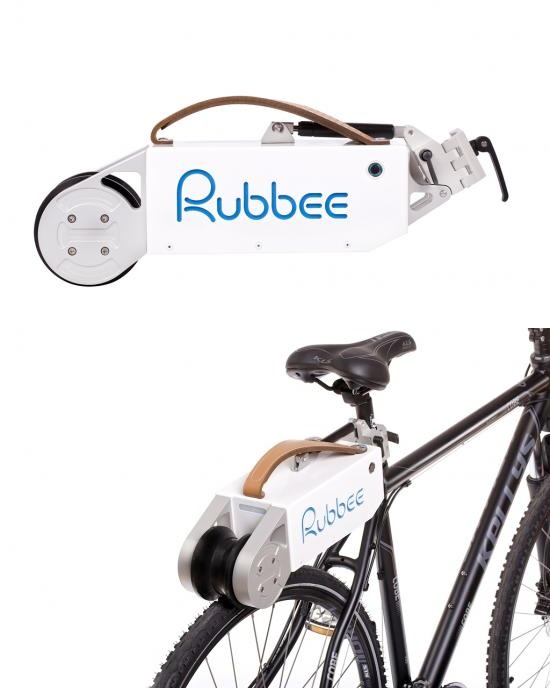  
  
2. 지정해놓은 기능이 바로 실행되는 물리 버튼.  
스마트폰의 무자비한 기능들을 쉽고 간단하게 접근할 수 있는 참신하고 방법.  
http://www.wired.com/2014/11/real-world-button-controlling-favorite-apps/?mbid=social_fb  
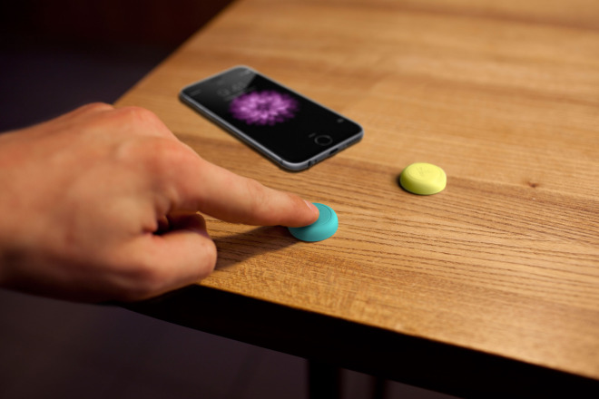  
  
3. 무선 제스쳐 컨트롤러.  
오른쪽엔 마우스, 좌측엔 이 기기를 놓으면 편리할듯.  
http://thecreatorsproject.vice.com/blog/look-ma-no-mouse-a-wireless-gesture-controller-could-change-the-way-you-scroll  
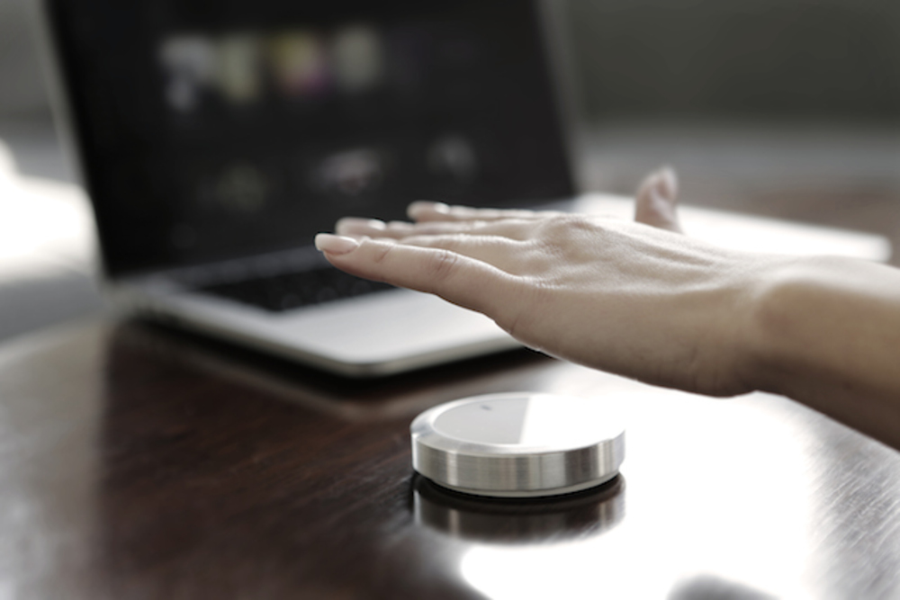  
  
4. 전선없는 크리스마스 트리  
https://www.kickstarter.com/projects/1034423012/aura-the-first-ever-wirelessly-powered-christmas-l?ref=nav_search  
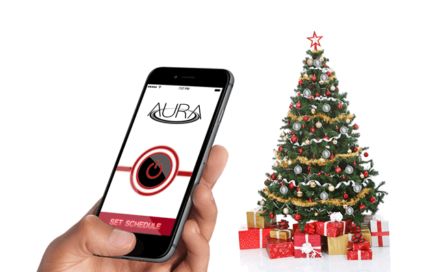  
  
5. 레진을 재료로 사용하는 3D프린터  
http://www.open-electronics.org/ibox-nano-the-worlds-smallest-resin-3d-printer-just-got-funded-on-kickstarter/?utm_content=buffer5f1a7&utm_medium=social&utm_source=facebook.com&utm_campaign=buffer  
  
  
6. 측정 도구의 디지털화  
http://techcrunch.com/2014/11/27/mocaheart/?ncid=rss&utm_source=feedburner&utm_medium=feed&utm_campaign=Feed%3A+Techcrunch+%28TechCrunch%29&utm_content=FaceBook  
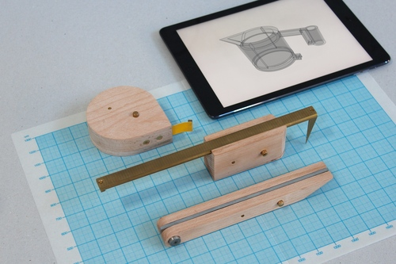  
  
7. 심장 건강상태를 측정,관리 해주는 기기.  
http://techcrunch.com/2014/11/27/mocaheart/?ncid=rss&utm_source=feedburner&utm_medium=feed&utm_campaign=Feed%3A+Techcrunch+%28TechCrunch%29&utm_content=FaceBook  
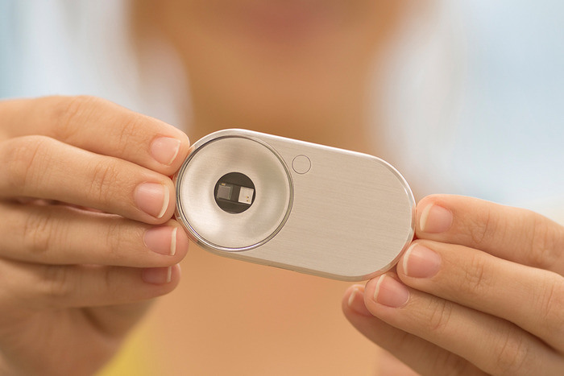  
  
8. 시계줄이 스마트워치, 가지고 있는 시계를 스마트하게 바꿔줌.  
http://www.earlyadopter.co.kr/8826  
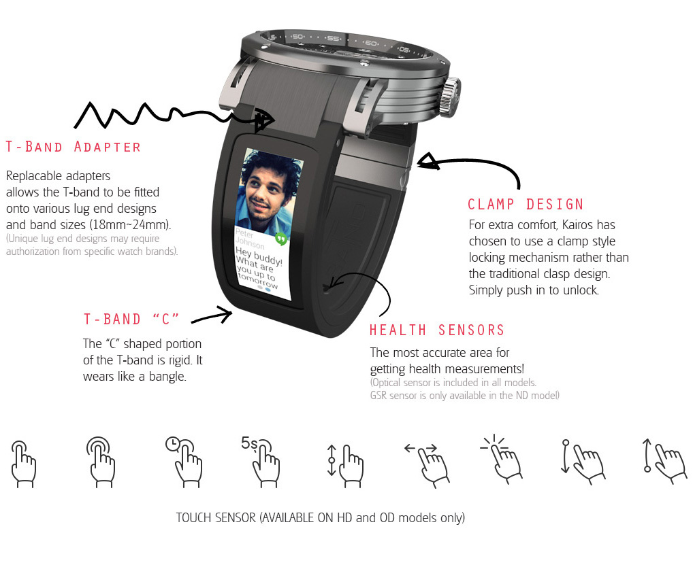  
  
9. 초소형 드론  
https://deals.thenextweb.com/sales/the-skeye-nano-drone?utm_medium=referral&utm_source=thenextweb.com&utm_campaign=skeyenanodrone  
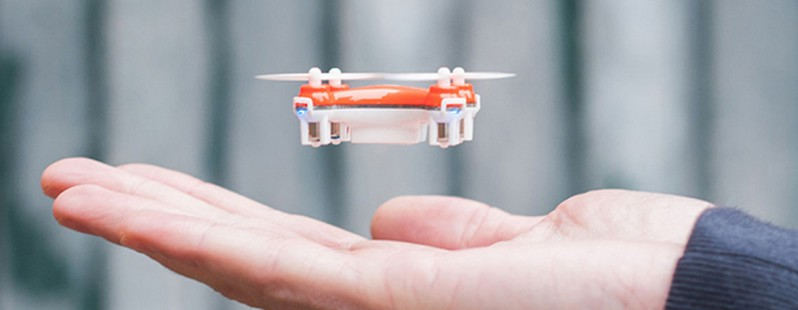  
  
10. 초소형 드론 2  
http://techcrunch.com/2014/11/27/zano-kickstarter/?ncid=rss&utm_source=feedburner&utm_medium=feed&utm_campaign=Feed%3A+Techcrunch+%28TechCrunch%29&utm_content=FaceBook  
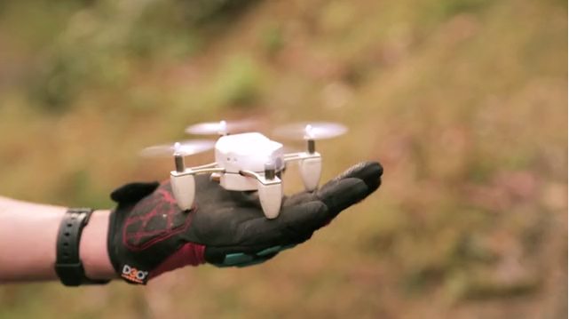  
  
11. 조본업(Jawbone Up) 피트니스 트래커 (새버전)  
http://www.youtube.com/watch?v=wmfYnJb11cw  
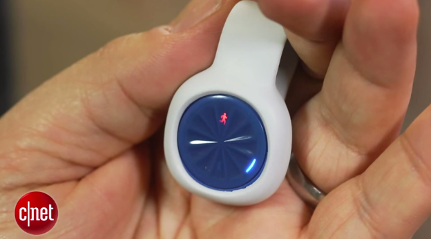  
  
12. 장애인을 위한 안구 마우스 (삼성)  
http://www.cnet.com/news/samsungs-eyecan-lets-your-eyes-control-your-computer/  
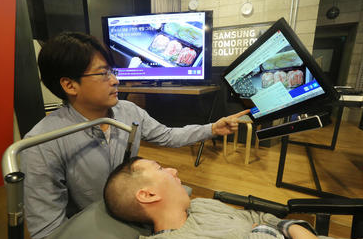  
  
13. 무선 스피커 + 물병.  
http://www.cnet.com/news/splish-splash-its-the-wireless-speaker-water-bottle/  
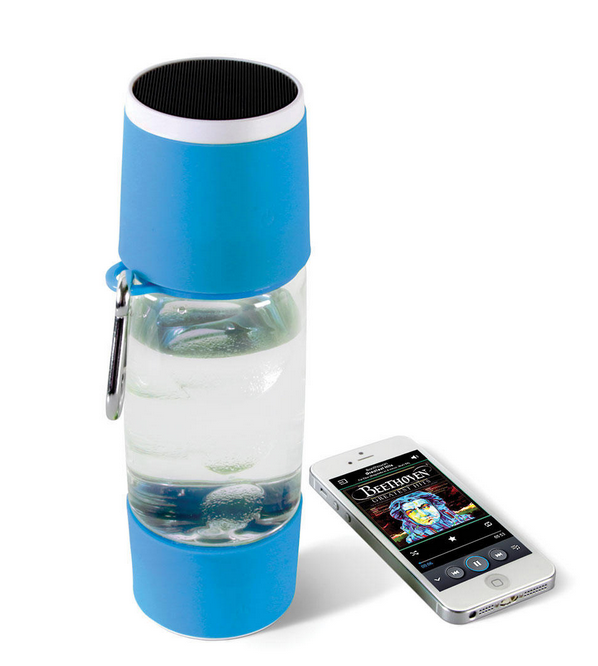  
  
  
