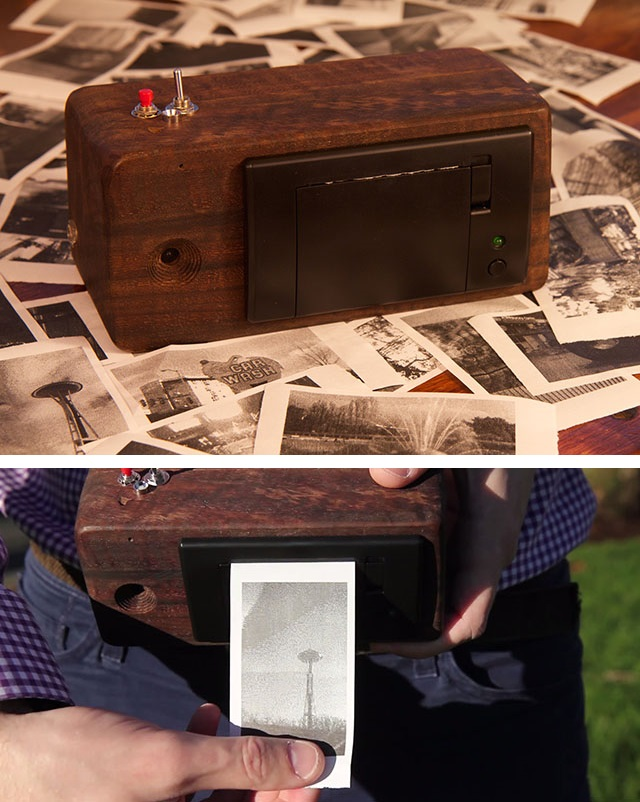
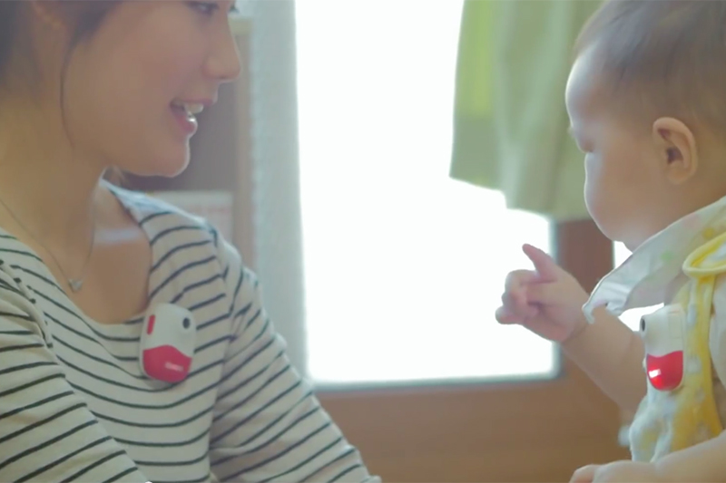
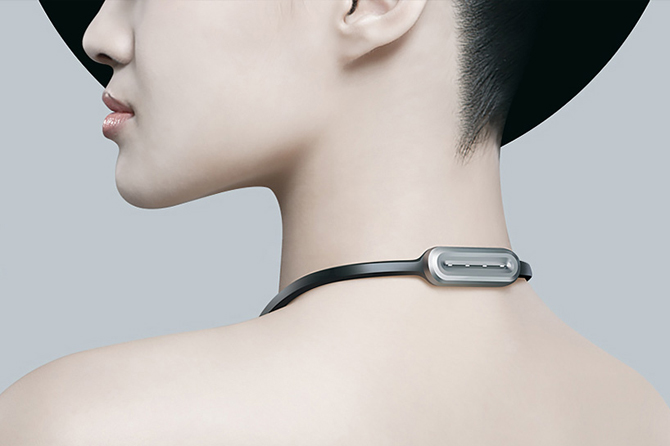
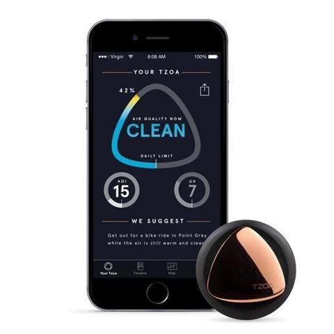
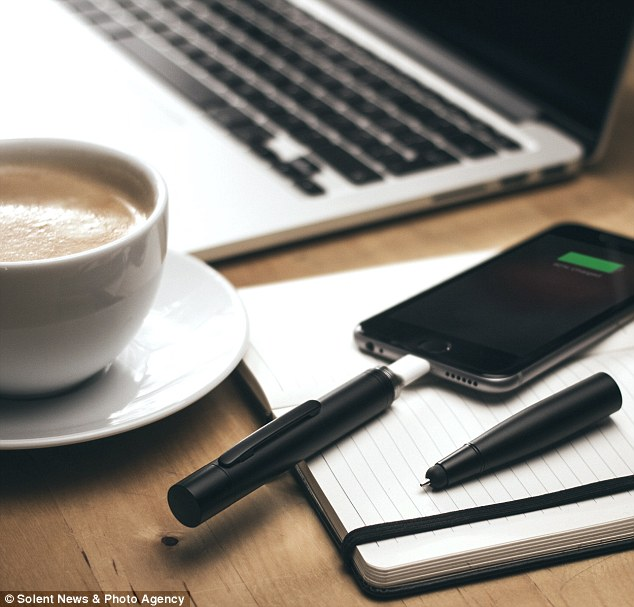
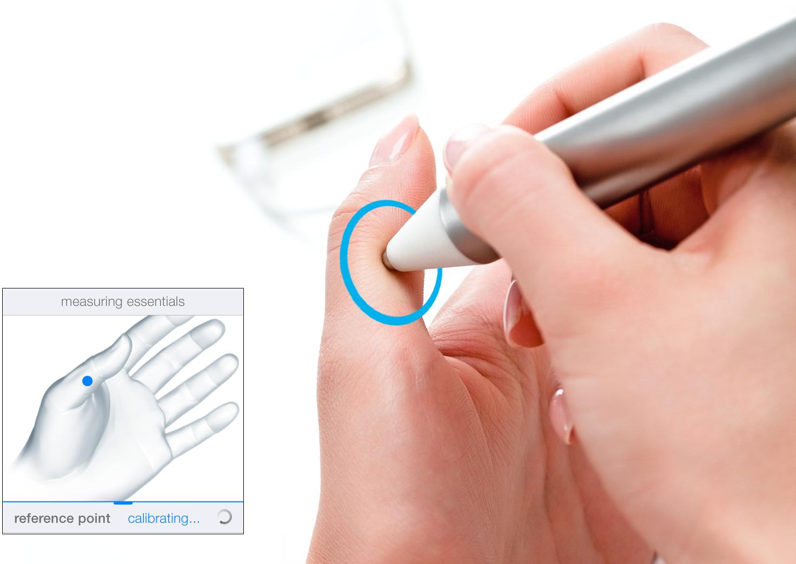
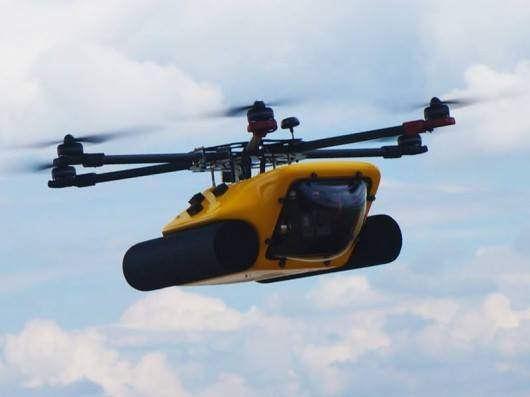
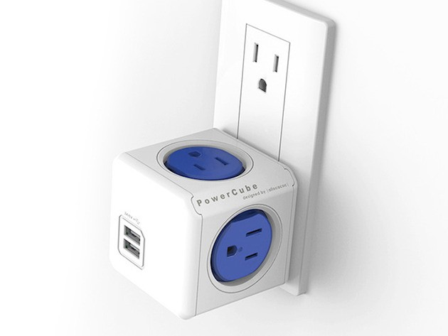
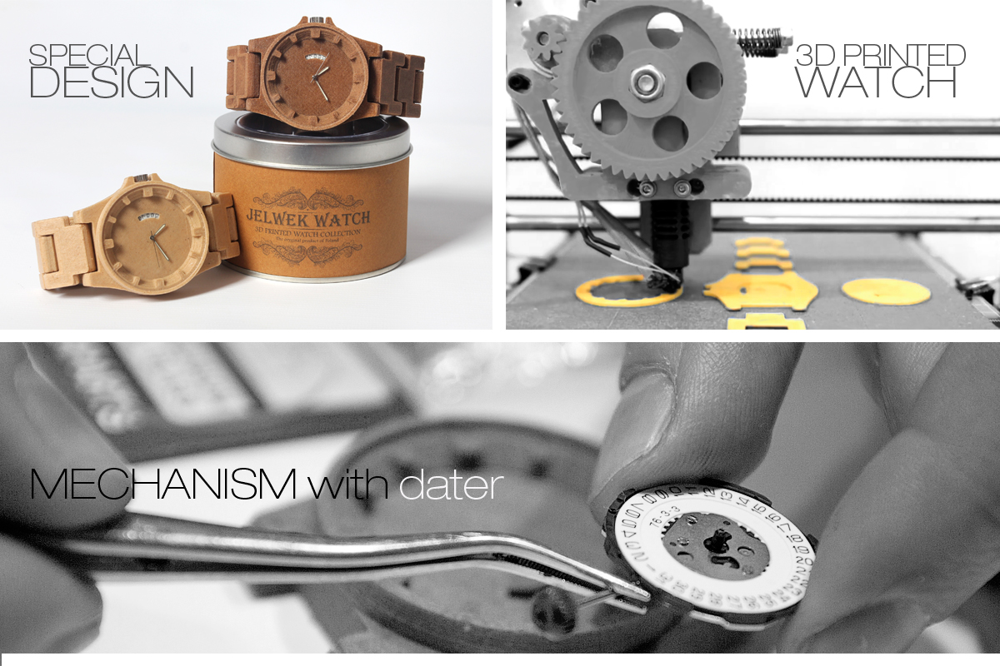
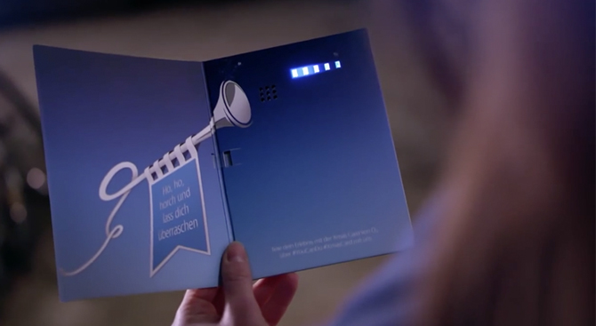

                        
---                          
#141229                 
> 2014년 52주차 **HOT DEVICE EVERY WEEK**                         
                         
                            
---                        
  
  
  
1. 영수증 용지에 바로 사진을 출력해주는 즉석 카메라  
http://thenextweb.com/creativity/2014/12/24/this-instant-camera-will-print-images-on-a-receipt-paper-roll/  
  
  
2. 엄마가 바라보는 아기, 아기가 바라보는 엄마의 모습을 동시에 영상으로 기록하는 카메라.   
둘 사이의 거리가 가까워지면 자동으로 영상을 기록.  
http://www.bloter.net/archives/216157  
  
  
3. 강아지 목에 착용함으로서 주인과 통화 할수 있는 기기. 서로 멀리 떨어져 있어도 강아지가 주인의 목소리를 들을 수 있음.   
https://www.kickstarter.com/projects/wuf/meet-wuf-the-worlds-smartest-dog-collar  
  
  
4. 목건강을 관리해 주는 웨어러블 목걸이  
http://www.bizion.com/bbs/board.php?bo_table=product&wr_id=1194  
  
  
5. 실내 외 공기 상태를 실시간으로 측정하는 기기  
http://www.zdnet.co.kr/news/news_view.asp?artice_id=20141130153536  
  
  
6. 펜형태의 보조 배터리 충전기  
http://interestingengineering.com/this-is-the-worlds-first-pen-with-an-integrated-smartphone-battery-charger/  
  
  
7. 신체의 비타민과 미네랄 등의 상태를 측정해주는 기기.  
https://www.indiegogo.com/projects/vitastiq-a-smart-device-for-vital-advice  
  
  
8. 수륙양용 드론  
http://www.gizmag.com/hexh20-amphibious-drone/35347/  
  
  
  
9. USB가 결합된 멀티탭  
http://www.gizmag.com/powercube-4-outlets--dual-usb-port-for-all-charging--power-needs--free-shipping/35325/  
  
  
10. 나무와 3D 프린터가 만난 시계  
https://www.indiegogo.com/projects/jelwek-watch  
  
  
  
11. 열면 발신자에게 전화가 걸리는 크리스마스 카드  
http://www.bizion.com/bbs/board.php?bo_table=marketing&wr_id=209  
  
  
  
  
