                    
---                      
#150112             
> 2015년 2주차 **HOT DEVICE EVERY WEEK**                     
                     
                        
---                    
  
  
CES 특집 - 흥미로운 37 가지의 제품을 소개합니다.  
  
1. 스마트폰에 설치하는 셀카용 플래쉬  
http://www.theverge.com/2015/1/5/7491573/lenovo-selfie-flash-ces-2015  
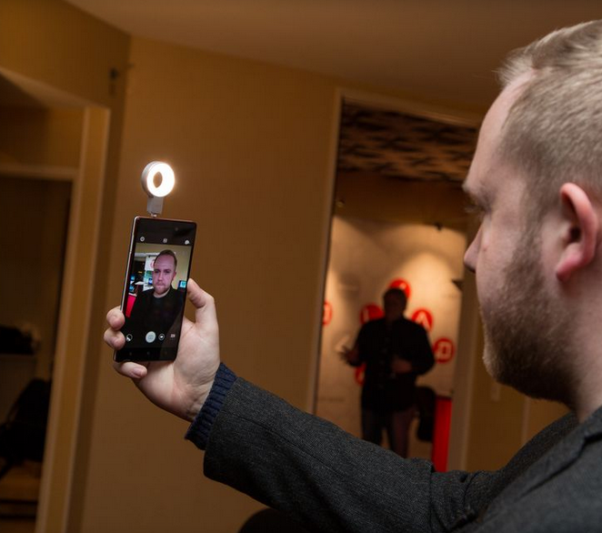  
  
2. 스마트 자전거 패달  
http://www.theverge.com/2015/1/4/7491885/connected-cycle-bike-pedal-prevents-stealing-track-movement  
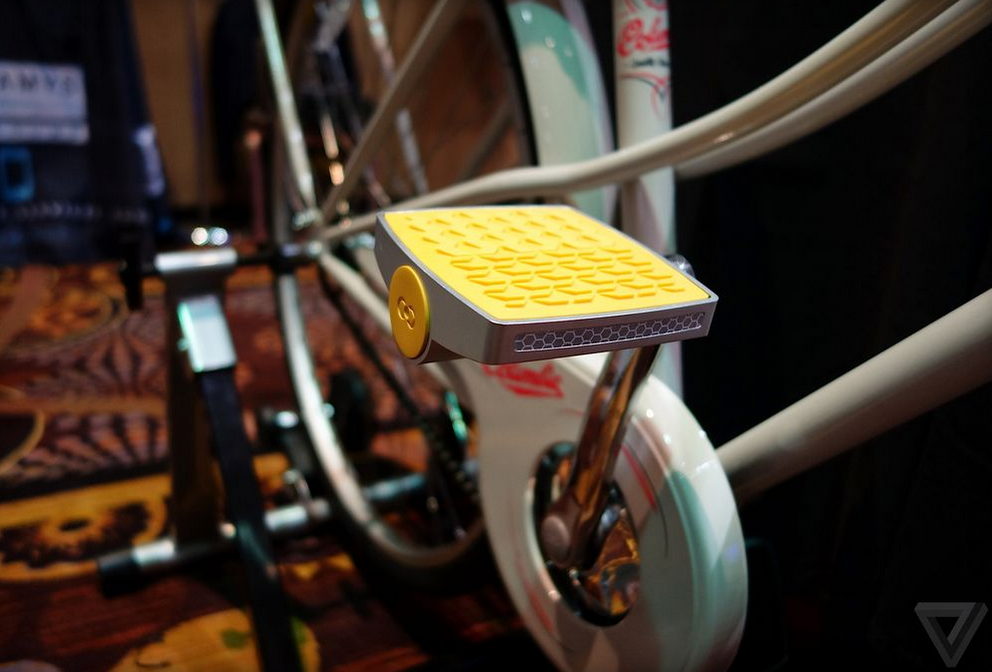  
  
  
3. 자녀의 체온을 부모에게 전달하는 스티커형 패치   
http://www.theverge.com/2015/1/4/7492519/ces-2015-blue-spark-temperature-temptraq  
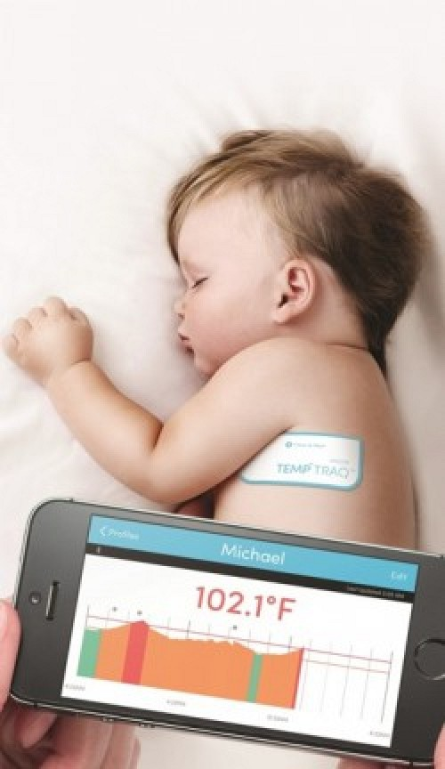  
  
4. 버튼 사이즈 웨어러블 기기 모듈  
http://www.theverge.com/2015/1/6/7505423/ces-2015-intel-curie-module-wearables  
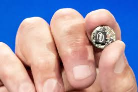  
  
5. 스마트홈 오브  
http://techcrunch.com/2015/01/07/branto/?ncid=rss&utm_source=feedburner&utm_medium=feed&utm_campaign=Feed%3A+Techcrunch+%28TechCrunch%29&utm_content=FaceBook  
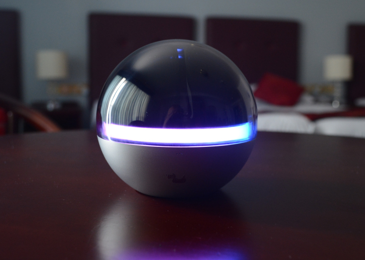  
  
6. 아기 모니터링 기기  
http://techcrunch.com/2015/01/07/naptime-baby-monitor-saves-parents-from-late-night-arguments/?ncid=rss&utm_source=feedburner&utm_medium=feed&utm_campaign=Feed%3A+Techcrunch+%28TechCrunch%29&utm_content=FaceBook  
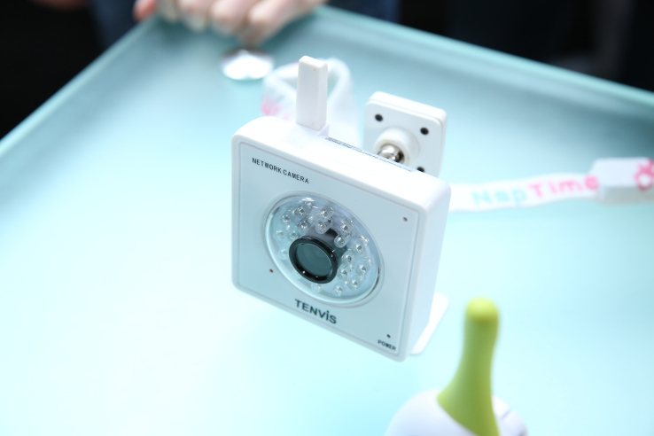  
  
7. 모니터에 꽂는 컴퓨터 스틱  
http://techneedle.com/archives/19657  
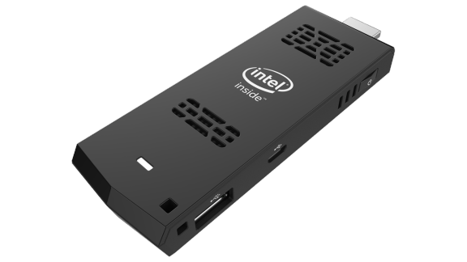  
  
8. 스마트 침대  
http://www.engadget.com/2015/01/06/rest-smart-bed/?ncid=rss_truncated  
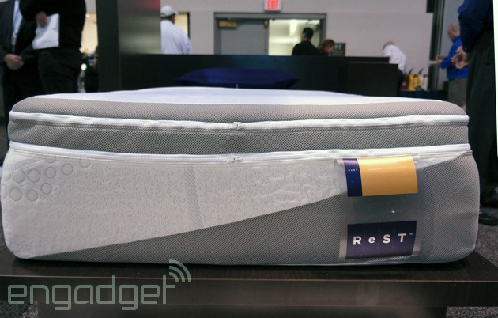  
  
9. 조립식 스마트 워치  
http://ces.gizmodo.com/this-modular-smartwatch-could-have-as-many-days-of-batt-1678389628?utm_campaign=socialflow_gizmodo_facebook&utm_source=gizmodo_facebook&utm_medium=socialflow  
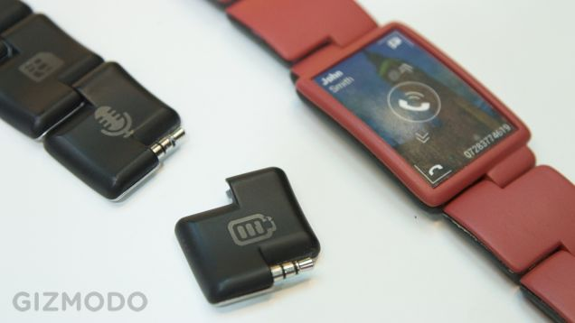  
  
  
10. 셀프조립 의자  
http://thecreatorsproject.vice.com/blog/premiere-mit-chair-builds-itself?utm_source=tcpfbus  
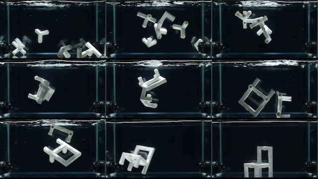  
  
11. 열화상 카메라 스마트폰 악세서리  
http://www.engadget.com/2015/01/06/flir-one-2015-hands-on/?ncid=rss_truncated  
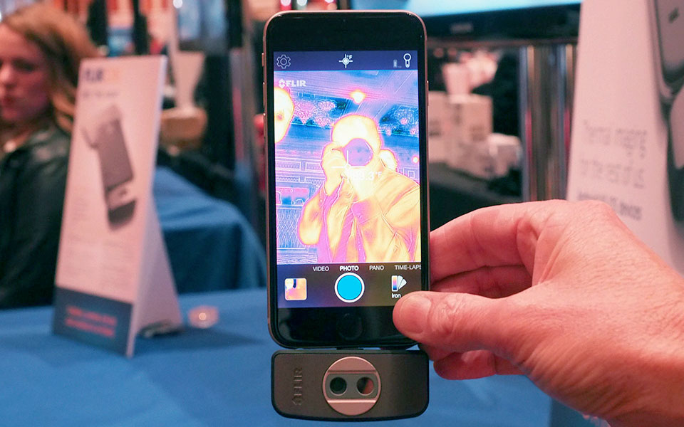  
  
12. 스마트 칫솔  
http://www.cnet.com/news/oral-b-smartseries-700-bluetooth-toothbrush-coming-to-the-us-in-february/  
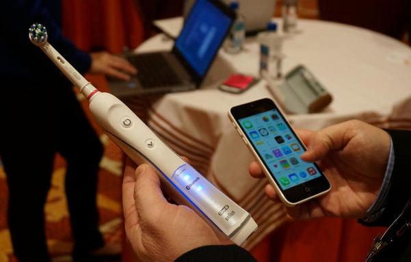  
  
13. lcd 사이드 미러  
http://www.engadget.com/2015/01/07/maserati-of-the-future-has-cameras-and-displays-not-mirrors/?ncid=rss_truncated  
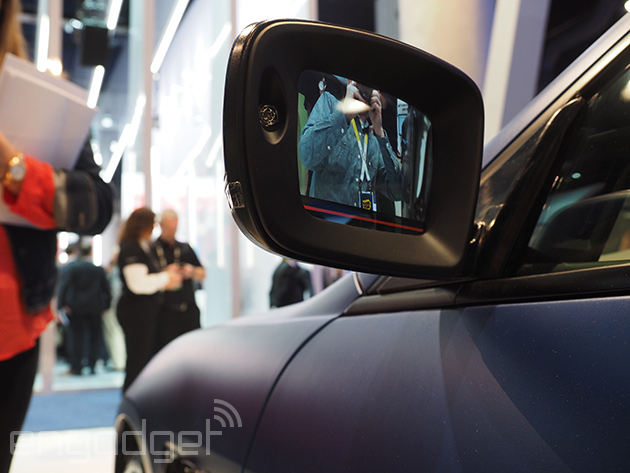  
  
14. 전자잉크 밴드  
http://techcrunch.com/2015/01/06/looksee-an-e-ink-smart-bracelet-will-always-fit-your-mood/?ncid=rss&utm_source=feedburner&utm_medium=feed&utm_campaign=Feed%3A+Techcrunch+%28TechCrunch%29&utm_content=FaceBook  
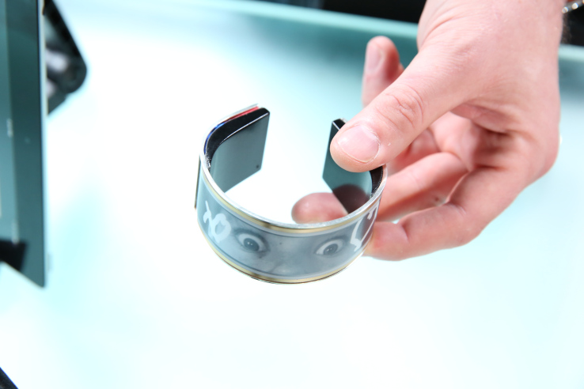  
  
15. 문앞에 있는 대상을 촬영하여 폰으로 보내줌.  
http://techcrunch.com/2015/01/06/peeple-is-a-smart-peephole-to-upgrade-your-door-with-caller-id/  
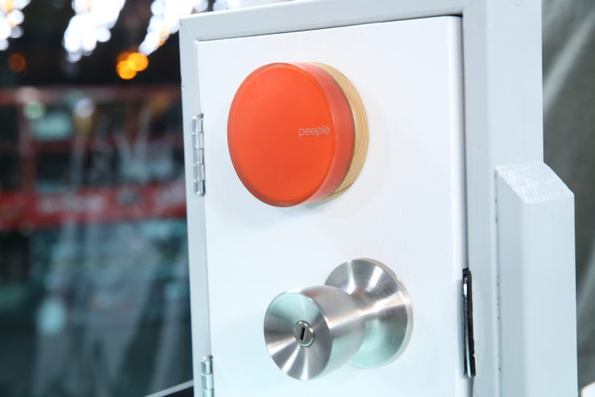  
  
16. 스마트 음주 측정기  
http://tcrn.ch/1tRJGDM  
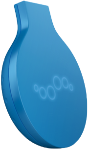  
  
  
17. 누가 집에 왔는지 알려주는 커넥티드 카메라.  
http://www.engadget.com/2015/01/04/netatmo-welcome-camera/?ncid=rss_truncated  
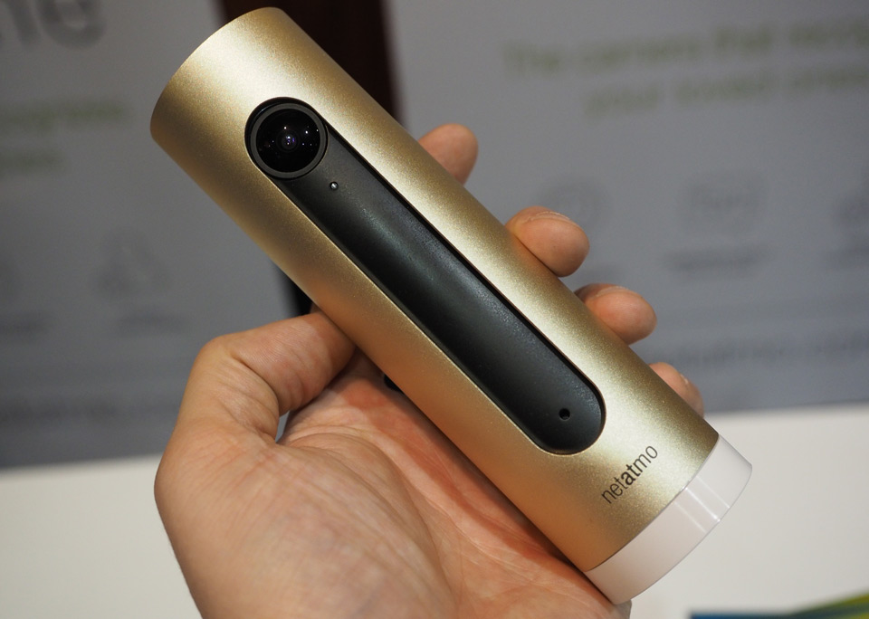  
  
18. 반려동물이 집에 안전하게 잘있는지 알려주는 기기  
http://www.engadget.com/2015/01/04/tagg-alarm-smart-pet-monitoring/?ncid=rss_truncated  
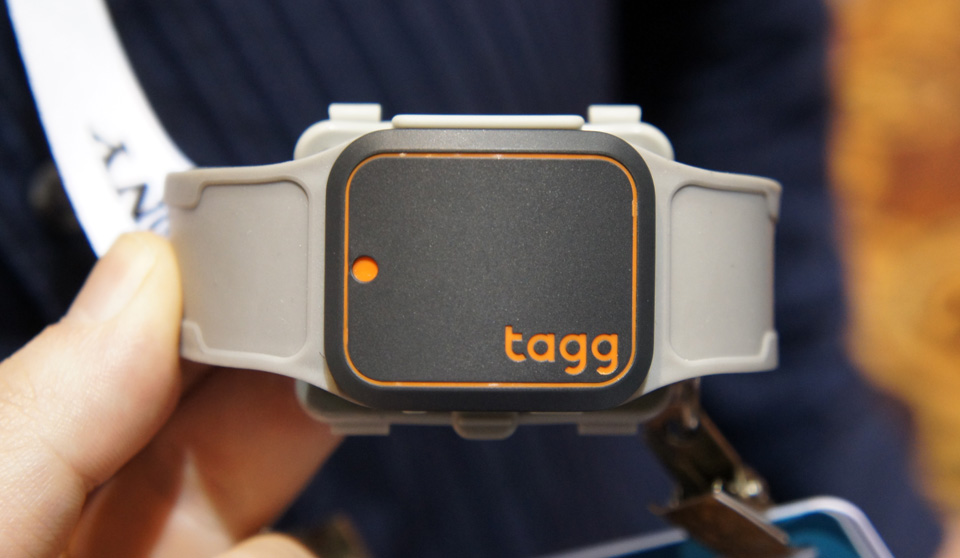  
  
19. 피부상태 측정기  
http://tcrn.ch/14vgZ3C  
  
  
  
20. 3d 프린터 - 액체형  
http://formlabs.com/en/  
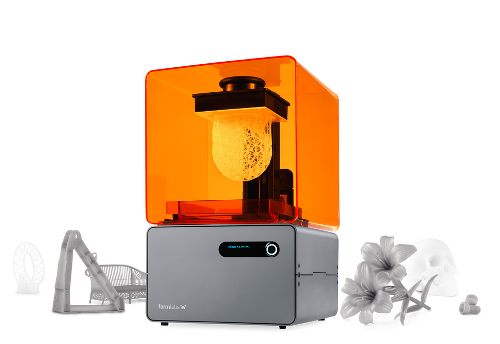  
  
21. 간단한 전자 회로까지 프린팅하는 3d 프린터  
http://hackaday.com/2015/01/06/3d-printing-circuits-gets-rid-of-the-box-altogether/  
  
  
22. 폴라로이드 휴대용 사진 프린터기  
http://www.cnet.com/products/polaroid-zip-mobile-printer/  
  
  
23. 터치스크린이 달린 자동차 키  
http://gizmodo.com/bmws-new-key-fob-is-a-touchscreen-device-in-its-own-rig-1677710054?utm_campaign=socialflow_gizmodo_facebook&utm_source=gizmodo_facebook&utm_medium=socialflow  
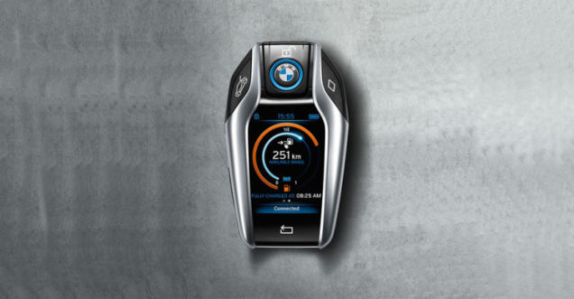  
  
24. 스트레스 완화 기기  
http://phys.org/news/2015-01-paris-based-team-stress-cutting-gear-ces.html  
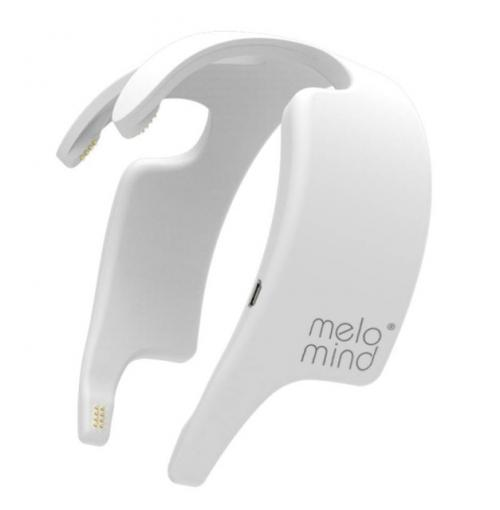  
  
25. 프로그래밍 가능한 소형 라인트레이서  
http://techcrunch.com/2015/01/05/ozobots-tiny-robots-use-squiggly-lines-and-googles-blockly-to-teach-kids-to-code/?ncid=rss&utm_source=feedburner&utm_medium=feed&utm_campaign=Feed%3A+Techcrunch+%28TechCrunch%29&utm_content=FaceBook  
  
26. 종이 위를 이동하며 프린트하는 로봇 - 판매 시작  
http://mashable.com/2015/01/05/zutas-printer-pre-order/?utm_campaign=Mash-Prod-RSS-Feedburner-All-Partial&utm_cid=Mash-Prod-RSS-Feedburner-All-Partial&utm_medium=feed&utm_source=feedly&utm_reader=feedly  
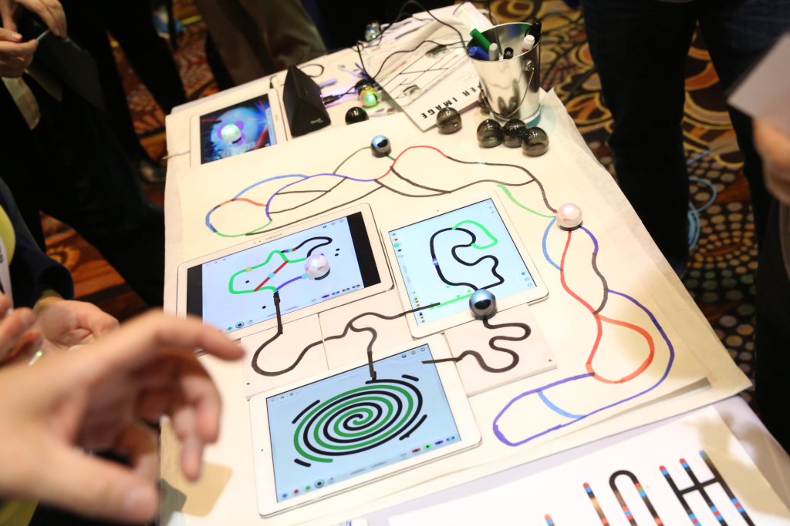  
  
27. 소니 스피커 + 전구  
http://www.theverge.com/2015/1/5/7497911/sonys-symphonic-light-speaker-ces-2015  
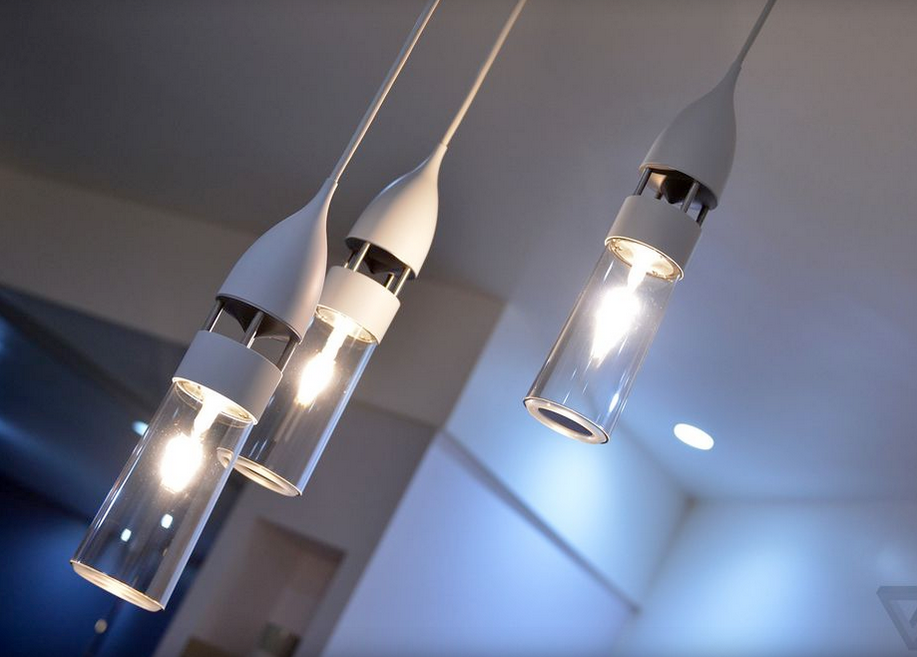  
  
  
28. 구글 에어 플레이 - 오디오를 위한 크롬 캐스트  
http://www.theverge.com/2015/1/5/7482719/google-cast-audio-streaming-speakers-availability-ces-2015  
  
  
29. 휴대용 클라우드 저장소  
http://www.cnet.com/products/lima/  
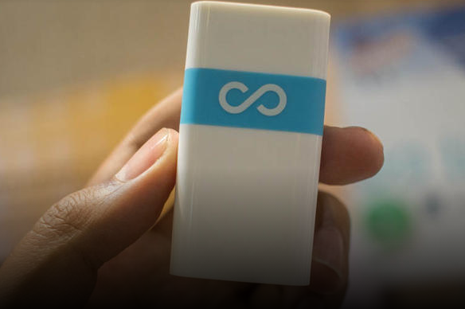  
  
30. 허리부착 요통 감시 기기  
http://techcrunch.com/2015/01/04/the-valedo-helps-you-train-back-pain-away/?ncid=rss&utm_source=feedburner&utm_medium=feed&utm_campaign=Feed%3A+Techcrunch+%28TechCrunch%29&utm_content=FaceBook  
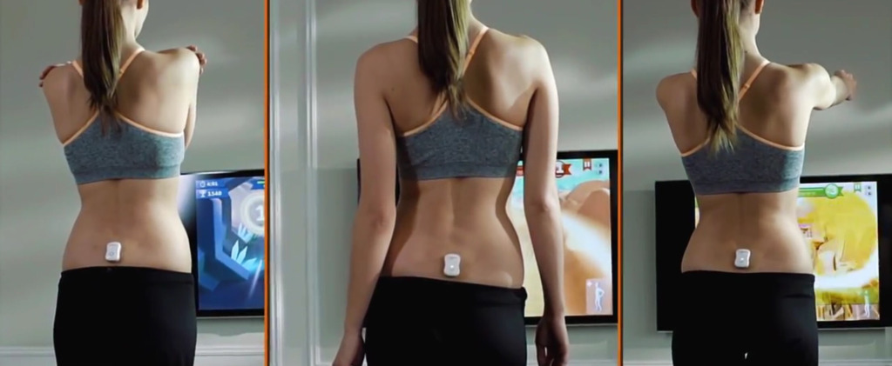  
  
31. 일상을 기록하는 라이프 로그 카메라  
http://www.cnet.co.kr/view/124570  
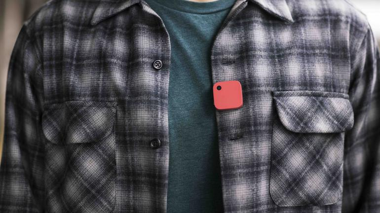  
  
32. 스스로 사이즈를 정하는 벨트  
http://gizmodo.com/the-only-gadget-the-world-really-needs-is-a-self-adjust-1677432880?utm_campaign=socialflow_gizmodo_facebook&utm_source=gizmodo_facebook&utm_medium=socialflow  
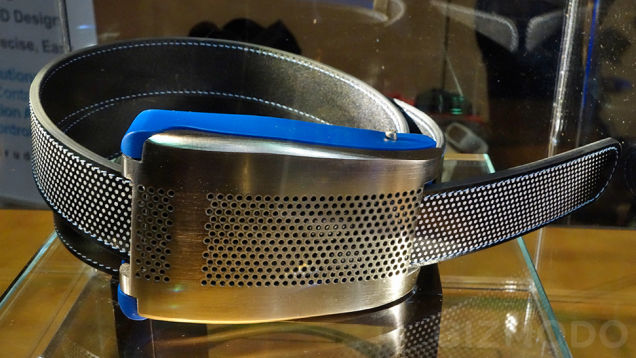  
  
33. 구 형태의 디스플레이  
https://vine.co/v/OpIYKOQUnYr  
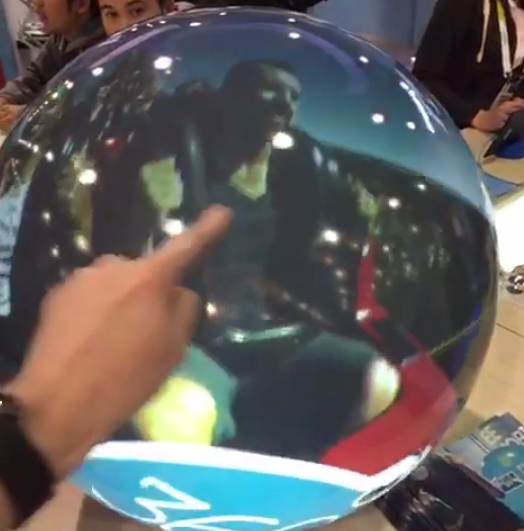  
  
34. 스마트 줄자.  
http://www.engadget.com/2015/01/04/e-tape-measure-metric-imperial-bluetooth-hands-on/?ncid=rss_truncated  
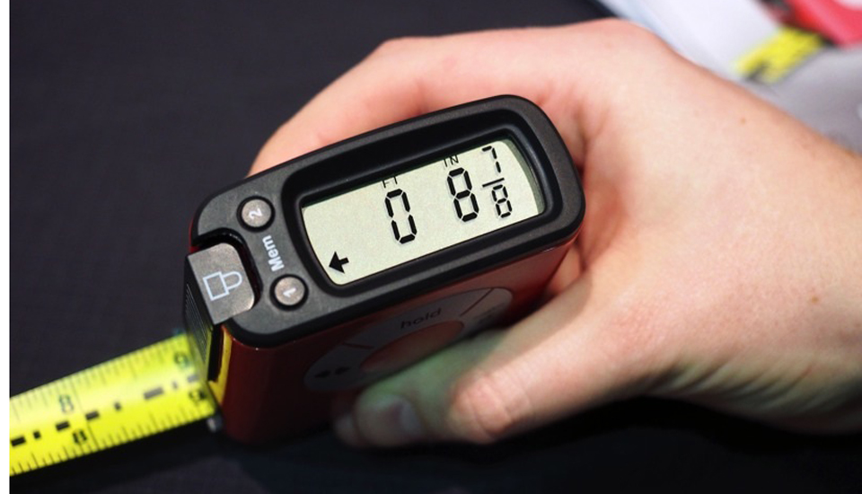  
  
35. 조금 덜 똑똑한 시계  
http://mashable.com/2015/01/04/withings-activite-pop-watch/?utm_campaign=Mash-Prod-RSS-Feedburner-All-Partial&utm_cid=Mash-Prod-RSS-Feedburner-All-Partial&utm_medium=feed&utm_source=feedly&utm_reader=feedly  
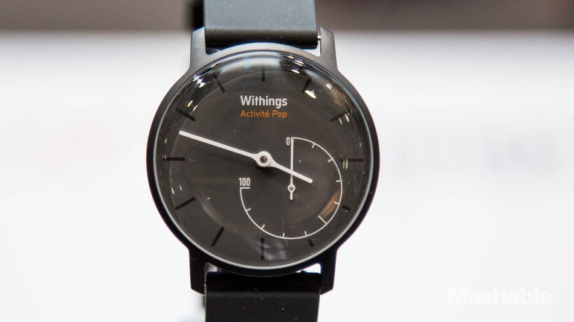  
  
36. 스마트 화분  
http://www.engadget.com/2015/01/04/parrot-h2o-pot/?ncid=rss_truncated  
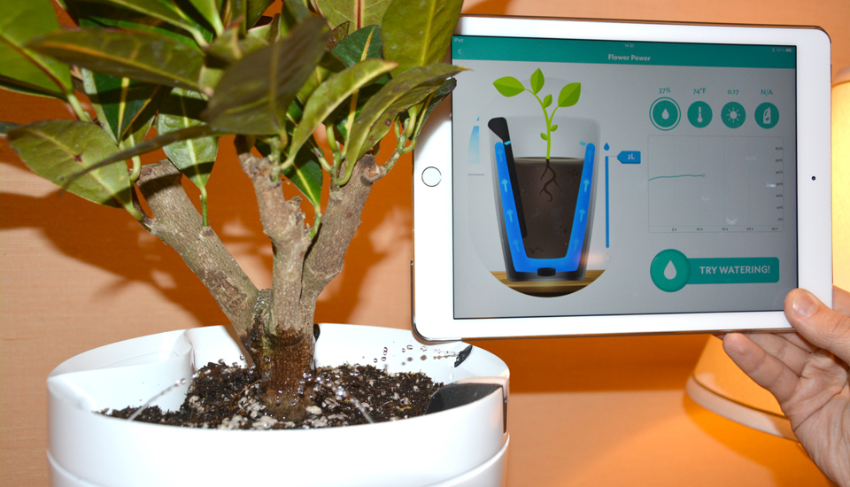  
  
  
37. 웨어러블 밴드 56종 (링크 클릭)  
http://venturebeat.com/2015/01/07/i-tried-on-56-wearables-today-heres-a-photo-of-every-single-one-of-them/  
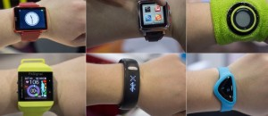  
  
  
  
  
