                
---                  
#150126               
> 2015년 4주차 **HOT DEVICE EVERY WEEK**                 
                 
                    
---                
  
  
1. 증강현실 헤드셋 홀로렌즈(Microsoft)  
http://m.blog.naver.com/appifystudio/220248179103  
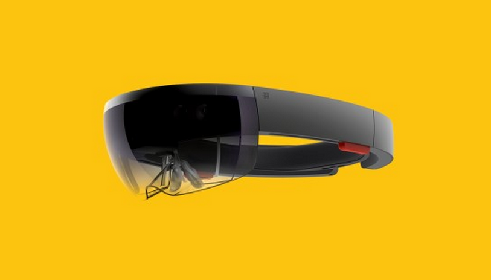  
  
2. 세제와 옷과 함께 물속에 넣어 놓으면 초음파를 이용해 세탁을 하는 기기  
https://www.indiegogo.com/projects/dolfi-next-gen-washing-device#description  
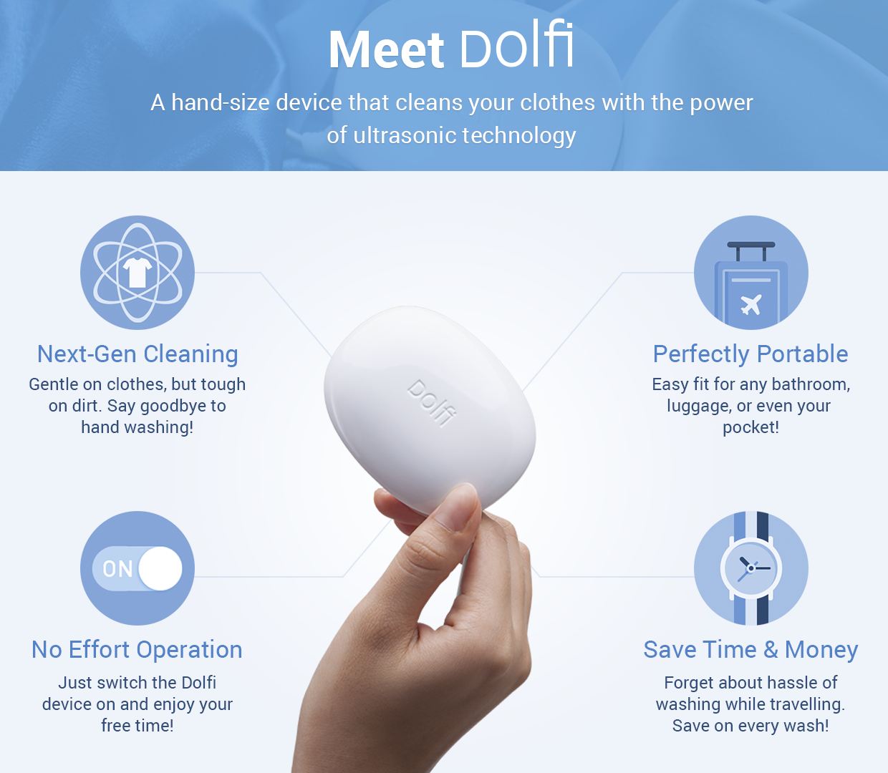  
  
3. 전자잉크를 이용해 간단한 알림을 표시해줄 수 있는 소형 보조 디스플레이 기기  
http://techcrunch.com/2015/01/22/displio/?ncid=rss&utm_source=feedburner&utm_medium=feed&utm_campaign=Feed%3A+Techcrunch+%28TechCrunch%29&utm_content=FaceBook  
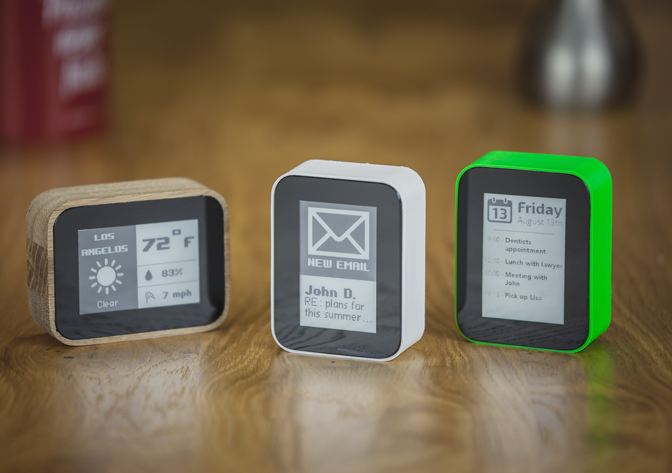  
  
4. 허리에 차는 노인용 에어백  
http://www.huffingtonpost.kr/2015/01/23/story_n_6529504.html  
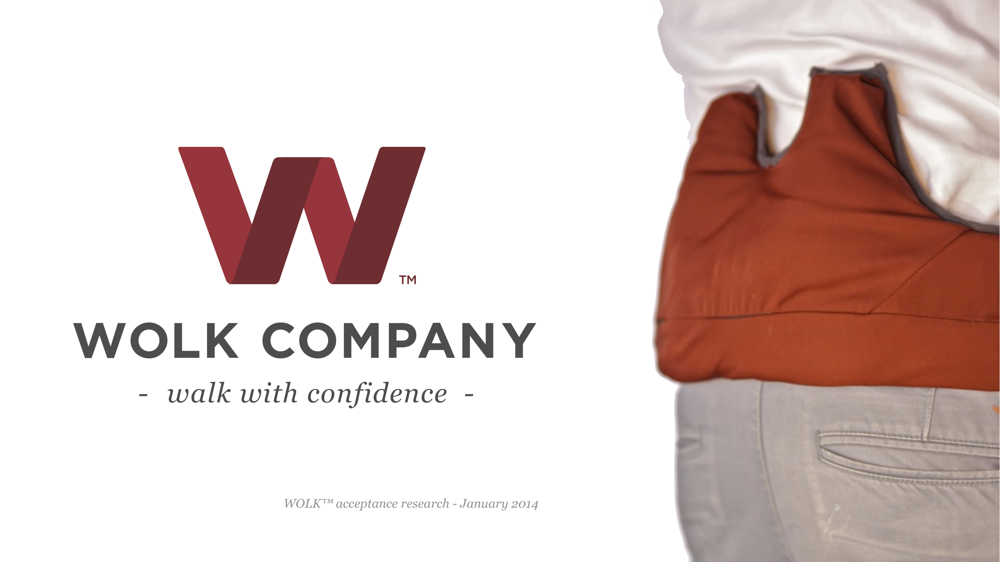  
  
  
5. 80년대 NASA가 만든 가상현실 헤드셋  
https://www.youtube.com/watch?v=NAuytnYU6JQ  
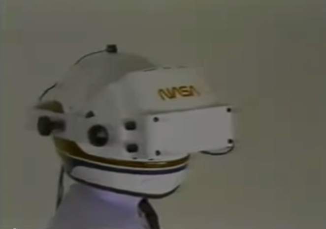  
  
6. 차에서 사각지대에 있는 대상(자전거,오토바이, 사람등) 감지 및 디스플레이 기술 (재규어)  
http://www.earlyadopter.co.kr/10936  
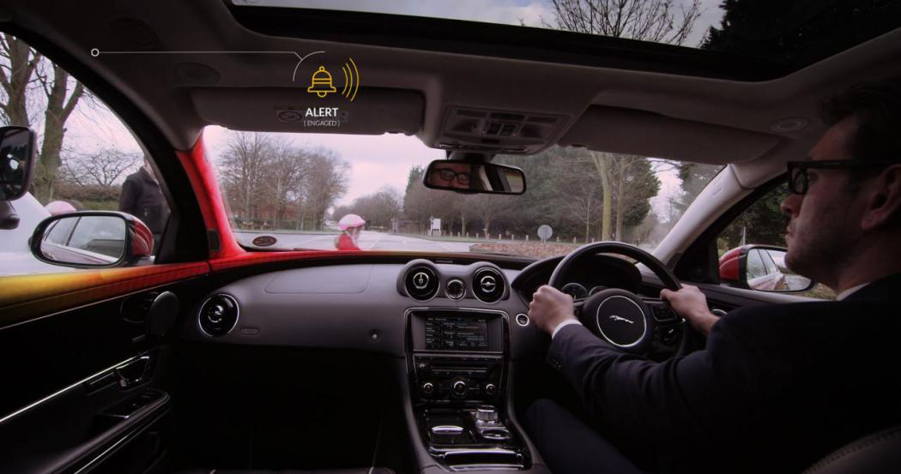  
  
  
7. 뇌파를 이용해 조정 가능한 헬멧  
http://behnazfarahi.prosite.com/204244/5572755/gallery/synapse  
  
  
  
8.  타인에게 현재 대화가능한 상태인지 아닌지 알려주는 간단한 LED 인디케이터  
https://www.kickstarter.com/projects/914874115/luxafor-your-ultimate-productivity-device  
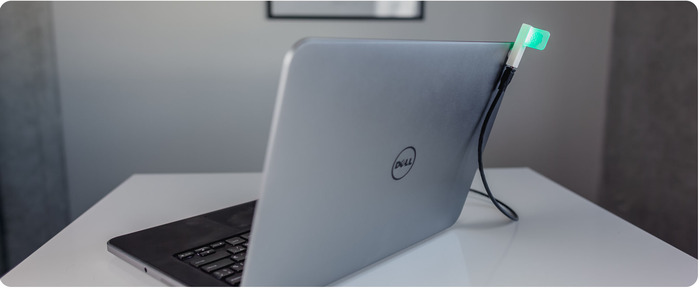  
  
9. 혀를 이용해 소리를 들을 수 있는 제품   
http://www.engadget.com/2015/01/19/braille-for-the-mouth-could-help-deaf-people-hear/?ncid=rss_truncated  
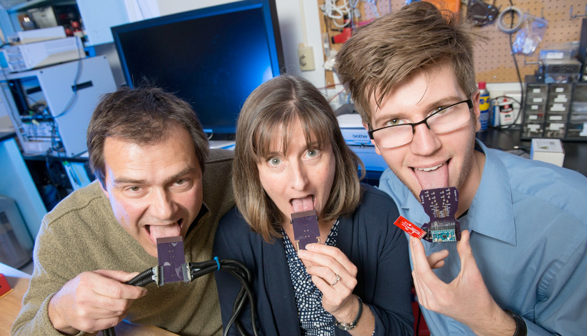  
  
10. 마우스 + PC 일체형  
http://interestingengineering.com/mouse-box-is-fully-working-pc/  
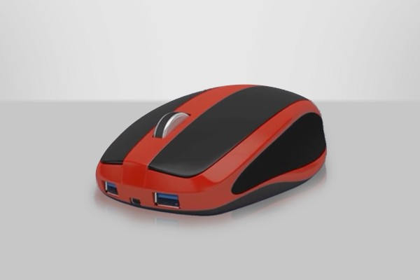  
  
11. 스마트홈 세트(샤오미)  
http://www.etnews.com/20150119000169?SNS=00002  
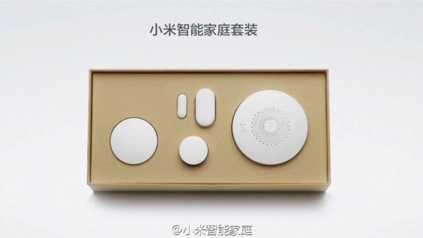  
  
12. 그림 그리는 것을 도와주는 기기  
http://thecreatorsproject.vice.com/blog/these-machines-will-teach-you-to-draw-whether-you-like-it-or-not?utm_source=tcpfbus  
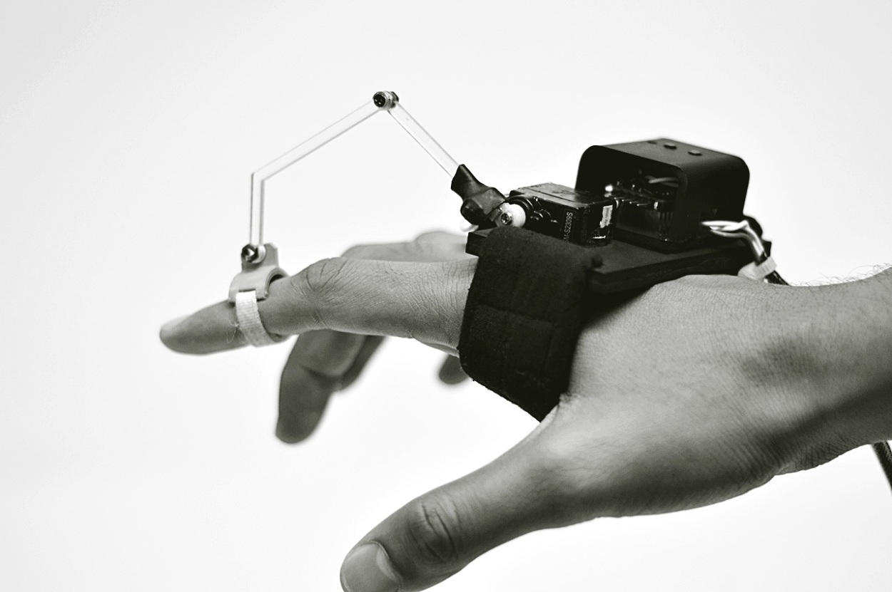  
  
13. Boston Dynamics의 휴머노이드 로봇 ATLAS 최신  
http://www.darpa.mil/NewsEvents/Releases/2015/01/20.aspx  
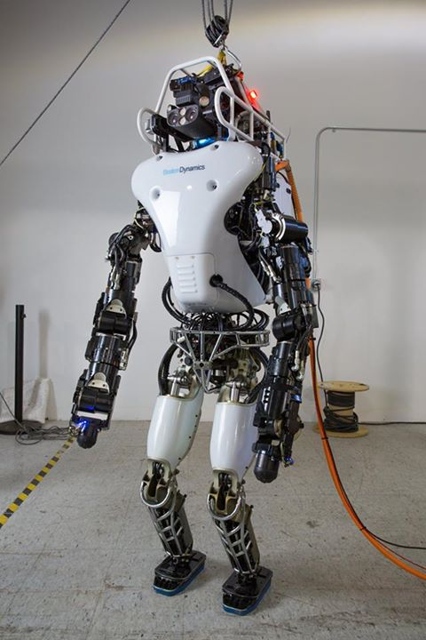  
  
14. 레고를 이용해 만든 점자 프린터  
http://www.huffingtonpost.kr/2015/01/21/story_n_6513298.html  
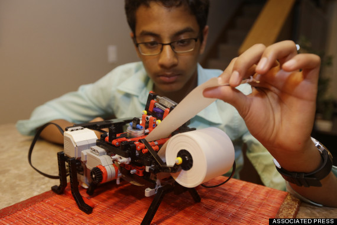  
  
  
