          
---            
#150309         
> 2015년 10주차 **HOT DEVICE EVERY WEEK**           
           
              
---          
  
  
1. 전구 소켓에 끼울 수 있는 빔 프로젝터.  
http://www.earlyadopter.co.kr/12363  
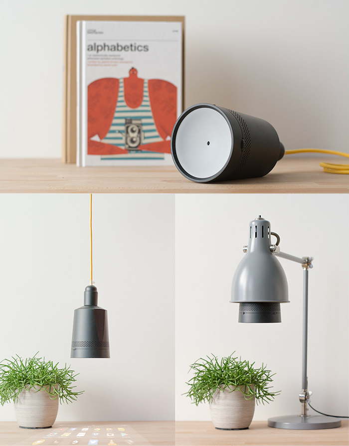  
  
2. 하나의 기기로 여러가지 악기를 연주할 수 있는 전자악기.  
http://www.theverge.com/2015/3/3/8144193/artiphon-instrument-1-kickstarter-campaign  
  
  
3. 전자렌지에 돌리면 썻던 내용을 reset 할 수 있는 노트.  
https://www.indiegogo.com/projects/rocketbook-cloud-integrated-microwavable-notebook  
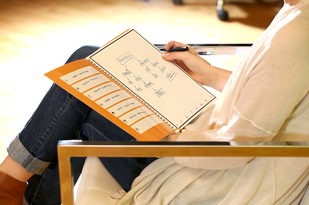  
  
4. 사용자 명령을 수행하는 스피커 (Sony)  
http://www.earlyadopter.co.kr/12793  
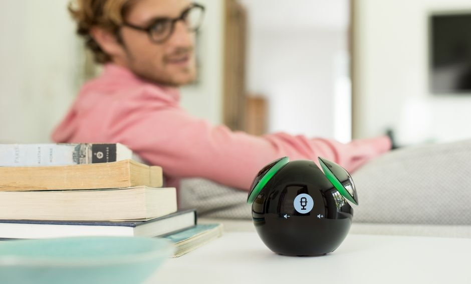  
  
5. VR기기를 더 실감나게 체험 하도록 회전하는 의자.  
http://www.engadget.com/2015/03/05/roto-virtual-reality-chair/  
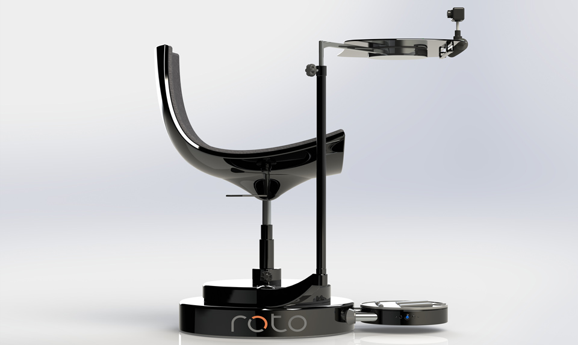  
  
6. Eye Tracking 기기, 눈의 움직임을 PC나 모바일 기기의 입력으로 받음.  
https://theeyetribe.com/  
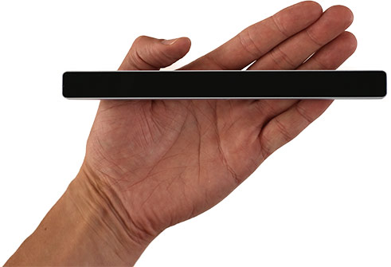  
  
7. 태블릿 pc에 설치하는 홀로그램 기기.  
http://www.psfk.com/2015/03/holocube-hc-tablet-ipad-projection-3d-holograms.html?utm_content=bufferb184d&utm_medium=social&utm_source=facebook.com&utm_campaign=buffer  
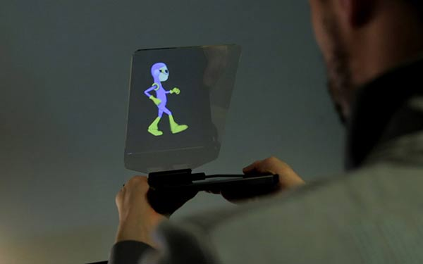  
  
8. 배변시간을 미리 알려주는 웨어러블 기기.  
http://mashable.com/2015/03/03/d-fee-poop-predictor/  
  
  
9. 책상 표면에 디스플레이가 되는 책상.  
http://techholic.co.kr/archives/27782?utm_source=twitterfeed&utm_medium=facebook  
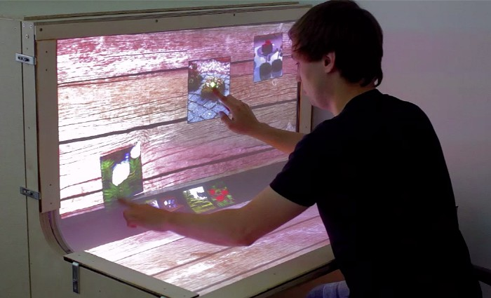  
  
  
10. VR용 손동작 입력 악세서리.  
http://mashable.com/2015/03/02/realm-vr-controller/?utm_cid=mash-com-fb-main-link  
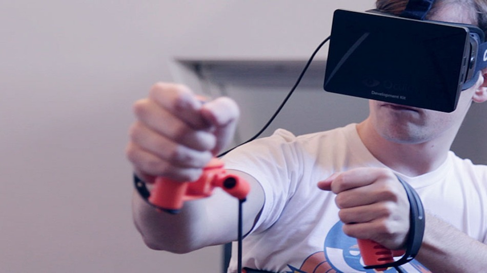  
  
11. 포스트잍 같은 접착제 없이 어느 표면에나 붙일수 있는 메모지  
http://www.psfk.com/2015/03/magnetic-sticky-notes-statically-charged-sticky-notes-tesla-amazing.html?utm_content=buffer3ebd8&utm_medium=social&utm_source=facebook.com&utm_campaign=buffer  
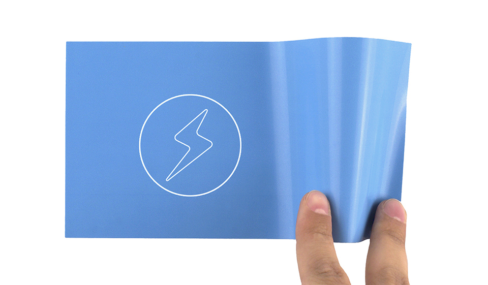  
  
12. 부착형 원격 셀카 카메라.  
http://www.earlyadopter.co.kr/12744  
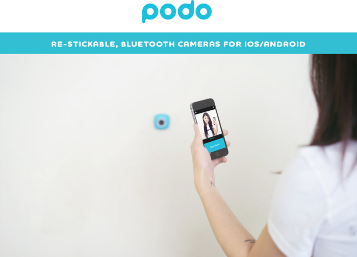  
  
13. 분실 방지 기능이 있는 우산.  
http://www.earlyadopter.co.kr/12717#.VPUg6Qse8FE.facebook  
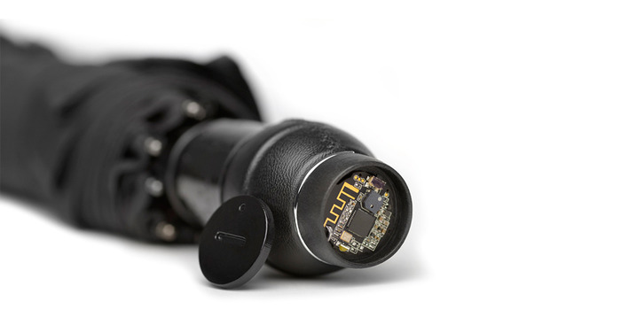  
  
14. 7만원 짜리 고프로(샤오미)  
https://www.techinasia.com/xiaomi-gopro-yicamera/  
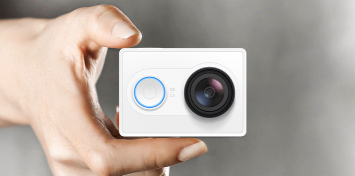  
  
15. 강물로 배터리를 충전할 수 있는 휴대용 수력발전기.  
http://www.earlyadopter.co.kr/12940#.VPk-YV41O5E.facebook  
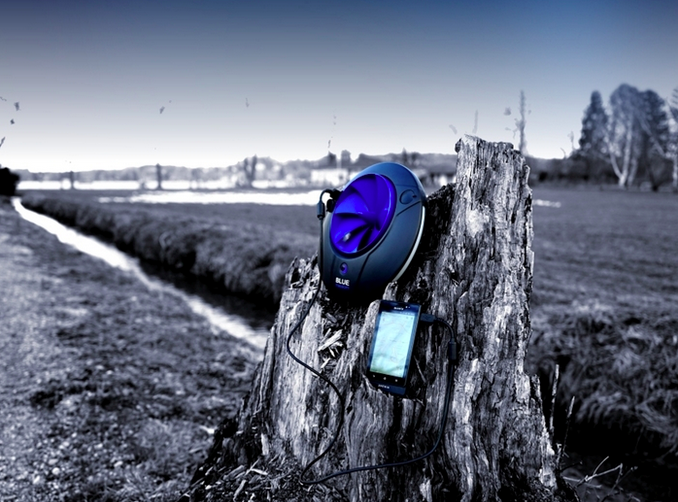  
  
  
16. 이케아 무선 충전 가구  
http://www.earlyadopter.co.kr/12664  
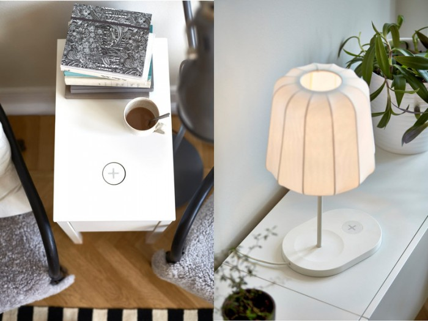  
  
17. 벌의 방해없이 벌꿀을 채취 할수 있는 벌통  
https://www.indiegogo.com/projects/flow-hive-honey-on-tap-directly-from-your-beehive  
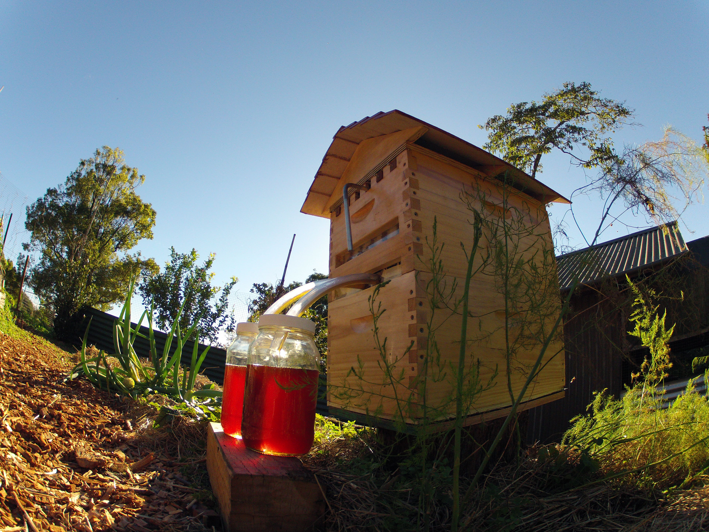  
  
18. 바이올린 연주 로봇  
http://gizmodo.com/ro-bow-is-a-violin-paying-robot-that-actually-sounds-pr-1687311126?utm_campaign=socialflow_gizmodo_facebook&utm_source=gizmodo_facebook&utm_medium=socialflow  
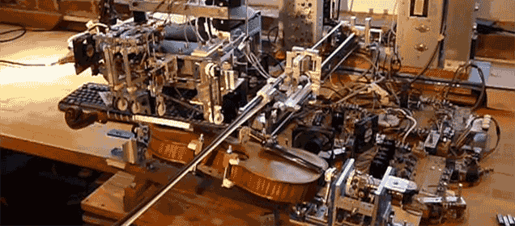  
  
  
