        
---          
#150316       
> 2015년 11주차 **HOT DEVICE EVERY WEEK**         
         
            
---        
  
  
1. 칠판에 필기하는 대로 바로 저장되는 스마트 보드마카  
http://techcrunch.com/2015/03/11/the-equil-smart-marker-records-everything-you-write/  
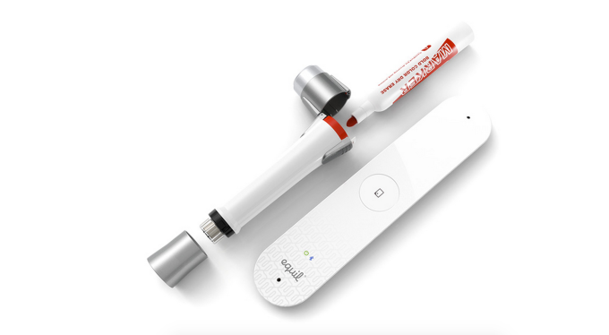  
  
2. 글루건과 레고의 조합으로 만든 3D 펜  
http://blog.naver.com/anatzblog/220294989519  
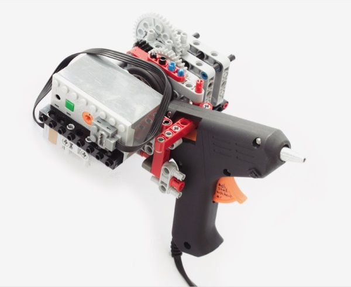  
  
3. 9V배터리로 스마트폰을 충전할 수 있게 해주는 젠더.  
http://gizmodo.com/this-tiny-multi-function-cube-can-save-a-dying-smartpho-1687067995?utm_campaign=socialflow_gizmodo_facebook&utm_source=gizmodo_facebook&utm_medium=socialflow  
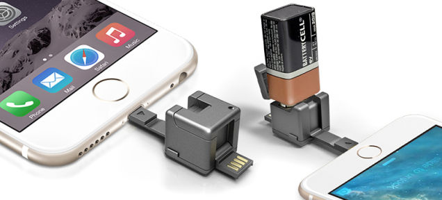  
  
4. 손가락으로 가리킨곳의 글을 읽어 주는 디바이스  
http://www.cnet.com/news/this-finger-mounted-camera-helps-the-blind-to-read/  
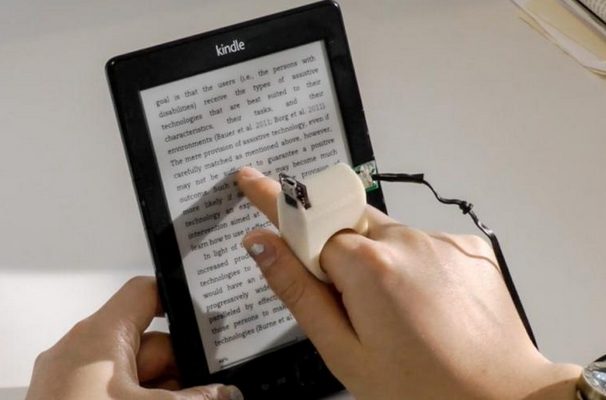  
  
5. 팬케익 3D 프린터  
http://9to5toys.com/2015/03/10/worlds-first-custom-pancake-printer-bot/  
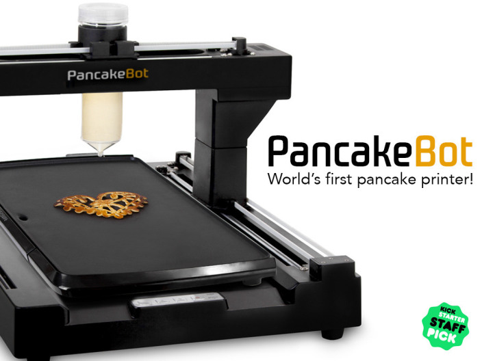  
  
6. 레고블럭을 실시간으로 3D모델로 보여주는 시스템  
http://www.psfk.com/2015/03/lego-bricks-lego-x-gravity-studio-3d-models.html  
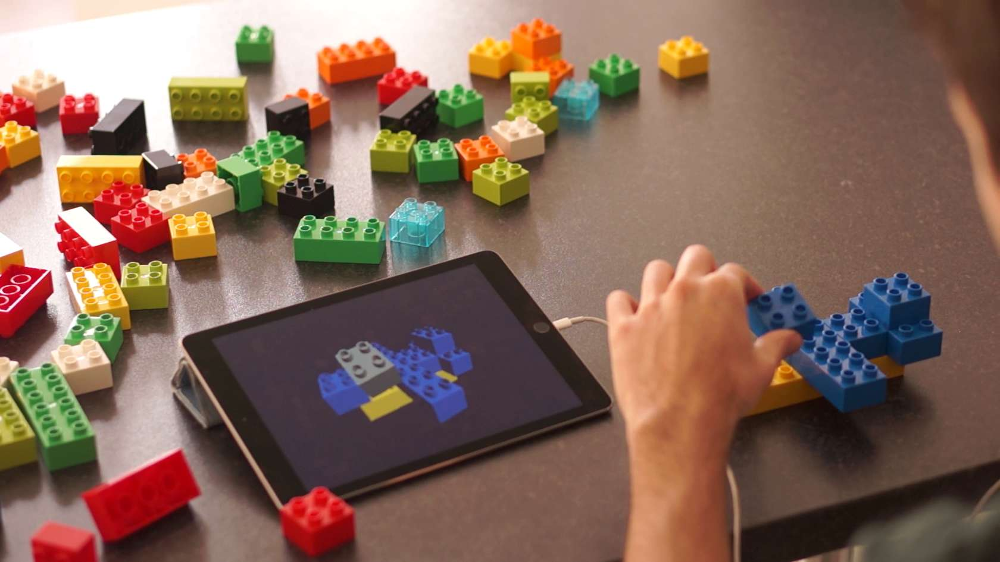  
  
7. 스티커를 이용 프로그래밍을 가르치는 시스템  
http://phys.org/news/2015-03-preschoolers-sticker-based.html  
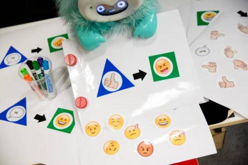  
  
8. 제스쳐를 이용해 음악을 만들 수 있는 키보드  
http://www.psfk.com/2015/03/keys-keyboard-led-lights-gestures-idan-beck-music-making-instrument.html?utm_content=bufferf7186&utm_medium=social&utm_source=facebook.com&utm_campaign=buffer  
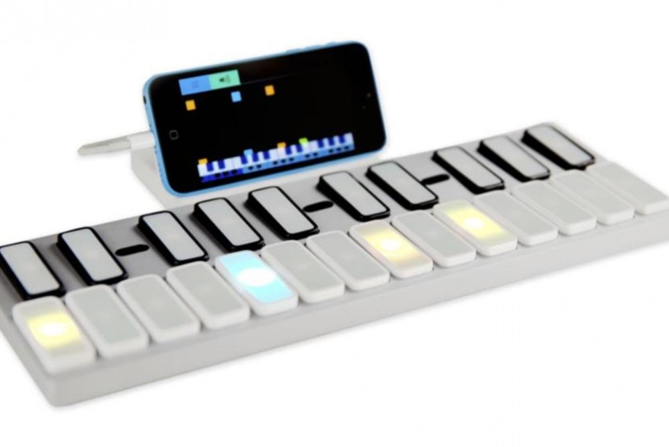  
  
9. 해의 움직임을 본떠 만든 조명  
http://www.psfk.com/2015/03/luminous-lamp-natural-spectrum-light-bulbs.html?utm_content=buffera078f&utm_medium=social&utm_source=facebook.com&utm_campaign=buffer  
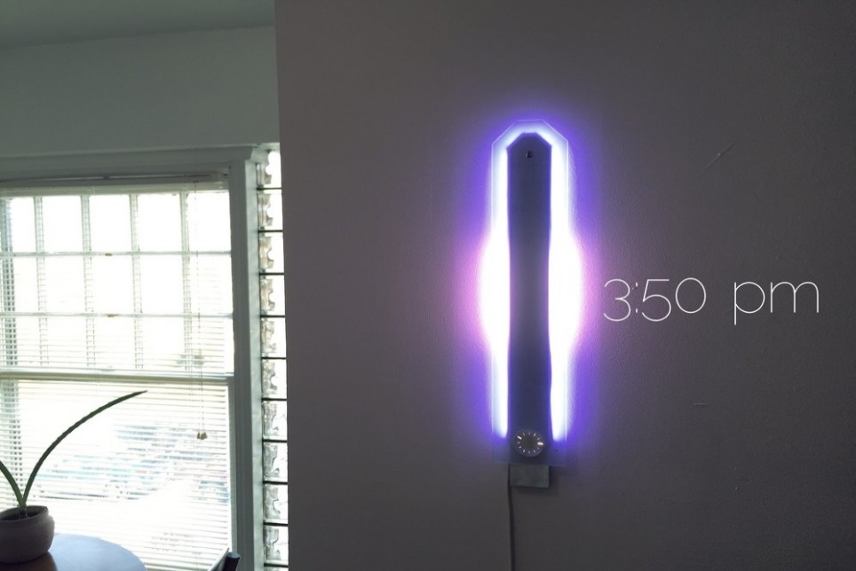  
  
10. 디즈니랜드 에서 사용하는 스마트밴드  
http://www.extremetech.com/electronics/200665-researchers-create-glasses-free-3d-display-with-tiny-spherical-lenses   
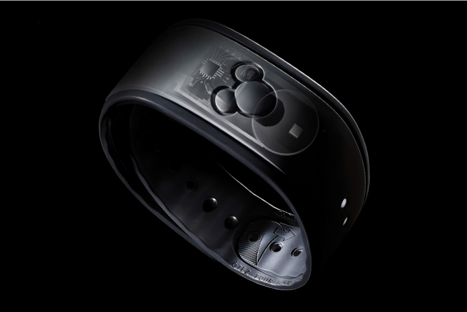  
  
11. 발로 차도(약하게) 넘어지지 않는 2족 보행 로봇.  
http://techcrunch.com/2015/03/10/atrias-the-bipedal-robot-keeps-standing-even-after-you-sweep-the-leg/  
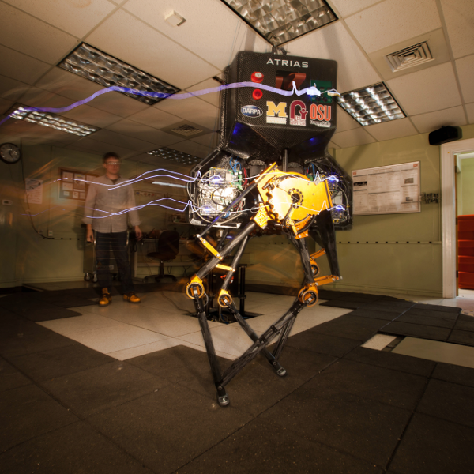  
  
12. 청각/시각 장애인이 쉽게 모바일로 메시지를 작성할 수 있게 도와주는 장갑 입력장치.  
http://mashable.com/2015/03/13/mobile-lorm-glove/?utm_cid=mash-com-fb-main-link  
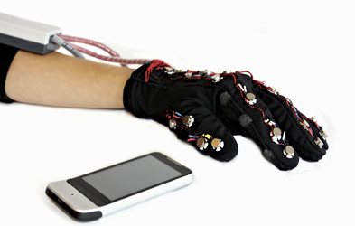  
  
13. 안경이 필요없는 3D 디스플레이 기술 소개  
http://www.extremetech.com/electronics/200665-researchers-create-glasses-free-3d-display-with-tiny-spherical-lenses  
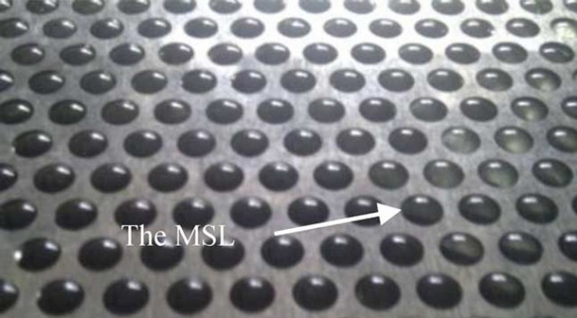  
  
  
150316 <tech>  
세일러묵 드림.  
