      
---        
#150323      
> 2015년 12주차 **HOT DEVICE EVERY WEEK**       
       
          
---      
  
  
지난 한 주간 흥미로웠던 H/W 프로젝트를 소개하고 있습니다.  
댓글 및 메시지 피드백 환영 합니다.  
  
1. 안쓰는 구형 아이폰을 라디오로 만들어주는 기기.  
https://www.kickstarter.com/projects/1294556862/i-ready-o-retrofying-your-unused-iphones  
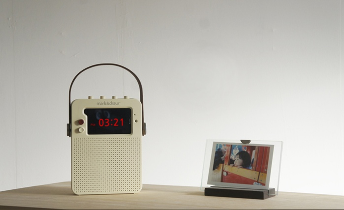  
  
2. 몸에 부착하여 아무때나 앉을 수 있는 웨어러블 의자 (아우디)  
http://www.insight.co.kr/view.php?ArtNo=16503  
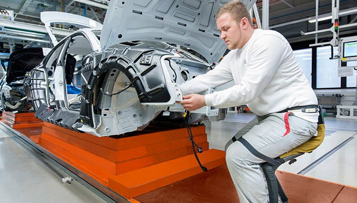  
  
3. 현존하는 가장 빠른 새로운 방식의 3D프린터  
http://mnews.joins.com/news/article/article.aspx?total_id=17376869  
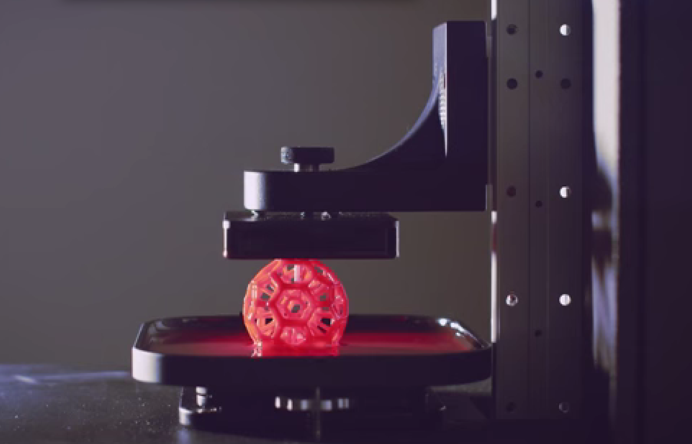  
  
4. 오픈 소스로 조립 가능한 인공 관절   
http://blog.naver.com/anatzblog/220304214553  
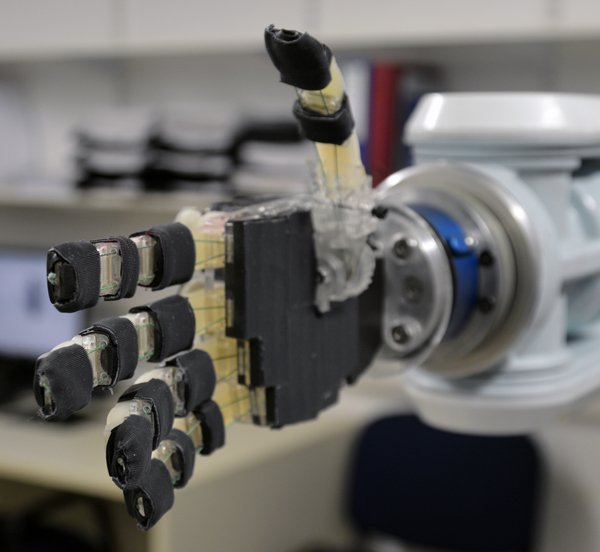  
  
5. 소형의 친인간적인 산업용 로봇   
http://www.engadget.com/2015/03/19/rethink-robotics-sawyer/?utm_source=Feed_Classic_Full&utm_medium=feed&utm_campaign=Engadget&?ncid=rss_full  
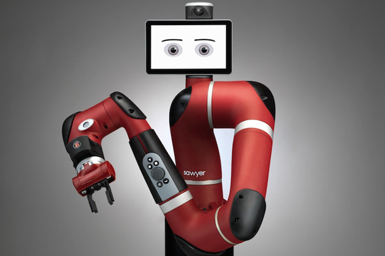  
  
6. 페블의 모듈러 스마트 워치, 심박센서등 원하는 기능을 시계줄에 선택적으로 탑재.  
http://www.etnews.com/20150320000137  
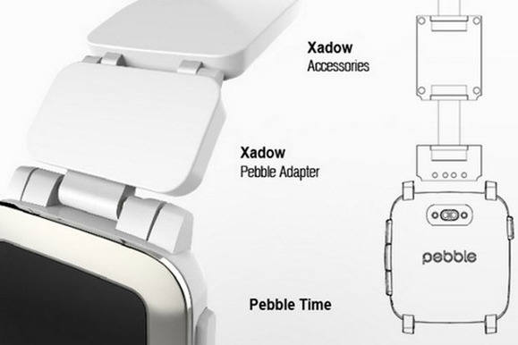  
  
7. 임산부에게 매일 조언을 해주는 기기  
http://techholic.co.kr/archives/29702?utm_source=twitterfeed&utm_medium=facebook  
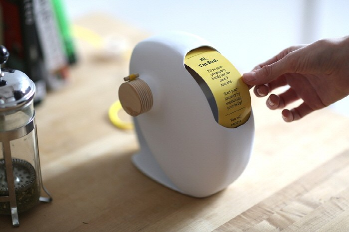  
  
8. 스마트폰과 PC에서 동시에 사용할 수 있는 128G USB메모리  
http://www.pkparis.com/en/prods/kisauve/  
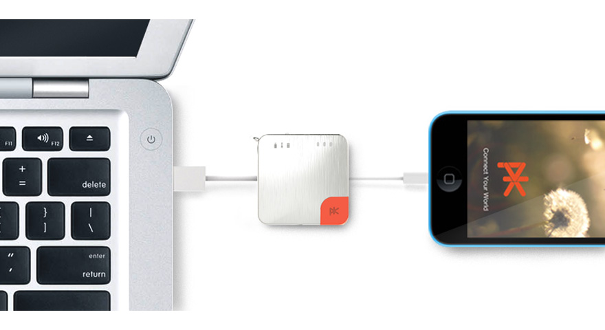  
  
9. 뇌졸증 환자치료에 도움을 주는 음악 장갑  
https://www.flintrehabilitation.com/learn/  
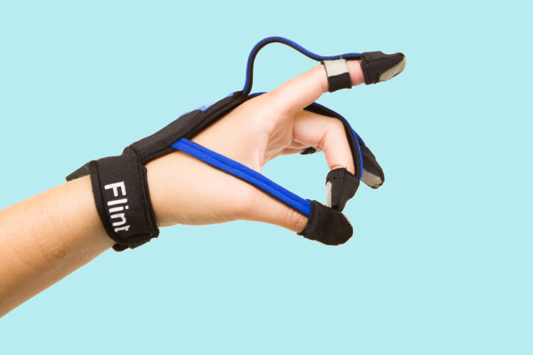  
  
10. 손으로 직집 컨트롤하는 증강 현실 헤드셋  
http://mashable.com/2015/03/16/impression-pi/?utm_cid=mash-com-fb-main-link  
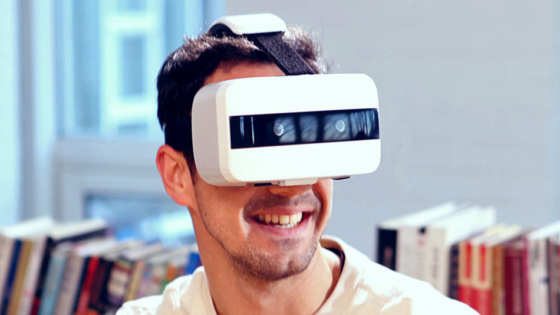  
  
11. 보드 없이 바퀴만 존재하는 스케이트 보드  
http://www.cnet.com/uk/news/post-modern-skateboard-has-no-board-just-two-wheels/  
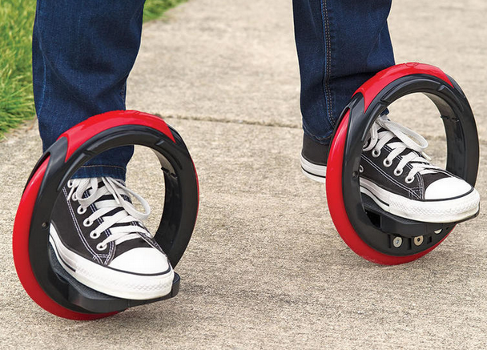  
  
12. 신발에 장착하는 LED 조명  
http://www.gizmag.com/night-runner-shoe-lights/36634/  
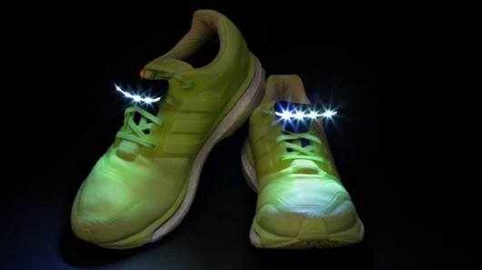  
  
13. 주변 사물을 촬영하여 사물의 진동을 분석 무슨말을 했는지 알아내는 기술  
http://mnews.joins.com/news/article/article.aspx?total_id=17376870  
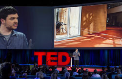  
  
  
