                                
---                                      
#150413    
> 2015년 15주차 **HOT DEVICE EVERY WEEK**                   
                  
                                  
---                                      
  
  
1. 진짜 나비처럼 날아다니는 로봇 (독일기업 Festo)   
영상참고. 대단하다는 말밖에.  
https://www.youtube.com/watch?v=1gu3z7w4Vc8  
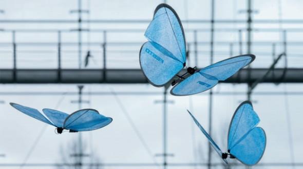  
  
2. 불세기를 자동으로 조절해 주는 스마트 스토브  
온도를 측정하여 음식이나 레시피에 따라 자동으로 불 조절을 해줌.  
기존 불조절 손잡이를 쉽게 교체.  
http://techneedle.com/archives/20521  
  
  
3. 뮤지션을 위한 몸에 착용하는 진동 메트로놈   
https://www.indiegogo.com/projects/soundbrenner-pulse-wearable-device-for-musicians/  
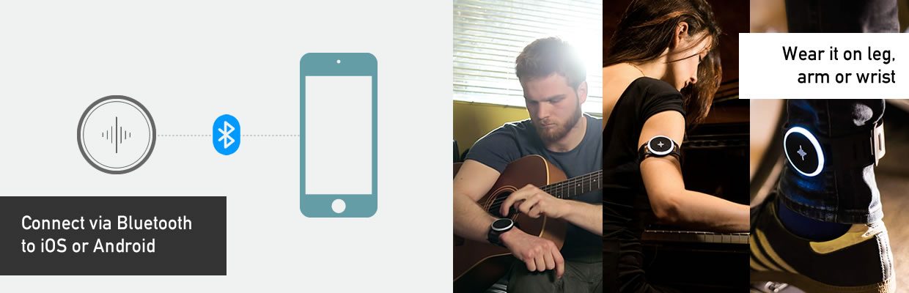  
  
4. 허리를 곧게 펴서 앉을 수 있게 도와주는 제품  
우리는 하루에 9시간 이상을 앉아있지만 올바른 자세로 앉지 않아 허리의 건강이 매우 위험한 수준에 달해 있어 이 문제를 해결.  
http://www.earlyadopter.co.kr/14142  
https://www.kickstarter.com/projects/1123408990/betterback-perfect-posture-effortlessly?ref=category_popular  
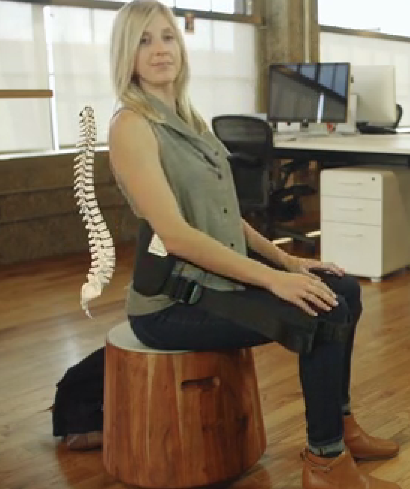  
  
5. 자전거 거치용 레버 형태의 공기 펌프  
쉽게 설치가 가능하며, 후미등, 타이어제거 공구도 됨.  
https://www.kickstarter.com/projects/1295071512/kickstand-pump-combines-4-bike-tools-into-one?ref=category_location  
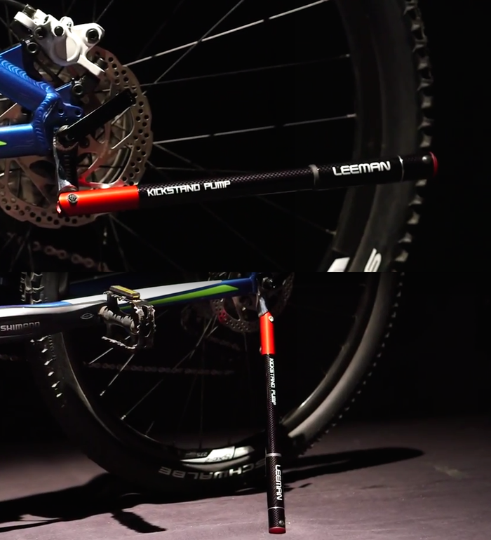  
  
6. 사진이 아닌 소리를 찍는 사운드 카메라  
http://www.bizion.com/bbs/board.php?bo_table=insight&wr_id=253  
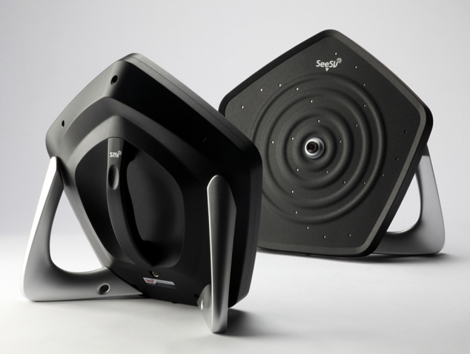  
  
7. 스마트 화분  
http://techholic.co.kr/archives/31866  
https://www.kickstarter.com/projects/gynapse/planty-the-smart-way-to-connect-with-nature  
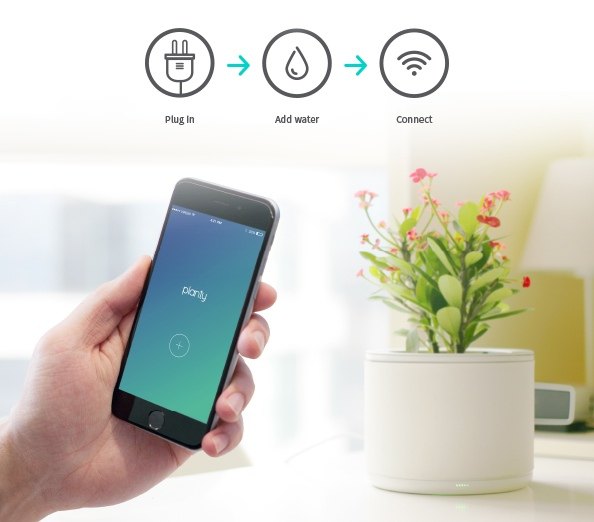  
  
8. 레이져 포인터 처럼 사용하는 마우스  
http://www.earlyadopter.co.kr/14272  
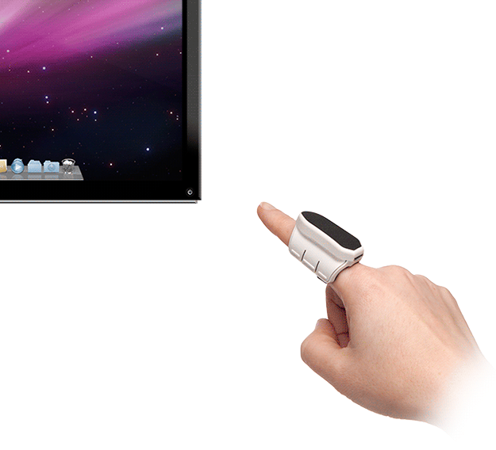  
  
9. 바퀴에 태양광 패널이 탑재된 전기 자전거  
http://www.engadget.com/2015/04/06/the-solarbike-is-a-very-real-thing/?hc_location=ufi  
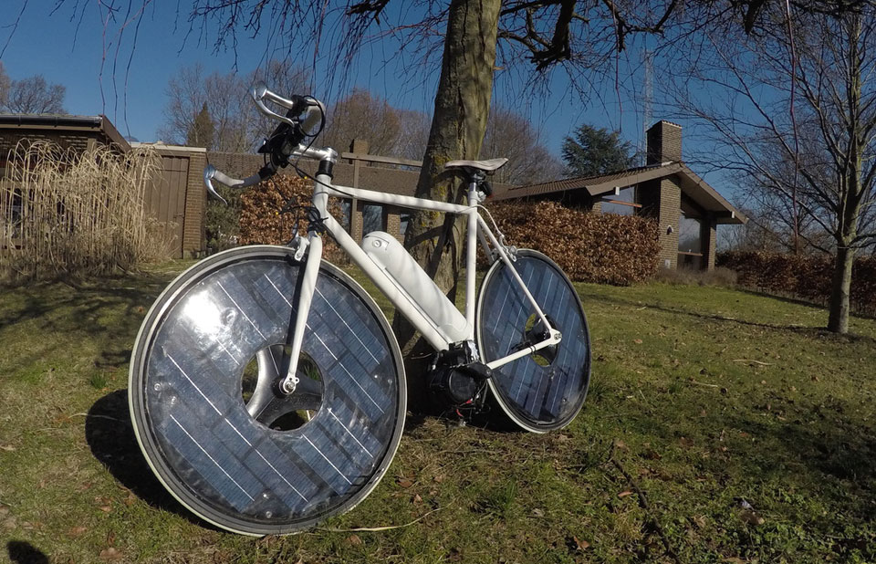  
  
10. 스마트 휴대용 램프(필립스)  
http://www.earlyadopter.co.kr/14229  
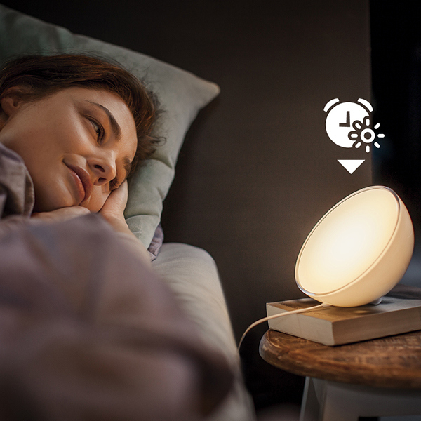  
  
11. 파킨슨 병을 조기에 검출하는 키보드   
키보드 입력 패턴을 분석  
http://www.engadget.com/2015/04/03/keyboard-diagnosis-parkinsons-disease-mit/?hc_location=ufi  
  
  
12. 플라스틱 종이컵을 재활용하여 재료로 사용하는 3D프린터  
http://www.perpetualplasticproject.com/#ppp1  
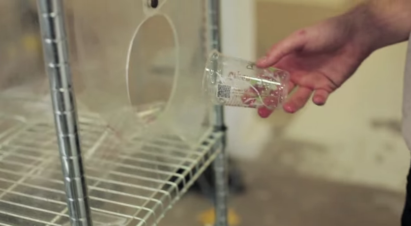  
  
13. 스마트워치의 진동을 이용한 진보된 햅틱 피드백 터치 기술  
https://vimeo.com/124604407  
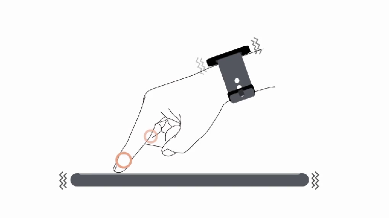  
  
  
  
