                            
---                                  
#150427  
> 2015년 17주차 **HOT DEVICE EVERY WEEK**               
>               
                              
---                                  
  
  
1. 플렉서블하게 고정(Mounting)이 가능한 귀여운 액션캠   
Pixar에서 만든것같이 생겼지만 국내 스타트업 Boud 제품.  
기존 액션캠의 단점인 손쉬운 마운팅 문제를 해결.  
https://www.indiegogo.com/projects/flex-cam-pic-bringing-flexibility-into-your-life  
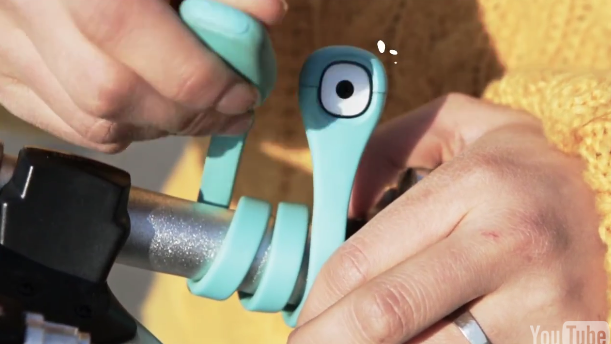  
  
2. 공중부양한 상태로 빛이 나오는 전구  
https://www.kickstarter.com/projects/flyte/flyte-levitating-light  
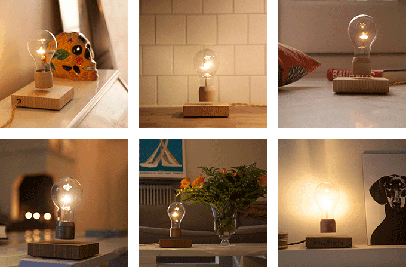  
  
3. 3D프린터로 출력한 제품을 전기도금 할 수 있는 제품.  
구리, 니켈, 팔라듐, 금 등으로 쉽게 도금이 가능한 가정용 기기.  
https://www.kickstarter.com/projects/1499748748/orbit1-a-tabletop-electroplater-turns-your-ideas-i  
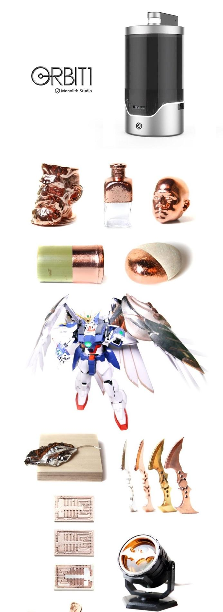  
  
4. 콘센트가 가까이 없어도 소파에서 바로 폰을 충전할 수 있게 해주는 기기  
http://gizmodo.com/put-a-pair-of-usb-ports-where-you-really-need-them-in-1699713364  
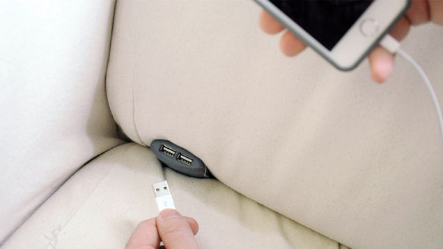  
  
5. 선물을 받은 사람이 상자를 열면 자동으로 선물을 준 사람한테 전화를 걸어주는 선물 상자.  
https://vimeo.com/115299742   
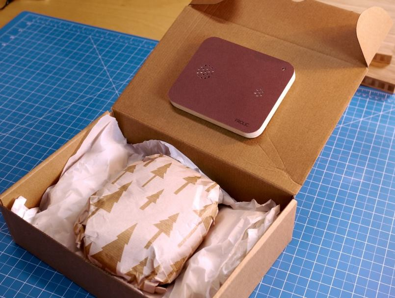  
  
6. 흙의 상태를 알려주는 센서, 태양광에너지를 사용하여 따로 전원이 필요없음.  
http://www.wired.com/2015/04/edyn-garden-sensor/?mbid=social_fb  
  
  
7. 손톱을 터치 패드로 사용하는 입력장치.  
http://www.engadget.com/2015/04/18/thumbnail-trackpad/?utm_source=Feed_Classic_Full&utm_medium=feed&utm_campaign=Engadget&?ncid=rss_full  
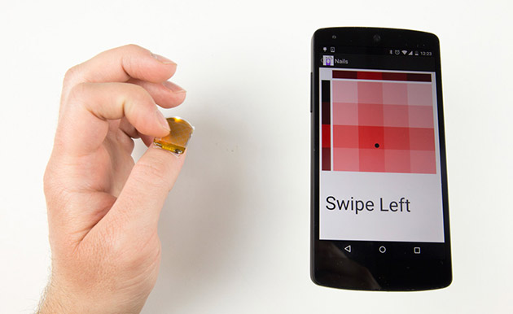  
  
8. 불이 아닌 전기 스파크로 불을 붙이는 라이터  
http://www.earlyadopter.co.kr/14874  
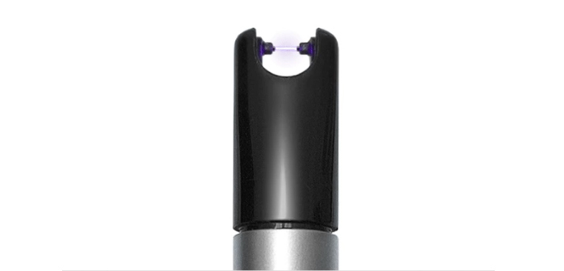  
  
9. 이케아의 미래의 주방 컨셉 (영상)  
부엌 테이블위에서 빔프로젝터로 유용한 정보를 투영시킴.  
http://www.engadget.com/2015/04/20/ikea-concept-kitchen-2025/?utm_source=Feed_Classic_Full&utm_medium=feed&utm_campaign=Engadget&?ncid=rss_full  
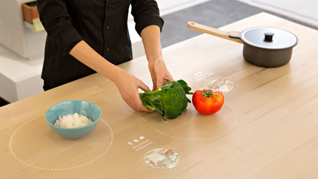  
  
10. 소리가 아닌 조명으로 기상하게 도와주는 기기  
http://www.earlyadopter.co.kr/14965  
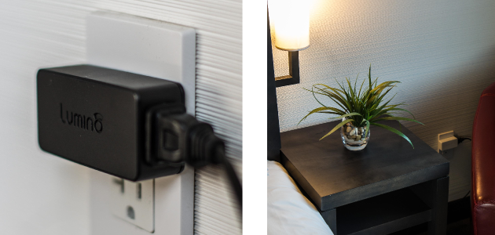  
  
11. 실내에서도 드론이 벽에 부딪혀도 문제없도록 해주는 안전장치  
드론 초보자가 연습하기 좋음.  
https://vimeo.com/125313453  
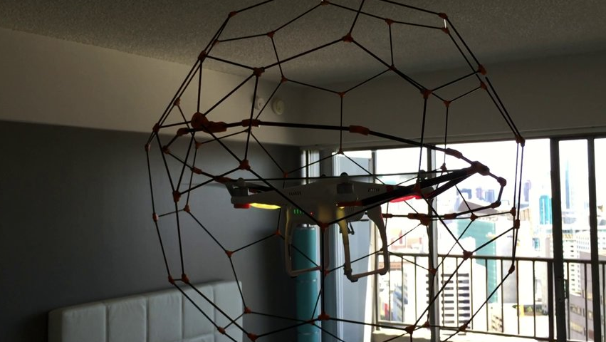  
  
12. 디즈니의 스마트폰의 새로운 형태의 입력장치.  
스피커출력에 따른 마이크의 입력을 조절하여 다양한 형태의 사용자의 입력을 감지할 수 있는 입력장치.  
http://techcrunch.com/2015/04/20/disneys-lab-builds-buttons-that-work-by-manipulating-soundwaves-rather-than-electricity/#.n9p80q:eSXc  
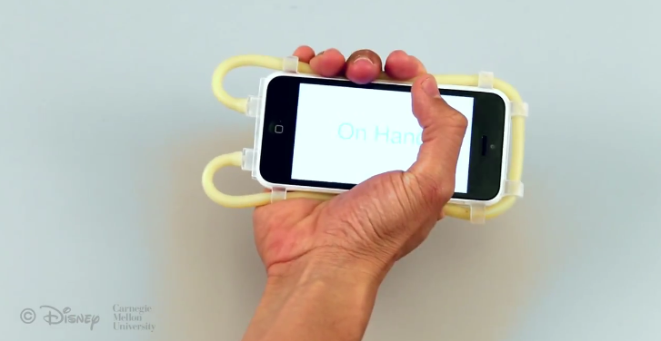  
  
13. 냄새, 바람, 물을 이용해 실제와같이 느길 수 있는 가상현실 마스크  
가상현실 헤드셋과 같이 사용.  
http://techholic.co.kr/archives/32308?utm_source=twitterfeed&utm_medium=facebook  
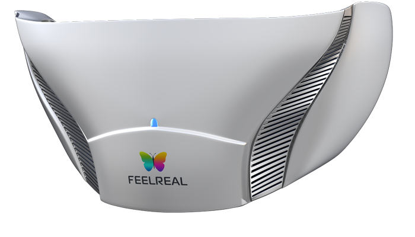  
  
14. 각종 디바이스를 연결하여 스마트홈을 만들어주는 기기  
집 전체를 터치 리모컨 하나로 관리  
http://www.earlyadopter.co.kr/14993  
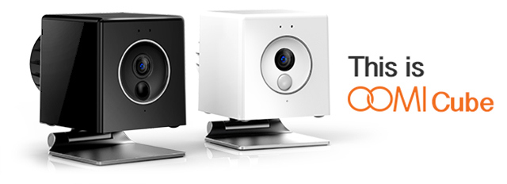  
  
15. 3D프린팅 가능한 오픈소스 휴머노이드 로봇  
https://www.kickstarter.com/projects/2107823129/plen2-the-worlds-first-printable-open-source-human?ref=tag  
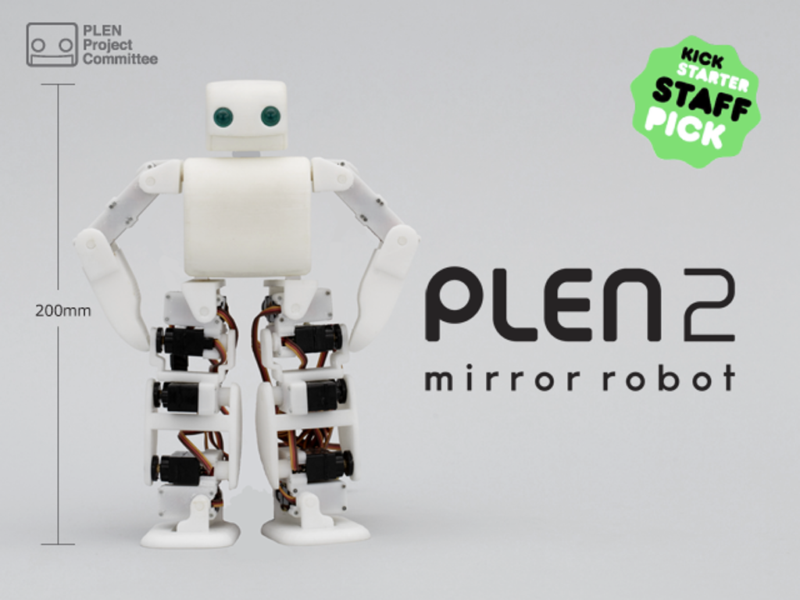  
  
16. 카본 파이버 소재를 사용해 금속을 대체할 수 있는 플라스틱 기어  
http://gizmodo.com/plastic-gears-reinforced-with-carbon-fiber-could-replac-1699417719  
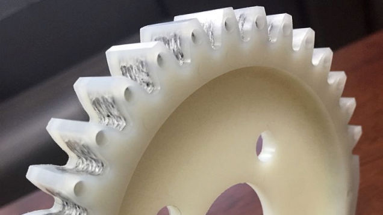  
  
17. 펠트를 재료로 사용하는 3D 프린터기 (디즈니)  
(펠트 : 양모등을 압출해서 만든 부드럽고 두꺼운 천)  
http://www.huffingtonpost.kr/2015/04/18/story_n_7094174.html  
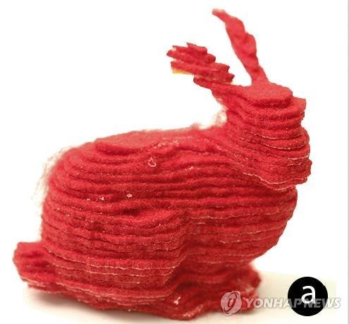  
  
  
