                      
---                            
#150518      
> 2015년 20주차 **HOT DEVICE EVERY WEEK**         
>         
                        
---                            
  
 1주년 기념Week  
매주 월요일 아침 출근길,등교길에   
지난주 가장 HOT 했던 디바이스를 파악해 보세요.  
  
1. 어떠한표면에 작성해도 디지털로 바로 저장이 되는 펜.   
기존제품은 특수 종이가 필요하거나, 펜촉의 위치를 측정하는 추가 장치가 필요했는데  
본 제품은 그런것이 필요없음.  
https://www.kickstarter.com/projects/1958554063/phree-make-the-world-your-paper  
  
  
2. 강아지처럼 졸졸 따라다니는 셀캠용 드론.  
몸에 추적 장치를 지니기만 하면 드론이 알아서 대상을 촬영해줌. 그리고 방수임.  
http://www.earlyadopter.co.kr/42848  
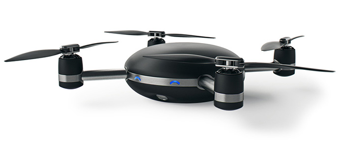  
  
3. 기존에 쓰지않던 스마트폰 배터리를 보조 배터리로 만들어주는 장치.  
https://www.kickstarter.com/projects/betterre/better-re-upcycling-power-pack-reusing-smartphone?ref=nav_search  
  
  
4. 스마트 휴지통 = 휴지통 + 진공청소기  
http://www.earlyadopter.co.kr/42701  
  
  
5. 간단히 끼워서 가구로 만들어주는 탈부착용 다리.  
http://www.funshop.co.kr/funtenna/detail/4095  
  
  
  
6. 컵에 있는 물만 끓일 수 있는 전기포트.  
http://www.earlyadopter.co.kr/42825  
  
  
7. 안개를 이용한 mid-air 디스플레이 장치.  
https://vimeo.com/121979573  
  
  
8. LED 전구 블루투스 스피커(sony)  
http://www.theverge.com/2015/5/12/8590159/sony-light-bulb-speaker-announced  
  
  
9. 원격(웹페이지)으로 고양이와 놀아줄수 있는 장난감.  
http://www.cnet.com/news/tease-your-cat-with-remote-control-toys-from-anywhere/  
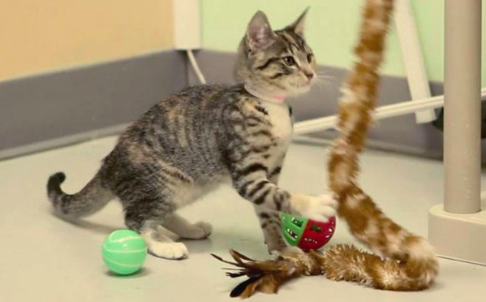  
  
10. 도어벨을 누르면 스마트폰에서 누군지 영상으로 확인하고 통화할 수 있는 기기.  
집에 아무도 없어도 바로 스마트폰으로 대화할 수 있음.  
https://ring.com  
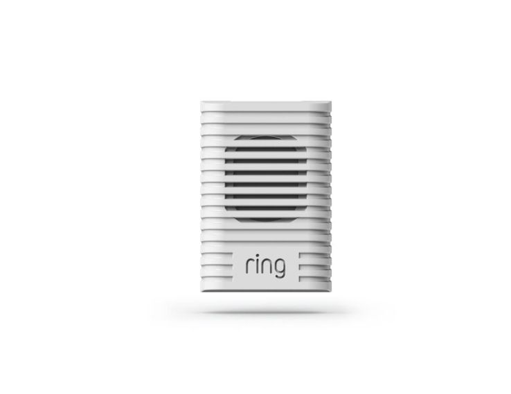  
  
11. 라즈베리 파이용 전자잉크 디스플레이  
http://www.geek.com/chips/papirus-is-a-46-e-paper-display-for-the-raspberry-pi-1622713/  
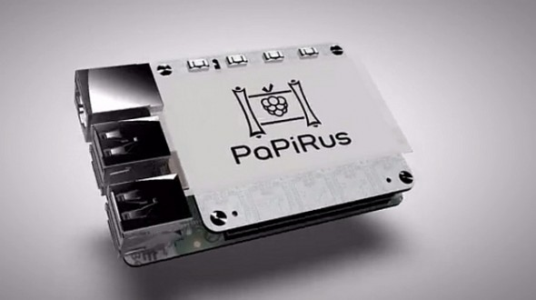  
  
12. 딱 전화기능만 있는 심플한 폰. 스마트폰의 각종 알림에서 해방.  
http://www.geek.com/mobile/light-phone-is-a-bright-idea-that-makes-smartphones-less-distracting-1622811/  
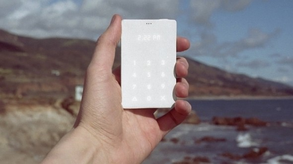  
  
13. 뒷면이 전자 잉크 디스플레이인 스마트폰 요타폰(두번째 버전)  
전자잉크 디스플레이는 전원이 필요없이 마지막 디스플레이 상태를 유지하고 있음.  
http://techneedle.com/archives/20762  
  
  
  
14. 감쪽같은 인공 손가락  
https://www.youtube.com/watch?v=PWvdSP8avhg  
https://handfacts.wordpress.com/2011/06/29/lost-a-finger-upgrade-your-body-with-the-x-finger/  
  
  
15. 머리감겨주는 기계  
https://www.facebook.com/fizikist/videos/801244833257990/  
  
  
16. 타임랩스 촬영을 더 쉽게 해주는 회전 장치  
http://www.earlyadopter.co.kr/42742  
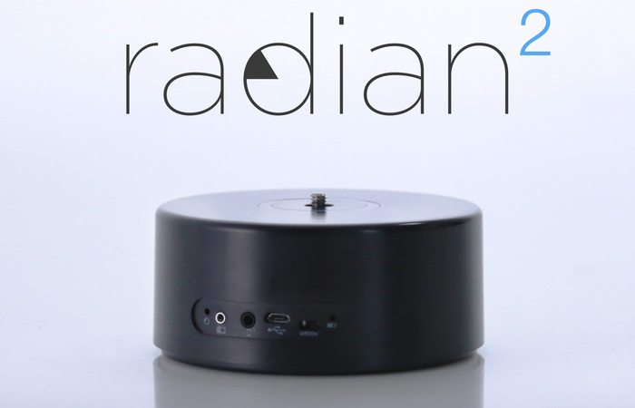  
  
17. 피부 상태를 분석해주는 기기.  
http://besuccess.com/2015/05/waywearable/  
  
  
18. $9 짜리 컴퓨터  
http://www.huffingtonpost.kr/2015/05/11/story_n_7254232.html?1431325173  
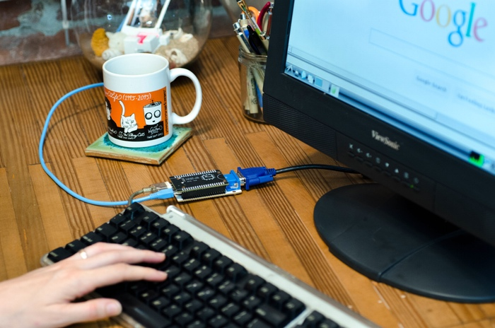  
  
19. 날씨 측정 해주는 스마트폰 악세서리.  
https://www.kickstarter.com/projects/weatherpoint/weather-point-the-worlds-smallest-weather-station?ref=nav_search  
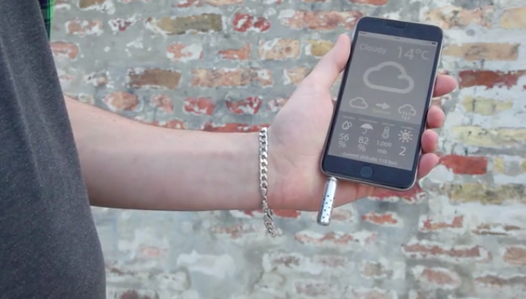  
  
20. 모든것을 버튼으로 만들어주는 기기  
http://www.engadget.com/2015/05/11/makey-makey-go-kickstarter-launch/  
  
  
21. 자전거를 탈때 부는 바람으로 팬을 돌려 전기를 생산하는 $5 짜리 발전기.  
http://www.huffingtonpost.kr/2015/05/10/story_n_7253712.html?ncid=fcbklnkkrhpmg00000001  
  
  
22. 발로 밟아 쉽게 탈수하는 수동 탈수기  
https://www.youtube.com/watch?v=SUgF24GcDi0  
  
  
23. 다리에 착용하여 무거운짐을 쉽게 들수있게 도와주는 웨어러블 엑소슈트.  
http://www.geek.com/news/japanese-banks-now-have-money-grabbing-robotic-exoskeletons-that-are-probably-great-for-bank-robbery-1622425/  
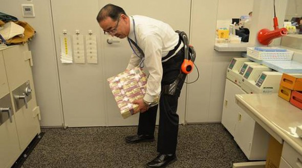  
  
24. 디스플레이도 되는 스마트 거울  
http://mashable.com/2015/05/15/starwood-technology/?utm_cid=mash-com-fb-main-link  
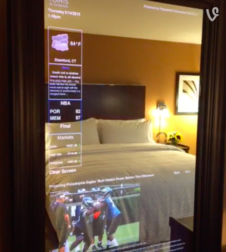  
  
25. 피자를 시킬 수 있는 탁상 시계   
http://thenextweb.com/shareables/2015/05/14/what-time-is-it/  
  
  
26. 자물쇠를 30초 안에 해체하는 로봇.  
http://www.wired.com/2015/05/little-3-d-printed-robot-cracks-combination-locks-30-seconds/?mbid=social_fb  
  
  
27. 수돗물을 채워넣고 바로 마실 수 있는 스마트 정수기  
https://drinkcove.com/shop  
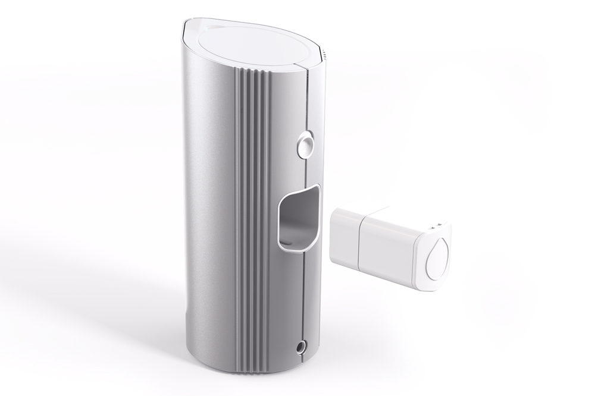  
  
28. 어떤 곳이든 터치스크린으로 만들어주는 프로젝터.  
https://www.indiegogo.com/projects/touchpico-turn-any-surface-into-a-touch-screen  
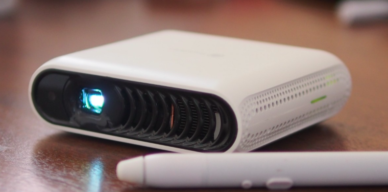  
  
  
오늘 부로 #지난주_핫_IT_프로덕트 가 포스팅 1주년을 맞이 하였습니다.  
  
  
