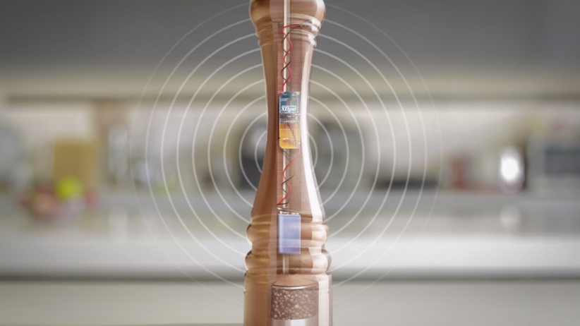
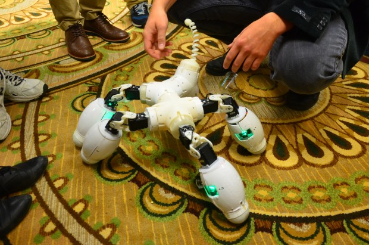

                    
---                          
#150525     
> 2015년 21주차 **HOT DEVICE EVERY WEEK**       
>       
                      
---                          
  
  
1. 안드로이드의 뒤로가기 버튼을 아이폰에서도 가능하게 해주는 보호 필름.  
그냥 필름만 붙이면 동작함. 미세한 내부 회로 존재.  
아이폰6의 뒤로가기 버튼이 한손조작이 어려워서 해결한 아이디어.  
http://www.earlyadopter.co.kr/43052  
    
  
2. 전등 스위치 위에 부착하여 원격으로 on/off 할 수 있는 기기   
http://www.wadiz.kr/Campaign/Details/1094  
    
  
3. 잘때 낄 수 있는 부드러운 헤드폰. 수면상태도 모니터링.  
http://www.earlyadopter.co.kr/43186  
    
  
4. 스마트폰 렌즈에 부착하는 스티커형 현미경 렌즈  
http://www.earlyadopter.co.kr/43046  
    
  
5. WIFI 를 먹통으로 만들어버리는 후추통.   
스마트폰에게 빼앗긴 식사시간 대화를 되찾아옴.  
http://www.entrepreneur.com/article/246075  
    
  
6. 손목에 차는 웨어러블 블루투스 스피커  
http://thenextweb.com/gadgets/2015/05/19/this-49-wearable-bluetooth-speaker-actually-sounds-pretty-great/  
    
  
7. 인바디 밴드  
https://www.kickstarter.com/projects/1759511432/inbody-band-see-yourself-change-everyday?ref=nav_search  
    
  
8. 스마트폰 알림을 대신 울려주는 백. 여성은 스마트폰을 가방에 넣고 다니는 경우가 더 많기 때문.  
http://news.naver.com/main/read.nhn?mode=LSD&mid=shm&sid1=101&oid=366&aid=0000268022  
    
  
9. 인공지능 로봇 친구  
https://www.indiegogo.com/projects/musio-your-curious-new-friend#/story  
    
  
10. 3D Food 데코레이션 Printer   
https://www.kickstarter.com/projects/2028227986/bocusini-worlds-first-plug-and-play-3d-food-printi  
    
  
11. 오렌지 껍질 겁나빨리 까는 기계  
http://sploid.gizmodo.com/video-a-machine-robot-peels-an-orange-so-fast-1706057248?utm_campaign=socialflow_gizmodo_facebook&utm_source=gizmodo_facebook&utm_medium=socialflow  
    
  
12. 아이폰6을 6분만에 충전하는 보조배터리  
http://www.earlyadopter.co.kr/43296  
    
  
13. 작고 가벼운 신형맥북용 USB-C 젠더  
http://www.earlyadopter.co.kr/43301  
    
  
14. 반려동물 위치,활동량 추적 기기, 이제 동물도 스마트폰에서 자유로울 수 없음.  
http://www.earlyadopter.co.kr/43222  
    
  
15. 태양광충전 보조 배터리  
http://www.engadget.com/2015/05/20/zerolemon-solarjuice-stackcommerce/  
    
  
16. 목적지만 입력하면 자율 비행으로 최대 6km 까지 비행하는 드론.  
http://www.earlyadopter.co.kr/43162  
    
  
17. 스마트 자전거 자물쇠  
http://uncrate.com/stuff/linka-smart-bike-lock/  
    
  
18. 태양광 충전기  
http://uncrate.com/stuff/solartab-solar-charger/  
    
  
19. 반려견에 장착하는 카메라. 심장박동수로 사진을 찍음  
http://www.psfk.com/2015/05/nikon-asia-dog-camera-heartography.html  
    
  
20. 스마트 도어벨 카메라  
http://techcrunch.com/2015/05/19/vivint-launches-a-new-home-automation-system-complete-with-a-tiny-doorbell-camera/?ncid=rss&utm_source=feedburner&utm_medium=feed&utm_campaign=Feed%3A+Techcrunch+%28TechCrunch%29#.ugp8yw:kbIg  
    
  
21. 보다 쉽게 걸을 수 있는 의족  
http://techcrunch.com/2015/05/20/brain-powered-prosthetics-get-closer-to-becoming-an-everyday-reality/  
    
  
22. 마인드컨트롤 의족  
http://www.digitaltrends.com/cool-tech/mind-controlled-bionic-prosthetics-announced/?utm_source=facebook&utm_medium=socialm&utm_campaign=cooltech  
    
  
23. 모듈형 로봇.  
http://spectrum.ieee.org/automaton/robotics/diy/fable-modular-robotics  
    
  
24. 탄성으로 전기를 생산하는 고무  
http://www.engadget.com/2015/05/18/ricoh-invents-super-efficient-power-producing-rubber/?utm_source=Feed_Classic_Full&utm_medium=feed&utm_campaign=Engadget&?ncid=rss_full  
    
  
25. 진동으로 발전하는 풍력발전기.  
http://www.theverge.com/2015/5/16/8615089/vortex-bladeless-wind-turbines-shake-to-generate-electricity  
    
  
26. 실내온도를 줄여주는 테이블. 별도의 전원 필요없음.  
http://www.wired.com/2015/05/table-sucks-heat-lower-ac-bills/?mbid=social_fb  
    
  
  
  
  
