                    
---                          
#150601       
> 2015년 22주차 **HOT DEVICE EVERY WEEK**       
>       
                      
---                          
    
Google I/O 행사에서 진행된 4가지 프로젝트부터 소개합니다.    
    
1. Google Project #0 VR 3D영상 스트리밍용, 360-degree camera array    
카메라가 많은 이유는 모든 방향의 양안시차가 있는 영상을 만들기 위함임.     
VR기기의 왼쪽눈과 오른쪽눈의 영상이 서로 달라서 공간감을 느낄 수 있음.    
이 카메라 array로 만든 영상을 VR기기를 쓰고 보면 실제 그 장소에 있는것처럼 느낄 수 있음.    
#VR    
http://www.engadget.com/2015/05/28/gopro-360-degree-camera-array-for-vr/?utm_source=Feed_Classic_Full&utm_medium=feed&utm_campaign=Engadget&?ncid=rss_full    
    
    
2. Google Project #1 Project Jacquard    
스마트실. 기존 터치패널이 아닌 천위에서 터치하는 기술.    
옷의 일부를 이 스마트실로 만들고 디바이스를 이 옷 위에서 컨트롤 가능.    
#wearable    
http://www.popsci.com/googles-levi's-computers-clothing-project-jacquard?dom=fb&src=SOC    
http://www.cnet.com/news/google-fabrics-and-fashion-a-peek-at-project-jacquard/    
    
    
3. Google Project #2 Project Tango    
스마트폰으로 3D 공간 지도를 만들어줌.    
#mobile    
http://www.engadget.com/2015/05/29/google-qualcomm-project-tango-phone/?utm_source=Feed_Classic_Full&utm_medium=feed&utm_campaign=Engadget&?ncid=rss_full    
(참고 Tango Tablet, 2014)    
http://www.engadget.com/2015/05/28/google-project-tango-public-release/?utm_source=Feed_Classic_Full&utm_medium=feed&utm_campaign=Engadget&?ncid=rss_full    
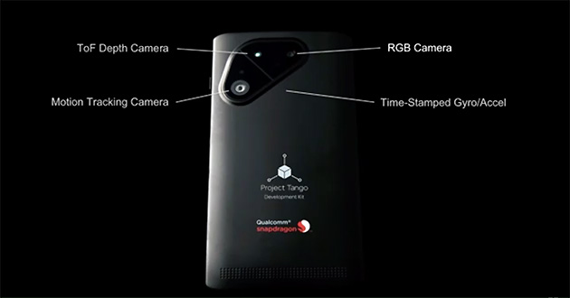    
    
4. Google Project #3 Project Soil    
radar를 이용 손의 제스쳐를 인식함.    
#input_device    
http://www.engadget.com/2015/05/29/atap-project-soli%20/?utm_source=Feed_Classic_Full&utm_medium=feed&utm_campaign=Engadget&?ncid=rss_full    
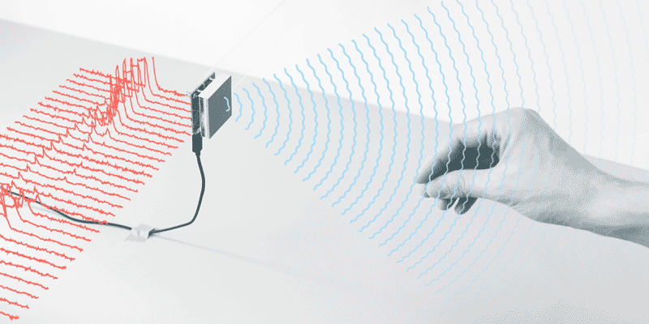    
    
5. 키보드위에서 바로 터치패널 이용해 마우스 제어.    
#input_device    
https://www.indiegogo.com/projects/moky-invisible-touchpad-with-keyboard#/story    
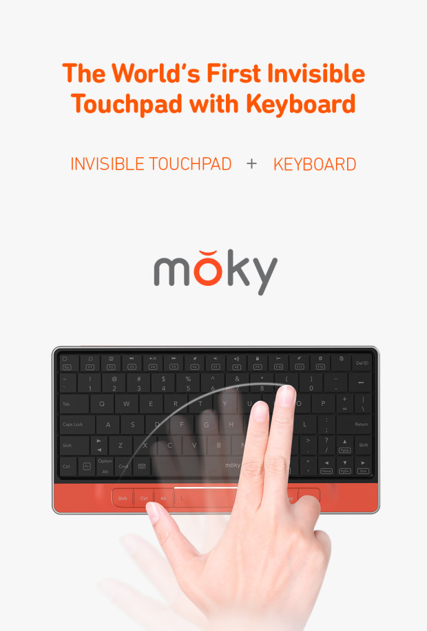    
    
6. 향기로 일어날 수 있는 알람시계    
#smart_home    
http://uncrate.com/stuff/sensorwake-scent-alarm-clock/    
    
    
7. 피자박스 스마트폰 프로젝터 (피자헛)    
피자를 먹으면서 같이 영화볼수 있도록.     
#mobile_accessary    
http://www.engadget.com/2015/05/27/pizza-hut-projector-box/?utm_source=Feed_Classic_Full&utm_medium=feed&utm_campaign=Engadget&?ncid=rss_full    
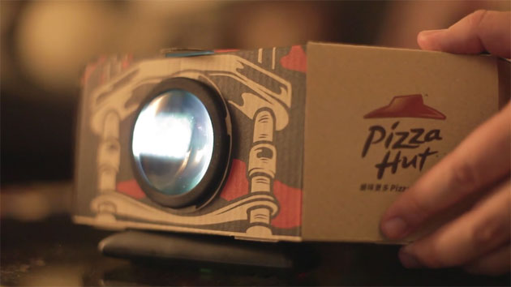    
    
8. 디즈니 캐릭터의 걸음걸이를 로봇으로(연구)    
#robotics    
http://thenextweb.com/shareables/2015/05/26/disney-brings-animated-characters-to-life-as-robots/    
    
    
9. 스스로 몸을 접을 수 있는 마이크로 로봇.    
평상시엔 껌종이같이 얇게 펴져있고, 접히면, 기어다닐수 있고 수영도 할 수 있고, 짐을 나르기도 함.    
미친 로봇임.    
#robotics    
http://techcrunch.com/2015/05/29/meet-an-origami-robot-that-can-build-itself-run-around-and-then-dissolve/?ncid=rss&utm_source=feedburner&utm_medium=feed&utm_campaign=Feed%3A+Techcrunch+%28TechCrunch%29    
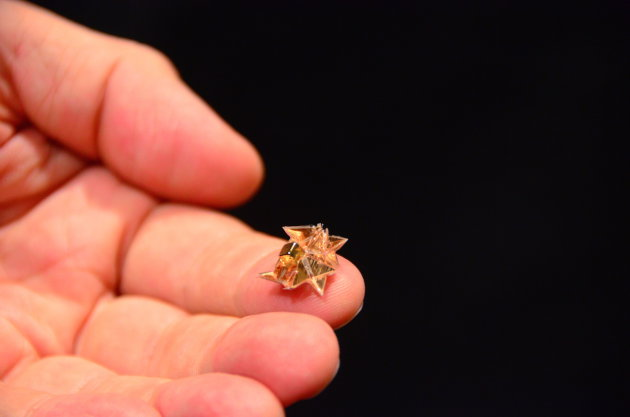    
    
10. 집안의 모든 가전을 이 하나의 기기로 제어.    
#smart_home #IoT    
http://www.earlyadopter.co.kr/43452    
    
    
11. 점프해서 허들을 뛰어넘는 치타 로봇(MIT)    
#robotics    
http://www.wired.com/2015/05/watch-terrifying-cheetah-robot-jump-hurdles/?mbid=social_fb    
    
    
12. 날수도 있고 날개로 기어다닐 수 있는 드론(박쥐형태).    
#drone    
http://interestingengineering.com/daler-drone-vampire-bat-can-fly-and-walk/    
    
    
13. GoPro카메라를 360도 전방위를 촬영할수 있게 도와주는 기기.    
#action_cam    
http://www.engadget.com/2015/05/27/gopro-spherical-camera-drone/    
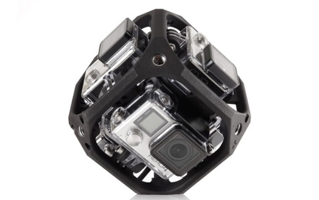    
    
14. 사용자 얼굴의 표정도 인식이 되는 VR기기 (facebook)    
#VR    
http://www.psfk.com/2015/05/facebook-oculus-rift-facial-performance-sensing-head-mounted-display-hao-li.html    
    
    
15. 실내 공기 상태를 모니터링 해주는 기기.    
#smart_home #IoT    
http://www.engadget.com/2015/05/27/the-awair-helps-you-breathe-easier-by-tracking-air-quality/?utm_source=Feed_Classic_Full&utm_medium=feed&utm_campaign=Engadget&?ncid=rss_full    
    
    
16. 로봇 새를 로봇 바퀴가 날려줌.    
#robotics    
http://www.cnet.com/news/watch-a-robotic-cockroach-launch-a-robotic-bird/    
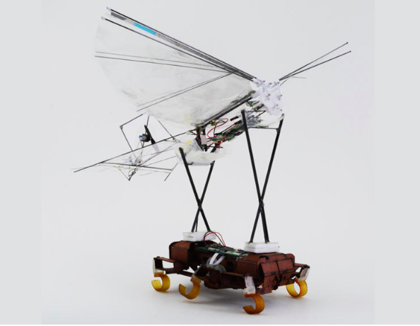    
    
17. 팅커벨 사이즈 군용 스파이캠 드론.    
#drone    
http://www.engadget.com/2015/05/29/us-military-micro-drone/?utm_source=Feed_Classic_Full&utm_medium=feed&utm_campaign=Engadget&?ncid=rss_full    
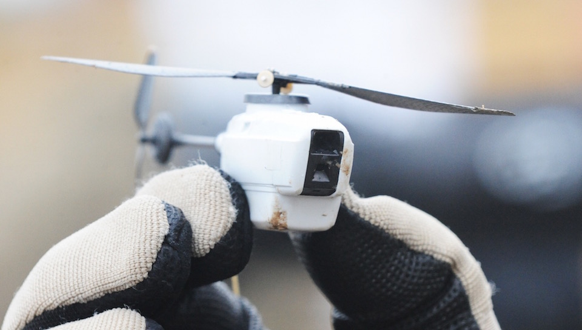    
    
18. 프로젝터가 내장된 스마트폰    
#mobile    
http://www.geek.com/mobile/lenovo-smartphone-uses-lasers-to-project-a-touchscreen-onto-any-surface-1623805/    
    
    
19. 스마트 신발(레노보)    
#wearable    
http://www.earlyadopter.co.kr/43567    
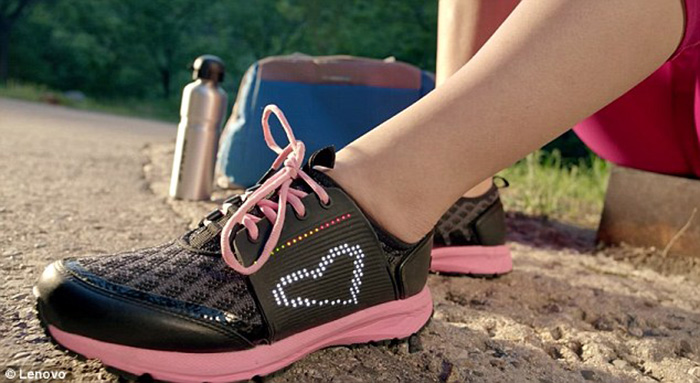    
    
20. 모바일용 DJ mixing & scratching 기기    
#mobile_accessary    
https://www.kickstarter.com/projects/396428272/mixfader-the-worlds-1-connected-object-for-becomin    
    
    
21. 스마트폰용 휴대용 스튜디오    
#mobile_accessary    
http://www.10x10.co.kr/shopping/category_prd.asp?itemid=1078873    
    
    
22. 털을이용한 거울 (미디어 아트)    
#media_art    
http://www.engadget.com/2015/05/26/motion-sensing-pompom-mirror-recreates-your-likeness-in-fur/    
    
    
23. 스마트폰용 소형 헤드폰 앰프    
#mobile_accessary    
http://www.earlyadopter.co.kr/43433    
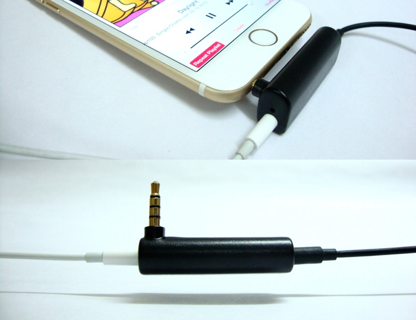    
    
24. 기름으로 움직이는 드론.    
배터리 전원을 사용하는 드론보다 더 많은 시간 빠른속도로 이용가능.    
#drone    
http://www.digitaltrends.com/cool-tech/yeair-gas-powered-drone-kickstarter/?utm_source=facebook&utm_medium=socialm&utm_campaign=cooltech    
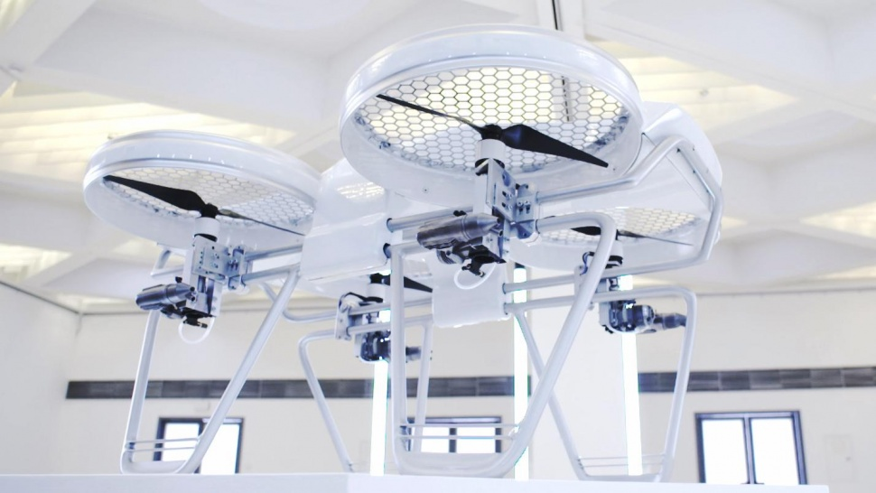    
    
25. 건강한 눈의 3배 시력을 갖게해주는 생체 렌즈    
#biotech    
http://media.daum.net/digital/others/newsview?newsid=20150524104523502    
    
    
26. 새로운 스킬을 사람처럼 학습하는 로봇.(연구)    
#robotics    
http://gizmodo.com/this-robot-learns-new-tasks-by-doing-them-like-a-human-1706567578?utm_campaign=socialflow_gizmodo_facebook&utm_source=gizmodo_facebook&utm_medium=socialflow    
    
    
27. 다리를 다쳐도 스스로 적응하는 로봇(연구)    
#robotics    
http://www.iflscience.com/technology/robots-can-adapt-injury-within-minutes    
    
    
    
