                
---                      
#150608    
> 2015년 23주차 **HOT DEVICE EVERY WEEK**                      
>                       
                  
---                      
  
  
1. DRC(DARPA Robotics Chanllenge) 우승한 KAIST팀 로봇 (DRC-HUBO)  
현존 가장 권위있는 로봇 대회라고 볼 수 있으며,  
한국팀이 로봇 최강국인 미국, 일본팀을 제치고 우승을 차지한 것은 놀라울 만한 성과임.  
#robotics  
http://www.theroboticschallenge.org/finalist/kaist  
http://www.nytimes.com/2015/06/07/science/korean-robot-makers-walk-off-with-2-million-prize.html?emc=edit_th_20150607&nl=todaysheadlines&nlid=55481950&_r=0  
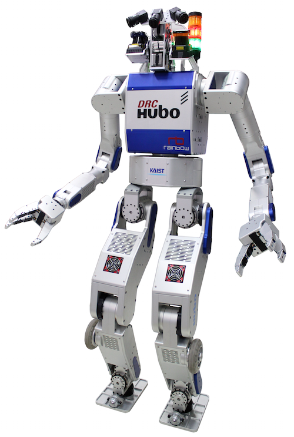  
  
2. 실제 소리에서 듣고싶은 소리만 볼륨을 키우고 원하지 않는 소리는 볼륨을 낮출 수 있는 이어폰.  
https://www.kickstarter.com/projects/dopplerlabs/here-active-listening-change-the-way-you-hear-the  
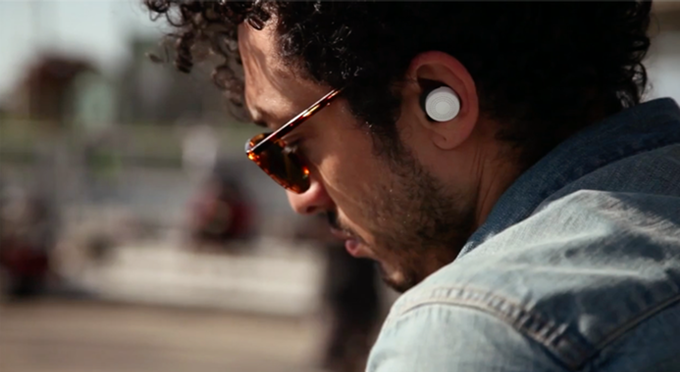  
  
3. 병원에서 아이들의 걱정,불안을 감소시켜주는 곰돌이 로봇.  
뒤에서 사람이 원격조정으로 아이들과 대화하며, 아이들은 실제 곰돌이가 말하고 움직이는줄 앎.  
#robotics  
http://www.nytimes.com/2015/06/04/technology/huggable-robot-therapeutic-value-hospitals.html?hp&action=click&pgtype=Homepage&module=photo-spot-region&region=top-news&WT.nav=top-news&_r=1  
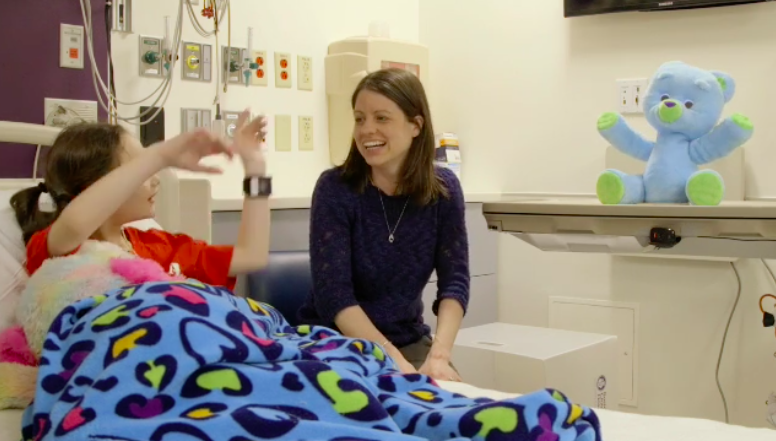  
  
4. 아무 신발에나 부착할 수 있는 롤러 스케이트.  
https://www.kickstarter.com/projects/flaneurz/on-wheelz-walk-and-roll-with-your-favorite-shoes  
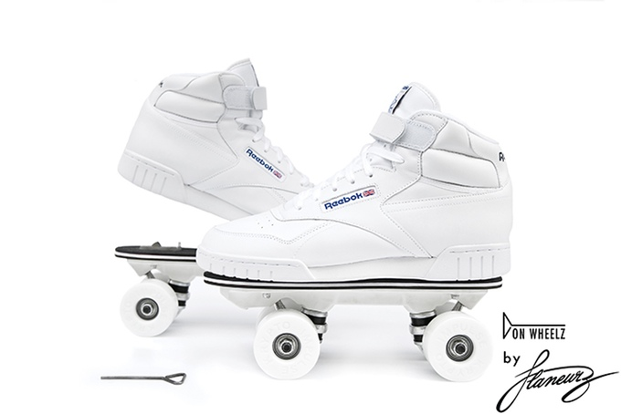  
  
5. 어쿠스틱 기타에 부착하여 여러 sound를 만들어 낼 수 있는 MIDI 컨트롤러  
http://acpad.com/#brief  
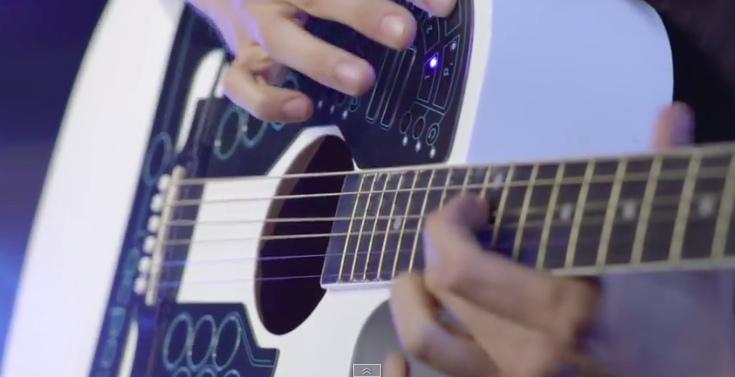  
  
6. 자외선 차단제의 효과를 광고하는 인형(NIVEA)  
http://www.earlyadopter.co.kr/43893  
  
  
7. 프로젝터가 내장되어있는 키보드. 모니터가 필요없음.  
http://www.cnet.com/uk/news/work-anywhere-with-a-wall-with-the-sho-u-kibojet-keyboard-projector/  
  
  
8. 스페이스바에 정전식 터치 패널이 장착된 키보드.  
스페이스바를 이용한 새로운 input동작 가능.  
http://www.engadget.com/2015/06/03/synaptics-smartbar/?utm_source=Feed_Classic_Full&utm_medium=feed&utm_campaign=Engadget&?ncid=rss_full  
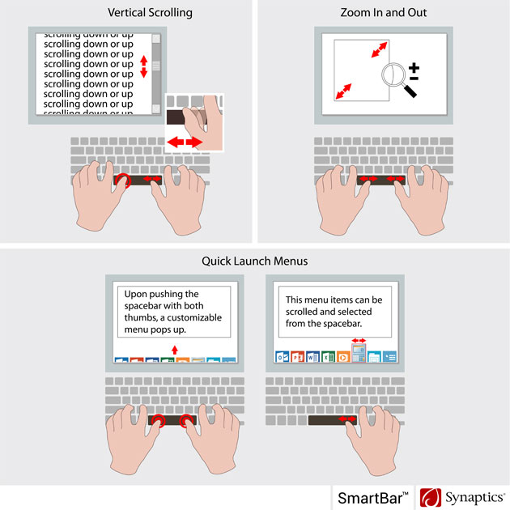  
  
9. WIFI로 전기를 얻는 카메라 모듈  
http://www.geek.com/science/researchers-develop-camera-powered-via-wifi-1624521/  
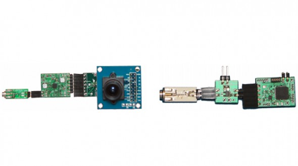  
  
10. 나무로 만든 부드러운 배터리  
http://interestingengineering.com/squeezable-soft-body-battery-made-from-wood/  
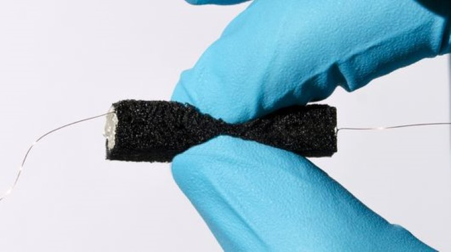  
  
11. 로봇 사무라이  
#robotics  
http://www.engadget.com/2015/06/05/robot-and-samurai-face-off-in-an-awesome-sword-duel/?utm_source=Feed_Classic_Full&utm_medium=feed&utm_campaign=Engadget&?ncid=rss_full  
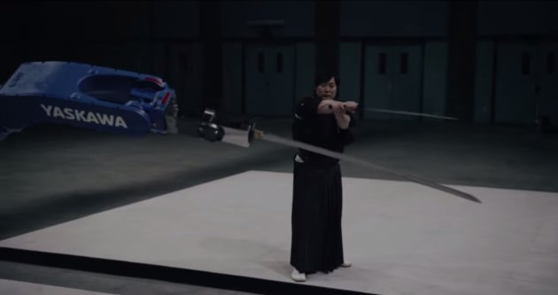  
  
12. 콘센트에 꽂아 사용하는 Windows돌아가는 PC   
http://www.geek.com/news/these-wall-warts-are-actually-full-windows-pcs-1624377/  
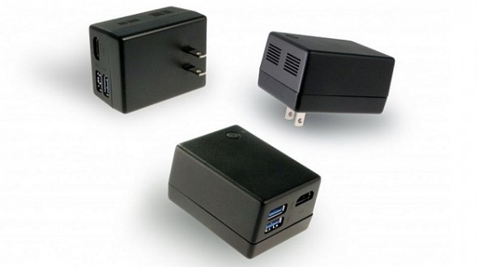  
  
13. 디지털 Handpan 악기  
http://blog.atmel.com/2015/06/02/oval-is-the-worlds-first-digital-handpan/?sf38467268=1  
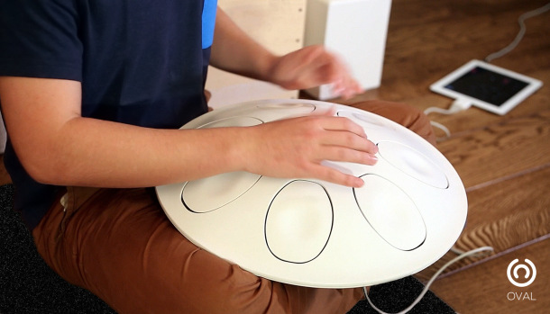  
  
14. 런던 경찰이 착용하게될 body cam, 버스의 블랙박스와 비슷한 개념?  
http://www.engadget.com/2015/06/03/london-police-body-cameras/?utm_source=Feed_Classic_Full&utm_medium=feed&utm_campaign=Engadget&?ncid=rss_full  
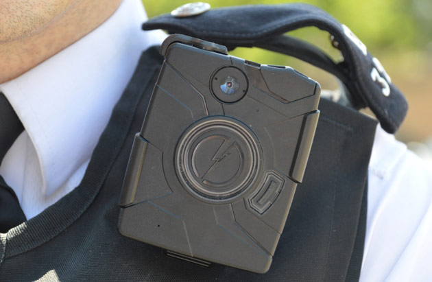  
  
15. 인텔의 스마트종이, 프로젝터와 구멍뚤린 종이를 이용해 유용한 정보를 출력.  
https://www.youtube.com/watch?v=o8Aat7V7OFM&feature=youtu.be  
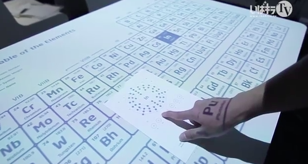  
  
16. 내일의 날씨를 알려주는 상자.  
http://www.huffingtonpost.kr/2015/06/02/story_n_7492152.html  
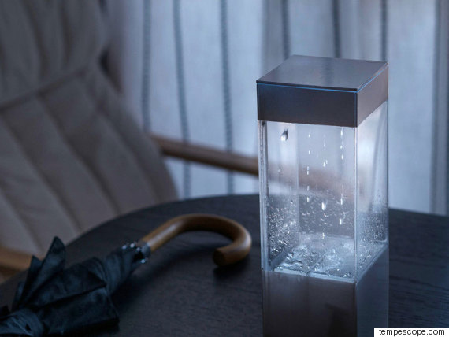  
  
17. 모든 물병을 스마트 물병으로 만드는 뚜껑.  
http://www.earlyadopter.co.kr/43863  
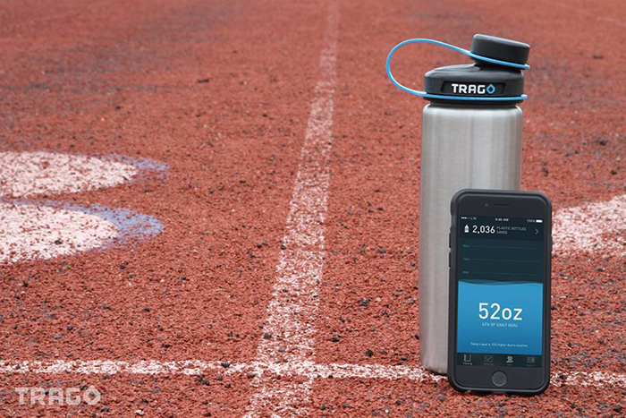  
  
18. 규칙적으로 물을 마시도록 도와주는 스마트 물병  
http://www.earlyadopter.co.kr/43795  
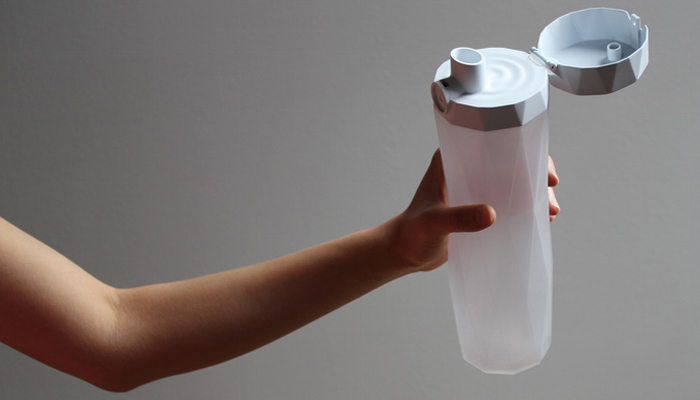  
  
19. 레이져 트랙패드.   
http://www.engadget.com/2015/06/03/laser-projected-mouse-robot-head/?utm_source=Feed_Classic_Full&utm_medium=feed&utm_campaign=Engadget&?ncid=rss_full  
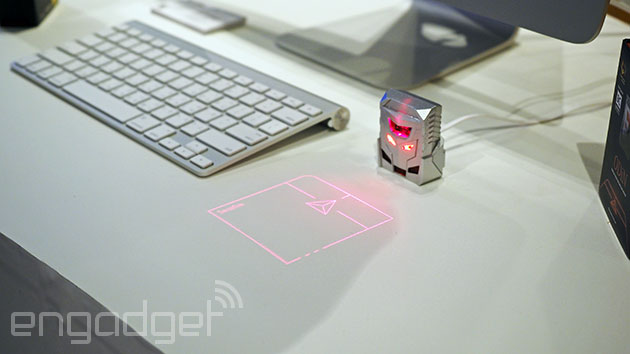  
  
20. 기분을 전환시켜주는 헤드셋.  
https://bcitechreview1.wordpress.com/2015/06/03/thync의-기분-전환-헤드셋/  
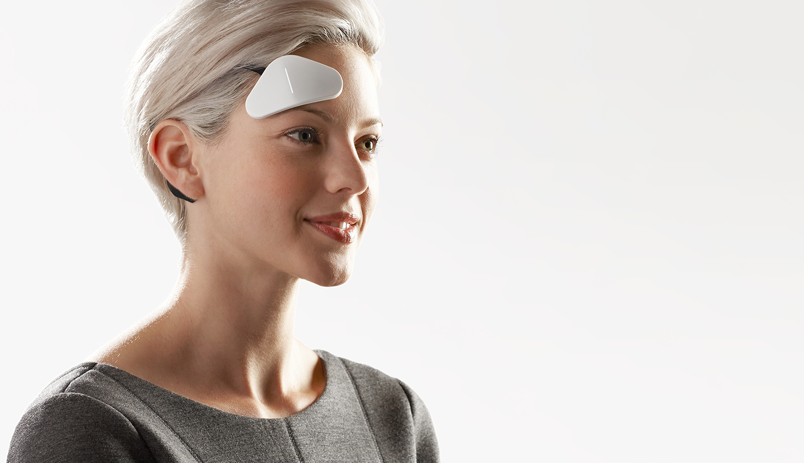  
  
21. 애플 스마트 홈킷으로 만든 첫번째 스마트홈 제품.  
http://recode.net/2015/06/02/first-apple-smart-home-products-launch-ahead-of-worldwide-developer-conference/  
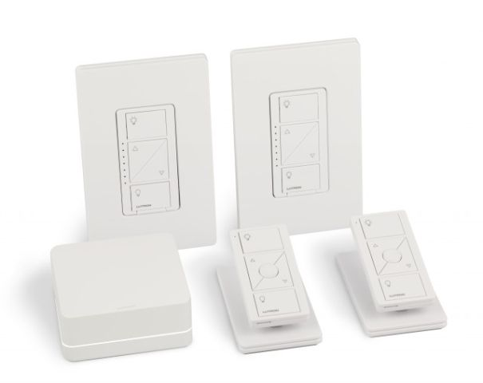  
  
22. Introduce the 바퀴 로봇  
움직일때 귀여움 주의  
#robotics  
http://interestingengineering.com/super-fast-robot-x2-velociroach-can-run-11-miles-per-hour/  
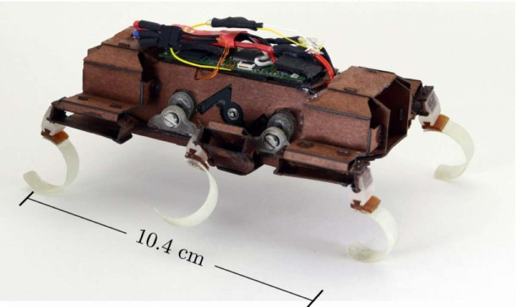  
  
23. 무서운 짐을 사람처럼 밀어서 이동시키는 로봇.  
#robotics  
http://www.engadget.com/2015/06/02/robot-push-heavy-objects/?utm_source=Feed_Classic_Full&utm_medium=feed&utm_campaign=Engadget&?ncid=rss_full  
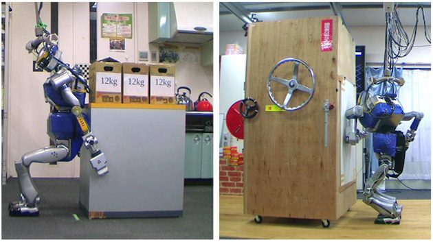  
  
24. 기저귀 상태를 파악하는 스마트 기저귀  
http://www.engadget.com/2015/06/02/acer-diaperpie-intel-edison/?utm_source=Feed_Classic_Full&utm_medium=feed&utm_campaign=Engadget&?ncid=rss_full  
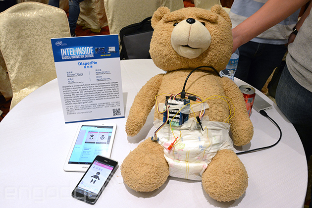  
  
25. 좀더 안경 같다고 주장하는(?) VR 헤드셋  
http://www.psfk.com/2015/06/virtual-reality-goggles-weigh-four-ounces-dlodlo-vr-goggles.html  
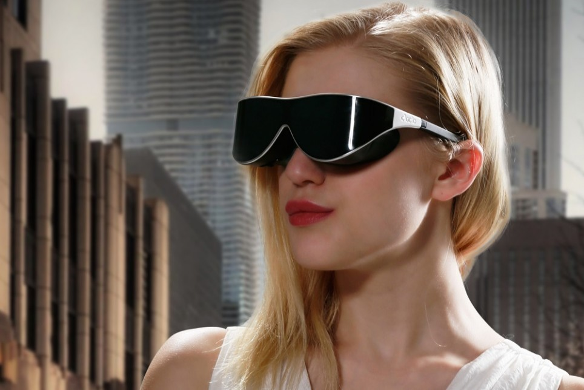  
  
  
  
