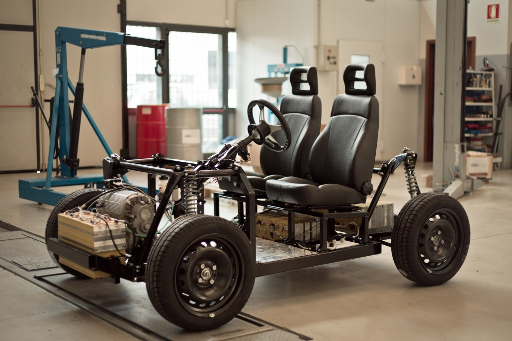
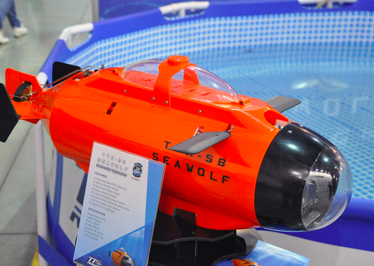
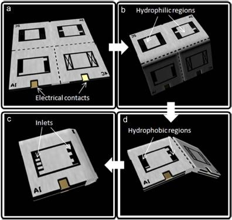
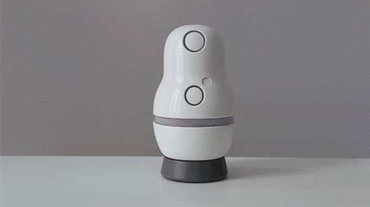
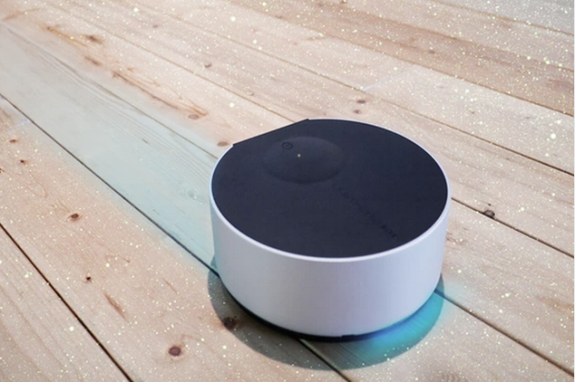
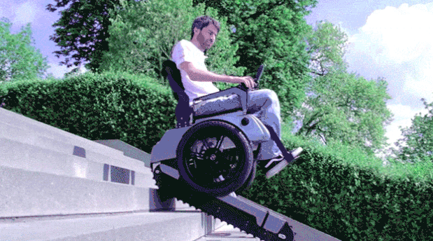
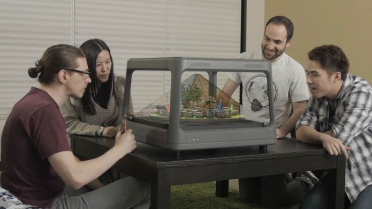
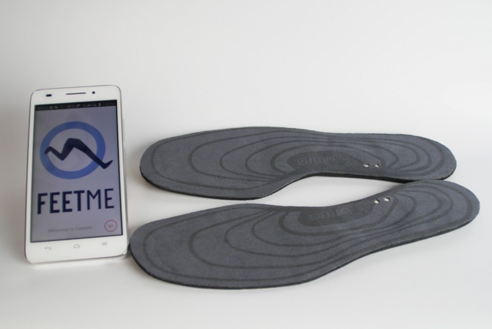
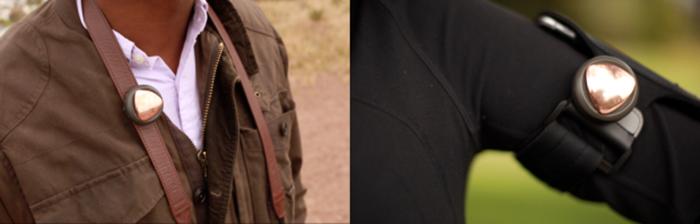
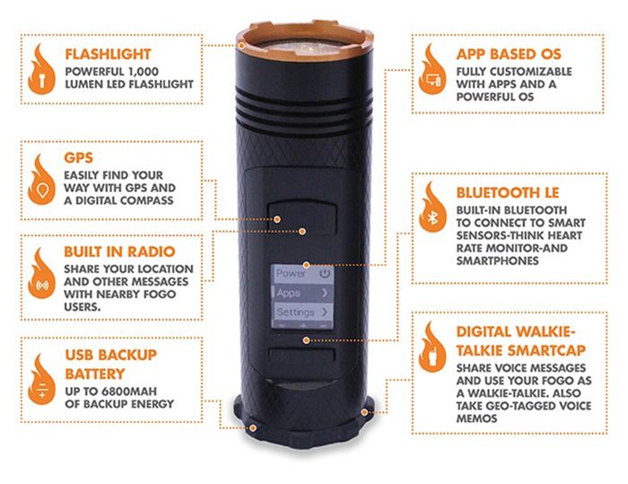

              
---                    
#150615  
> 2015년 24주차 **HOT DEVICE EVERY WEEK**                    
>                     
                
---                    
  
1. 한시간이면 조립할 수 있는 오픈소스 전기 자동차 플랫폼.  
누구나 설계도를 받아서 제작할 수 있고, 이 회사는 구글에 인수되었음.  
https://www.osvehicle.com/osv-platform/  
  
  
2. 고프로 잠수함.  
http://www.cnet.com/news/take-your-gopro-for-a-dive-with-the-seawolf-rc-sub/  
  
  
3. 가정용 헬스 케어 로봇.  
http://techcrunch.com/2015/06/12/catalia-health-gets-1-25-million-from-khosla-ventures-for-its-healthcare-robot/?ncid=rss&utm_source=feedburner&utm_medium=feed&utm_campaign=Feed%3A+Techcrunch+%28TechCrunch%29#.ugp8yw:Bkt8  
  
  
4. 성냥갑 크기로 접히는 종이 배터리.  
박테리아의 호흡을 이용해 전기를 만드는 시스템을 종이 위에 구현  
http://biz.chosun.com/site/data/html_dir/2015/06/12/2015061201670.html?outlink=facebook  
  
  
5. 스토리 텔링 대신 해주는 기기.  
주로 조부모님이 손자들을 위해 스토리를 읽어주면 자동으로 자녀들이 가진 기기로 전송되고 들을 수 있음.  
멀리 떨어져있는 가족간의 소통문제를 해결.  
http://www.gizmag.com/storyhome-family-storytelling-device/37947/?sf38625633=1  
  
  
6. 자외선으로 책상위를 살균하는 로봇 살균 청소기.  
http://www.digitaltrends.com/home/uve-robotic-countertop-cleaner-sanitizes-with-ultraviolet-light/?utm_source=facebook+&utm_medium=socialm&utm_campaign=home  
  
  
7. 계단을 올라갈 수 있는 휠체어  
http://gizmodo.com/this-incredible-wheelchair-can-climb-stairs-like-a-tank-1710868819  
  
  
8. 드디어 출시된 오큘러스 리프트의 정식 소비자용 VR헤드셋과 컨트롤러.  
지금까지는 개발자용이었음.  
http://news.naver.com/main/read.nhn?mode=LSD&mid=sec&sid1=105&oid=001&aid=0007655456&viewType=pc   
  
http://techcrunch.com/2015/06/11/watch-our-first-look-at-the-new-oculus-rift-and-touch-controller-hardware/?ncid=rss&utm_source=feedburner&utm_medium=feed&utm_campaign=Feed%3A+Techcrunch+%28TechCrunch%29  
  
9. 초소형 로봇 벌.  
http://www.nationalgeographic.com/explorers/explorers-week/explorer-moment-rob-wood-robobee/?utm_source=Facebook&utm_medium=Social&utm_content=link_fb20150611ng-explorermomentwood&utm_campaign=Content&sf9907601=1  
  
  
10. 블루투스 기능이 없는 스피커를 블루투스 스피커로 바꿔주는 기기(차량용)  
http://aboutcar.motorgraph.com  
  
  
11. 3D홀로그램 출력 기기  
http://techcrunch.com/2015/06/10/holus-is-a-tabletop-device-that-turns-digital-media-into-a-3d-hologram/#.ugp8yw:vsMc  
  
  
12. Nest의 스마트 홈 카메라  
http://www.engadget.com/2015/06/10/nest-camera-leak/?utm_source=Feed_Classic_Full&utm_medium=feed&utm_campaign=Engadget&?ncid=rss_full  
  
  
13. 피부암을 조기 진단할 수 있는 스마트폰 악세서리  
http://www.digitaltrends.com/mobile/molescope-skin-cancer-detecting-smartphone-accessory-news/?utm_source=facebook&utm_medium=socialm&utm_campaign=mobile  
  
  
14. 대형 투명 디스플레이 티비  
http://www.cnet.com/uk/news/samsung-shows-retail-ready-transparent-mirrored-oled/  
  
  
15. 물의 움직임으로 동작하는 컴퓨터  
http://news.stanford.edu/news/2015/june/computer-water-drops-060815.html  
  
  
16. 파스처럼 붙이는 진통 완화기기.  
http://www.zdnet.com/article/cur-wearable-targets-chronic-pain-offering-immediate-relief/  
  
  
17. 샤오미가 출시한 에어컨  
http://www.earlyadopter.co.kr/44434  
  
  
18. 모듈형 사운드 시스템  
https://www.indiegogo.com/projects/kien-the-first-flexible-sound-system#/story  
  
  
19. 자동차의 HUD방식과 같은 홀로그램 날씨 시계  
http://www.earlyadopter.co.kr/44247  
  
  
20. 스마트 깔창  
http://www.psfk.com/2015/06/smart-insoles-feet-me-hax-runners-health.html  
  
  
21. 웨어러블 공기 상태 측정기.  
http://www.earlyadopter.co.kr/44173   
  
  
22. 복합적인 기능을 가진 아웃도어용 키트  
http://www.earlyadopter.co.kr/44089  
  
  
  
