            
---                  
#150622        
> 2015년 25주차 **HOT DEVICE EVERY WEEK**                  
>                   
              
---                  
  
1. 감정을 읽고 사람과 소통할 수 있는 로봇 페퍼 출시 178만원 (소프트뱅크)  
http://news.jtbc.joins.com/html/254/NB10933254.html  
  
  
2. 일상의 소리를 쉽게 캡쳐할 수 있는 가장 작은 무선 마이크  
마이크계의 GoPro라고 주장.  
https://www.indiegogo.com/projects/instamic-the-smart-small-gopro-of-microphones#/story  
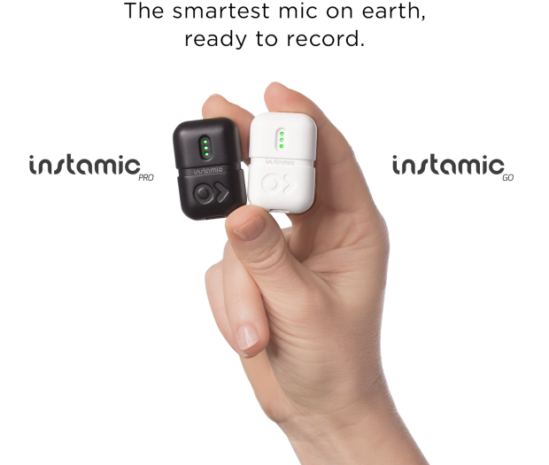  
  
3. 다이어터를 위한 칼로리 밥주걱  
http://www.earlyadopter.co.kr/44998  
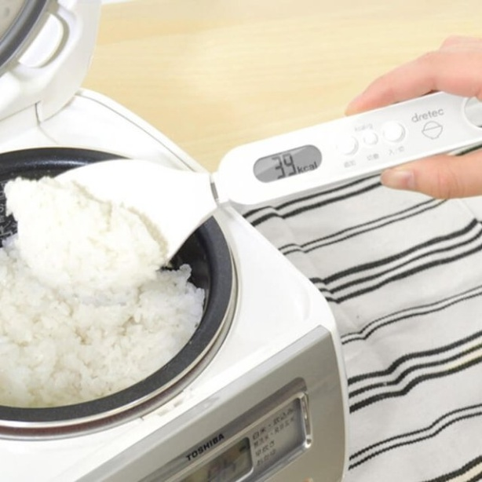  
  
4. 아이폰용 하이앤드 카메라 악세서리  
http://gizmodo.com/this-could-be-best-way-yet-of-turning-your-iphone-into-1712066271  
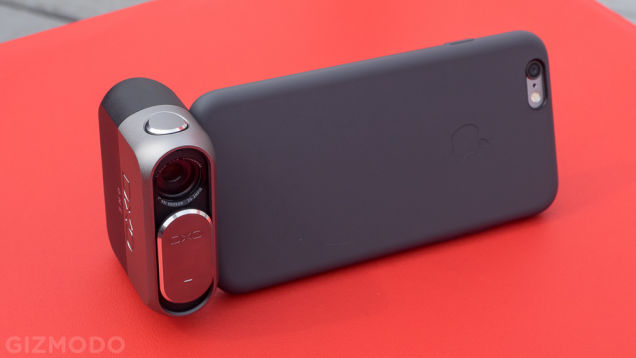  
  
5. 새로운 킨들 페이퍼화이트 출시(e북)  
전 모델보다 해상도가 높아짐.  
http://www.cnet.com/uk/products/amazon-kindle-paperwhite-2015/  
  
  
6. 습기를 에너지원으로 사용하는 장치 개발.  
http://gizmodo.com/watch-humidity-power-a-miniature-car-1711930353  
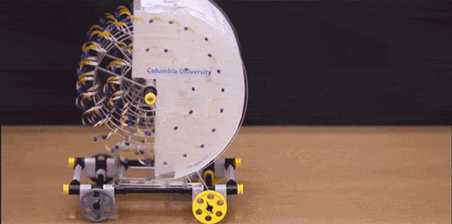  
  
7. 소형 코골이, 수면무호흡증 치료 기기.  
http://www.earlyadopter.co.kr/44836  
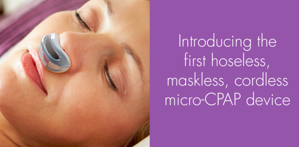  
  
8. 색상을 자유롭게 바꿀 수 있는 신발.  
http://www.earlyadopter.co.kr/44828  
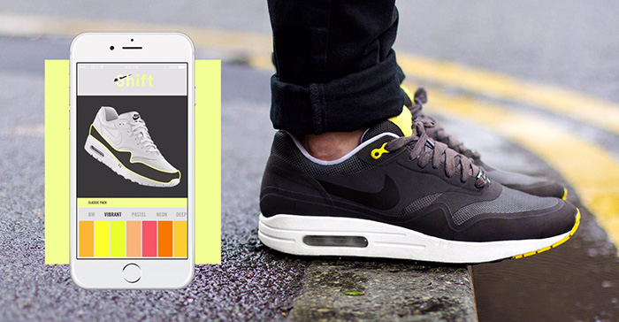  
  
9. 현관문 구멍에 장착하는 카메라  
http://www.earlyadopter.co.kr/44810  
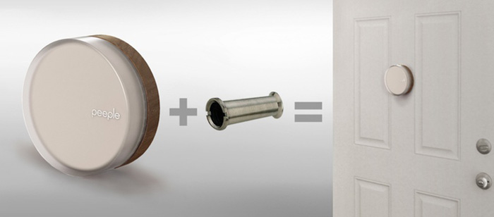  
  
10. 신체를 각성시키거나 편안하게 해주는 웨어러블 밴드.  
https://www.kickstarter.com/projects/1799505246/doppel-a-new-breed-of-wearable-technology-to-set-y/description  
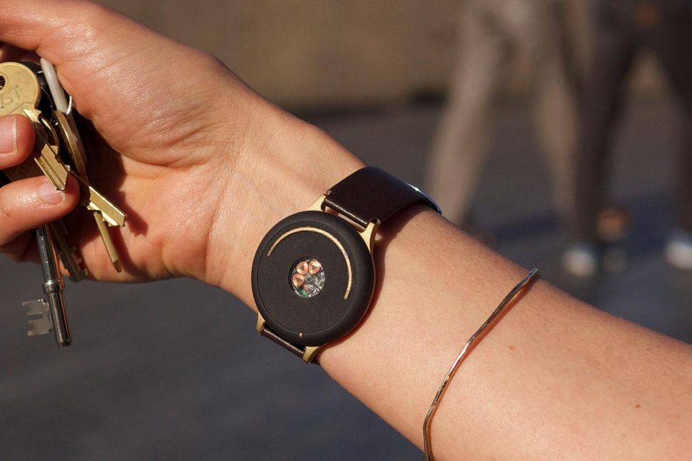  
  
11. 실제 주위에 있는 소리를 본인의 귀 위치에서 3D로 녹음하는 녹음기.  
https://www.kickstarter.com/projects/1553305645/openears  
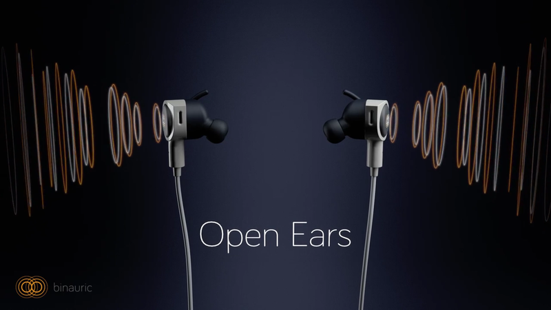  
  
12. 매우 효율적으로 걷는 로봇.  
2.2KW리튬이온 배터리 한번충전으로 10km를 걸을 수 있음.  
http://www.engadget.com/2015/06/16/ultra-efficient-robot-walks-like-people/?utm_source=Feed_Classic_Full&utm_medium=feed&utm_campaign=Engadget&?ncid=rss_full  
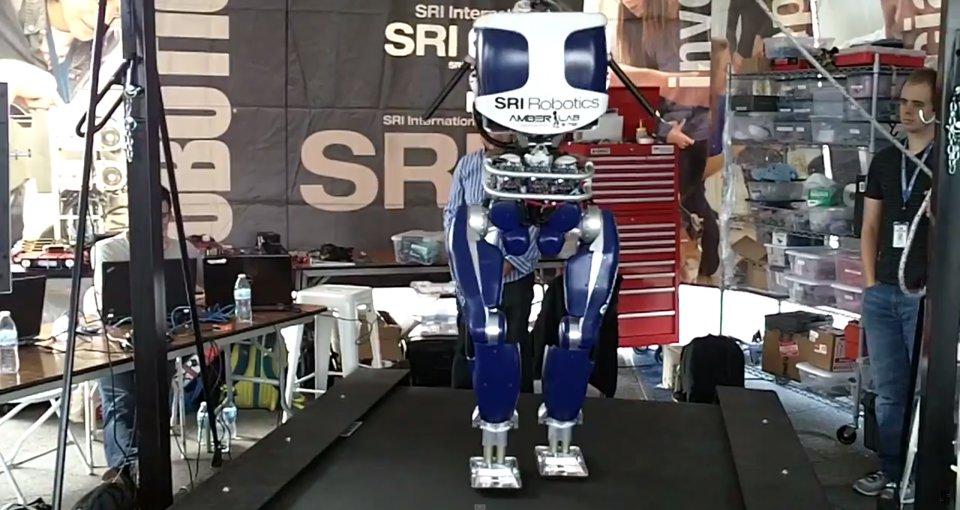  
  
13. 다이슨 LED스탠드.  
http://www.earlyadopter.co.kr/44665  
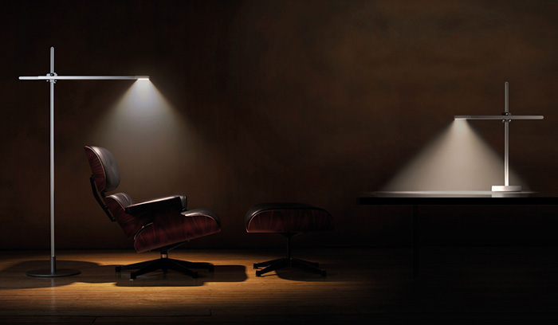  
  
14. 방수 블루투스 스피커  
http://www.earlyadopter.co.kr/44918  
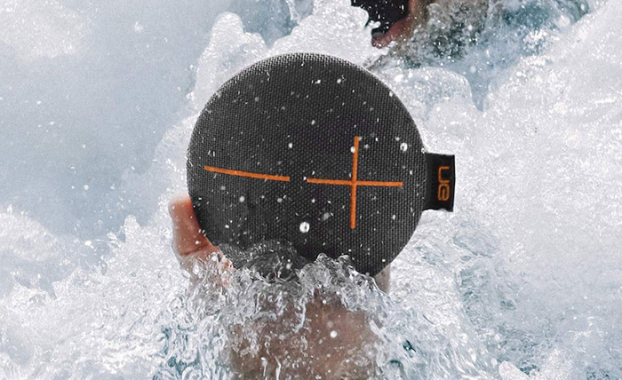  
  
15. 아이폰을 액션캠으로 만들어 주는 케이스  
http://www.earlyadopter.co.kr/44676  
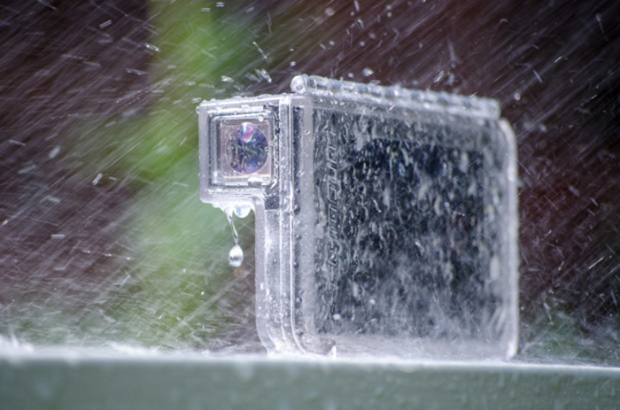  
  
16. 근육을 수치화 해서 관리해주는 기기.  
http://techholic.co.kr/archives/34355?utm_source=twitterfeed&utm_medium=facebook  
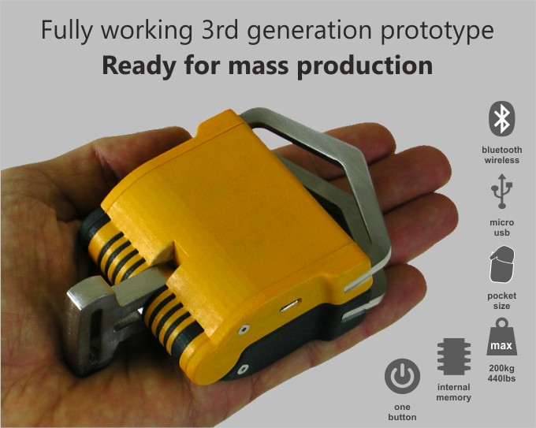  
  
17. 손동작이 불편한 사람들을 위한 로봇 장갑  
http://www.technologyreview.com/news/538181/soft-robotic-glove-could-put-daily-life-within-patients-grasp/  
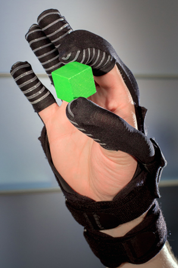  
  
18. 다리를 3D프린팅 하는 프로젝트.  
http://www.cnet.com/news/gravity-defying-3d-printer-to-print-bridge-over-water-in-amsterdam/  
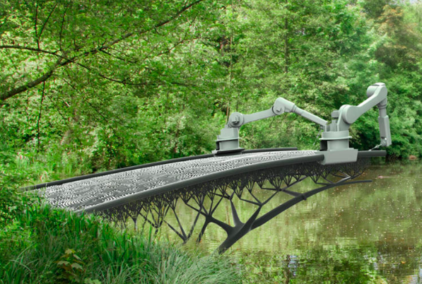  
  
19. 수도꼭지를 원격으로 틀었다 잠갔다 할 수 있는 기기  
http://www.cnet.com/products/wise-orchard/  
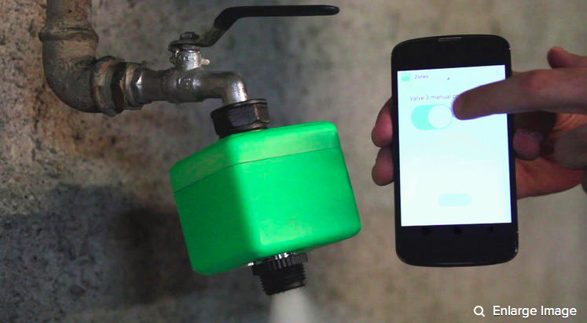  
  
  
