        
---              
#150706    
> 2015년 27주차 **HOT DEVICE EVERY WEEK**              
>               
          
---              
  
1. 크라우드 펀딩받는 애플워치 스트랩  
http://www.earlyadopter.co.kr/59010  
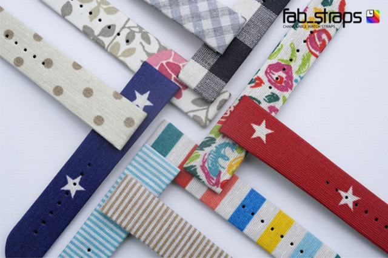  
  
2. 공기중에 디스플레이 & 터치가 되는 기술  
http://www.iflscience.com/technology/scientists-create-holograms-you-can-touch  
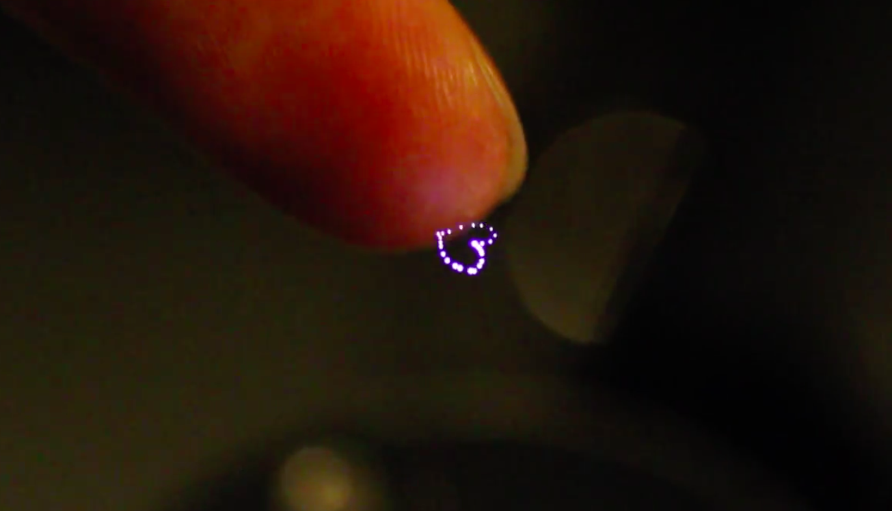  
  
3. 블루투스와 센서가 내장된 목각인형.  
쓰다듬으면 반응하고 원격으로 통신 가능.  
http://techholic.co.kr/archives/36156  
  
  
4. 360도 모든 방향을 촬영하는 카메라  
VR 헤드셋을 쓰고 촬영된 영상을 감상할 수 있음.  
http://techcrunch.com/2015/07/03/sphericam-2-is-a-4k-360-degree-camera-built-for-the-vr-era/#.ugp8yw:QQ2z  
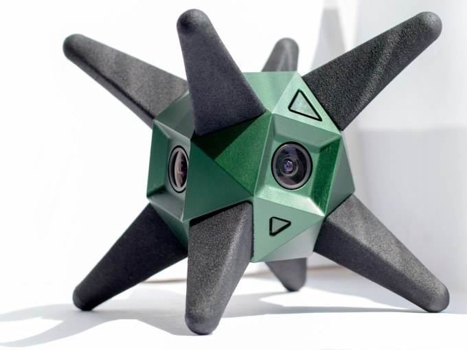  
  
4.5 안경에 붙이는 탈착형 모바일 디스플레이  
누가 쳐다 보면 안경에서 재빠르게 제거할 수 있다는것이 장점.  
https://www.kickstarter.com/projects/1991375881/vufine-a-handsfree-wearable-display?ref=nav_search  
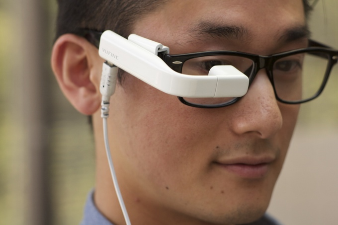  
  
5. 인공위성끼리 데이터를 전송하는 레이져 기술 (Facebook-internet.org)  
저위도 궤도에서 공전하는 인공위성으로 보다 빠른 위성인테넷을 전세계모든 사람들에게 제공할 수 있음.  
http://www.engadget.com/2015/07/01/zuckerberg-facebook-lasers/  
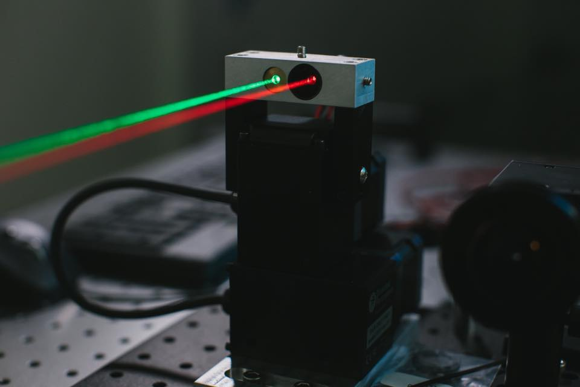  
  
6. 레고 블럭을 쌓는 3D 프린터기  
http://www.psfk.com/2015/07/hudor-faucet-audi-fraser-leid-hands-free-faucet.html  
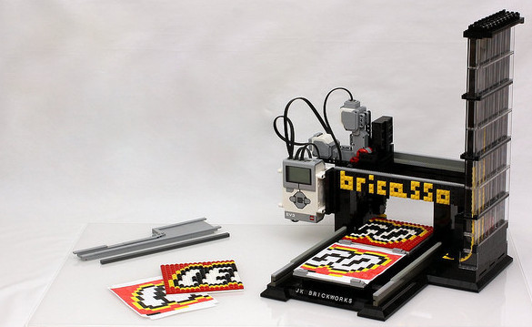  
  
7. 사과 깎는 장치.  
http://www.makesushi.com/product/apple-peeler-and-core-slicer/  
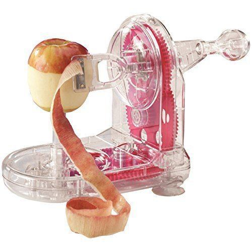  
  
8. 귓속의 구조를 3D스캔하는 스캐너, 본인귀에 딱맞는 이어폰을 제작할 수 있음.  
http://www.engadget.com/2015/07/02/snugs-3d-scanners-bespoke-buds/  
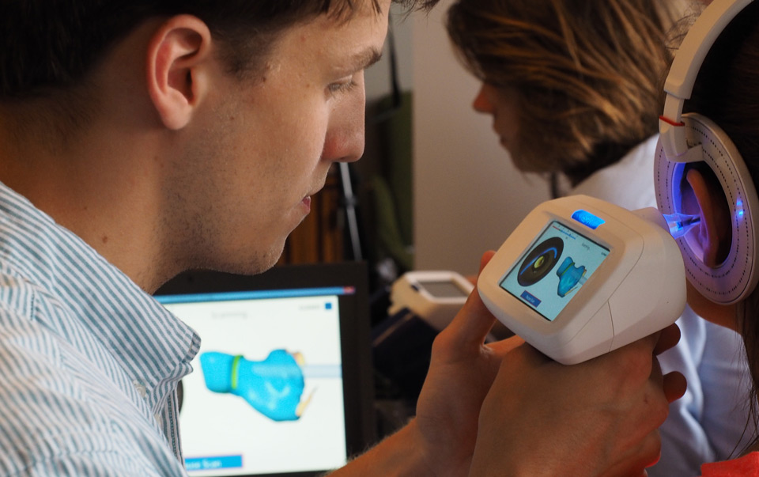  
  
9. 프로젝션 맵핑을 쉽게 도와주는 기술  
https://www.kickstarter.com/projects/theheavymteam/heavym-bring-projection-to-another-level/description  
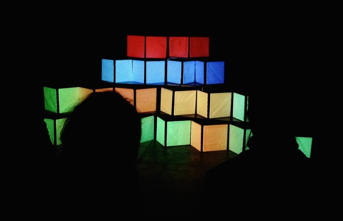  
  
10. 한글 시계  
http://www.wadiz.kr/Campaign/Details/1240  
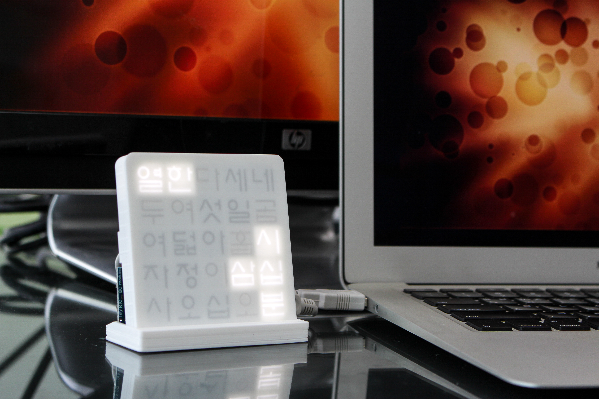  
  
11. 세그웨이 형태의 1인용 운송기기.  
https://www.indiegogo.com/projects/revobot-the-most-advanced-body-gravity-board#/story  
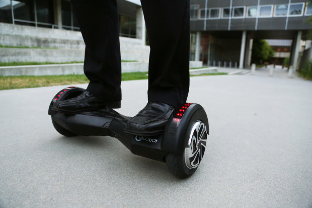  
  
12. 멍멍이들 쉽게 목욕시킬 수 있는 아이디어 제품  
http://www.woofwasher360.com  
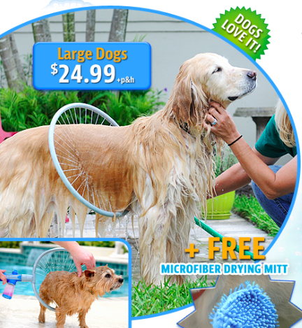  
  
13. 일반 자동차에 설치하면 무인 자동차로 만들어주는 기기.  
http://spectrum.ieee.org/cars-that-think/transportation/self-driving/first-aftermarket-autonomous-cars-hit-the-road-in-california  
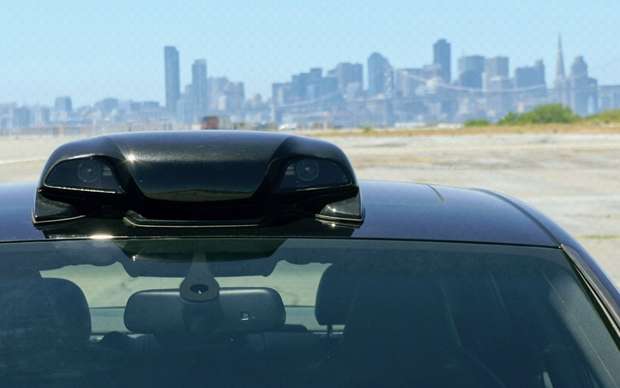  
  
14. 자전거 페달링으로 기기를 충전할 수 있게 만들어주는 악세서리  
http://www.psfk.com/2015/07/beagle-street-black-sun-documentary-gary-tarn-leapsecondmovie.html  
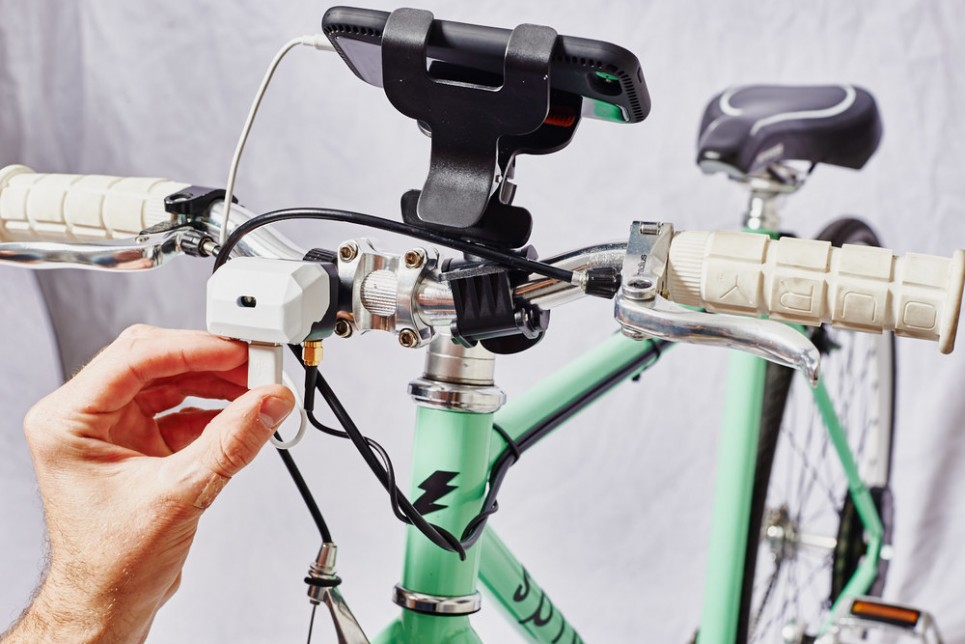  
  
15. 휴대폰 케이블로 충전하는 건전지  
http://www.bloter.net/archives/231392  
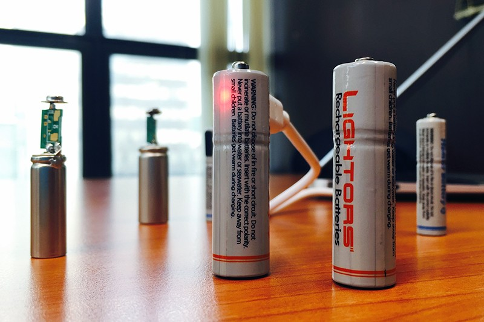  
  
16. 영상촬영에 최적화된 모듈형 스마트폰 케이스  
https://www.kickstarter.com/projects/olloclip/olloclip-studio-an-integrated-mobile-photography-s  
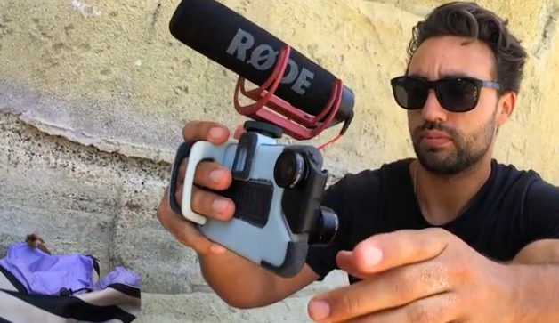  
  
18. 빛을 내는 미세한 LED를 인쇄하는 기술  
http://www.earlyadopter.co.kr/59334  
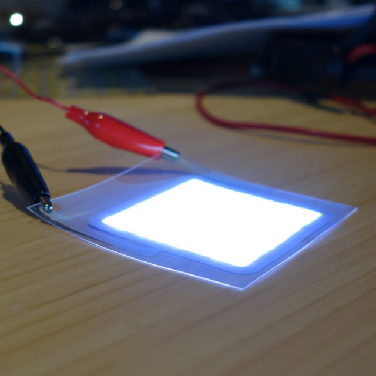  
  
19. 스윙을 분석,트래킹하는 골프 장갑  
http://www.engadget.com/2015/06/30/piq-golf-sensor/  
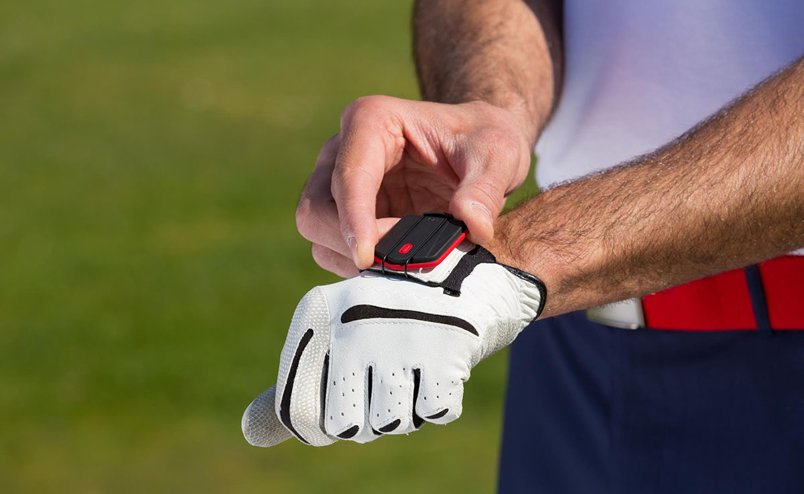  
  
20. 헬스 트레이닝을 시켜주는 스마트 거울 디스플레이  
http://techcrunch.com/2015/06/30/smartspot-which-brings-computer-vision-to-gyms-and-trainers-raises-1-85m-from-khosla-signalfire/?ncid=rss&utm_source=feedburner&utm_medium=feed&utm_campaign=Feed%3A+Techcrunch+%28TechCrunch%29  
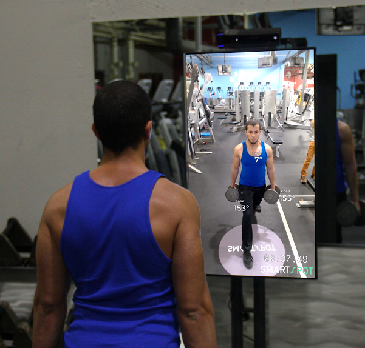  
  
21. 오페라에 배우로 출연한 로봇.  
http://www.cnet.com/news/can-a-robot-feel-robot-singer-takes-on-touchy-opera-role/  
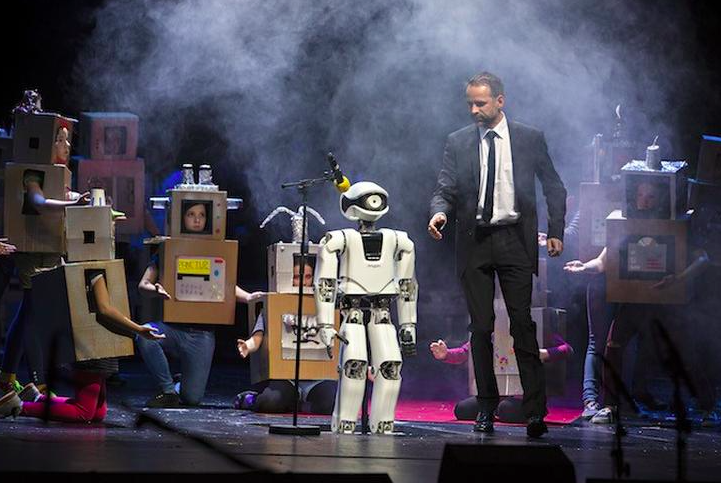  
  
22. 위생적이고 손쉽게 변기를 청소해주는 기기  
http://www.engadget.com/2015/06/30/loogun-toilet-cleaner/  
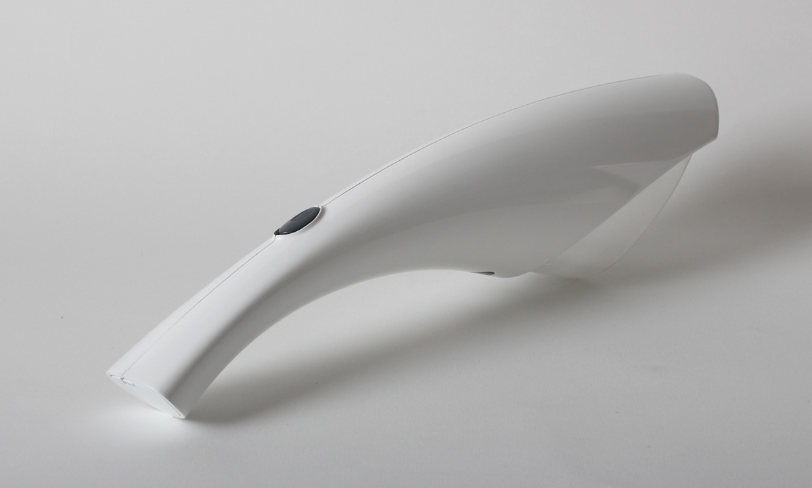  
  
23. 살균기능이 있는 텀블러  
http://www.earlyadopter.co.kr/59046  
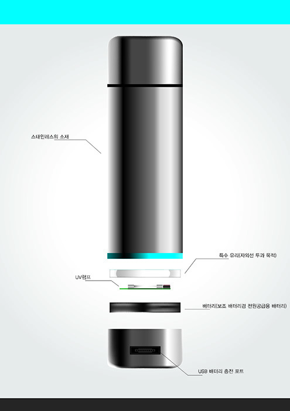  
  
  
