      
---            
#150713           
> 2015년 28주차 **HOT DEVICE EVERY WEEK**            
>             
        
---            
  
1. 새로 출시된 고프로 카메라 GoPro Session  
보다 콤팩트하고 저렴함.  
http://9to5toys.com/2015/07/06/gopro-hero4-session-release/  
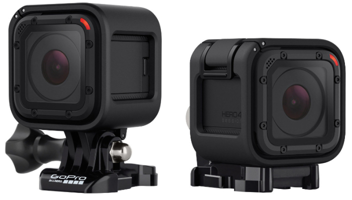  
  
2. 영수증 프린터기를 이용해 스마트폰의 여러 컨텐츠를 출력. (사진,웹페이지,TODO리스트 등등을 간편하게 출력)  
http://www.earlyadopter.co.kr/59613  
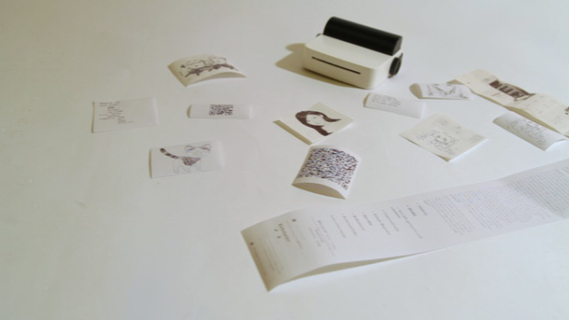  
  
3. 휴대용 태양광 발전기 Kalipak  
https://www.youtube.com/watch?v=gQp_2BoN2Cc  
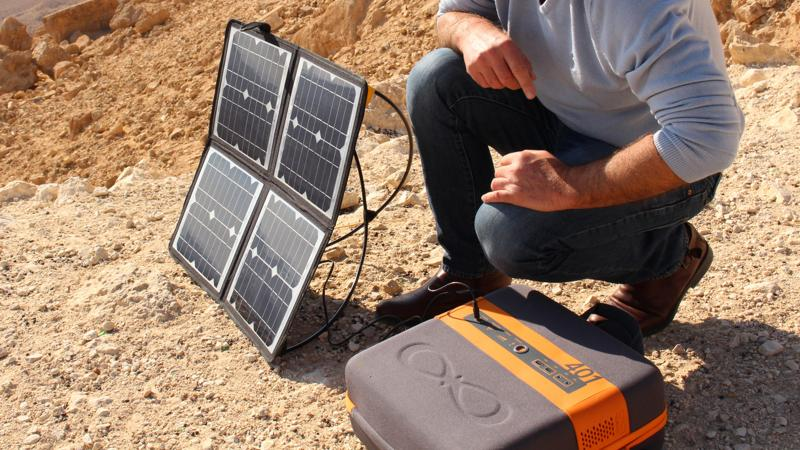  
  
4. 나무나 종이 표면을 태워서 글자를 새길 수 있는 돋보기  
http://www.earlyadopter.co.kr/59640  
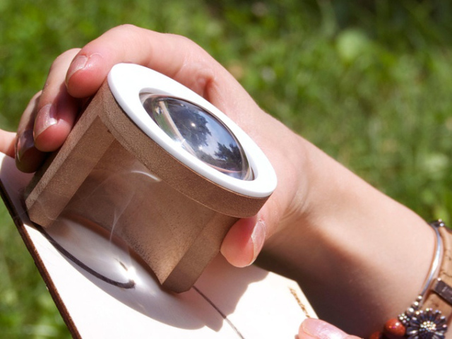  
  
5. 어디에도 설치가 가능한 방수 블루투스 스피커 (꼬리로 감아서 설치)  
http://www.businessinsider.com/boom-swimmer-waterproof-wireless-bluetooth-speaker-2015-7?utm_content=buffer969a4&utm_medium=social&utm_source=facebook.com&utm_campaign=buffer  
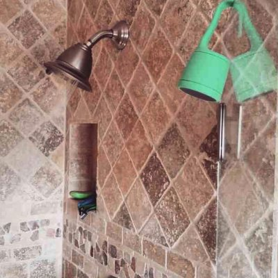  
  
6. 세계 곳곳에 인터넷을 보급할 수 있는 저궤도 위성.  
http://www.ipnomics.co.kr/?p=17261  
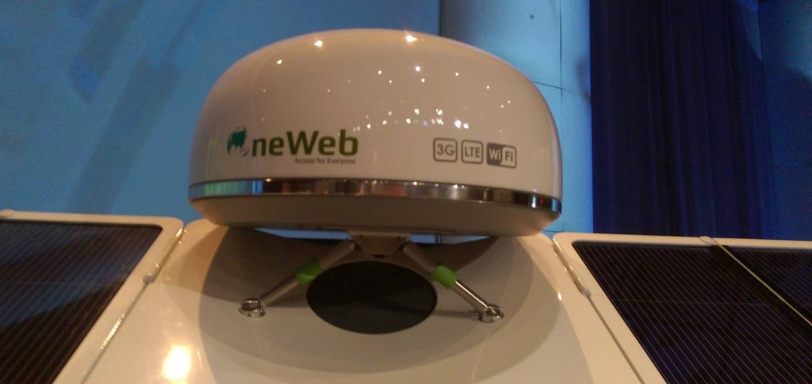  
  
7. 가족과 소통하는 가정용 로봇.  
https://www.indiegogo.com/projects/buddy-your-family-s-companion-robot#/story  
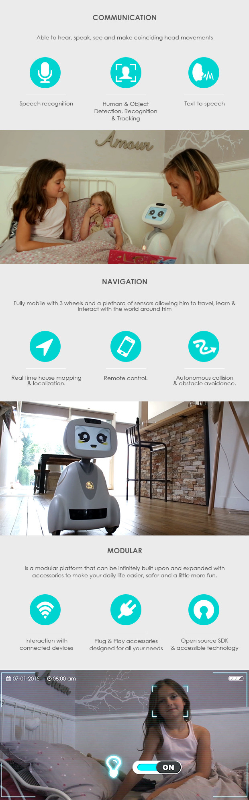  
  
8. 스키용 에어백, 눈속에 파뭍히지 않게 해주는 용도.  
http://gizmodo.com/mass-recall-of-avalanche-rescuing-airbags-thanks-to-st-1716916800?utm_campaign=socialflow_gizmodo_facebook&utm_source=gizmodo_facebook&utm_medium=socialflow  
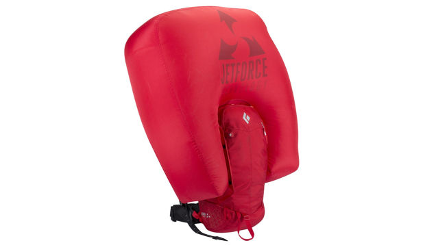  
  
9. 프로그래밍 가능한 로봇 장난감.  
http://www.engadget.com/2015/07/09/vortex-robot-toy-hands-on/  
  
  
10. 라떼아트를 출력해주는 커피 프린터기  
http://www.earlyadopter.co.kr/59498  
  
  
11. 소녀들을 위한 스마트 팔찌  
http://www.earlyadopter.co.kr/59597  
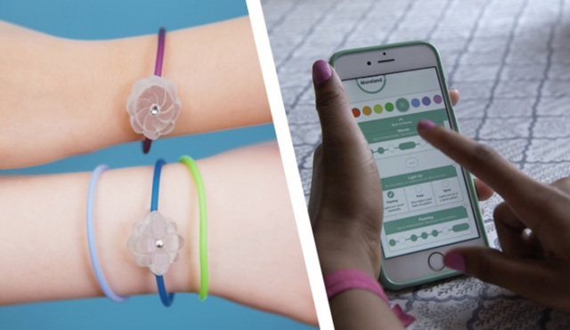  
  
12. 벽을 기어 올라갈수 있는 장치  
http://interestingengineering.com/spider-style-climbing/  
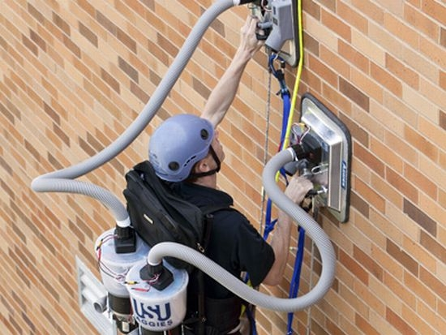  
  
13. 가정 내 수신 감도가 약한 Wi-Fi 지점을 위한 유선 연결 장치.  
Chromecast를 라우터에 직접 연결하여 Chromecast의 연결 속도와 안정성확보.  
https://store.google.com/product/_ethernet_adapter_for_chromecast  
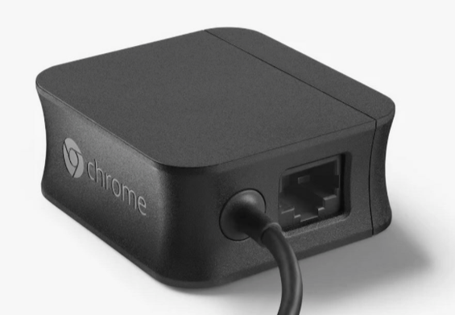  
  
14. 입는 옷에서 운동 효과를 파악할 수 있는 웨어러블 기기  
http://www.earlyadopter.co.kr/59525  
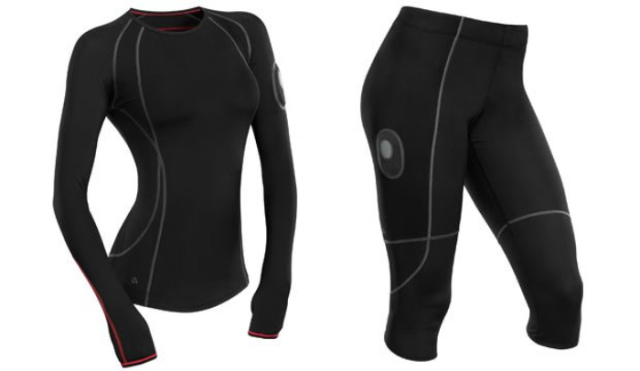  
  
15. 결제가 가능한 손목밴드  
http://thenextweb.com/gadgets/2015/07/07/barclays-bpay-band-convenient-contactless-payments-if-youve-got-the-wrist-space/  
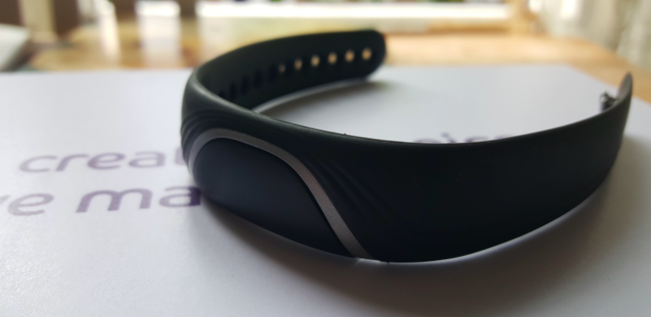  
  
16. 뒤집어 끼워도 꽂아지는 마이크로 USB단자  
http://www.earlyadopter.co.kr/59523  
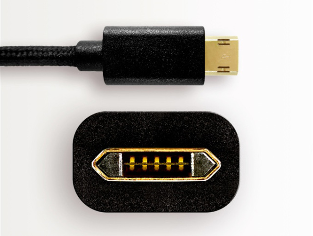  
http://www.cnet.com/news/finally-a-reversible-micro-usb-cable/  
  
17. 얇고 가벼운 태양광 충전기  
http://www.earlyadopter.co.kr/59506  
  
  
18. 셀카 마이크, 인터뷰할때 누가 안찍어줘도 됨  
https://www.indiegogo.com/projects/solocam#/story  
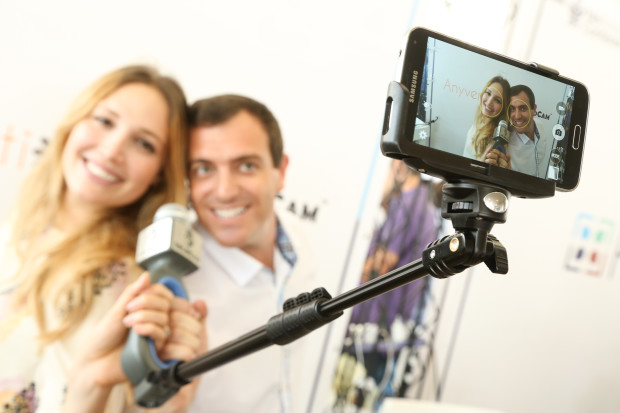  
  
19. 신용카드 크기의 어린이용 장난감 컴퓨터  
http://techcrunch.com/2015/07/07/the-microbit-is-shaping-up-to-be-the-perfect-programming-device-for-kids/?ncid=rss&utm_source=feedburner&utm_medium=feed&utm_campaign=Feed%3A+Techcrunch+%28TechCrunch%29  
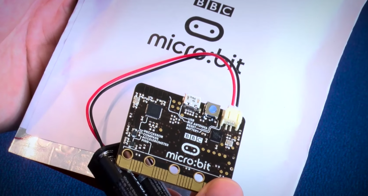  
  
  
20. 스마트폰 화면을 HUD(Head Up Display) 방식으로 볼수 있는 기기  
http://www.earlyadopter.co.kr/59395  
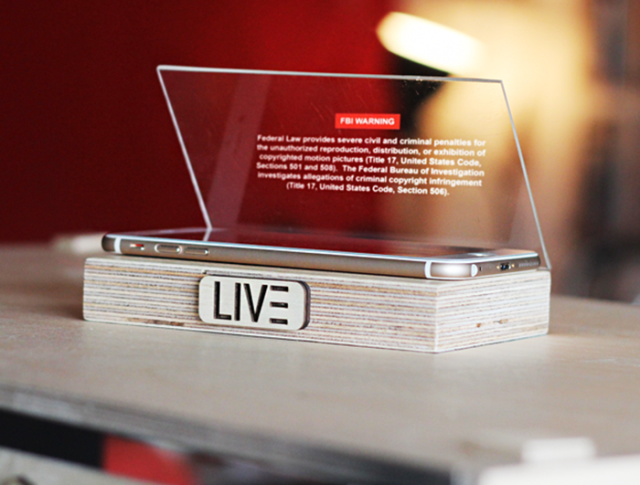  
  
21. DIY 타투 기기  
http://www.earlyadopter.co.kr/59421  
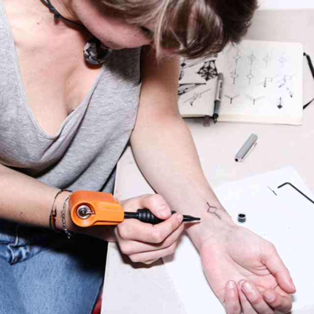  
  
22. 스트레스 관리 웨어러블 밴드 Wellbe  
https://www.youtube.com/watch?v=p_eDdX_to4I  
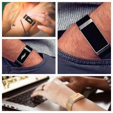  
  
23. 빛을 프린트 하는 3D프린터기  
http://www.engadget.com/2015/07/05/painting-light-with-3d-tech/  
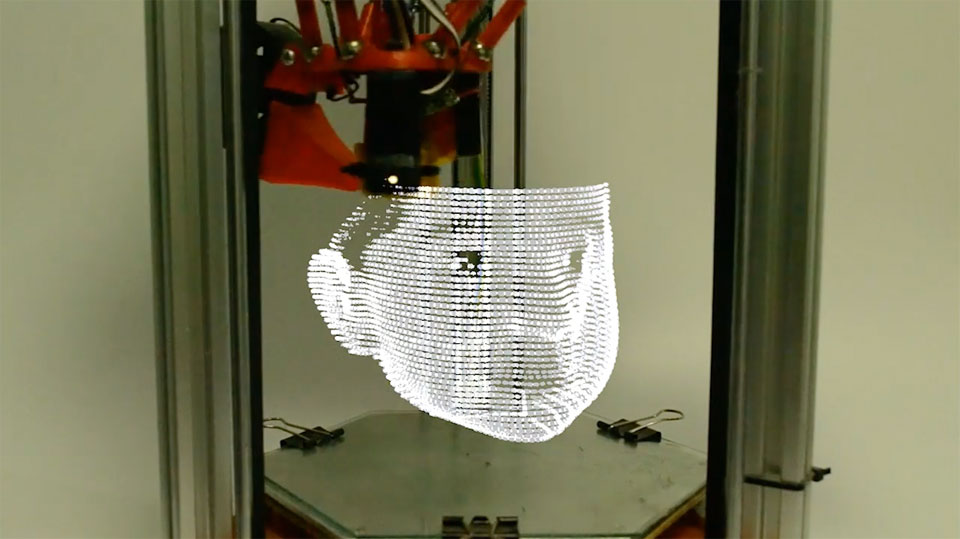  
  
24. 총을 조준할때 고정되도록 도와주는 엑소 슈트  
http://www.digitaltrends.com/cool-tech/the-army-is-developing-an-arm-mounted-exoskeleton-that-helps-soldiers-aim/  
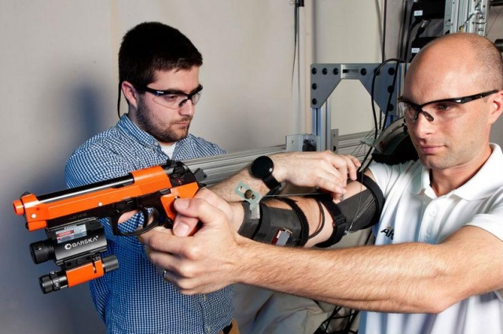  
  
25. 노트북용 보조모니터  
http://www.geek.com/news/triple-your-laptop-display-space-with-slidenjoy-1627138/  
  
  
26. 패션에 좀 더 신경쓴 스마트 팔찌  
https://www.indiegogo.com/projects/helen-smart-bracelet-with-custom-straps#/story  
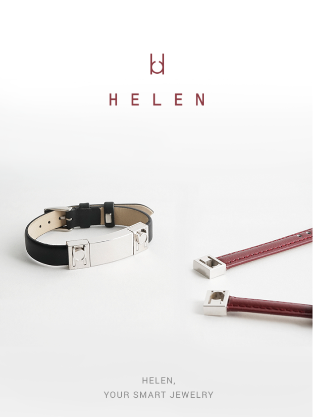  
  
  
