    
---          
#150720         
> 2015년 29주차 **HOT DEVICE EVERY WEEK**          
>           
      
---          
    
1. 기존의 스마트폰에 자석커넥터로 만들어주는 커넥터 단자.    
맥의 MacSafe 자석 커넥터를 폰에서 쓸 수 있게 해줌.    
https://www.kickstarter.com/projects/1041610927/znaps-the-9-magnetic-adapter-for-your-mobile-devic?ref=category_popular    
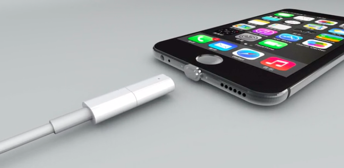    
    
2. 익사 방지용 손목에 차는 비상용 에어 백    
물에 빠졌을때 이산화탄소 가스가 방출되어 바로 물에 뜨는 에어백을 터트릴 수 있음.    
https://www.indiegogo.com/projects/kingii-the-new-standard-in-water-safety#/story    
    
    
3. 모든 방향을 가공할 수 있는 5축CNC 밀링 머신.    
기존의 CNC밀링 머신은 한 평면만 가공이 가능.    
https://www.kickstarter.com/projects/1090944145/pocket-nc-the-first-5-axis-cnc-mill-for-your-deskt?ref=category    
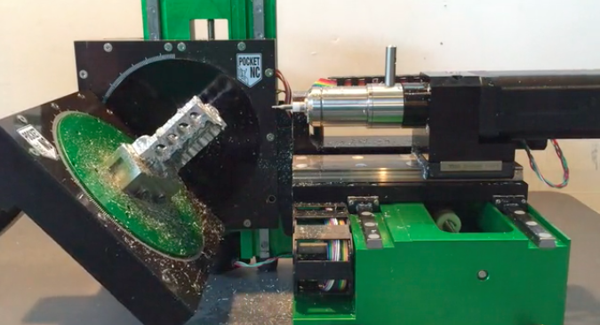    
    
4. 손동작으로 스마트와치나 스마트폰을 컨트롤 할 수 있는 블루투스 장치    
https://www.kickstarter.com/projects/belfio/deus-ex-aria-the-evolution-of-smartwatch-control    
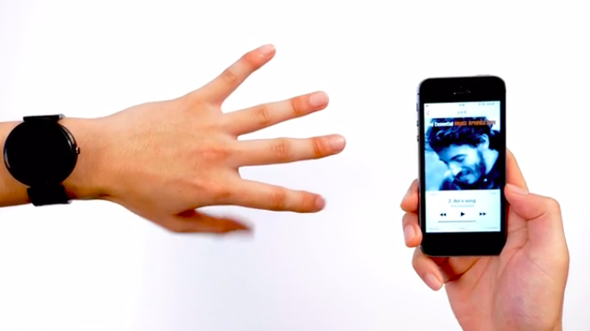    
    
5. 전자 기타 앰프로 유명한 Marshall에서 만든 스마트폰    
헤드폰 출력단자가 2개이며, 볼륨조절 버튼이 다이얼 방식    
http://www.theverge.com/2015/7/16/8976561/marshall-london-smartphone-images     
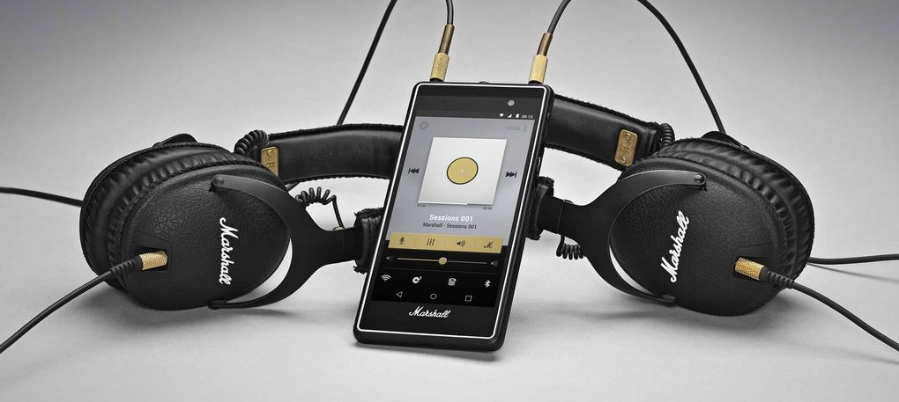    
    
6. 샤오미가 출시한 정수기    
http://thegear.co.kr/8828    
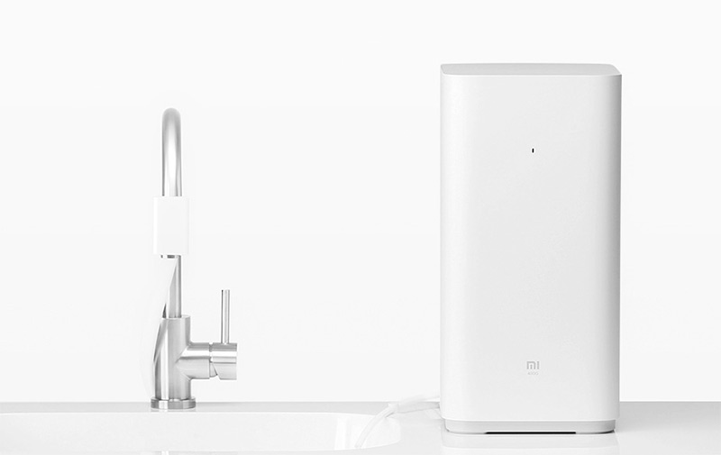    
    
7. 샤오미가 출시한 스마트 신발    
http://techg.kr/6484    
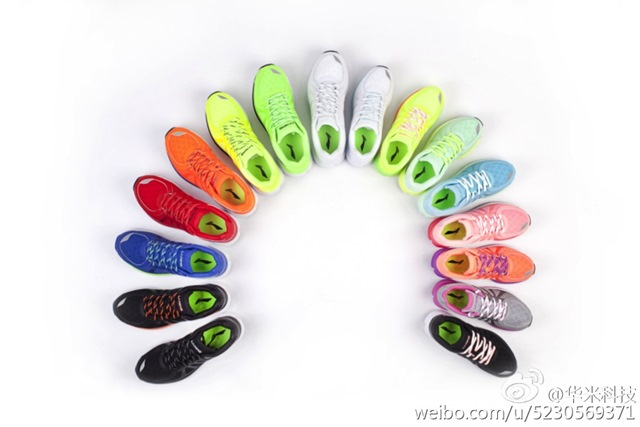    
    
8. 카메라를 스트랩이 아닌 몸에 바로 고정시킬 수 있는 홀더.    
https://peakdesign.com/store/capturepro    
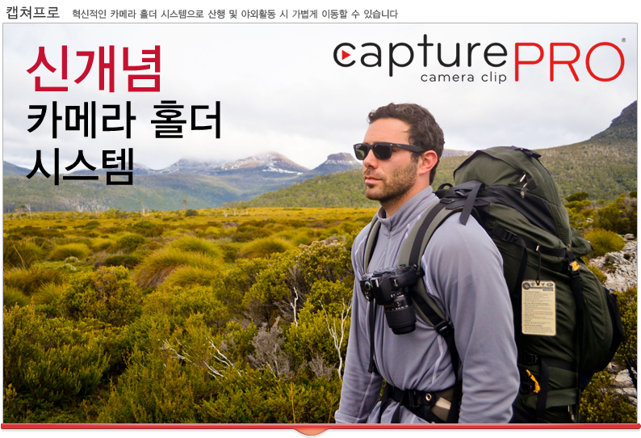    
    
9. 음주측정 스마트폰 악세서리    
http://www.earlyadopter.co.kr/59830    
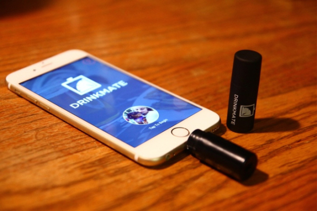    
    
10. 양변기에 부착해 물을 자동으로 내려주는 기기    
http://www.earlyadopter.co.kr/60224    
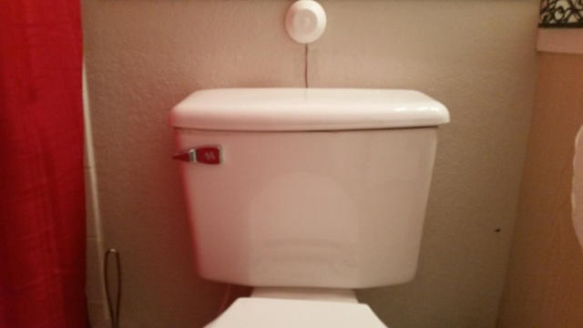    
    
11. 작고 가볍고 접으면 휴대성도 좋은 전기 자전거    
http://www.earlyadopter.co.kr/60194    
    
    
12. 분실 방지 기능이 있는 스마트 우산.    
http://www.earlyadopter.co.kr/60068    
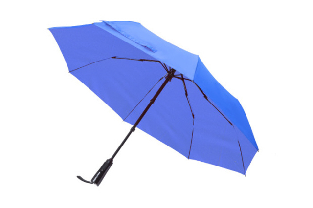    
    
13. 촛불로 스마트폰을 충전할 수 있는 발전기    
http://www.earlyadopter.co.kr/60024    
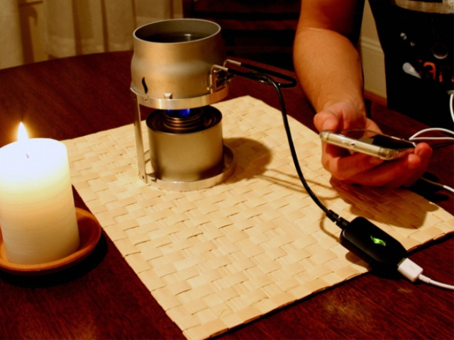    
    
14. 스마트폰을 클래식한 비디오 카메라로 바꿔주는 악세서리    
http://www.earlyadopter.co.kr/59910    
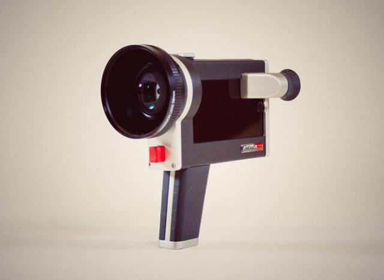    
    
15. 피트니스 트래킹 전자발찌    
http://www.earlyadopter.co.kr/59887    
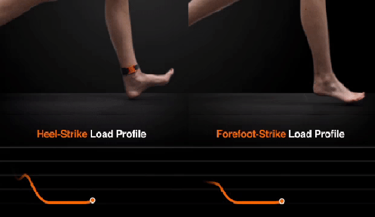    
    
16. 자전거 휠을 디스플레이로 바꿔주는 조명.    
http://www.earlyadopter.co.kr/59886    
    
    
17. 고양이의 수분섭취량을 분석하는 기기.    
http://besuccess.com/2015/07/pura_indiegogo/    
    
    
18. 내장 이어폰이 있는 스마트폰 케이스    
http://www.earlyadopter.co.kr/60145    
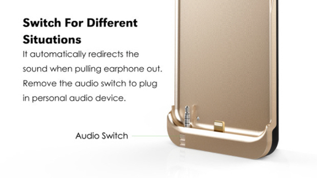    
    
19. 수험생등을 위한 단순한 스마트폰.    
http://www.earlyadopter.co.kr/60125    
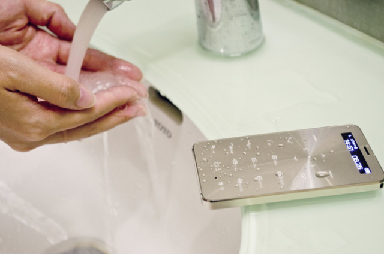    
    
20. 발사이즈가 커지면 크기를 늘릴 수 있는 신발.    
https://www.youtube.com/watch?v=GvMQLYTdYUA    
    
    
21. 증강현실 스마트 안경    
http://www.arm.com/innovation/products/air-3d-smart-glasses.php?sf39360701=1    
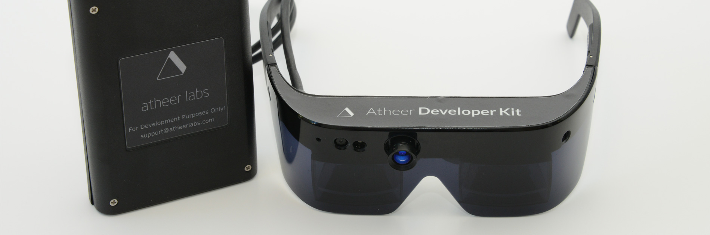    
    
22. 스타벅스에 대기줄이 있는지 미리 알려주는 기기    
http://thenextweb.com/insider/2015/07/13/this-gadget-will-tell-you-if-theres-a-line-at-starbucks-before-you-arrive/    
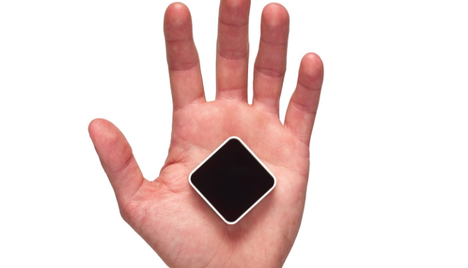    
    
23. 집 방문자가 총이 있는지 알려주는 기기    
http://www.engadget.com/2015/07/15/gundetect/    
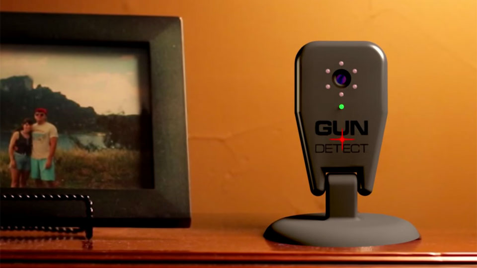    
    
24. 사람과 상호작용할 수 있는 로봇장난감.    
http://toyland.gizmodo.com/someone-at-pixar-built-the-most-adorable-peek-a-boo-pla-1717046545    
    
    
    
