---      
#150727     
> 2015년 30주차 **HOT DEVICE EVERY WEEK**      
>       
  
---      
  
1. 두껍지않아 불편하지 않은 구명조끼.  
비상시 레버를 당기면 에어백이 터짐. 압축공기 충전으로 재활용가능.  
세일러묵 인사이트 : 지난주에도 압축공기를 터트리는 비슷한 제품이 있었음. 에어백은 물놀이 안전 용품의 새로운 패러다임.  
http://www.earlyadopter.co.kr/60698  
  
  
  
2. 태양에너지를 저장해 발광하는 후레쉬.  
패트병뚜껑 대신 끼워 조명으로도 사용가능.  
https://www.indiegogo.com/projects/suli-your-portable-sun#/story  
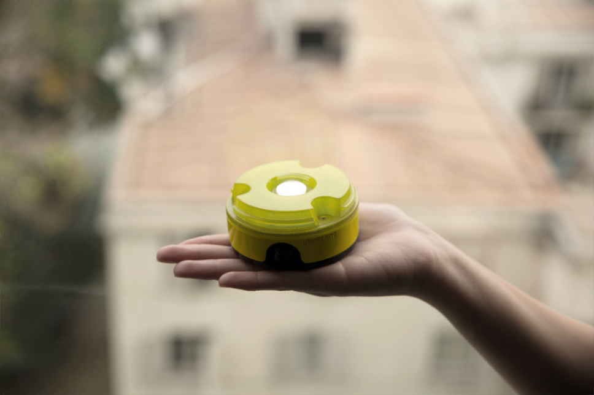  
  
3. 보행 어시스턴스 슈트 (혼다)  
세일러묵 인사이트 : 최근 힘을 보조하는 입는형태의 로봇의 연구가 활발히 진행되고 있고 제품화도 많이 되고 있음.  
특히 고령화가 가속되고 있는 일본에서는 몸이 불편하신 어르신 위주로 수요 폭발할 것으로 예상.  
http://m.irobotnews.com/news/articleView.html?idxno=5330  
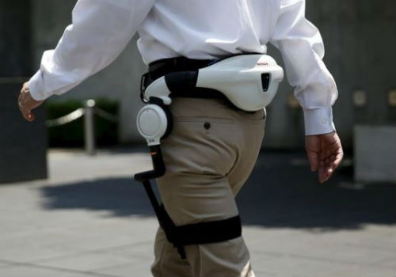  
  
4. 초콜렛을 출력하는 3D프린터기  
이 제품을 만든 3D systems회사는 이미 3D 프린터 제작분야에서 탑클라스 회사.  
https://www.youtube.com/watch?v=8gyKmB6RK-4  
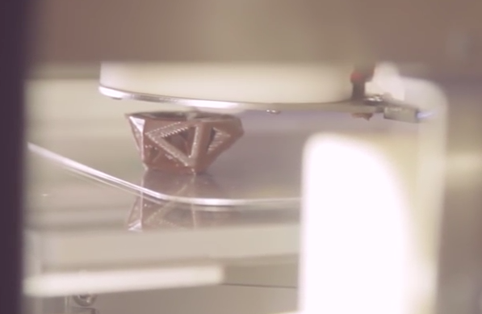  
  
  
5. 포크나 수저등 식기에 장착하는 소스 주입기.  
http://www.cnet.com/news/fork-mounted-gadget-delivers-hot-sauce-directly-to-every-bite/  
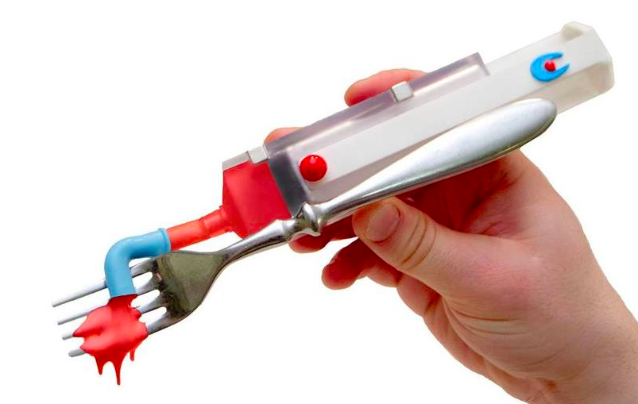  
  
6. IOS에서 사용하는 열화상 카메라 악세서리  
http://www.cnet.com/uk/products/flir-one/  
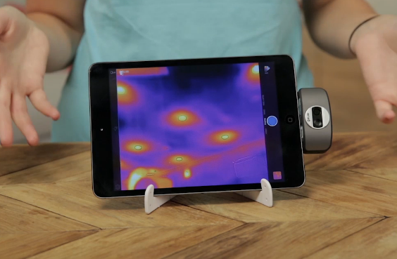  
  
7. 한번에 360방향의 사진을 찍는 카메라, 앞뒤 양면에 하나씩 있는 카메라로 모든방향을 한번에 합성.  
https://theta360.com/en/  
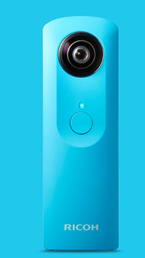  
  
  
8. Eye 스캐닝 도어락  
http://www.digitaltrends.com/home/iris-scanners-can-lock-and-unlock-your-doors/?utm_source=facebook&utm_medium=socialm&utm_campaign=home  
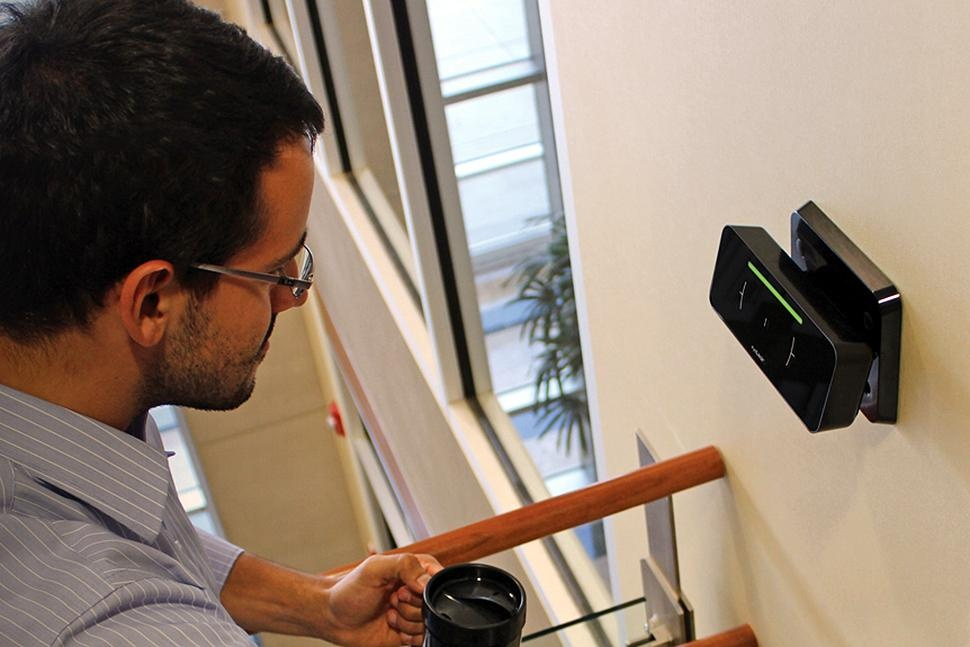  
  
  
9. 노안때문에 시각장애가 온 사람들의 시력을 복원하는 생체이식 기기.  
http://www.theverge.com/2015/7/22/9013843/first-patient-with-age-related-vision-loss-receives-bionic-eye-implant  
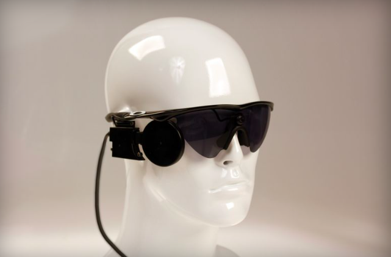  
  
  
10. 주변의 깨끗한 화장실을 찾아주는 기기 & App  
http://looie.co/#hey  
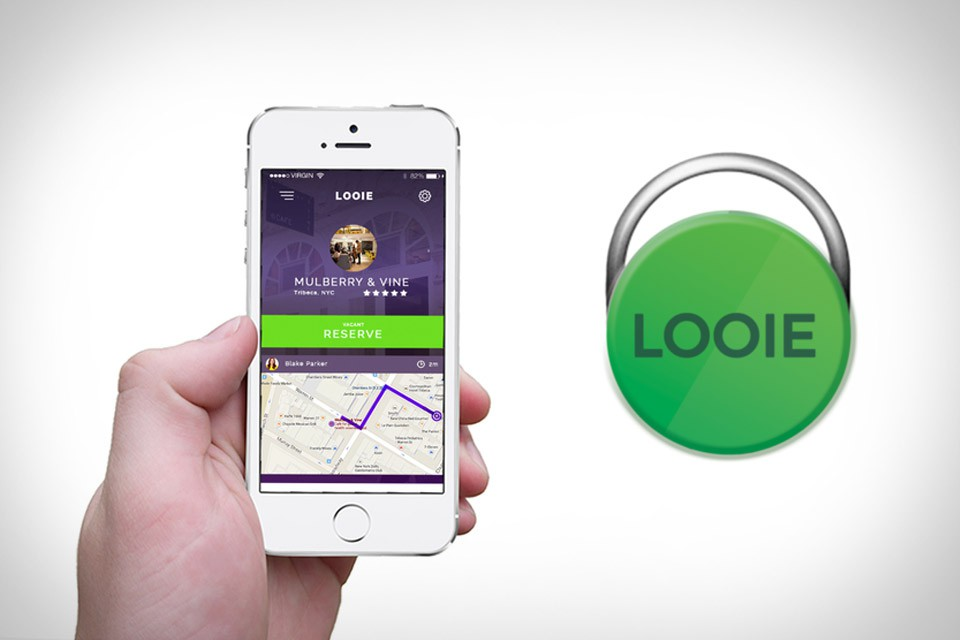  
  
11. 우유가 생했는지 알려주는 3D프린팅 된 뚜껑.  
http://www.engadget.com/2015/07/22/3d-printed-bottle-caps-will-let-you-know-if-your-milk-goes-bad/  
http://www.nature.com/articles/micronano201513  
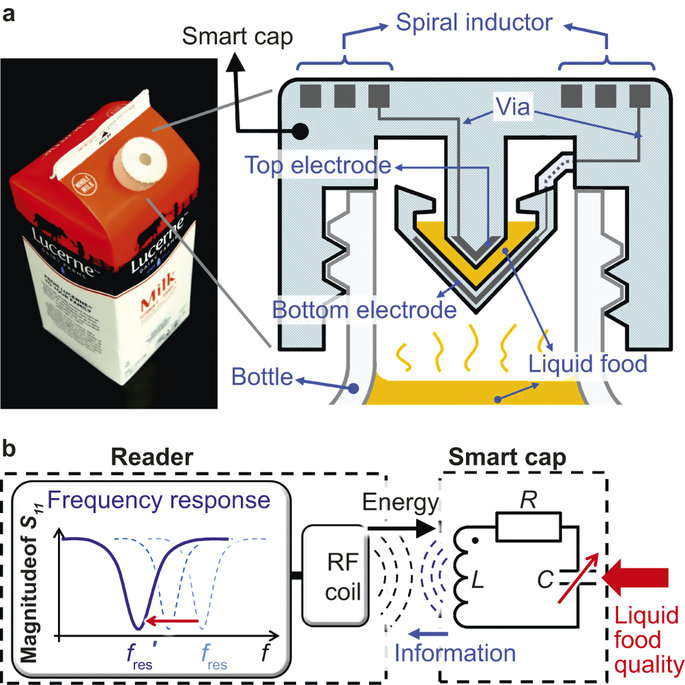  
  
  
12. 폭스바겐이 만든 폴더블 전기 스쿠터  
http://www.digitaltrends.com/cars/volkswagen-last-mile-surfer-pictures-specs-news/?utm_content=buffera8b6d&utm_medium=social&utm_source=facebook.com&utm_campaign=DT-FB  
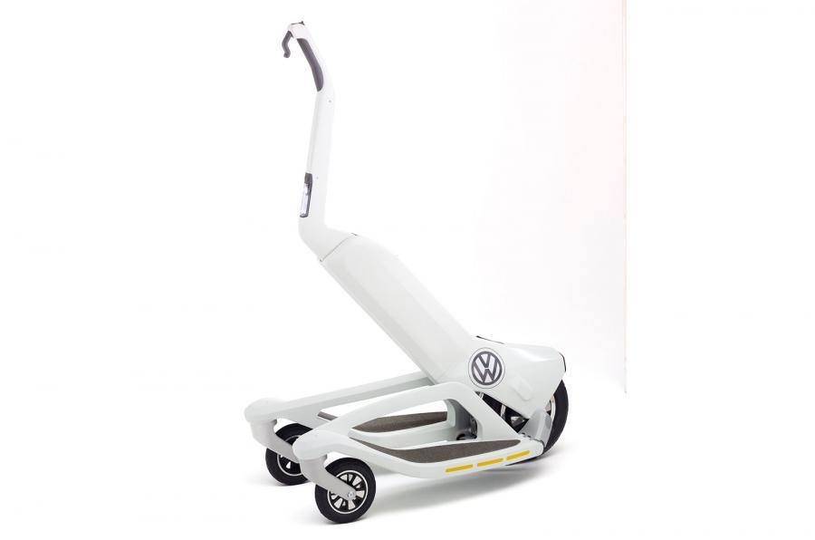  
  
13. 원격으로 의사에게 진료를 받을 수있는 로봇.  
https://www.youtube.com/watch?v=u1-MFo7_n-Y  
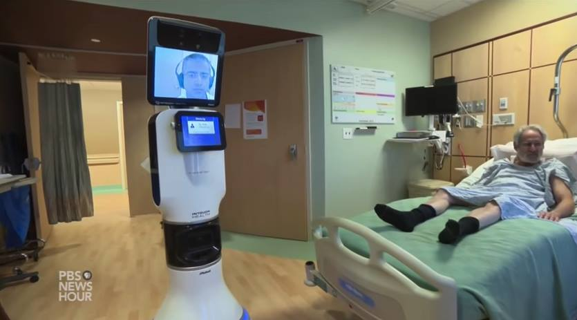  
  
14. 샤오미 블루투스 스피커(가격 99위안, 한화18000원)  
http://platum.kr/archives/42517  
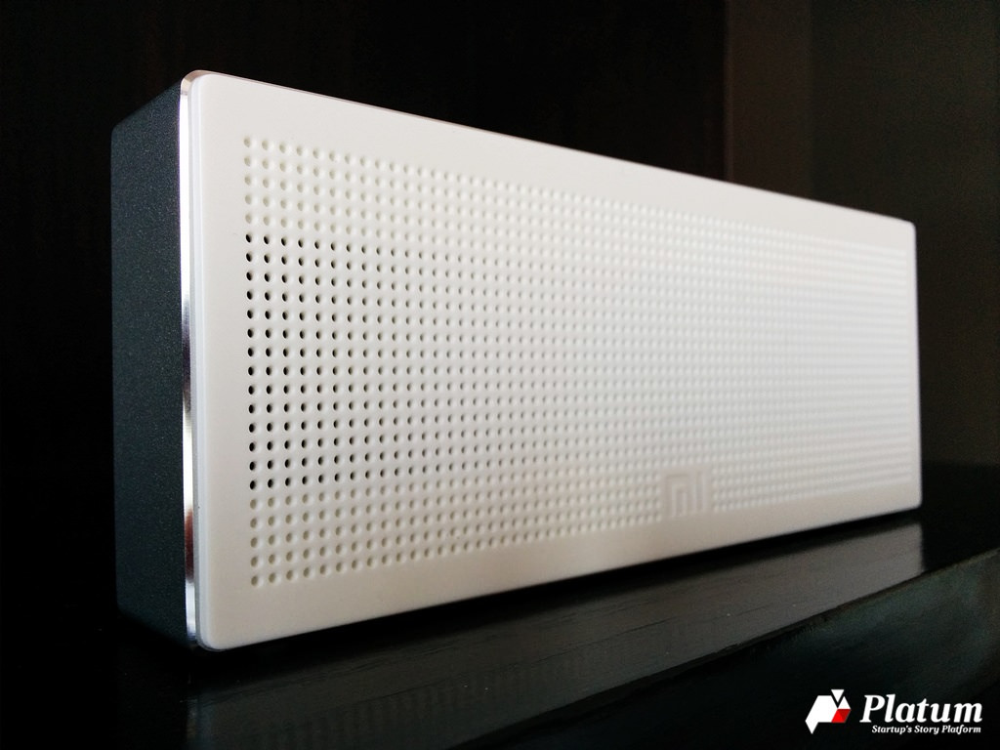  
  
15. 필요한 만큼 꽂아 쓰는 모듈형 USB-C 허브  
http://www.earlyadopter.co.kr/60499  
  
  
16. 모바일 기기를 다양한 형태로 거치할 수 있게 해주는 거치대.  
http://www.earlyadopter.co.kr/60535  
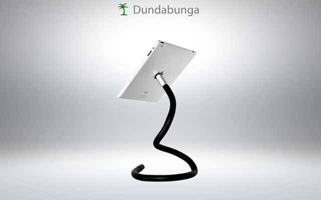  
  
17. 태양광을 이용한 전동 킥보드  
http://www.earlyadopter.co.kr/60560  
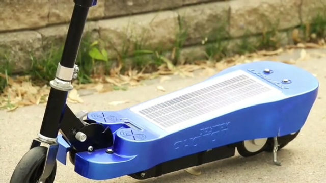  
  
18. 스마트 화분  
https://www.youtube.com/watch?v=7kZap4JunhA  
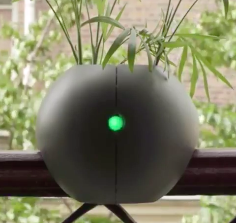  
  
19. 개인 피트니스 코치 웨어러블 밴드  
https://www.youtube.com/watch?v=dMJQhhop76Q  
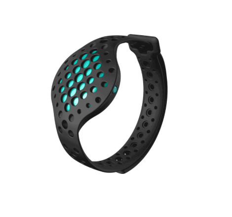  
  
  
