---  
#150831  
> 2015년 35주차 **HOT DEVICE EVERY WEEK**  
>   
---  

1. 유리를 3D 프린팅 하는 기술 (MIT)  
http://matter.media.mit.edu/environments/details/g3dp  
  

2. 돌돌말아서 휴대하는 키보드(LG)  
http://techcrunch.com/2015/08/26/lg-made-a-full-size-keyboard-for-mobiles-that-folds-into-a-stick-to-fit-in-your-bag/?sr_share=facebook#.ugp8yw:OLC2  
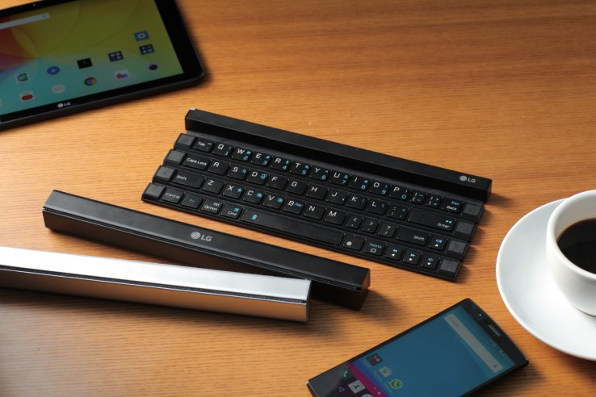  
  
3. 추상표현주의(Abstract Expressionism) 작품을 그리는 로봇청소기  
http://www.psfk.com/2015/08/jackson-pollock-vacuuming-robot-expressionist-painter-mr-head.html  
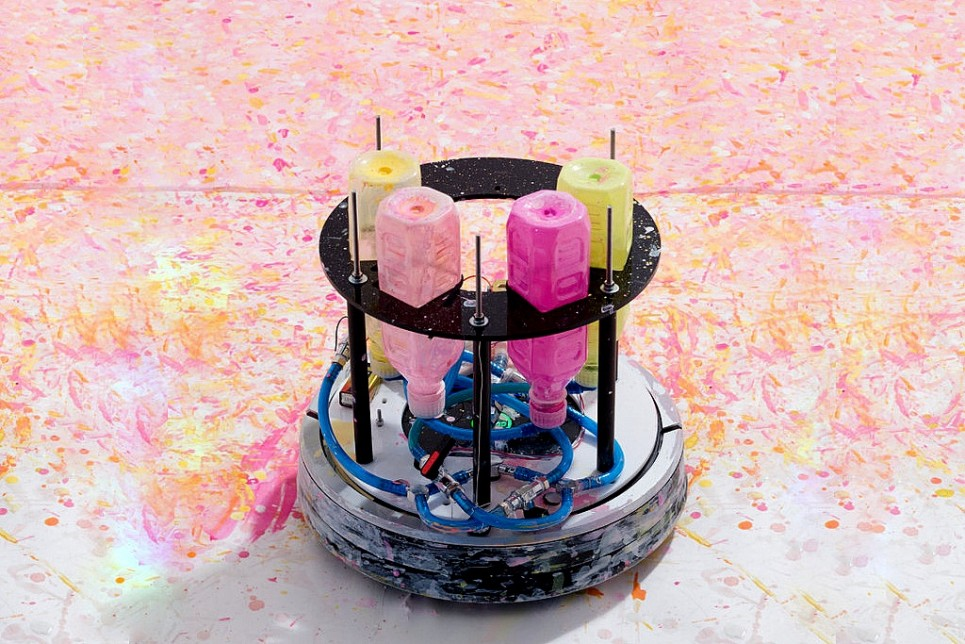  

  
4. 가격이 저렴하고 성능이 우수한 오픈소스 의수  
http://gizmodo.com/cheaper-faster-better-the-plan-to-build-an-open-sour-1726361559?utm_campaign=socialflow_gizmodo_facebook&utm_source=gizmodo_facebook&utm_medium=socialflow  
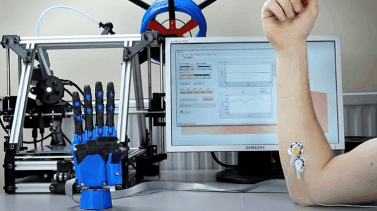  

  
5. 곤충을 모방한 뛰고 걷는 초소형 로봇들(TED)  
http://www.ted.com/talks/sarah_bergbreiter_why_i_make_robots_the_size_of_a_grain_of_rice#t-355218  
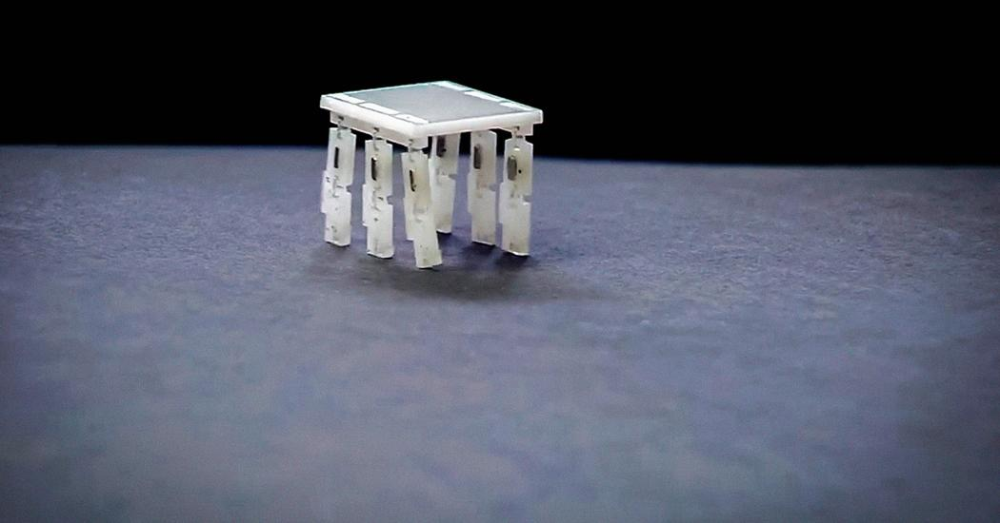  

  
6. 재봉실로 만든 인공근육  
http://techholic.co.kr/archives/34906  
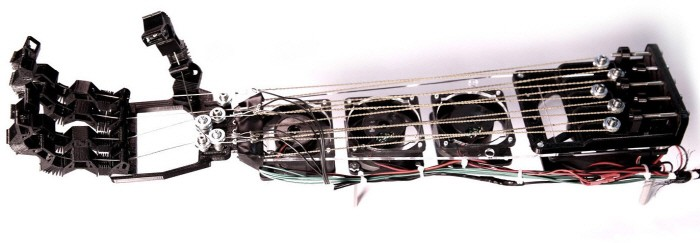  

  
7. Sony가 만든 드론  
http://techholic.co.kr/archives/39209  
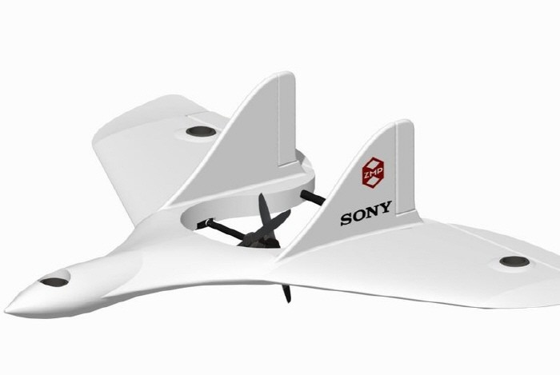  

  
8. 불빛으로 방향을 알려주는 스마트 자전거 악세서리  
http://techneedle.com/archives/22003?utm_source=dlvr.it&utm_medium=facebook  
  

  
9. 자전거 뒷바퀴에 설치하는 충전기  
http://uncrate.com/stuff/siva-atom-bicycle-usb-charger/  
  

  
10. 전자잉크 디스플레이가 내장된 키보드  
http://techholic.co.kr/archives/39222  
  

  
11. $15 짜리 컴퓨터(오렌지 파이)  
http://www.cnx-software.com/2015/08/26/orange-pi-pc-allwinner-h3-board-is-now-available-for-15/  
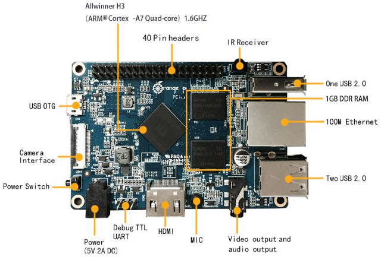  

  
12. 암 치료가 얼마나 효과적으로 이뤄지고 있는지 실시간으로 측정할 수 있는 센서  
http://techholic.co.kr/archives/38666  
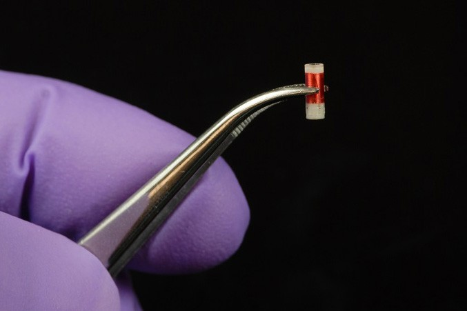  

  
13. 무선이어폰, 유선이어폰이 될 수 있는 이이폰  
http://www.earlyadopter.co.kr/63027  
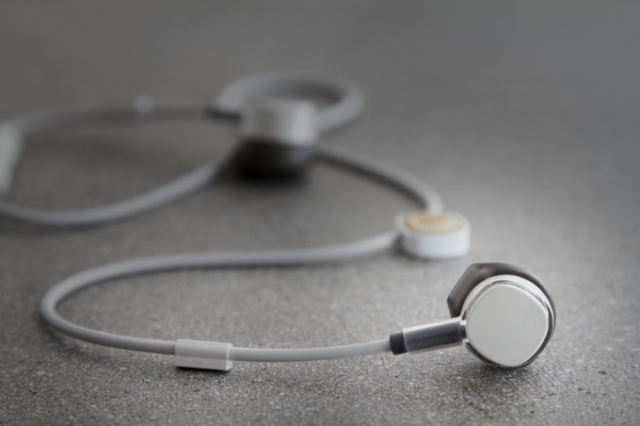  

  
14. 폭스바겐 자율주행 유모차  
http://techholic.co.kr/archives/39044  
  

  
15. 어린이용 스마트 워치  
http://www.engadget.com/2015/08/28/tencent-qq-watch-china/  
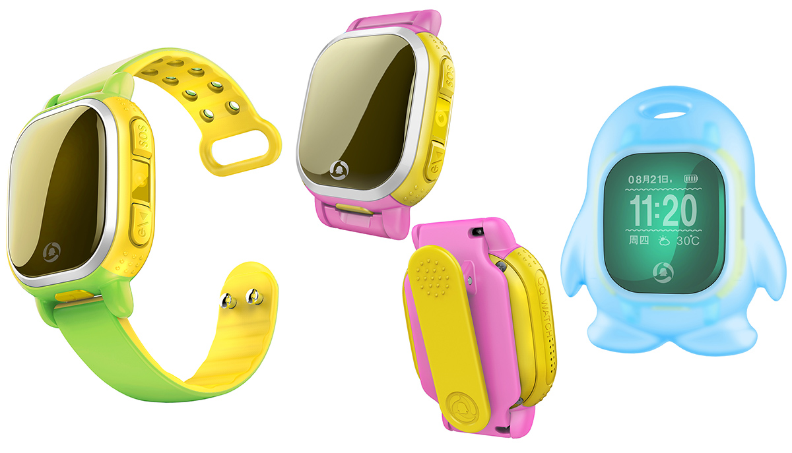  

  
16. 음식 알러지를 테스트 할 수 있는 휴대용 기기  
http://www.psfk.com/2015/08/food-allergens-portable-allergen-sensor-nima.html  
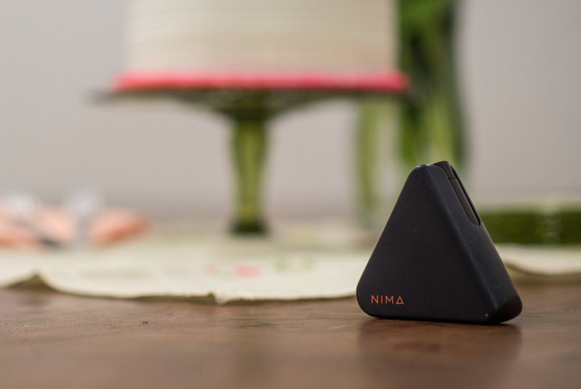  

  
17. 투명 태양광 패널  
http://www.digitaltrends.com/cool-tech/solar-window-solar-panel/?utm_content=bufferd4b9e&utm_medium=socialm&utm_source=facebook.com&utm_campaign=DT-FB  
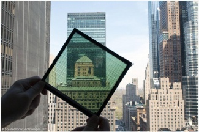  

  
18. 휴대용 스피커 + TV 리모컨  
http://www.geek.com/news/sony-combines-a-portable-speaker-with-a-tv-remote-yes-really-1632118/  
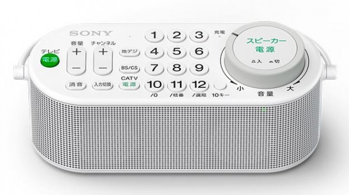  

  
19. HUD(Head-Up Display) 네비게이션  
https://www.indiegogo.com/projects/exploride-turn-your-car-into-a-smart-car#/story  
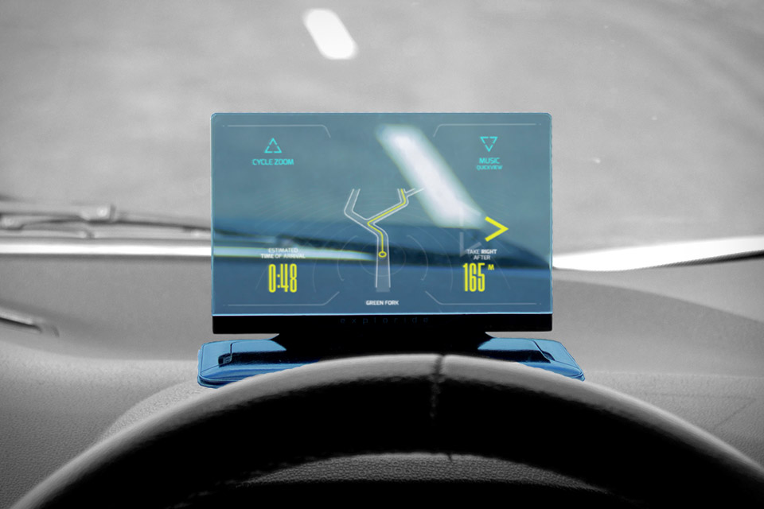  

  
20. Force 터치 패널 모듈  
http://www.wired.com/2015/08/sensel-morph/?mbid=social_fb  
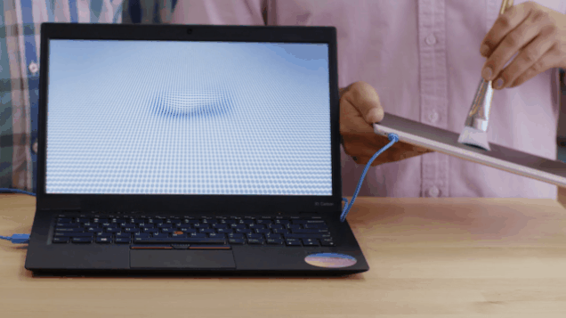  
