  
---    
#150914    
> 2015년 주차 **HOT DEVICE EVERY WEEK**    
>     
  
---    
  
1. 더욱 정교하고 세밀한 작업을 할 수있는 Apple Pencil  
터치의 세기를 감지하는 3D 터치가 내장된 아이패드 프로에서 사용  
https://www.youtube.com/watch?v=iicnVez5U7M  
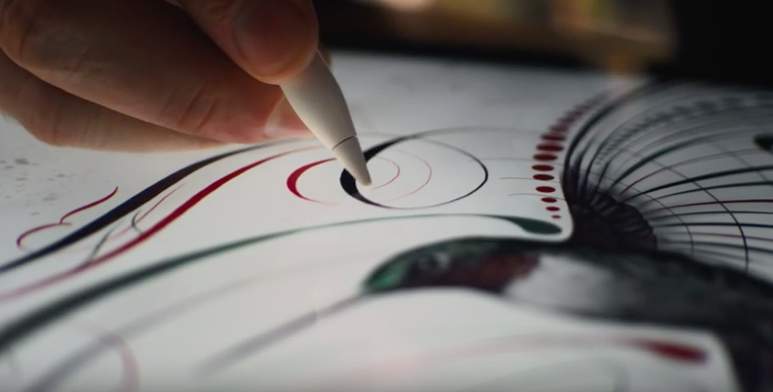    
  
  
2. 소행성 탐사용 고슴도치 로봇. (NASA)  
로봇내부에 3개의 휠이 빠른 속도로 돌면서 직육면체를 원하는 방향으로 회전시켜 이동.  
http://www.geek.com/science/nasa-creates-hedgehog-robot-to-traverse-asteroids-1633424/  
    
  
  
3. 아날로그 자전거 벨같이 생긴 디지털 자전거 벨.  
기능은 본인 자전거 찾기.  
http://www.earlyadopter.co.kr/63516  
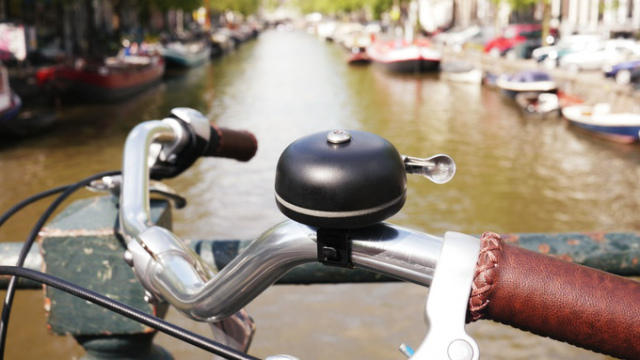    
  
  
4. 마샬(Marshall)의 블루투스 스피커  
http://www.earlyadopter.co.kr/63452  
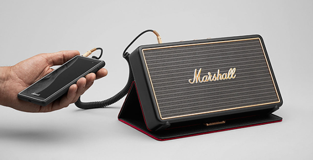    
  
  
5. 스마트폰이나 주변기기들을 컨트롤 할 수 있는 반지.  
http://androidcommunity.com/omate-smart-ring-tells-you-when-that-person-is-calling-20150811/  
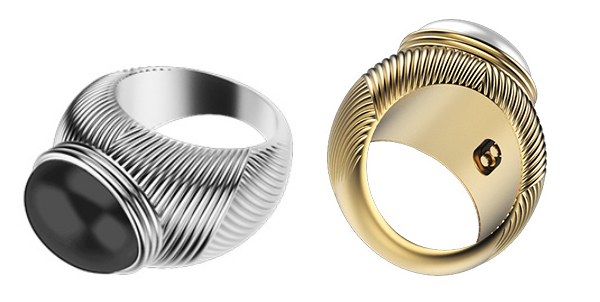    
  
  
  
6. 단순히 잡아당겨서 태양을 추적하는 태양광 패널 메커니즘.  
태양광 패널은 태양의 위치를 추적해야 가장 효율적으로 충전을 할 수 있기에 지금까지는 모터를 달아서 태양을 추적했음.  
http://www.engadget.com/2015/09/11/kirigami-inspired-solar-cells-can-track-the-sun-without-motors/  
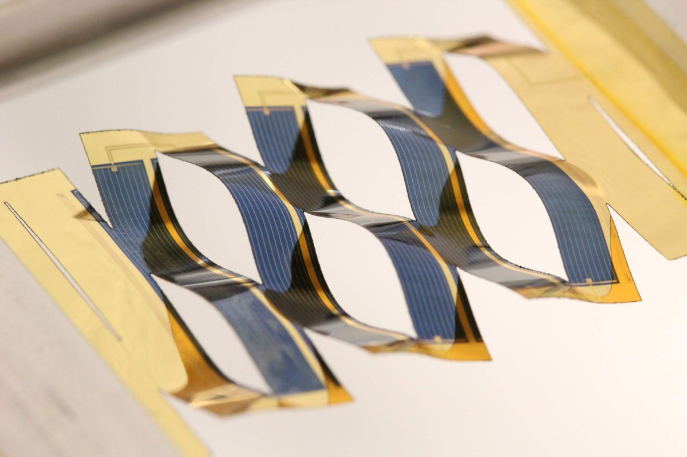    
  
7. 무인양품 블루투스 스피커.  
유명한 무인양품 CD플레이어와 유사한 디자인  
http://thegear.co.kr/9415  
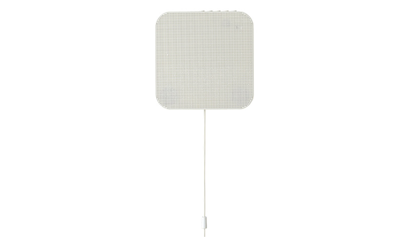    
  
8. 침으로 부터 건강정보를 파악하는 마우스 피스  
http://www.technologyreview.com/news/541111/smart-mouthguard-monitors-your-saliva-and-your-health/  
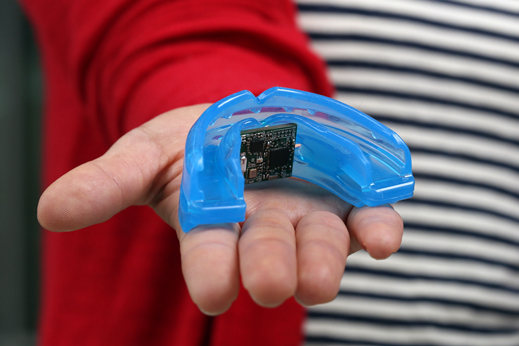    
  
9. 몸에 지니고 있는 웨어러블 기기간의 통신을 블루투스가 아닌 신체의 자기장을 이용하는 기술.  
블루투스보다 더 적은 에너지를 사용함으로써 배터리를 더 오래 쓸수 있음.  
http://interestingengineering.com/alternative-to-bluetooth-uses-your-body-to-transmit-data/  
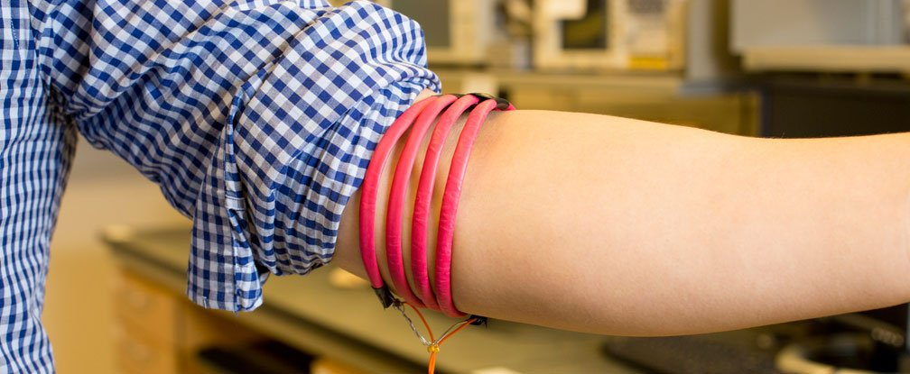    
  
10. 38cm 거리에서 100인치 화면을 구현하는 LG 프로젝터  
http://www.earlyadopter.co.kr/63600  
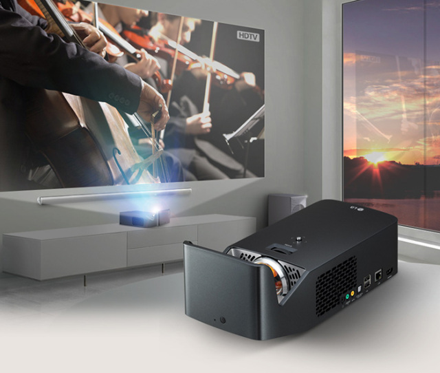    
  
11. 골전도 헤드폰  
http://www.cnet.com/news/batband-may-be-the-goofiest-bone-conduction-headphones-ever/  
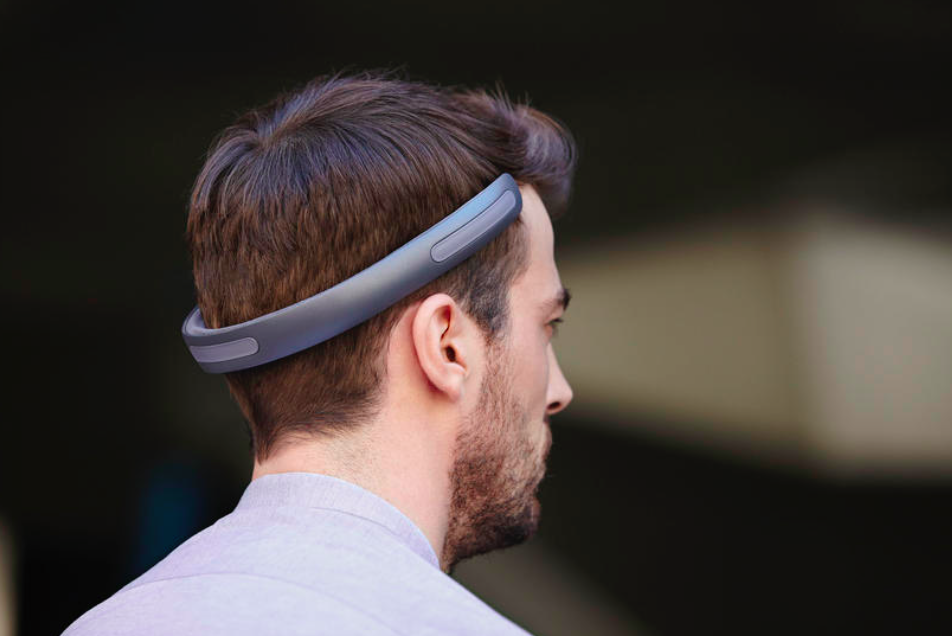    
  
12. 총이 발사되어도 치명적이지 않게 만들어주는 안전장치  
http://gizmodo.com/this-clip-on-handgun-attachment-makes-bullets-non-letha-1730039256  
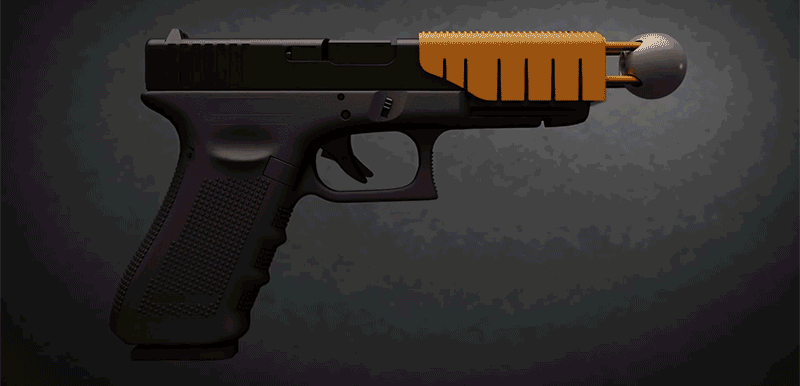    
  
13. 라즈베리파이용 공식 터치스크린.($60)  
http://www.engadget.com/2015/09/08/raspberry-pi-official-touchscreen-display/  
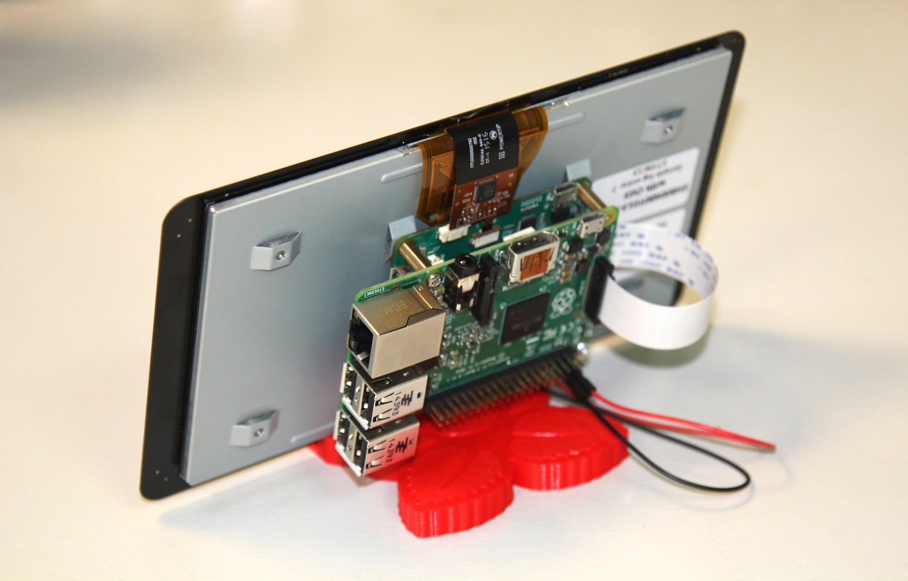    
  
