---  
#151005  
> 2015년 주차 **HOT PRODUCT EVERY WEEK**  
>   

---  

1. 칼날이 아닌 레이져로 면도하는 면도기.
https://www.kickstarter.com/projects/skarp/the-skarp-laser-razor-21st-century-shaving
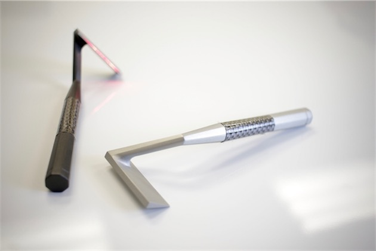

2. 크롬캐스트 오디오(구글)
블루투스 같은 무선 오디오 기능이 없는 구형 오디오 기기에서 무선 오디오 기능을 실현하기 위한 기기
http://www.cnet.com/products/chromecast-audio/
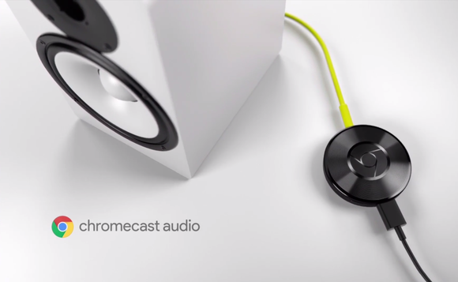

3. 물속에서 즐길 수 있는 양팔에 부착하는 제트 팩
http://funtenna.co.kr/220496503610

4. 입으면 자동으로 올바른 자세가 되는 속옷.
http://www.earlyadopter.co.kr/64458
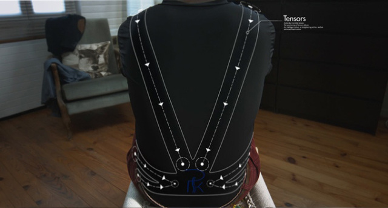

5. 자동차가 무선(LTE) 데이터통신을 할 수있게 만들어주는 기기. 차량내 OBD-2단자에 연결해서 사용.
http://techholic.co.kr/archives/41207
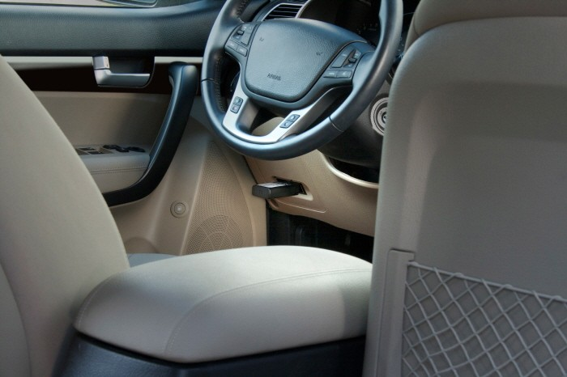

6. 휴대용 풍력발전 충전기
http://www.funshop.co.kr/funtenna/detail/4765
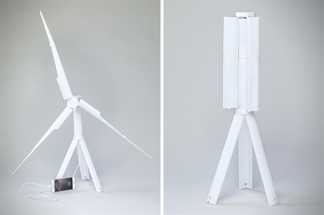

7. Microsoft가 출시한 VR키트(구글카드보드와 유사제품)
http://www.geek.com/microsoft/microsoft-has-a-google-cardboard-clone-for-vr-devs-1635095/
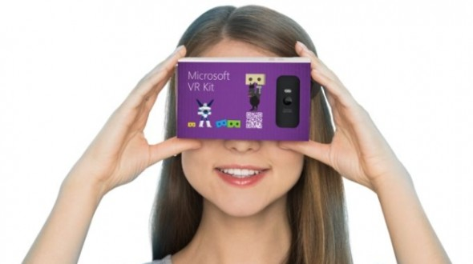

8. 부드럽게 물건을 집는 소프트 로봇.
http://www.psfk.com/2015/10/mit-robot-hand-soft-touch-modular-soft-robotic-gripper.html
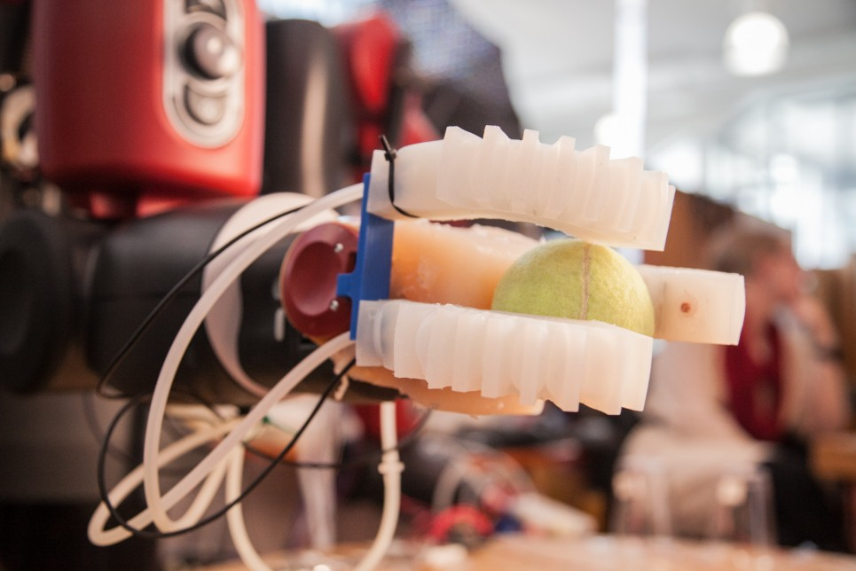

9. 스스로 접히고 점프하는 로봇.
http://www.engadget.com/2015/09/28/tribot-origami-robot-epfl/
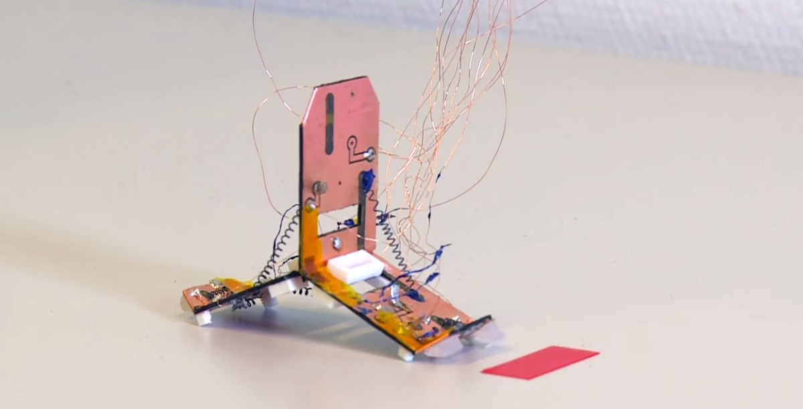

10. 새로운 형태의 신디사이져 키보드
http://techholic.co.kr/archives/41193
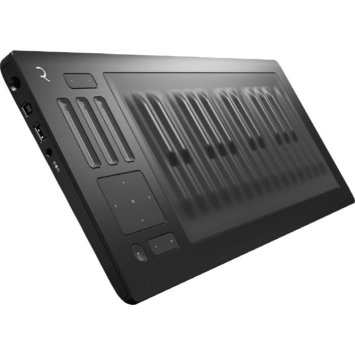

11. 고프로용 스테빌라이져.
http://www.engadget.com/2015/10/03/aetho-aeon-gopro-stabilizer/

12. 이모티콘만 1000개인 키보드
http://techholic.co.kr/archives/41182
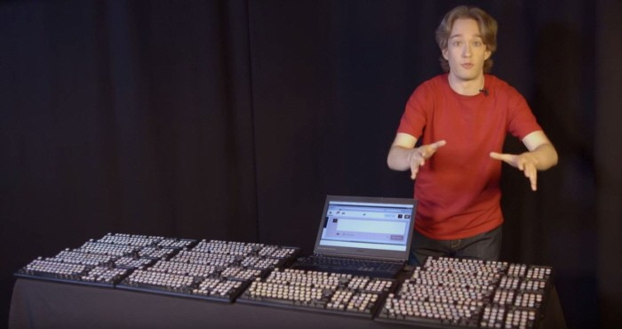

13. 로봇 인형을 위한 소프트 스킨 연구 (디즈니)
http://www.engadget.com/2015/10/01/disney-research-soft-skin-toy-robots/
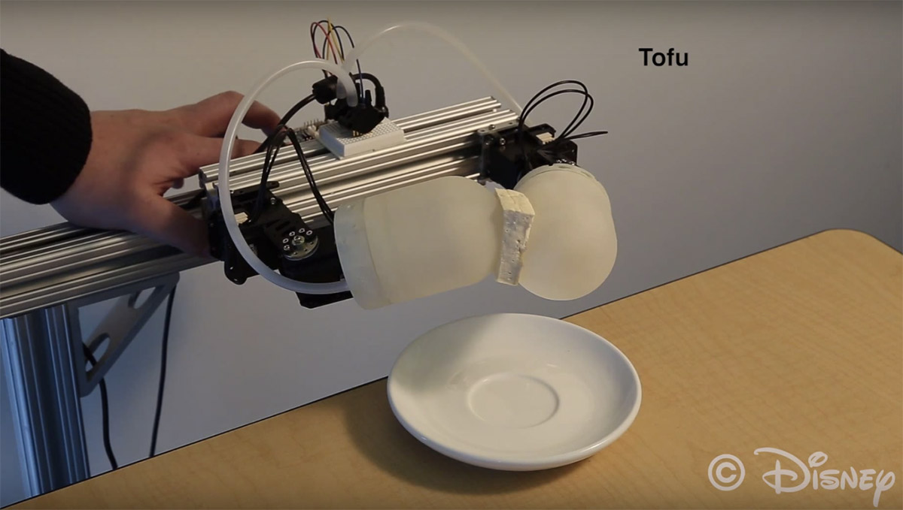

14. 양손으로 조립을 할 수 있는 보다 정밀한 손을 가진 로봇
http://media.daum.net/digital/all/newsview?newsid=20151001030625000
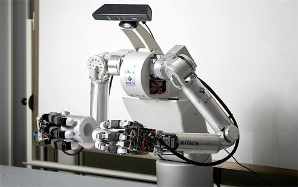

