---  
#151012  
> 2015년 주차 **HOT PRODUCT EVERY WEEK**  
>   

---  

1. 멀티 펑션 로봇팔(1). (3D프린팅, 밀링머신, 납땜, 부품조립, 사람의 작업을 보조할 수 있음)
https://www.kickstarter.com/projects/1849283018/makerarm-the-first-robotic-arm-that-makes-anything
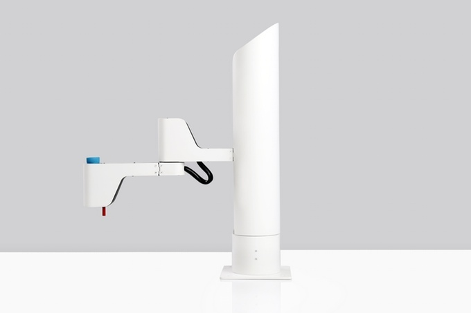

2. 멀티 펑션 로봇팔(2).
https://www.kickstarter.com/projects/dobot/dobot-robotic-arm-for-everyone-arduino-and-open-so
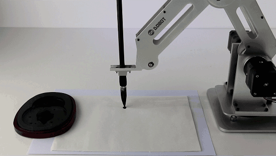

3. DJI 의 카메라 짐벌(영상이 흔들리지 않게 고정하는 장치)
https://www.youtube.com/watch?v=tJZzgNwLoNA&feature=youtu.be
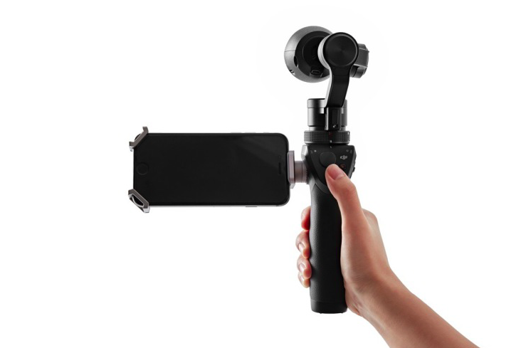

4. 샤프가 만든 로봇, 로보혼
http://funtenna.co.kr/220502041426
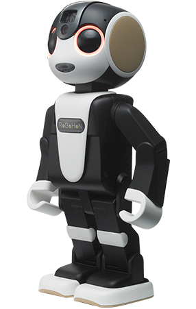

5. MS 에서 출시한 스마트와치
http://gizmodo.com/a-closer-look-at-the-microsoft-band-2-definitely-more-1734976164?utm_campaign=socialflow_gizmodo_facebook&utm_source=gizmodo_facebook&utm_medium=socialflow
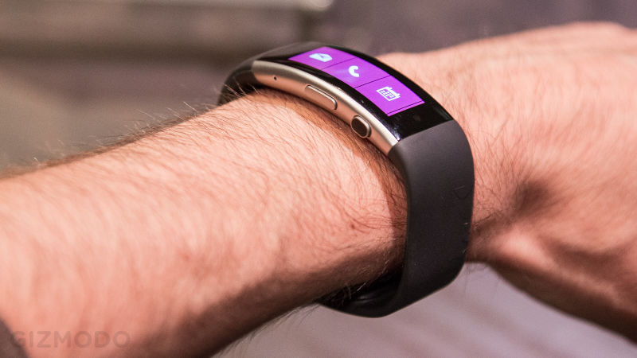

6. 윈도우10 모바일폰의 화면을 PC에서 보게해주는 Display Dock
http://www.theverge.com/2015/10/6/9453577/microsoft-display-dock-announced-price-release-date-continuum
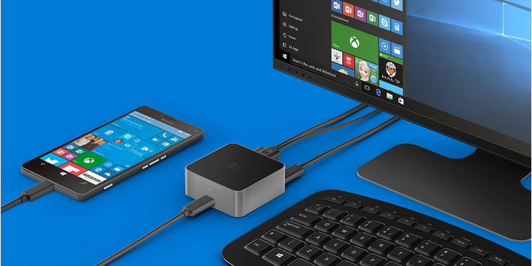

7. 드론과 협업하는 4족보행 로봇.
http://www.engadget.com/2015/10/05/four-legged-bot-uses-drone-sidekick-to-avoid-rough-terrain/
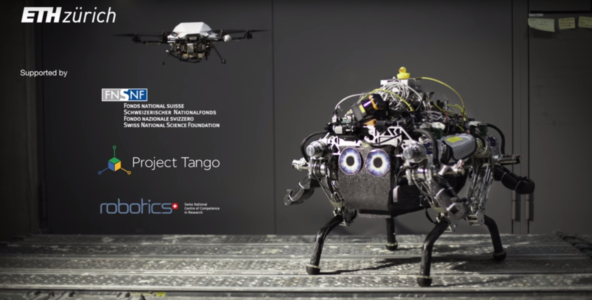

8. $55 짜리 FPGA 보드(CPU를 원하는데로 설계가능) 
http://www.pcworld.com/article/2989126/gadgets/meet-snickerdoodle-an-affordable-powerfully-maker-focused-raspberry-pi-rival.html
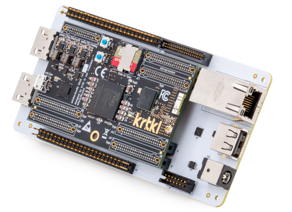

9. 아이폰에 끼워서 가상현실 영상을 만들 수 있는 악세서리
전방,후방 카메라의 영상을 합성해서 360방향의 영상을 만듦.
https://www.youtube.com/watch?v=l4AVXWAg220
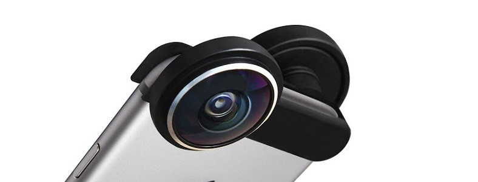

10. 진공청소기의 흡입으로 동작하는 회전 공구
http://gizmodo.com/dremels-new-rotary-tool-is-cheap-because-its-powered-by-1735162533?utm_campaign=socialflow_gizmodo_facebook&utm_source=gizmodo_facebook&utm_medium=socialflow
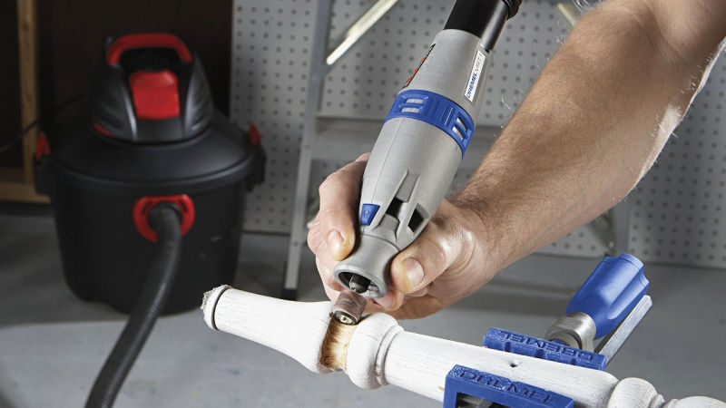

11. VR헤드셋으로 수술을 시뮬레이션하는 기술
http://mashable.com/2015/10/05/surgeons-virtual-reality/?utm_cid=mash-com-fb-vid-vid#rGJD5CuE5kqj

12. 독특한 힌지구조를 가지고 있는 MS 노트PC (Surface Book)
http://www.engadget.com/2015/10/06/microsoft-surface-book-hands-on/
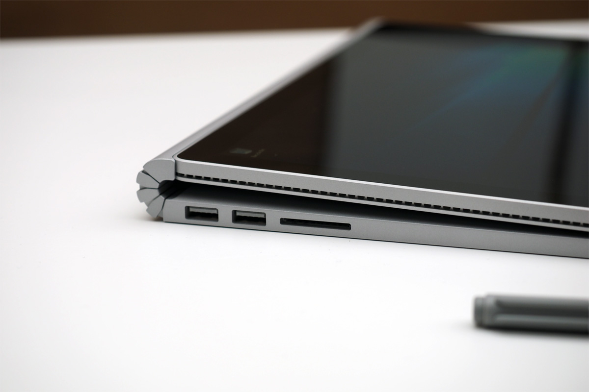

13. 운동하는 자세를 바로 잡아주는 웨어러블 기기
http://www.engadget.com/2015/10/07/lumo-run/

