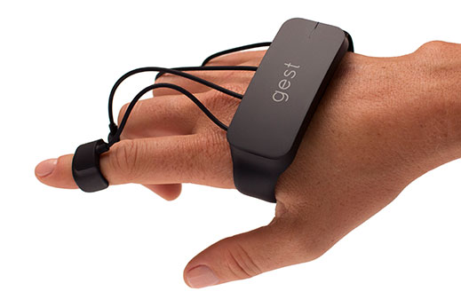
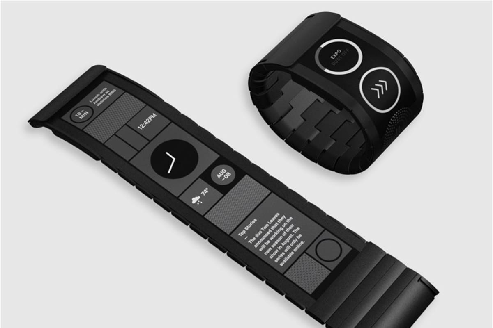
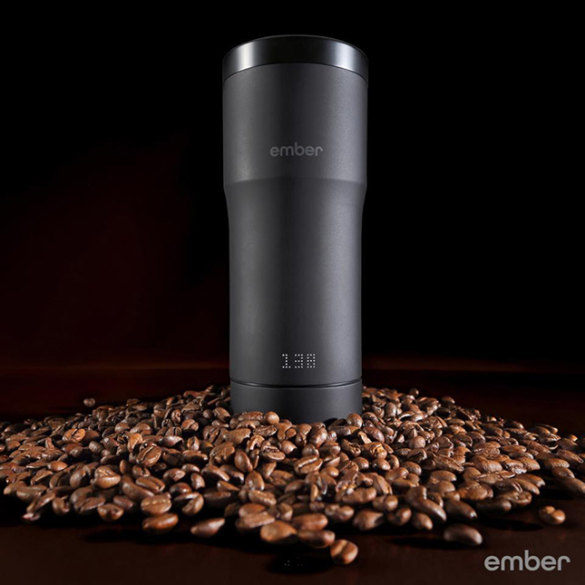
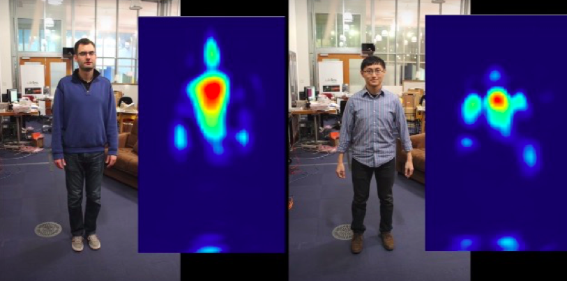
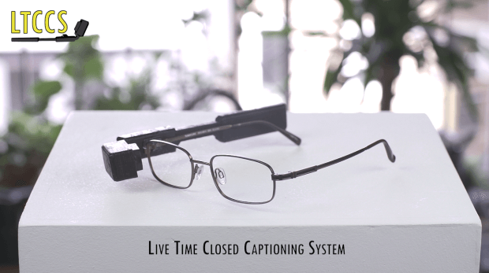
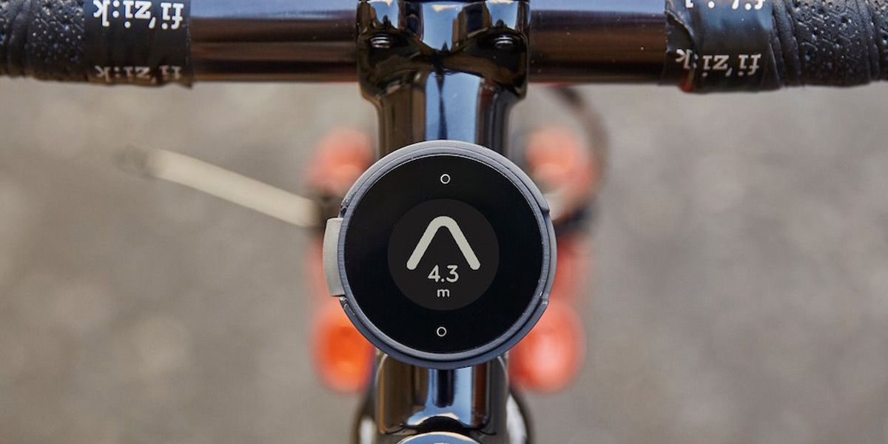
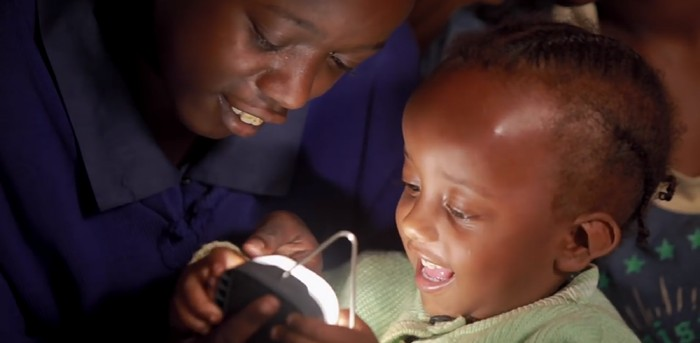
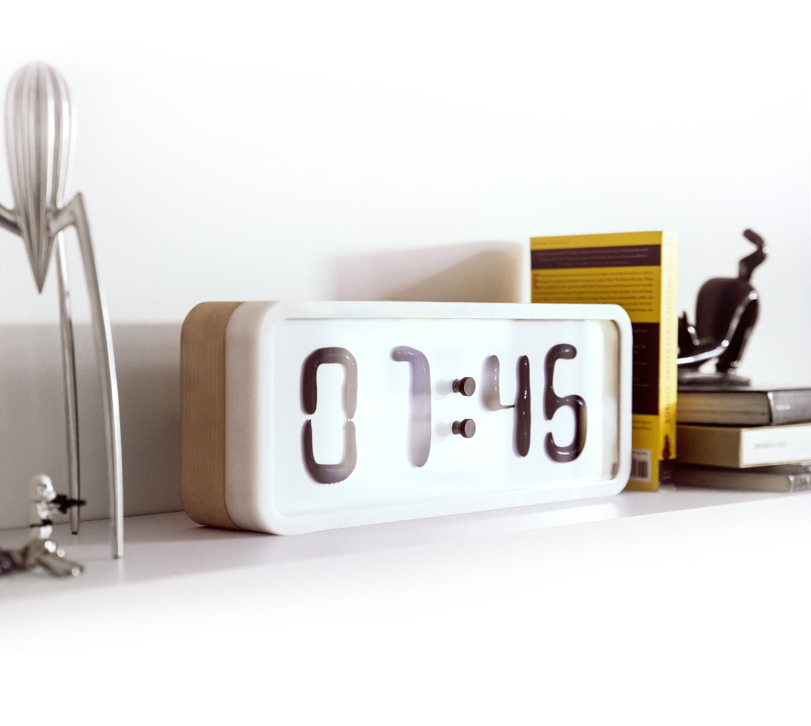
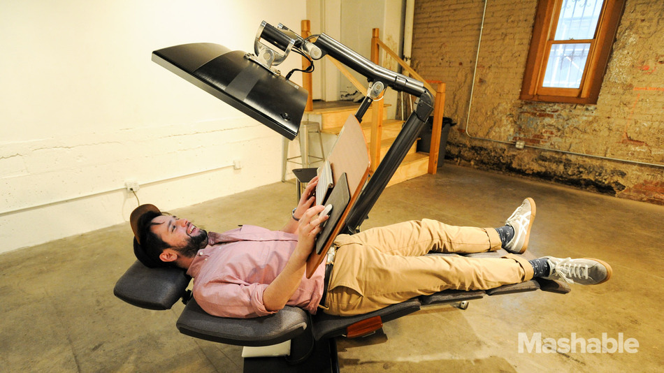

---  
#151102  
> 2015년 주차 **HOT PRODUCT EVERY WEEK**  
>   

---  

1. 손의 움직임을 사용한 입력장치.
가상현실의 물체를 잡거나, 가상 키보드를 입력할 수 있음.
http://www.technologyreview.com/news/542911/get-to-grips-with-virtual-objects-using-this-stripped-down-glove/?utm_campaign=socialsync&utm_medium=social-post&utm_source=facebook

2. E-잉크 디스플레이를 탑재한 구부러지는 웨어러블 기기
http://techneedle.com/archives/23067

3. 자동으로 차(Tea)를 내려주는 기기
http://www.cnet.com/products/teforia-infuser/

4. 온도를 조절할 수 있는 스마트 텀블러.  
설정한 온도를 계속 유지해줌.
http://www.earlyadopter.co.kr/65807

5. Wifi 신호를 이용해 벽을투과해 사람의 윤곽을 볼 수잏는 기기, R-F캡쳐
http://thenextweb.com/shareables/2015/10/29/this-device-uses-wi-fi-to-see-through-walls/

6. 청력이 좋지 않은 사람들을 위해, 대화를 자막으로 뿌려주는 웨어러블 안경.
http://www.earlyadopter.co.kr/65779

7. 자전거용 GPS 내비게이션 
http://www.engadget.com/2015/10/28/beeline-simple-bike-navigation/

8. $5 태양광 랜턴
전력망이 공급되지 않은 저개발 국가에서 유용.
http://techholic.co.kr/archives/40367

9. 액체 자석으로 시간을 표현하는 시계.
http://www.hellorhei.com

10. 누워서 일할 수 있게해주는 테이블&의자
http://mashable.com/2015/10/28/altwork-station-laying-down/?utm_cid=mash-com-fb-main-link#oMVCKD6Q5OqE

