---  
#151109  
> 2015년 주차 **HOT PRODUCT EVERY WEEK**  
>   

---  

1. 사진의 초첨을 찍기전에 정하는것이 아니라, 찍은 이후에 후보정으로 저장된 모든 초첨중 선택 수 있는 VR 영상촬영용 카메라
http://www.wired.com/2015/11/lytro-refocuses-to-create-a-groundbreaking-vr-camera/?mbid=social_fb#slide-5

2. 짐을 실어 날라주는 로봇.
http://www.engadget.com/2015/11/02/starship-technologies-local-delivery-robot/
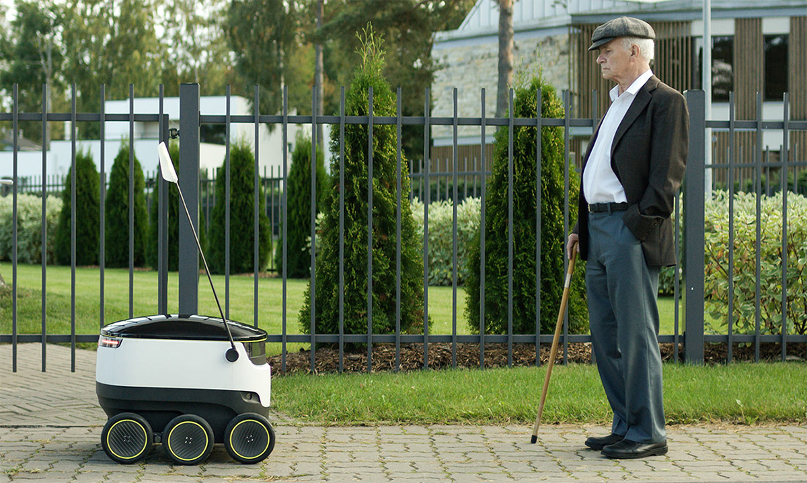

3. YAMAHA 오토바이 타는 로봇
http://www.engadget.com/2015/10/28/yamaha-motobot/
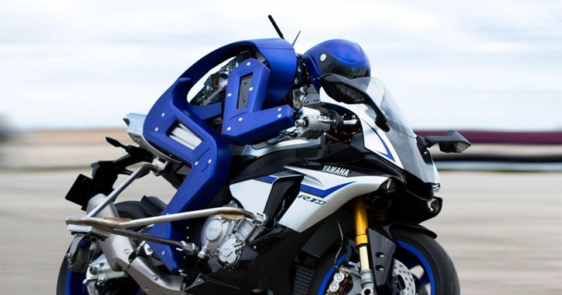

4. 발뮤다의 새로운 방식의 토스터기
https://www.balmuda.com/jp/toaster/
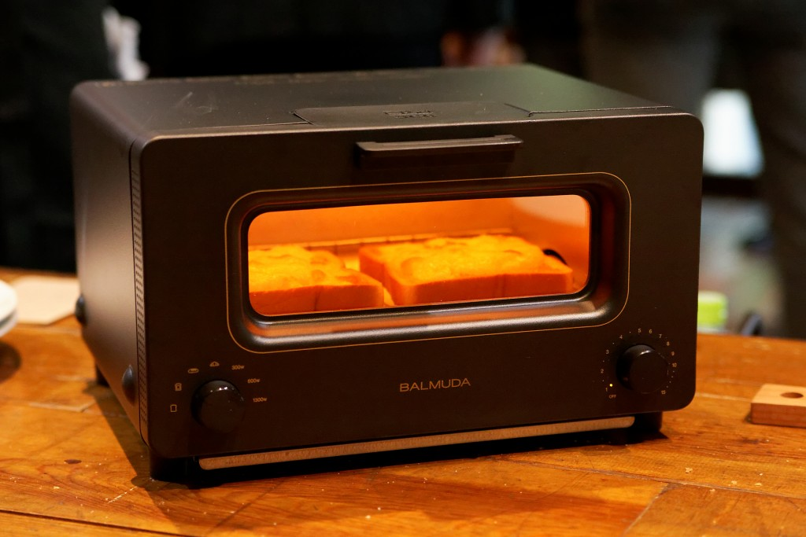

5. 아이들의 저축습관을 길러주는 디지털 돼지 저금통.
http://www.fastcodesign.com/3053118/an-adorable-cyber-piggy-bank-that-teaches-kids-to-save-digitally#1

6. 유아 돌연사 방지용 스마트 아기 양말
http://techneedle.com/archives/23278

7. 창문을 내렸다 올리는 동작으로 자동차의 옆면 유리창을 닦을 수 있는 와이퍼.
http://blog.naver.com/funtenna/220529633934
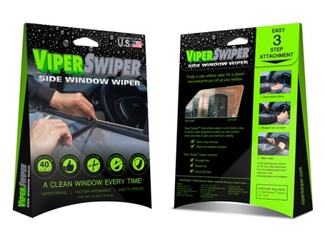

8. 모든 버튼을 무선으로 컨트롤하게 도와주는 기기
http://www.engadget.com/2015/11/04/robotic-iot-fingers-make-your-dumb-appliances-smarter/
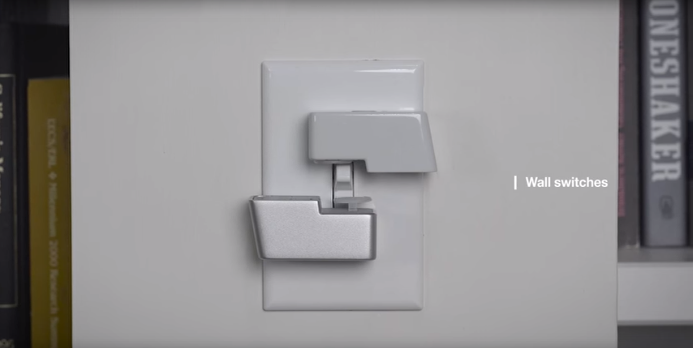

9. 테이프를 이용해 큰 물체의 프로토타이핑을 도와주는 테이프 건
http://www.businessinsider.com/gun-germany-furniture-ikea-3d-objects-tape-2015-11?utm_content=bufferbf475&utm_medium=social&utm_source=facebook.com&utm_campaign=buffer
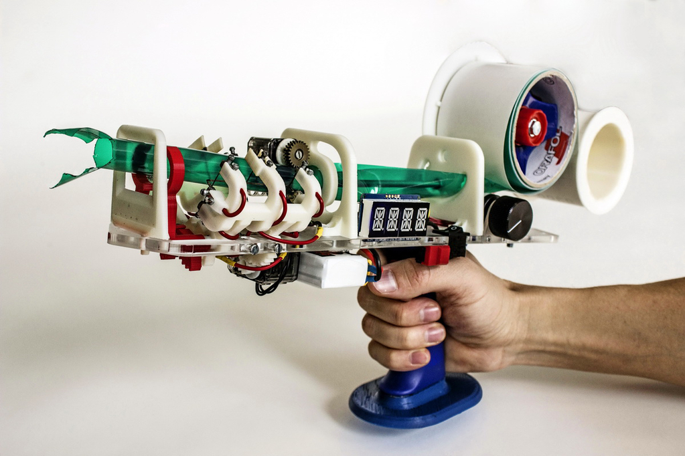

10. 조립식 스마트폰
http://thegear.co.kr/9922
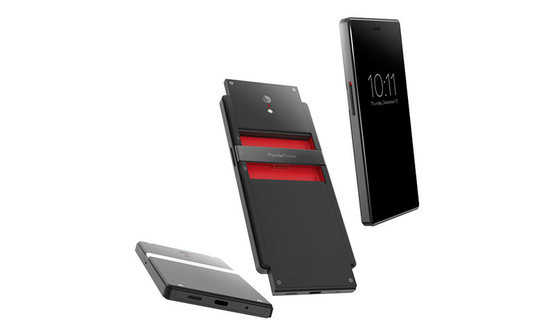

11. 머리에 쓰는 웨어러블 카메라
https://www.indiegogo.com/projects/3rditek-capture-your-life#/
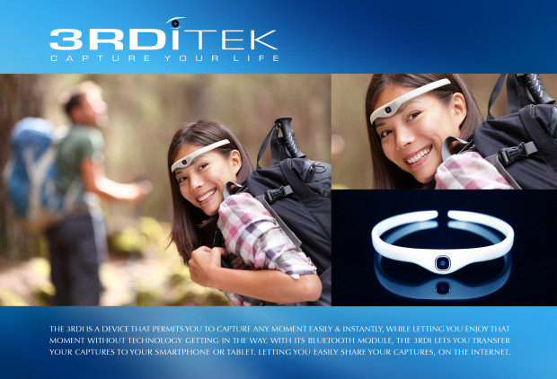

12. 스마트폰을 HUD 네비게이션으로 만들어주는 기기
http://uncrate.com/stuff/hudway-glass-head-up-car-display/
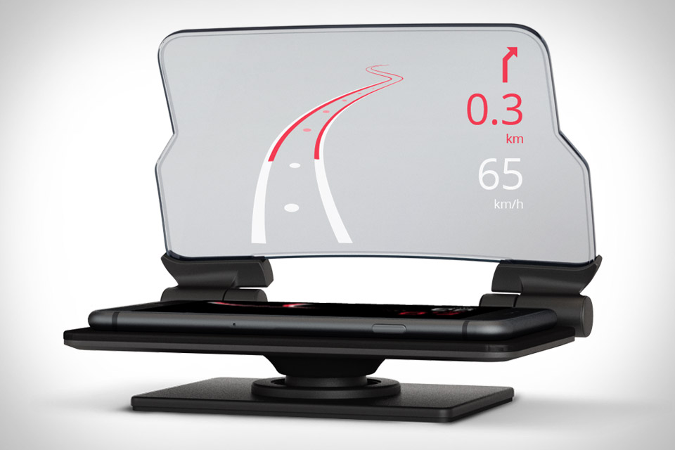

13. 유리창 청소로봇
http://www.earlyadopter.co.kr/65983
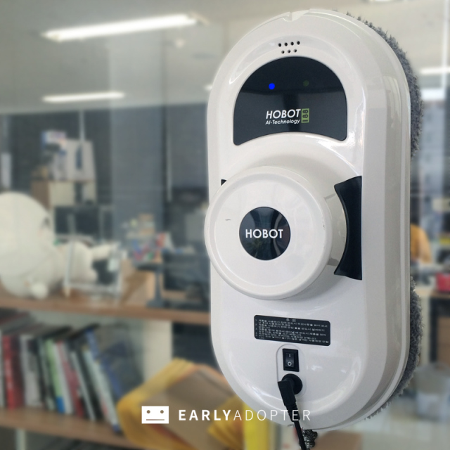

14. 모든 시계를 스마트워치로 만들어주는 아이템(1)
http://www.earlyadopter.co.kr/66035
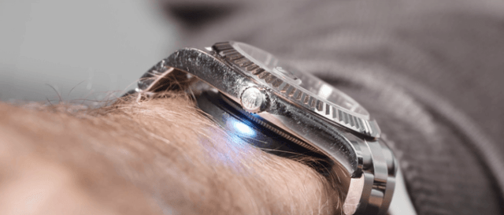

15. 모든 시계를 스마트워치로 만들어주는 아이템(2)
http://www.earlyadopter.co.kr/66172
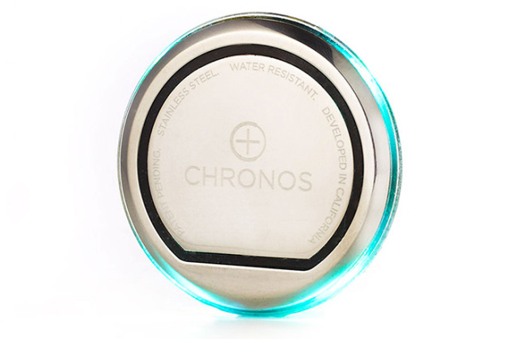

16. VR헤드셋을 이용한 곰돌이 인형 아바타
http://www.technologyreview.com/news/542741/inhabit-this-teddy-bears-body-using-virtual-reality/

17. 의사용 웨어러블 AR 디스플레이 기기
http://www.psfk.com/2015/11/augmented-reality-heads-up-display-method-design-firm-vivi-wearable-for-doctors.html?utm_content=bufferd7661&utm_medium=social&utm_source=facebook.com&utm_campaign=buffer
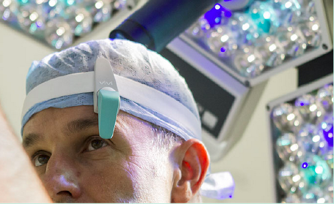

18. 혈류를 모니터링할 수 있는 웨어러블 기기
http://techneedle.com/archives/23362?utm_source=dlvr.it&utm_medium=facebook
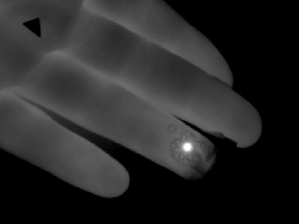

19. 인공위성을 고치는 로봇
http://space.io9.com/this-robot-is-all-eyes-the-better-to-inspect-satellites-1740629465?utm_campaign=socialflow_gizmodo_facebook&utm_source=gizmodo_facebook&utm_medium=socialflow
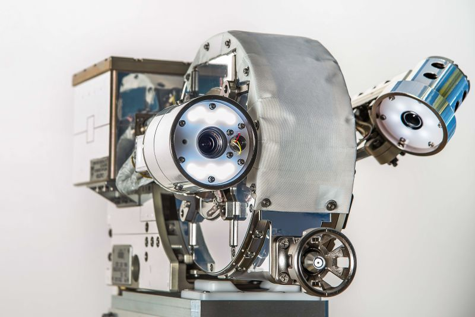

20. 테니스 센서
http://www.engadget.com/2015/11/04/qlipp-tennis-sensor/
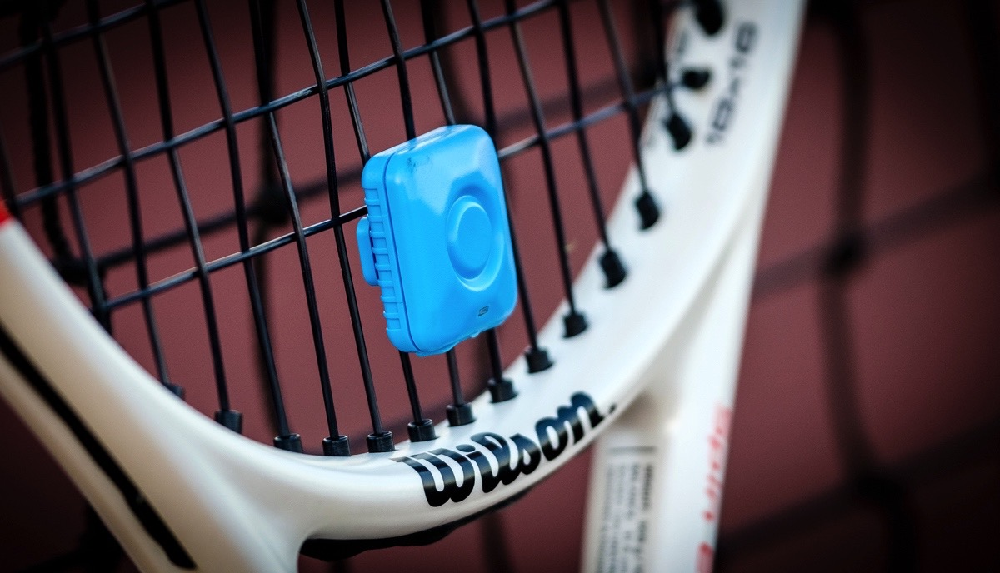

21. 스마트 캐리어
http://interestingengineering.com/why-is-this-smart-carry-on-luggage-booming-on-kickstarter/
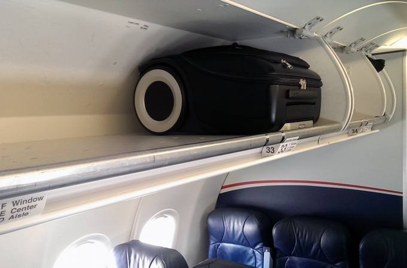

22. 박테리아를 이용, 땀을 흘리면 구멍이 열려 땀을 더욱 효과적으로 배출하는 옷
http://www.digitaltrends.com/cool-tech/biofilm-clothing-ancient-bacteria-morphs-sweat/?utm_content=bufferb0beb&utm_medium=socialm&utm_source=facebook.com&utm_campaign=DT-FB#/6
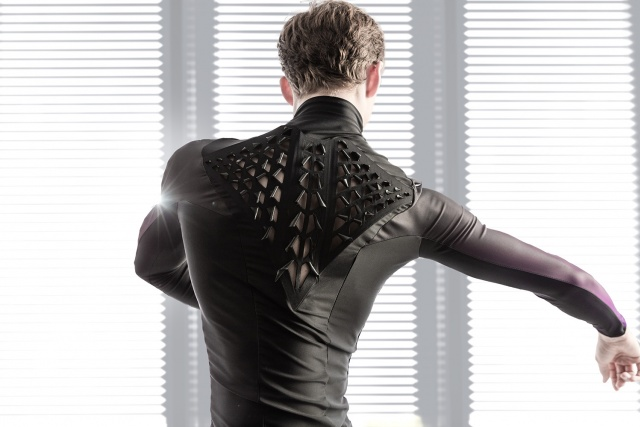
