---  
#151117  
> 2015년 주차 **HOT PRODUCT EVERY WEEK**  
>   

---  

1. 자동으로 네일아트를 해주는 기기
http://www.npr.org/sections/alltechconsidered/2015/11/08/453290268/could-a-nail-art-printer-be-girls-gateway-to-the-tech-world?utm_source=facebook.com&utm_medium=social&utm_campaign=npr&utm_term=nprnews&utm_content=202608
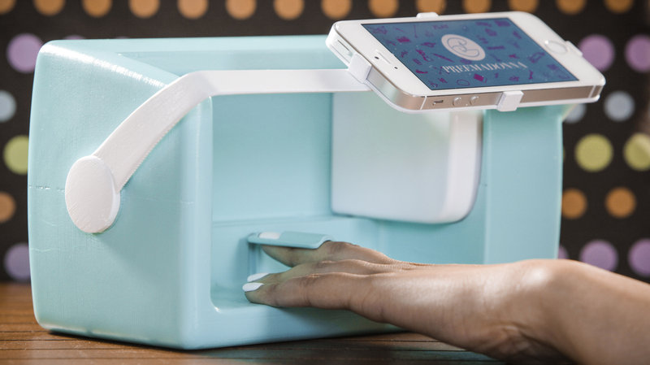

2. 심박센서가 추가된 New 샤오미 스마트 밴드($15)
http://www.earlyadopter.co.kr/66269
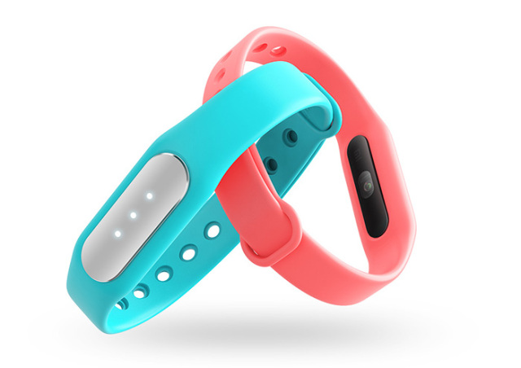

3. 사람이 유용하게 사용할수 있게 여러 형태로 변신하는 뱀형태 로봇.
http://www.engadget.com/2015/11/09/mit-media-lab-lineform-robot/
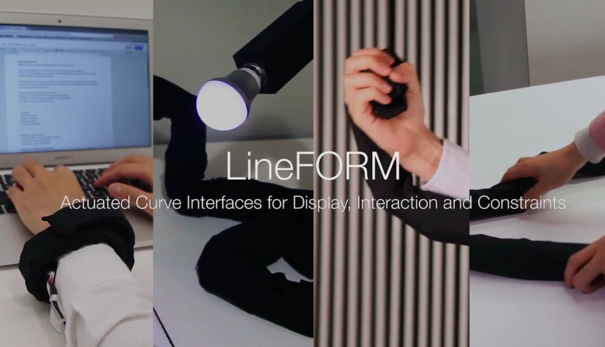

4. 작고 단순한 카메라 영상 모션 컨트롤 시스템
https://www.kickstarter.com/projects/2044759634/hercules-the-worlds-smallest-camera-motion-control
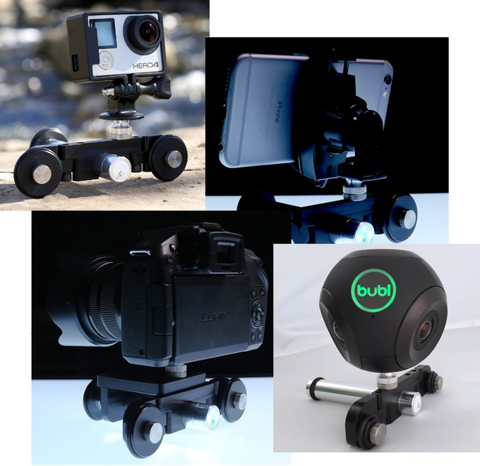

5. 아이가 좋아하는 곰인형을 말하는 친구로 만들어주는 기기
http://techcrunch.com/2015/11/10/oliba-turns-regular-cuddly-toys-into-connected-story-telling-toys/?ncid=rss&utm_source=feedburner&utm_medium=feed&utm_campaign=Feed%3A+Techcrunch+%28TechCrunch%29&sr_share=facebook

6. 버튼을 누르면 자동으로 조여지는 신발(푸마)
http://blog.naver.com/funtenna/220536015433
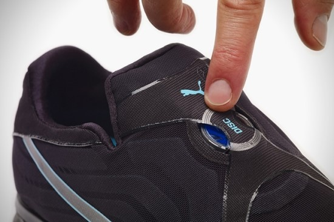

7. 스마트 발열 깔창
내장 배터리로 최대 8시간 사용, USB충전.
http://www.earlyadopter.co.kr/66494
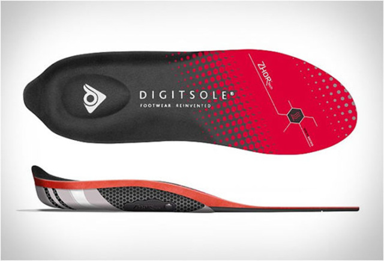

8. 3D프린팅된 맞춤형 신발
http://www.digitaltrends.com/cool-tech/minimal-shoe-3d-printed-programmable-fabric-snaps-into-shape/?utm_content=buffer9f119&utm_medium=socialm&utm_source=facebook.com&utm_campaign=DT-FB
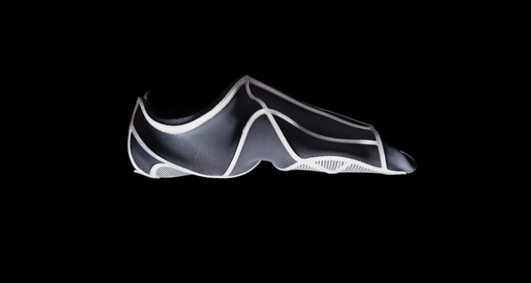

9. 스마트홈 3종 세트
http://www.earlyadopter.co.kr/66284
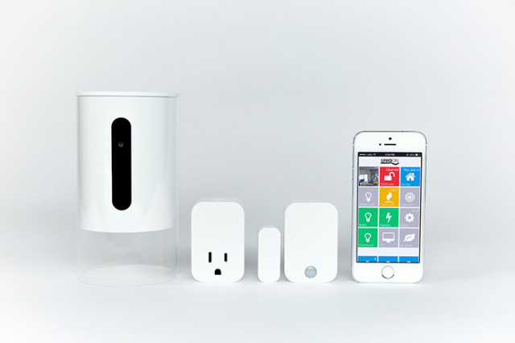

10. 장거리 도보 기네스북에 오른 4족보행 로봇
134Km를 54시간 34분에 주파
http://techholic.co.kr/archives/43818
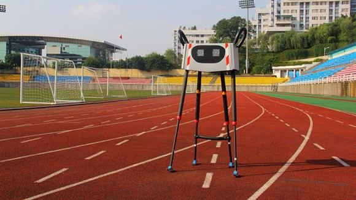

11. 휴대 및 마운트가 용이한 VR 영상 제작용 카메라
http://techcrunch.com/2015/11/08/meet-the-lucidcam-the-future-of-consumer-vr/?ncid=rss&utm_source=feedburner&utm_medium=feed&utm_campaign=Feed%3A+Techcrunch+%28TechCrunch%29&sr_share=facebook
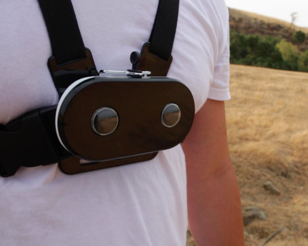

12. 냉장고에 붙이는 디지털 메모장.
그외에 스피커폰+라디오+메세지 허브
http://www.cnet.com/news/hands-on-with-the-triby-fridge-friendly-family-hub/
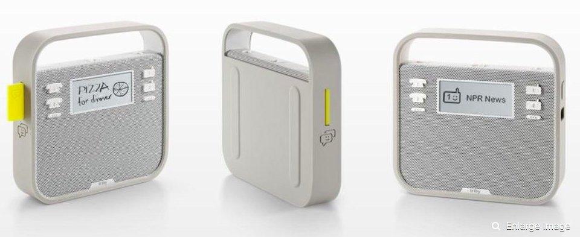

13. 로봇 강아지
http://www.engadget.com/2015/11/10/robot-dog-waits-for-you/
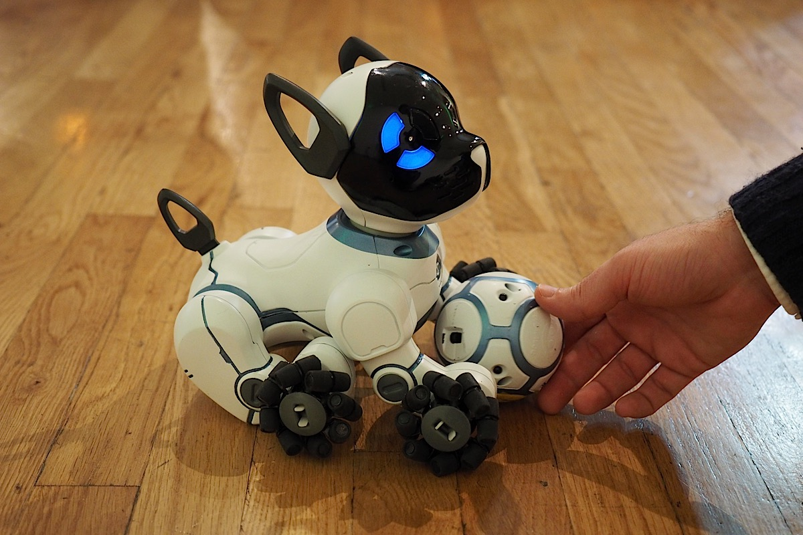

14. 매장에 재고를 자동으로 파악하는 로봇
http://www.engadget.com/2015/11/10/tally-store-shelf-robot/
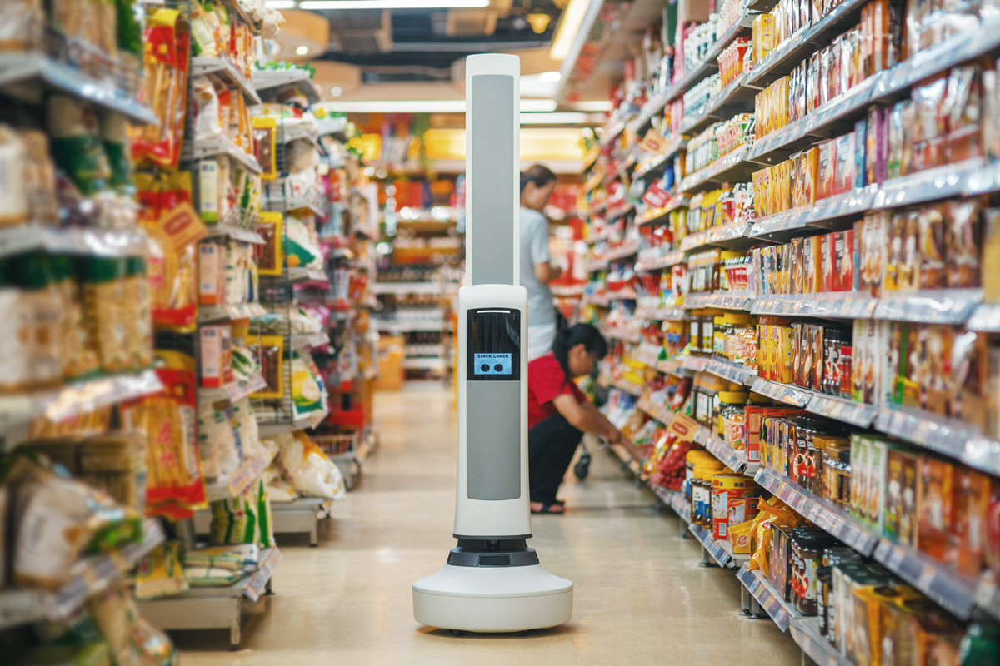

15. 차문까지 바닥을 비춰주는 기술(BMW)
http://techholic.co.kr/archives/43931
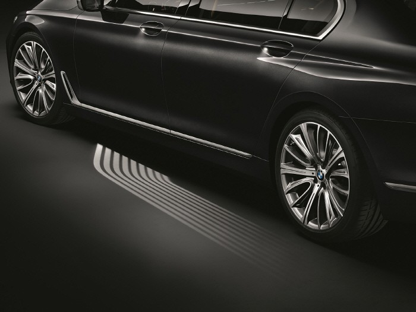

16. 사람의 24시간 리듬에따라 조명을 조절해주는 전구
http://techholic.co.kr/archives/43783
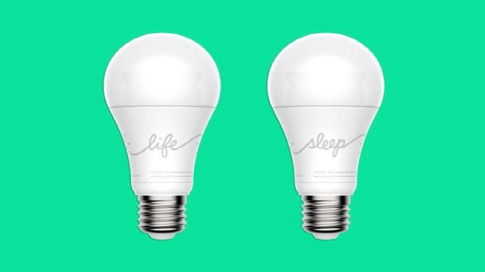

17. 미리 설계한 대로 벽돌을 쌓는 로봇.
http://techholic.co.kr/archives/43358
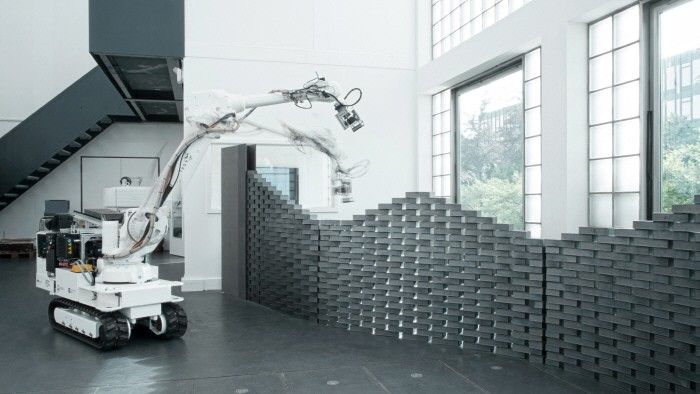

18. 최고의 요리를 위한 블루투스 온도계
http://techholic.co.kr/archives/43645
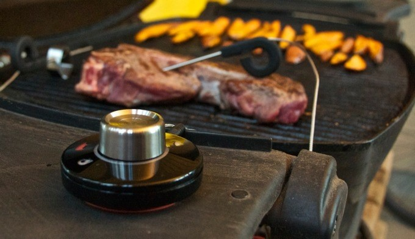

19. 태양광 패널 기와장
http://www.architectureadmirers.com/solar-tiles/
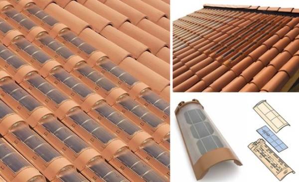

20. 근육의 움직임을 파악하여 손동작을 알아내는 기기
http://www.digitaltrends.com/wearables/this-smartwatch-wrist-band-uses-electrodes-to-recognize-hand-gestures/?utm_content=bufferb71c6&utm_medium=socialm&utm_source=facebook.com&utm_campaign=DT-FB
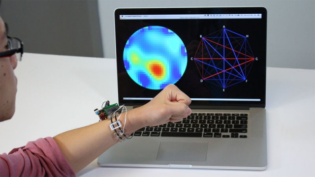
