---  
#151123  
> 2015년 주차 **HOT PRODUCT EVERY WEEK**  
>   

---  

1. VR 헤드셋으로 변하는 아이폰 케이스
아이폰의 후면카메라를 이용한 증강현실(AR)도 가능.
http://www.engadget.com/2015/11/17/figment-vr/
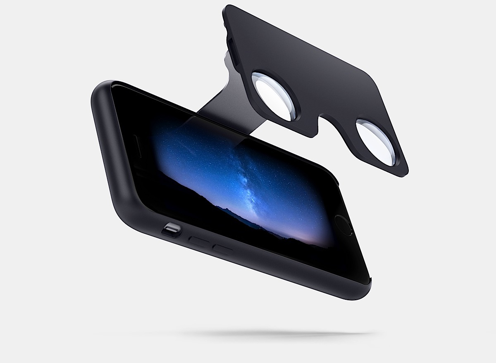

2. 빗물을 흘려버릴수 있는 케이스를 갖춘 접이식 우산
http://techholic.co.kr/archives/43199
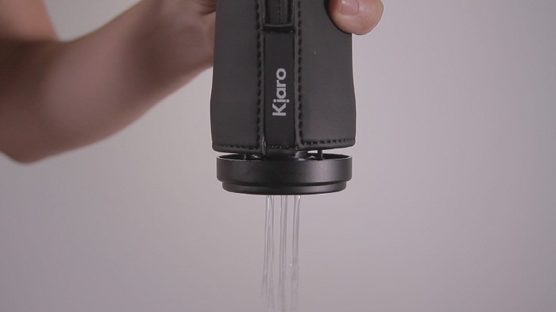

3. 수면의 질을 측정할 뿐만 아니라, 수면의 질이 향상되도록 직접적으로 도움을 주는 기기.
https://www.indiegogo.com/projects/juvo-track-manage-sleep-from-under-your-bed#/
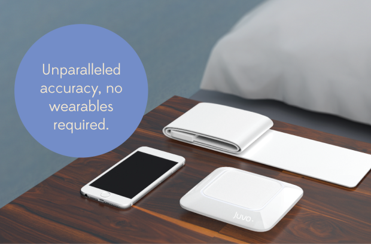

4. 정서안정에 도움이 되는 로봇 고양이
http://joyforall.hasbro.com/en-us
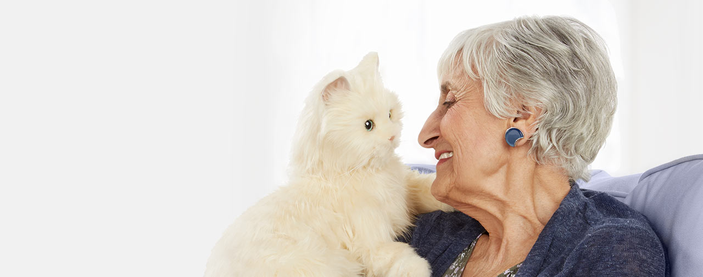

5. 렌즈처럼 마운트시켜 먼지를 털어내는 DSLR 전용 진공청소기
http://www.earlyadopter.co.kr/66590
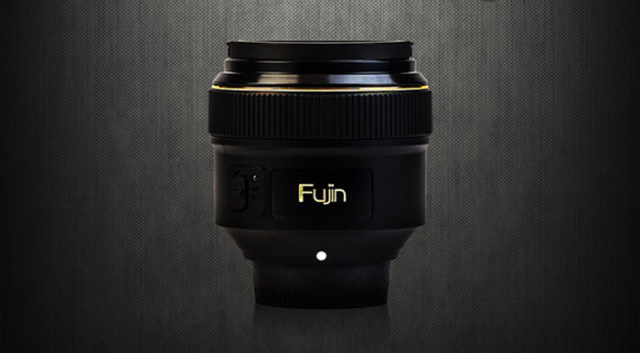

6. 적외선에 반응하여 움직이는 용지.
인공근육등 여러분야에서 응용가능.
http://techholic.co.kr/archives/44025
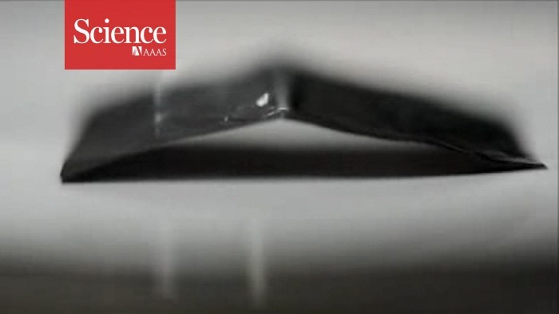

7. 아이의 수면상태를 알려주는 시계
http://techholic.co.kr/archives/44364
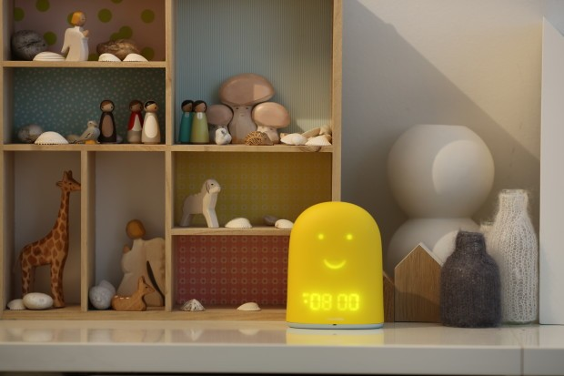

8. 스마트 방향제
http://thenextweb.com/gadgets/2015/11/17/i-know-youd-like-to-think-your-shit-dont-stank/

9. 심작 박동을 측정할 수 있는 삼키는 형태의 센서(MIT)
http://www.engadget.com/2015/11/20/mit-researchers-develop-ingestible-sensor-to-measure-vital-signs/
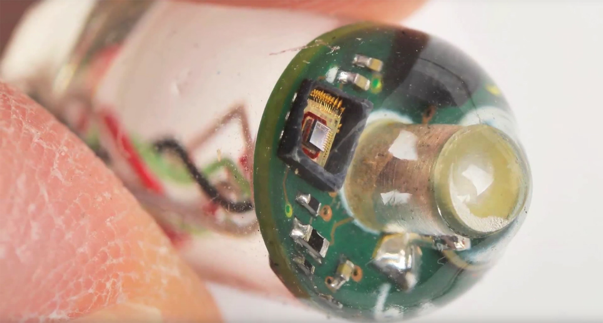

10. 스마트폰과 PC에서 모두 사용할 수 있는 USB 메모리
http://besuccess.com/2015/11/smartphone-accessory-startup-bench-soft-receives-2016-ces-innovation-awards-with-usb-flash-memory/
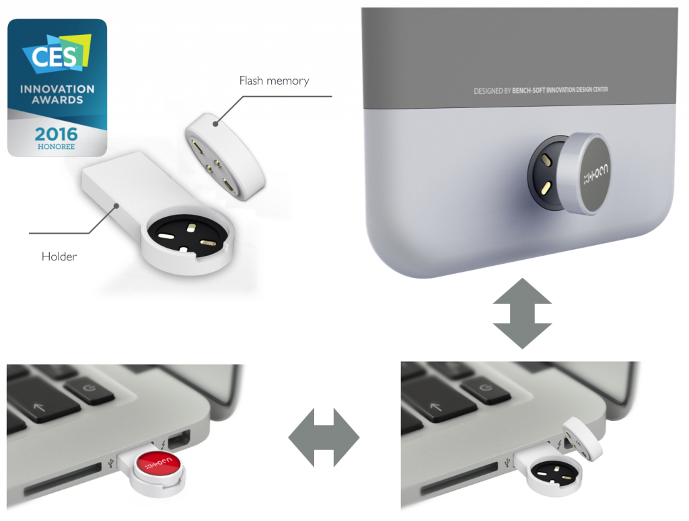

11. 태양 에너지로만 구동되는 모형 비행기
https://www.kickstarter.com/projects/852190721/worlds-first-solar-powered-airplane-science-kit-fo/description
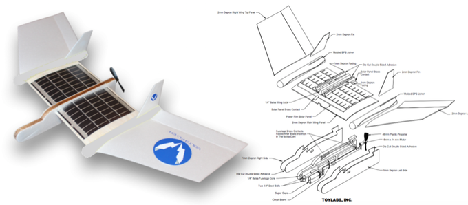

12. 휴대용 공기청정기
http://www.earlyadopter.co.kr/66531

13. 스마트홈 시스템
http://www.engadget.com/2015/11/16/lowes-iris/
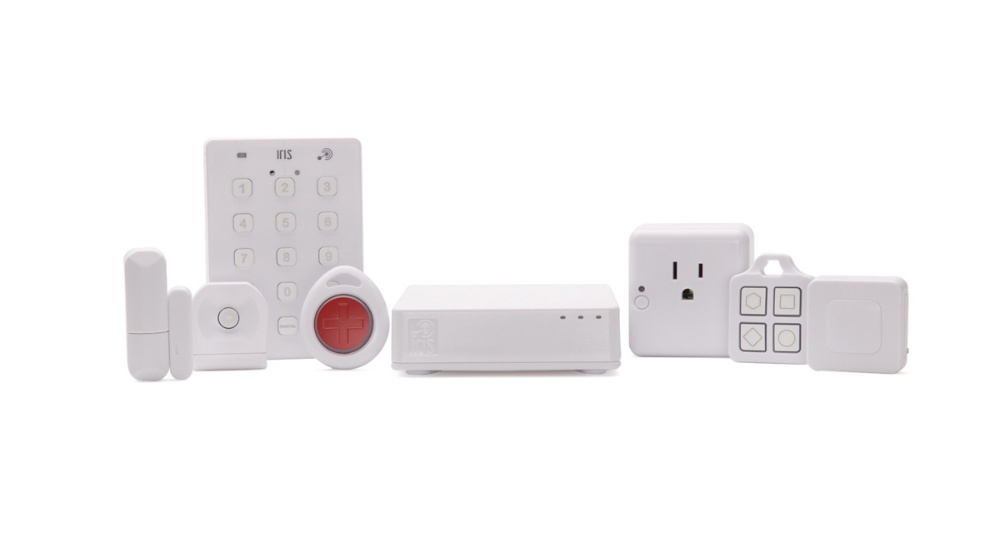

