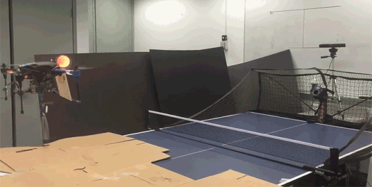

---  
#151129  
> 2015년 주차 **HOT PRODUCT EVERY WEEK**  
>   

---  

1. 도미노 피자 주문 버튼. 버튼 누르면 바로 주문됨.
http://www.engadget.com/2015/11/23/dominos-easy-order-button/

2. Squre사의 애플페이 단말기
(Squre : 모바일 신용카드 결제 단말기 회사)
http://www.engadget.com/2015/11/23/square-nfc-chip-card-reader-arrives/

3. 인터넷 공유기(AP)에 연결하여 AP에 연결된 모든 디바이스를 해킹으로부터 보호해주는 기기
http://www.wired.com/2015/11/this-fancy-rock-wants-to-protect-your-connected-devices/?mbid=social_fb

4. 게임하면서 이닦을 수 있게 도와주는 유아용 칫솔
http://www.playbrush.com/en/

5. 코골이 소리를 제거해주는 기기
실시간 노이즈 제거 기술
https://www.indiegogo.com/projects/silent-partner-quiets-snoring-noise-like-magic#/

6. 최근 많아진 스탠딩 데스크 사용자를 위한 발을 편하게 해주는 받침대
http://mashable.com/2015/11/24/wurf-board-kickstarter/?utm_cid=mash-com-fb-tech-link#X6ptBYML5PqX

7. 물을 얼마나 마셨는지 알려주는 스마트컵
http://www.wired.com/2015/11/the-pryme-smart-cup-tells-you-how-much-water-to-drink-seriously/?mbid=social_fb

8. 어린이용 노트북(OLPC)
http://www.engadget.com/2015/11/25/infinity-modular-laptop-crowdfunding/

9. $5짜리 컴퓨터 Raspberry PI 새버전
http://makezine.com/2015/11/25/raspberry-pi-announces-5-computer-model-zero/

10. 샤오미 자동차 충전기
http://item.mi.com/1154400043.html

11. 샤오미 두번째 공기청정기
http://www.earlyadopter.co.kr/66682

12. 가정용 미세먼지 측정기
https://www.tumblbug.com/qoqhstn?utm_source=facebook&utm_medium=social&utm_campaign=facebook_recommendation

13. 탁구치는 드론
http://smartincome.tistory.com/249

14. 스마트폰 활용한 초간편 아웃도어 램프
http://techholic.co.kr/archives/37702

15. 자동차의 서스펜션을 모티브로 만든 튼튼한 우산
http://www.earlyadopter.co.kr/66674

16. 실시간 영상을 보여주는 종이 비행기
http://interestingengineering.com/powerup-fpv-a-paper-plane-that-lets-you-stream-live-videos-from-the-cockpit/

17. 위치를 기록하고 건강을 체크하는 문신
http://www.engadget.com/2015/11/25/temp-tech-tattoos/

