---  
#151207  
> 2015년 주차 **HOT PRODUCT EVERY WEEK**  
>   

---  
1. 아마존의 새로운 배달용 드론.  
http://techcrunch.com/2015/11/29/amazon-shows-off-new-prime-air-drone-with-hybrid-design/?sr_share=facebook
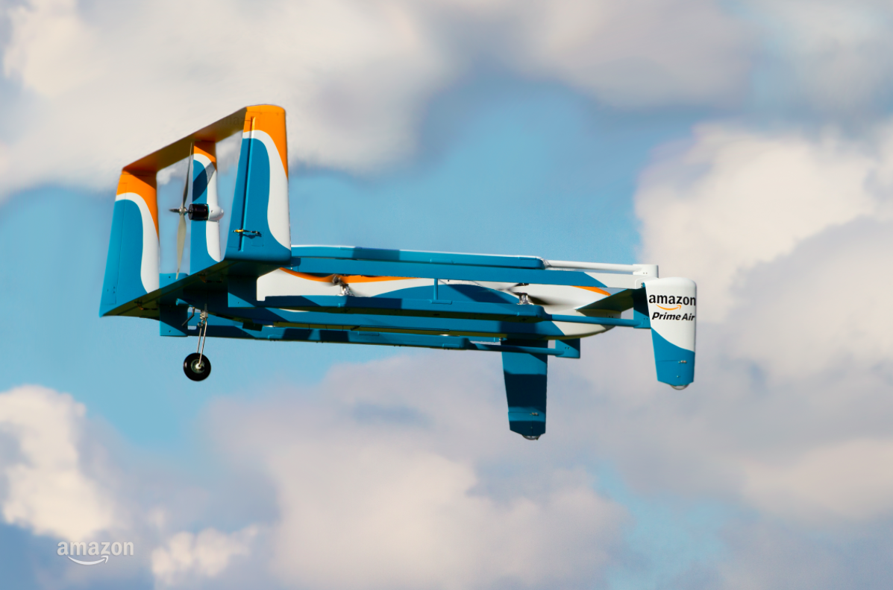

2. 샤오미의 5만원짜리 블랙박스.  
http://m.post.naver.com/viewer/postView.nhn?volumeNo=3086731
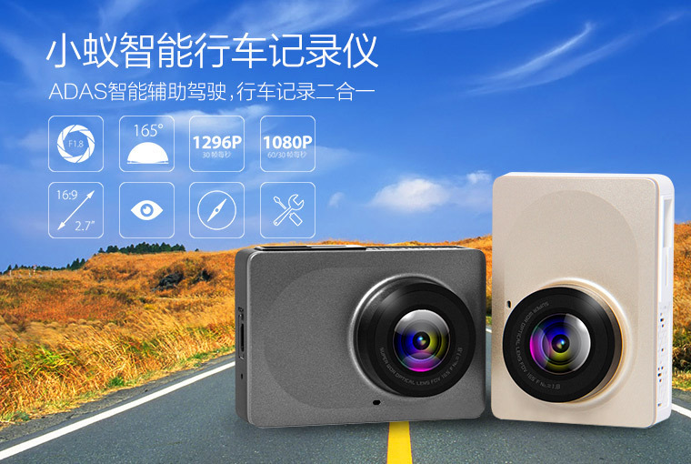

3. 어쿠스틱 기타 연주 녹음을 손쉽게 해주는 마이크
http://techholic.co.kr/archives/44225
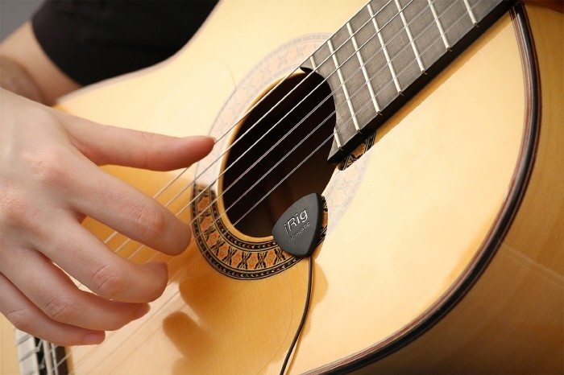

4. 보조배터리 겸용 손난로
http://techholic.co.kr/archives/44990

5. 휴대하기 편한 접이식 노트북 테이블
http://techholic.co.kr/archives/44617

6. 걸으면서 충전되는 스마트 깔창
http://techholic.co.kr/archives/44404
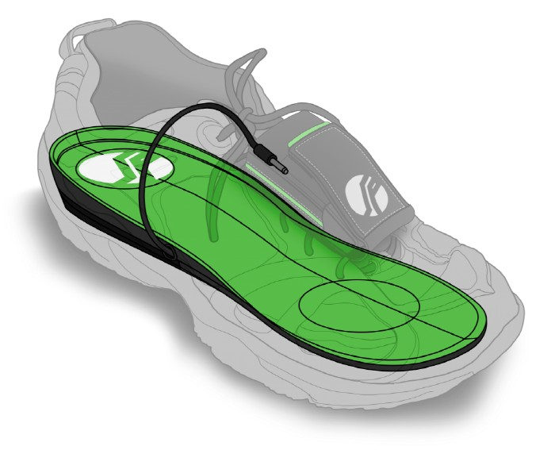

7. 고프로용 다면체 스탠드. 간단하게 다양한 방향으로 세울 수 있음. 
http://techholic.co.kr/archives/44509
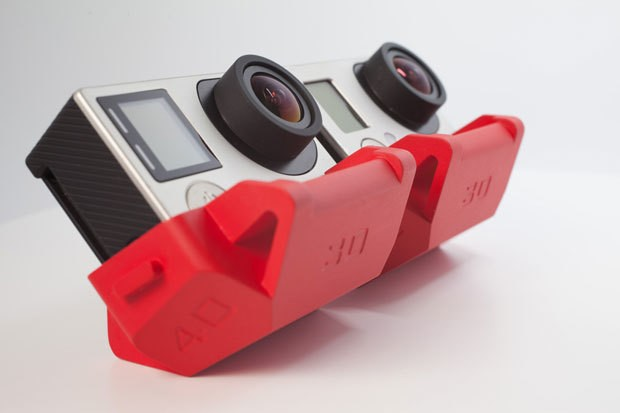

8. 렌즈가 없는 초박형 카메라.
렌즈없이 센서에서 직접 읽은 광학 정보를 컴퓨터로 처리하여 이미지 생성. 
http://techholic.co.kr/archives/45093
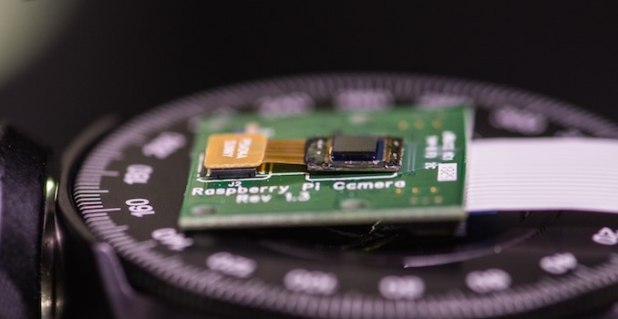

9. 상점앞에 지나다니는 유동인구를 분석해주는 기기
http://techcrunch.com/2015/12/03/placemeters-new-sensor-helps-business-owners-measure-traffic-in-front-of-their-stores/?ncid=rss&utm_source=feedburner&utm_medium=feed&utm_campaign=Feed%3A+Techcrunch+%28TechCrunch%29&sr_share=facebook
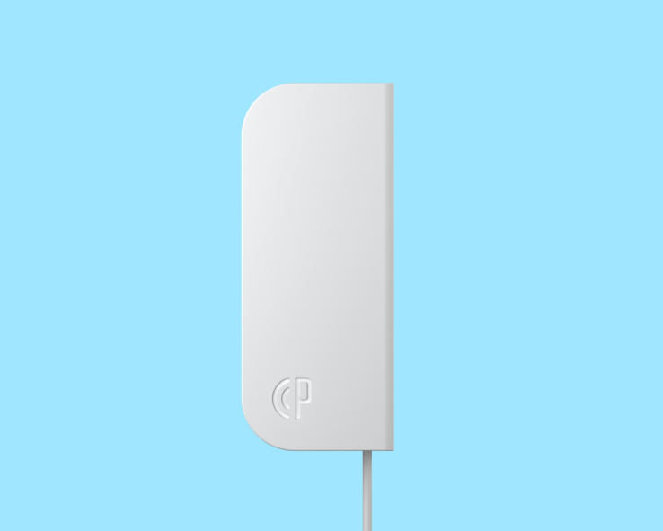

10. 프로펠러가 기기안에 들어있는 새로운 형태의 드론.
http://www.digitaltrends.com/cool-tech/fleye-wants-worlds-safest-drone/?utm_content=bufferd9f5e&utm_medium=socialm&utm_source=facebook.com&utm_campaign=DT-FB
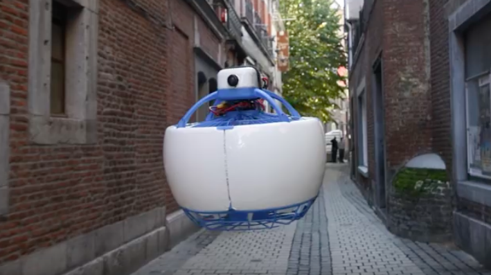

11. 무릎관절이 움직이는 에너지를 복원해 걸음을 쉽게 해주는 기기.
http://www.digitaltrends.com/cool-tech/world-first-bionic-knee-brace-levitation/
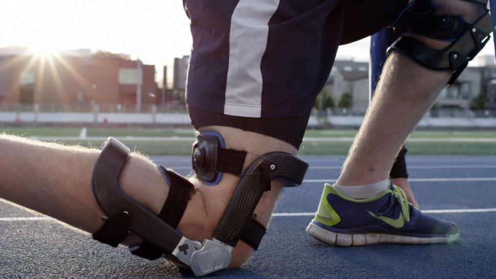

12. 웨어러블 디바이스에서 사용하는 회전 베젤 악세서리.
https://www.youtube.com/watch?v=KmmbUkt_8Dw
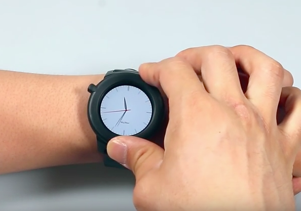

13. 사람이 타는 1인용 드론
http://www.digitaltrends.com/cool-tech/singapore-first-personal-flying-machine/?utm_content=buffer7bc4a&utm_medium=socialm&utm_source=facebook.com&utm_campaign=DT-FB
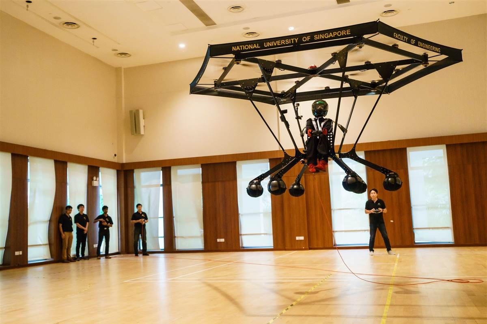

