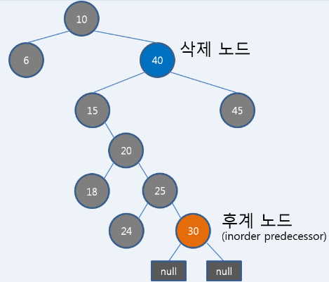

  
  
# Red-Black Tree general  
> 제 1 부  

-----  
  
>                          작성 : 김지훈 (ji_hun.kim@samsung.com)  
  
RB Tree의 가장 복잡한 연산인 삽입과 삭제가 어떤 원리로 동작 하는지 알아본다.  
경우의 수만 잘 따지고 그때그때 어떻게 해주는지 규칙만 알면 된다.  
  
> 목차  
0. RB tree의 5가지 규칙  
1. 삽입 연산  
2. 삭제 연산  
3. References  
  
  
  
## 0. RB tree의 5가지 규칙  
-----  
  
1) A node is either red or black  
2) The root is black  
3) All leaves (NULL) are black  
4) Both children of every red node are black  
> 레드 노드는 중첩될 수 없다.  
  
5) Every simple path from root to leaves contains the same number of black nodes.  
> Black Height가 같다.  
  
  
## 1.삽입 연산  
-----  
  
  
  
  
경우의수   
  
검은색에 삽입 / 빨간색에 삽입 두가지가 있는데   
  
```txt  
새노드 삽입 insert_case1() 수행  
  
-검은색에 삽입 -> 문제가 되지 않음   
-빨간색에 삽입   
	(1) 삼촌도 빨간색인 경우 insert_case3(n)  
		부모,삼촌 검은 색, 할아버지 빨간색으로   
	(2) 삼촌이 검은색인 경우 (여기서 삼촌은 할아버지의 오른쪽 자식으로 가정)  
    		1) 삽입노드가 부모노드의 오른쪽 자식인 경우 insert_case4(n)  
			삽입노드와 부모노드를 회전시켜 부모노드를 삽입노드의   
			왼쪽 자식으로 만든다.  -->  2)과 구조가 됨  
    		2) 삽입노드가 부모노드의 왼쪽 자식인 경우 insert_case5(n)   
			부모노드를 검은색 할아버지 노드를 빨간색으로 바꾸고  
			오른쪽회전 (부모노드가 루트위치로)  
```  
  
수도 코드  
  
```c  
insert_case1(n)  
{  
	if (부모노드가 없는경우) -> n을 블랙 (루트노드가됨)  
	else (부모노드 있으면)  
		insert_case2(n) 수행  
}  
```  
  
```c  
insert_case2(n)  
{  
	if ( 부모노드가 블랙인경우 ) 
		그냥 삽입해도 문제 안되므로 return  
	else(부모노드 빨강)  
		insert_case3(n) 수행		  
}  
```  
  
```c  
insert_case3(n)  
{  
   	if( 삼촌노드 빨간색이면 && 삼촌노드 있으면)  
		부모,삼촌노드 검은색으로  
		할아버지노드 빨간색으로  
		insert_case1( 할아버지노드)   " 재귀적으로 수행 !!"  
	else  "그외 나머지 경우 (삼촌 노드가 검정색 || 삼촌노드 없으면)"  
		insert_case4 (n)  
}  
```  
  
```c  
 "case5 함수를 수행할 구조로 만드는 작업"  
insert_case4(n) 
{	  
	if (부모노드가 할아버지 노드의 왼쪽자식 && 새노드가 부모노드의 오른쪽자식 )  
		rotation_left(부모노드)	  
		n = n->왼쪽노드  
	if(부모가 할아버지의 오른쪽 자식 && 새노드가 부모 노드의 왼쪽 자식)					  
		rotation_right(부모노드);  
		n = n->오른쪽노드  
  
	둘다 아니거나 위내용을 수행했으면  
	insert_case5(n) 수행  
  
}  
```  
  
```c  
 "case5 함수를 수행할 특정 구조가 되었다는 뜻"  
insert_case5(n) 
{  
	부모는 검은색으로 할아버지는 빨간색으로   
	if ( 부모가 할아버지의 왼쪽자식 && n이 부모의 왼쪽자식 )  
		rotation_right( 할아버지 노드)  
	else (부모가 할아버지 오른쪽 자식 && n이 부모의 오른쪽 자식 )  
		rotation_left( 할아버지 노드)  
  
}  
```  
  
  
회전연산은 매개변수로 전달된 노드의 자식을 치켜세워주는 연산 : 자식이 위로 부모는 아래로.   
  
  
  
  
  
  
  
    
    
    
    
## 2. 삭제 연산  
----    
    
	    
    
### 2.1. 삭제되는 노드 처리    
    
삭제되는 노드에 대체되는 노드를 복사한다.    
색은 삭제되는 노드색을 유지함.  노드만 바로 복사됨.     
    
대체될 수 있는 후계자는 이진트리 삭제와 마찬가지로 left 하위트리 에서 가장 큰 노드인데    
(삭제 노드의 왼쪽sub트리는  Inorder Predecessor 오른쪽은 Inorder successor라고 표현함)    
보통 맨 아래 노드이고 (leaf node가 1개와 Null leaf1개) 이거나 (Null leaf만 두개)인 경우밖에 없다.   
중요한건 이 대체되는 후계 노드가 그 자리에서 삭제 된다는것인데     
이때 RB트리의 규칙이 무너지는 경우가 있기 때문에     
대체되는 노드를 기준으로 아래 2번의 알고리즘을 따르게 된다.    
    
아래에서 n은 대체될 노드의 자식이다.     
일반 노드가 될 수 도 있고 Null leaf(검은색)가 될수도 있음)    

즉 트리에서 삭제되는 노드 기준으로 트리 balancing동작을 시키는 것이 아니라  
후계자 노드 기준으로 balancing동작 수행함.  
    
그림 참고      
      
      
    
### 2.2. 후계자 노드 처리    
    
후계 노드가 삭제되는 것으로 판단하면 되며     
후계 노드가 빨간색일 경우와 검은색일 경우에 따른 케이스    
아래 형제,부모,조카는 대체될 후계 노드 기준으로 위치한 노드임.    
(실제로는 대체될 후계노드의 자식노드기준으로 볼 수도 있는데. 그이유는 대체될 노드는    
삭제노드 위치로 변경되고 대체될 노드의 자리에는 어차피 그 노드의 자식노드가 위치할 것이기 때문이다.)    
    
```txt    

- 후계노드가 빨간색 -> 문제 없음    
- 후계노드가 검은색     
	- 형제가 빨간색인 경우 delete_case2(n)    
	- 형제가 검은색인 경우    
		(3) 부모노드 검은색, 형제의 양쪽 자식이 모두 검은색 :  delete_case3(n)    
			->형제노드만 빨간색으로    
		(4) 부모노드는 빨간색, 형제의 양쪽 자식이 모두 검은색 : delete_case4(n)    
			->형제:빨간색 부모:검정색    
		(5) 삭제노드와 가까운 조카노드가 빨간색일때 : delete_case5(n)    
			-> 형제와 조카노드 색교환, 형제기준 조카노드를 올리는 방향의 회전    
			(아래 case6 조건으로 변경됨)    
		(6) 삭제노드와 먼 조카노드가 빨간색 (가까운조카색 관계없음) : delete_case6(n)    
			형제는 부모노드 색으로, 부모는 검은색으로     
			멀리있는 조카노드 검은색으로    
			부모노드 기준 형제를 올리는 방향의 회전     
```    
    
- 삭제되는 후계자 노드 위치 기준으로 delete_one_child() 부터 시작

```c    
 "여기서 n은 실제 트리에서 제거될 후계 노드의 자리를 차지하게 될 노드임에 주의"    
delete_one_child(n)     
{    
	child = is_leaf() "n의 자식"     
    
	child(n의 자식)를 삭제될 n(후계노드)있던 자리로 변경    
	if( n == 블랙)    
		if ( child == 레드)    
			child 블랙으로 변경    
		else    
			delete_case1(child) 호출 
			"n의 자식으로 case 1 부터 start!"    
			"여기서 child의 위치는 후계노드의 원래 위치와 동일함"  
}    
```    
    
```c    
 "여기서 n은 대체노드의 자식노드 child임에 주의"    
delete_case1(n)    
{    
	if (삭제노드의 부모가 NULL이 아니면)    
		delete_case2(n) 호출    
}    
```    
    
```c    
 "형제를 검은색, 부모를 빨간색으로 바꾸고 left/right회전!"    
delete_case2(n)
{    
	if (형제 == 레드)     
		부모노드를 빨간색, 형제노드를 검은색 변경    
		if ( n == 부모의 왼쪽자식)    
			rotation_left(부모노드)    
		else    
			rotation_right(부모노드)	    
			    
	delete_case3(n) 호출    
}    
    
```    
    
```c    
delete_case3(n)    
{    
	if (형제==블랙 && 부모==블랙 && 형제 좌/우 자식==블랙)    
		형제를 빨간색    
		deletion_case1(부모노드) 호출    
	else    
		deletion_case4(n) 호출    
}    
```    
    
```c    
delete_case4(n)    
{    
	if (형제==블랙 && 부모==레드 && 형제 좌/우 자식==블랙)    
		형제를 빨간색    
		부모를 검정색으로     
	else    
		deletion_case5(n) 호출    
	    
}    
```    
    
```c    
delete_case5(n)	//case6 를 수행할 구조로 만드는 작업    
{    
	if (형제 == 블랙)    
		if (n이 부모노드의 왼쪽자식 && 형제 오른쪽자식==검정 && 형제 왼쪽자식==빨강)    
			형제노드 빨간색으로    
		 	형제 왼쪽 자식 검은색으로     
			rotation_right(형제노드)	    
		else if (n이 부모노드의 오른쪽 자식 && 형제 왼쪽자식==검정 && 형제 오른쪽자식==빨강)    
			형제노드 빨간색으로    
		 	형제 오른쪽 자식 검은색으로     
			rotation_left(형제노드)    
    
	deletion_case6(n) 호출    
}    
```    
    
```c    
delete_case6(n)    
{    
	형제색 = 부모의 색으로    
	부모색 = 검정색으로    
	if (n이 부모의 왼쪽 자식이면)    
		형제의 오른쪽자식 검정색 으로    
		rotation_left(부모노드)    
	else "n이 부모의 오른쪽 자식"    
		형제의 왼쪽자식 검정색 으로    
		rotation_right(부모노드)    
}    
```    
    
    
    
    
    
    
3. References  
------  
https://www.cs.usfca.edu/~galles/visualization/RedBlack.html  
https://en.wikipedia.org/wiki/Red-black_tree   
