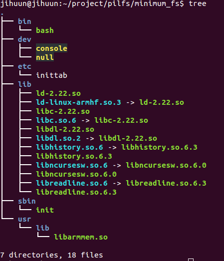

--------------------

# 0. 사전조사  

## 0.1. ``(참고)`` Base LFS SD-Card Image 를 sd card에 설치하기.  
이미 만들어놓은 공식 pilfs 이미지.  

````````````````````sh
 $ fdisk 및 mkfs.ext4 이용 sd card포맷.
 $ dd bs=4M if=pilfs-base-rpi2-20150811.img of=/dev/sdx //pilfs 이미지 설치
````````````````````
http://www.intestinate.com/pilfs/images.html  

--------------------
--------------------


## 0.2.``(참고)`` 라즈베리파이에서 부팅 가능한 img만들기 (나만의 img파일 만들기)  

- __Sd card 포맷__  

````````````````````sh
 $ sd card 마운트  
 $ fdisk /dev/sdc (디스트 삭제)
````````````````````

- __파티션 생성-> boot,루트파일시스템__  

````````````````````sh
 $ fdisk /dev/sdc
	첫번째 파티션 생성
	n
	p
	1
	enter(using first sector)
	+50M
	a
	t
	b (fat 32)
	두번째 파티션 생성
	n
	p
	2
	enter(using second sector)
	enter(using remeins all of sector)
	t
	83(linux)
````````````````````

- __파일시스템 포맷__  

````````````````````sh
 $ mkdosfs -F 32 -n Pi-boot -v /dev/sdc1
 $ mkfs.ext4 -m 1 -L MyLFS /dev/sdc2
````````````````````
- __마운트__  

````````````````````sh
 $ mount /dev/sdc1 /mnt/rasp0
 $ mount /dev/sdc2 /mnt/rasp
````````````````````

- __기존 pilfs이미지 마운트__  
  boot 관련 파일이나 루트파일시스템 파일들 복사 목적

````````````````````sh
 $ fdisk -l pilfs-base-rpi2-20150811.img
 $ mount pilfs-base-rpi2-20150811.img -o loop,offset=$((512*2048)) /mnt/tmp1/
 $ mount pilfs-base-rpi2-20150811.img -o loop,offset=$((512*98304)) /mnt/tmp2/
````````````````````
> 자세한 방법은 9장 참고.  

- __내용물 통째 복사__  

````````````````````sh
 $ cp -vpr /mnt/tmp1/* /mnt/rasp0/
 $ cp -vpr /mnt/tmp2/* /mnt/rasp/
````````````````````

- __my-pilfs.img 이미지 파일 만들기__  

````````````````````sh
 $ dd if=/dev/sdc of=my-pilfs.img bs=1M count=950
````````````````````

이후에는 /dev/sdc2을 나만의 루트파일시스템으로 변경 가능.  


--------------------
--------------------

## 0.3. ``(참고)`` 라즈베리파이용 커널 CROSS build 하고 커널 교체하기.  


- __소스코드 다운로드__  

````````````````````sh
 $ wget https://github.com/raspberrypi/linux/archive/rpi-4.1.y.tar.gz
````````````````````

- __defconfig이용 커널 빌드__  

````````````````````sh
 $ make ARCH=arm CROSS_COMPILE=arm-linux-gnueabi- mrproper
 $ make ARCH=arm CROSS_COMPILE=arm-linux-gnueabi- bcm2709_defconfig
 $ make ARCH=arm CROSS_COMPILE=arm-linux-gnueabi-
````````````````````

- __kernel교체__  

````````````````````sh
 $ mount /dev/sdc1 /mnt/temp/
 $ mv /mnt/temp/kernel7.img /mnt/temp/kernel7.img.back
 $ cp arch/arm/boot/zImage /mnt/temp/kernel7.img
````````````````````
이후 재부팅 uname -a 빌드날짜 확인. -> 교체완료  


--------------------
--------------------
# 1. 루트파일시스템 구축 From Scratch  

위에서 설치한 Base LFS SD-Card Image 시스템에서 SD카드의 두번째 파티션(루트파일 시스템)을 새롭게 구축하기.  
필요한 라이브러리 등은 Base LFS SD-Card img의 root fs 내용을 복사해 올것임.  

1.1. Basic File System 구성.  
1.2. Busy Box 설치  
1.3. System V Init 설치.  

참고 파일(Ramdisk를 이용한 root FS) - 여기서는 ramdisk를 만들진 않음   
https://www.google.co.kr/url?sa=t&rct=j&q=&esrc=s&source=web&cd=1&ved=0CCIQFjAAahUKEwiX0L6-lIDIAhVlKqYKHeBqAYM&url=http%3A%2F%2Fcfile219.uf.daum.net%2Fattach%2F26255937553F1A5F105F76&usg=AFQjCNF794qAdOvD6Cos175l2SEvbVqUaw&sig2=hluKZibdy5NNIUEFn4qpeg&cad=rja  

https://emreboy.wordpress.com/2012/12/20/building-a-root-file-system-using-busybox/  

--------------------
## 1.1. Basic File System 구성.  

- __FSH 구성하기__  

````````````````````sh
mkdir /home/jihuun/project/pilfs/rootfs
ROOTFS=/home/jihuun/project/pilfs/rootfs
cd ${ROOTFS}
mkdir bin dev etc lib proc sbin tmp usr var
chmod 1777 tmp
mkdir usr/bin usr/lib usr/sbin
mkdir var/lib var/lock var/log var/run var/tmp
mkdir root
chmod 1777 var/tmp
````````````````````


- __일단 기존 pilfs에서 쓰던 라이브러리 모두 복사.__  

````````````````````sh
mount /dev/sdc2 /mnt/temp/
cd /mnt/temp/lib/
cp *-*.so $ROOTFS/lib
cp -d  *.so.[*0-9] $ROOTFS/lib
cp libSegFault.so libmemusage.so libpcprofile.so $ROOTFS/lib/
````````````````````
> 나중에 busybox에 필요한 라이브러리만 복사필요.


--------------------

## 1.2. Busy Box 설치  


- __현재 최신버전 1.23.2 다운로드__  

````````````````````sh
wget http://www.busybox.net/downloads/busybox-1.23.2.tar.bz2
````````````````````


- __CROSS 빌드__  

````````````````````sh
 $ make ARCH=arm CROSS_COMPILE=arm-linux-gnueabi- defconfig
 $ make ARCH=arm CROSS_COMPILE=arm-linux-gnueabi- menuconfig
 	Build Options 에서 Cross Compiler Prefix에 arm-linux-gnueabi- 입력
 $ make CONFIG_PREFIX=$ROOTFS all install
````````````````````
> CONFIG_PREFIX= install할 디렉터리(루트파일시스템에) 설정.  
> init 프로그램 제거 설정 찾아서 삭제필요.  
> http://yjaeseok.tistory.com/299


> 참고  
> busybox에 필요한 라이브러리 확인해서 복사하기.  
> $ objdump -p 로 확인. (여기선 모든 라이브러리를 복사했기때문에 상과없음)  
> busybox 를 static으로 컴파일 했다면 lib복사는 필요없음.  


## 1.3 System V init설치  

- __2.86 다운로드__  

````````````````````sh
 $ wget ftp://ftp.cistron.nl/pub/people/miquels/sysvinit/sysvinit2.86.tar.gz
 $ tar -jxvf sysvinit2.86.tar.gz
````````````````````

- __CROSS빌드__  

````````````````````sh
cd sysvinit2.86/src/
make CC=arm-linux-gnueabi-gcc
````````````````````

- __crypt에러__  

````````````````````sh
sulogin.c:(.text.startup+0x284): undefined reference to `crypt'
collect2: error: ld returned 1 exit status
make: *** [sulogin] Error 1
````````````````````
> patch -Np1 -i ../sysvinit-2.88dsf-consolidated-1.patch 로 해결.  


- __install__  

````````````````````sh
cd $ROOTFS/
mkdir usr/include
mkdir -p ./usr/share/man/man1
mkdir -p ./usr/share/man/man5
mkdir -p ./usr/share/man/man8
cd sysvinit2.86/src/ (다시 빌드 소스로이동)
make ROOT=$ROOTFS install
````````````````````


## 1.4. 디바이스 파일생성.  
- ____

````````````````````sh
mknod -m 600 ${ROOTFS}/dev/mem c 1 1
mknod -m 666 ${ROOTFS}/dev/null c 1 3
mknod -m 666 ${ROOTFS}/dev/zero c 1 5
mknod -m 644 ${ROOTFS}/dev/random c 1 8
mknod -m 600 ${ROOTFS}/dev/tty0 c 4 0
mknod -m 600 ${ROOTFS}/dev/tty1 c 4 1
mknod -m 600 ${ROOTFS}/dev/ttyS0 c 4 64
mknod -m 666 ${ROOTFS}/dev/tty c 5 0
mknod -m 600 ${ROOTFS}/dev/console c 5 1
mknod -m 660 ${ROOTFS}/dev/ram0 b 1 0
````````````````````


## 1.5. 부트스크립트 설정.  

->>>잘 안됨!!  

http://www.intestinate.com/pilfs/guide.html  
piLFS bootscript를 이용할것임.  

wget http://www.intestinate.com/pilfs/scripts/pilfs-bootscripts-20150610.tar.xz

Makefile 수정 (설치 경로 변경).  
DESTDIR 를 ROOTFS로 .


- ____

````````````````````sh
make install-networkfix install-swapfix install-fake-hwclock install-switch-cpu-governor
````````````````````
> http://www.intestinate.com/pilfs/guide.html  10번 항목 참고


mkdir init.d rc0.d rc1.d rc2.d rc3.d rc4.d rc5.d rc6.d rcS.d
cp /mnt/ramdisk_test/etc/rc.d/rcS.d/S20swap $ROOTFS/etc/rc.d/rcS.d/S20swap
cp /mnt/ramdisk_test/etc/rc.d/rcS.d/S60swap $ROOTFS/etc/rc.d/rcS.d/S60swap


inittab , fstab 설정.  


--------------------
--------------------
# 2 다시하기: minimum root filesystem 구축  

참고링크 -> http://linuxguide.sourceforge.net/linux-minimal-filesystem.html  
raspbian의 rootfile system 에서 최소한으로 복사해서 만들기.


## 2.1. pilfs base의 rootfile system 을 마운트하기.  

## 2.2. sbin/init etc/inittab dev/* 를 /dev/sdc2를 마운트하고 복사. 딱 저것만 넣고 부팅.

## 2.3. ldd sbin/init했을때 다이나믹 라이브러리가 필요하면 해당하는 /lib도 복사해야함.
	Pilfs로 부팅해서  
````````````````````sh
$ ldd /sbin/init
	linux-vdso.so.1
	/usr/lib/libarmmem.so
	libc.so.6 => /lib/libc.so.6
	/lib/ld-linux-armhf.so.3
````````````````````
이렇게 나오므로 해당 라이브러리 복사해야함.  
(심볼릭링크 이름이랑 원본 모두 복사해야함)  
````````````````````sh
$ cp -apv libc.so.6 libc-2.22.so /home/jihuun/project/pilfs/minimum_fs/lib/
$ cp -apv libarmmem.so /home/jihuun/project/pilfs/minimum_fs/usr/lib/
$ cp -avp ld-2.22.so ld-linux-armhf.so.3 /home/jihuun/project/pilfs/minimum_fs/lib/
````````````````````

linux-vdso.so는 복사할 필요없음. 아래참고.  
> The lib linux-vdso.so ( as well as linux-gate.so) is not going to be found.
> It is a virtual Dynamically Shared Object and part of the kernel. You may
> want to take a look at this:
> http://www.trilithium.com/johan/2005/08/linux-gate/  

## 2.4. 부팅
init은 넘어감.

## 2.5. inittab수정.
````````````````````sh
# Begin /etc/inittab

id:3:initdefault:
x:3::/bin/bash

# End /etc/inittab
````````````````````
> 11.번에서 보겠지만 참고링크에서 소개한 방법엔  action field 가 빠졌음.-> bash실행 실패함.  

## 2.6. 부팅 -> kernel panic no working init found..
-> 3번(init)의 lib복사를 안해서 그랬었음.  
-> 다시 부팅하면 Init통과. 아래로그 참고  

````````````````````log
...
INIT: version 2.88 booting
INIT: /etc/inittab[4]: missing action field
INIT: Entering runlevel:3
INIT: no more processes left in this runlevel
````````````````````
> /bin/bash가 없어서 더이상 진행이 안되는듯.  


## 2.7. /bin/bash 복사.
-> 부팅하면 위와 로그 똑같음.  

## 2.8. bash의 library 복사.
pilfs로 부팅 후.  

````````````````````sh
$ ldd /bin/bash
	linux-vdso.so.1
	/usr/lib/libarmmem.so
.	libreadline.so.6 => /lib/libreadline.so.6
.	libhistory.so.6 => /lib/libhistory.so.6
.	libncursesw.so.6 => /lib/libncursesw.so.6
.	libdl.so.2 => /lib/libdl.so.2
	libc.so.6 => /lib/libc.so.6
	/lib/ld-linux-armhf.so.3
````````````````````
> 3번에서 안한거 복사.  
> (심볼릭링크 이름이랑 원본 모두 복사해야함)  
````````````````````sh
$ cp -avp libreadline.so.6 libreadline.so.6.3 /home/jihuun/project/pilfs/minimum_fs/lib/
$ cp -avp libhistory.so.6 libhistory.so.6.3 /home/jihuun/project/pilfs/minimum_fs/lib/
$ cp -avp libncursesw.so.6 libncursesw.so.6.0 /home/jihuun/project/pilfs/minimum_fs/lib/
$ cp -avp libdl-2.22.so libdl.so.2 /home/jihuun/project/pilfs/minimum_fs/lib/
````````````````````


## 2.9. 재부팅.  
안됨.  

## 2.10. fstab 복사.  
안됨.  
> 실제로는 fstab필요없음 ->삭제  


## 2.11. 문제수정. inittab 수정.  
부팅로그중.  
INIT: /etc/inittab[4]: missing action field  
이게 문제인듯.  

/etc/inittab 파일내용중 action 이 빠짐.  
x:3::/bin/bash  
> id:runlevels:action:process  

action에 적절한 명령 채워보기.  
(참고)http://manpages.ubuntu.com/manpages/hardy/ko/man5/inittab.5.html  

- __/etc/inittab 수정__  

````````````````````patch
- x:3::/bin/bash  
+ x:3:respawn:/bin/bash  
````````````````````


## 2.12. 재부팅.  
성공 -> bash-4.3# 화면에 뜸. 

다만 부팅로그중. 아래 로그는 확인필요.  

````````````````````sh
...
INIT: Entering runlevel: 3
bash: cannot set terminal process group (-1): Inappropriate ioctl for device
bash: no job control in this shell
bash-4,3# 
````````````````````

## 2.13. 최종 구성된 최소한의 파일들.  
  

