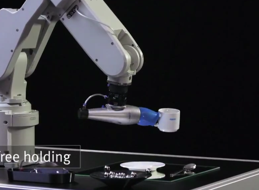
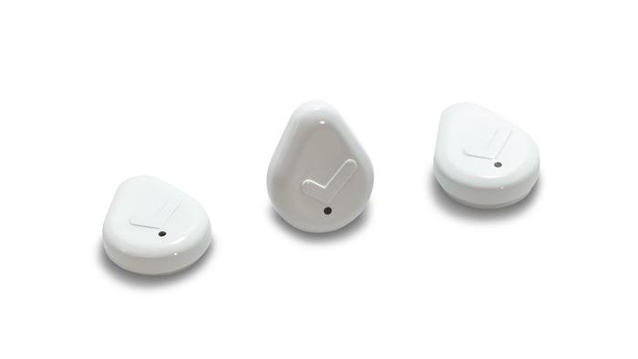
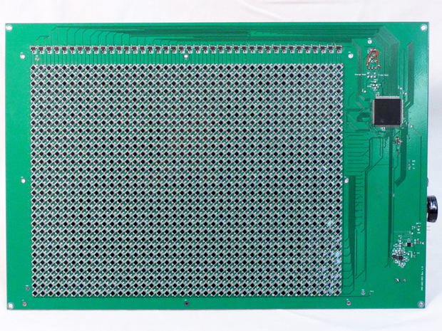
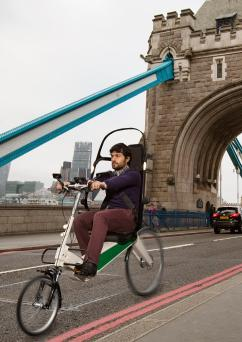
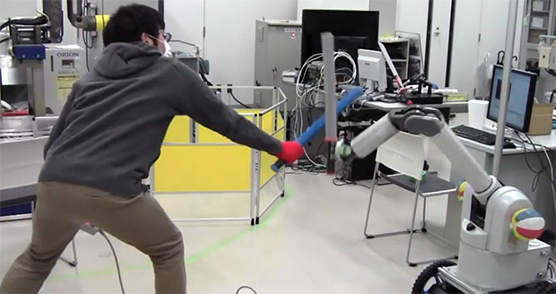

                              
---                                    
#150420  
> 2015년 16주차 **HOT DEVICE EVERY WEEK**                 
>                 
                                
---                                    
  
  
1. 자동화장 머신   
스마트폰앱으로 원하는 스타일을 선택한뒤 기기에 얼굴을 위치시키면 30초 정도면 화장을 끝내줌.  
인체무해한 전용 화장 파우더를 3D 프린팅이 응용된 기술로 얼굴에 인쇄.  
근데 솔직히 뻥같음.  
http://techholic.co.kr/archives/32125  
  
  
2. 어떠한 형태의 물체도 쉽게 잡을(Grip) 수 있는 로봇 손.  
카멜레온의 혀를 모방하여 만듦.   
다섯손가락의 손처럼 정교한 작업을 하기는 어렵겠지만 단순 집는 용도의 로봇손으로는 정말 획기적인 기술.  
https://youtu.be/m7l-87r4oOY  
  
  
3. 할일을 까먹지 않게 도와주는 기기  
해야할 물건이나 장소에 기기를 붙여놓으면 정해진 시간에 알림이 울림. 버튼을 눌러야 꺼짐.  
http://www.earlyadopter.co.kr/14591  
  
  
4. 맥북의 USB-C 단자를 표준 USB 단자로 바꿔주는 소형 어댑터  
http://macnews.tistory.com/m/post/3284  
  
  
5. 요리 해주는 로봇손.   
현재는 프로토타입 수준이며 2017년에 출시 예정  
http://www.geek.com/news/you-may-be-able-buy-a-robot-personal-chef-in-a-couple-years-1620317/  
  
  
  
6. 각 큐브형 모듈이 스스로 움직여 특정형태로 조립이 되는 로봇.  
https://www.youtube.com/watch?v=6aZbJS6LZbs  
http://newsoffice.mit.edu/2013/simple-scheme-for-self-assembling-robots-1004  
  
  
7. 손에끼는 블루투스 리모컨  
http://www.earlyadopter.co.kr/14404  
  
  
8. 따로 전원이 필요없이 무한정 동작하는 카메라.   
http://spectrum.ieee.org/tech-talk/consumer-electronics/audiovideo/selfpowered-video-camera-could-run-indefinitely-in-bright-light  
  
  
9. 주사바늘 없는 주사기  
http://www.cnet.com/news/simple-but-ingenious-invention-from-rice-university-takes-the-ouch-out-of-injections/  
  
  
10. 앉아서 운전하는 형태의 자전거  
https://www.indiegogo.com/projects/babel-bike#home  
  
  
11. 손가락에 착용하여 각종 디바이스를 제어할수 있는 입력기기  
http://www.sharedots.com/this-invention-from-india-is-going-to-change-way-we-live-forever-165.html  
  
  
12. 도난,분실 방지 기능이 달린 스마트 지갑  
http://www.earlyadopter.co.kr/14606  
  
  
13. 드럼을 이용한 music remix 머신   
http://www.wired.com/2015/04/clever-drum-machine-blends-physical-digital/?mbid=social_fb  
  
  
14. 칼싸움놀이 하는 로봇  
http://interestingengineering.com/sword-fighting-robot/  
  
  
  
15. 자동차에서 얼굴,표정,동작 등을 인식하여 안전사고를 미리 예방.  
http://www.engadget.com/2015/04/16/brains4cars-safety-system/?utm_source=Feed_Classic_Full&utm_medium=feed&utm_campaign=Engadget&?ncid=rss_full  
  
  
16. 스마트 무인 택배함  
https://www.kickstarter.com/projects/boxillion/boxillion-the-smartest-way-to-receive-deliveries?ref=category_newest  
  
  
17. 보다 리얼하게 스크린 골프를 즐길 수 있도록 스윙을 계산해주는 기기  
http://www.engadget.com/2015/04/17/optishot2-IRL/?utm_source=Feed_Classic_Full&utm_medium=feed&utm_campaign=Engadget&?ncid=rss_full  
  
  
18. 광 시야각을 가진 스마트폰용 VR 기기.   
본 기기 :150도/ 기어 VR : 60도   
https://www.kickstarter.com/projects/wearality/wearality-sky-limitless-vr?ref=category  
  
  
19. VR(가상현실) + AR(증강현실)  
전면 3D센서로 전방 손이나 물체를 감지하고 VR 기기에서 실제 증강현실을 보여줌.  
https://www.kickstarter.com/projects/impressionpi/impression-mobile-vr-ar-with-gesture-position-trac  
  
  
  
