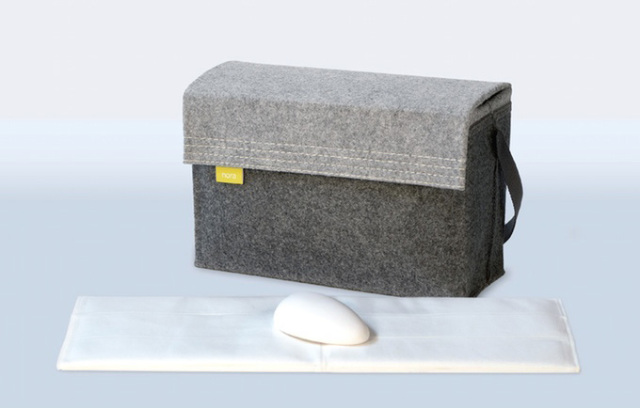
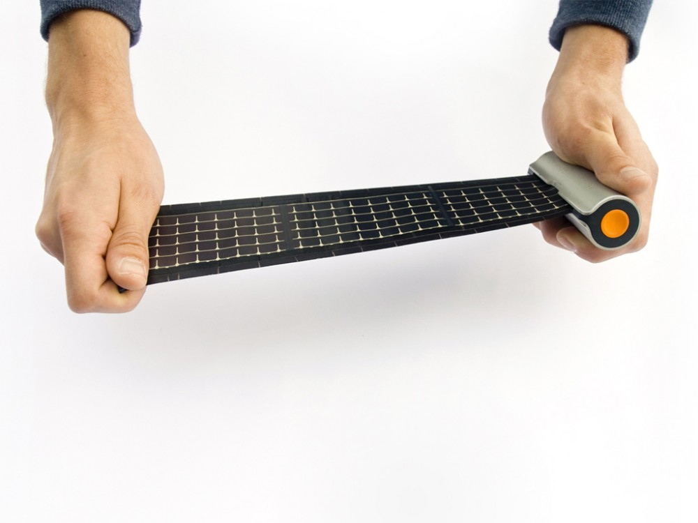
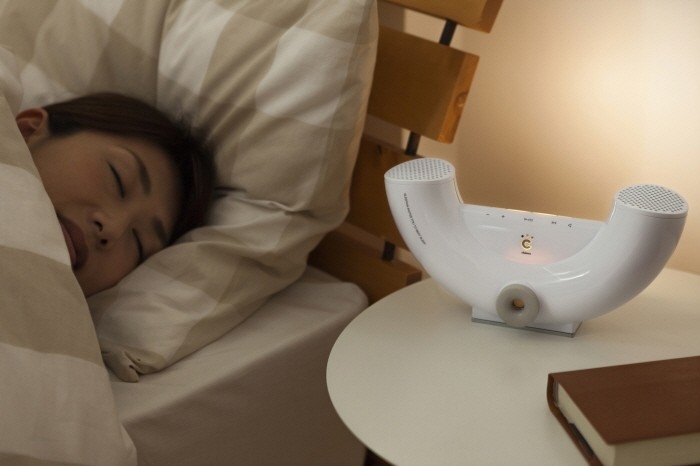
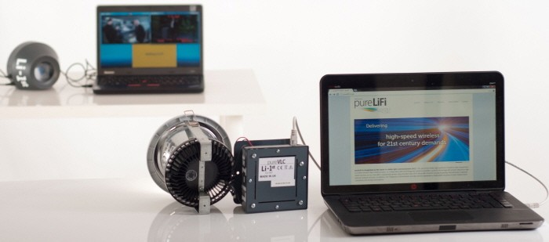
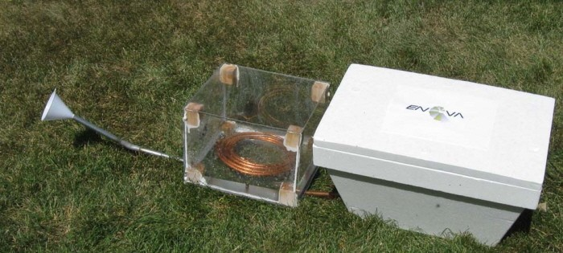
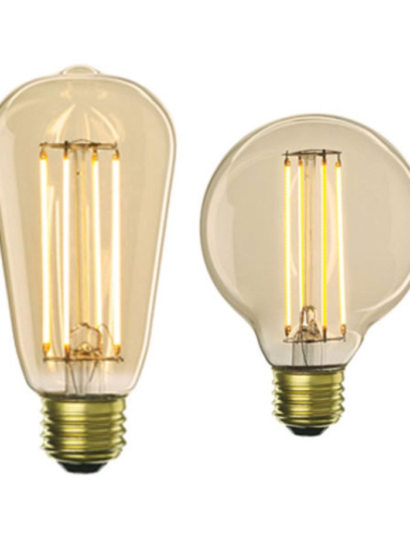
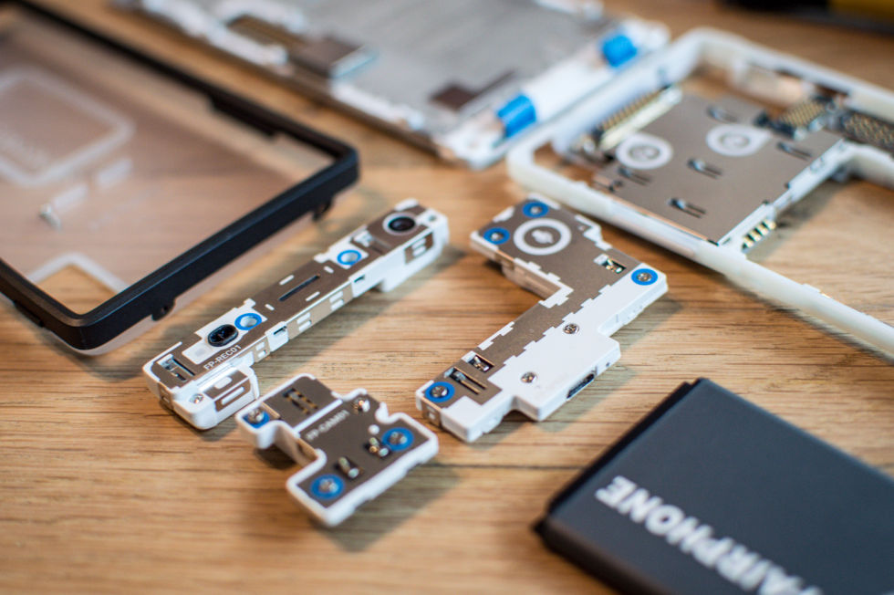

---  
#151026  
> 2015년 주차 **HOT PRODUCT EVERY WEEK**  
>   

---  

1. 청정원에서 만든 6가지 주방용 아이템들(왼쪽부터)
1) 소스의 굵기를 조절할 수 있는 뚜껑
2) 치즈 그레이터
3) 스피커 캡
4) 미니 텃밭(파나 허브등을 키울 수 있음)
5) 스파게티 보관함
6) 다지기 캡
http://www.earlyadopter.co.kr/65616

2. 코골이가 심한 사람들을 위한 기기.
배개 밑에 설치하여 코고는 소리에 따라 배게의 높낮이를 조절해줌.
http://www.earlyadopter.co.kr/65377

3. 스스로 움직이는 주사위
https://www.kickstarter.com/projects/556341540/bots-battleground-the-first-boogie-dice-based-game?ref=nav_search

4. 돌돌 말아서 가지고 다니는 태양광 충전기
http://interestingengineering.com/waacs-rollable-solar-charger-provides-green-energy-on-the-go/

5. 샤오미에서 출시한 세그웨이
http://www.engadget.com/2015/10/19/xiaomi-ninebot-mini-segway/

6. 건전지 없이 체온으로 키는 LED 손전등
http://hooc.heraldcorp.com/view.php?ud=20151021000908

7. 허공을 터치 스크린처럼 사용하는 손가락 컨트롤러.
http://techholic.co.kr/archives/42249

8. 소리, 빛, 향기를 이용해 숙면을 유도하는 기기
http://techholic.co.kr/archives/42396

9. 빛의 점멸을 이용해 통신하는(LI-FI) 기술을 이용해 동영상 스트리밍 전송을 가능케 한 기술
http://techholic.co.kr/archives/41595

10. 공처럼 굴러다니거나 4족 보행을 할 수 있는 로봇.
http://techholic.co.kr/archives/42320

11. 전기를 사용하지 않은 채 음식을 저장할 수 있는 냉장고
http://techholic.co.kr/archives/42614

12. 빈티지 에디슨 전구같이 보이는 LED전구
http://www.architecturaldigest.com/story/led-edison-bulbs?mbid=social_cp_facebook_wir

13. 안드로이드 앱을 PC환경으로 사용하게 해주는 MIPI PC 
멀티 윈도우, 상태바등을 이용할 수 있음.
https://www.jide.com/en/mini

14. 쉽게 각 부품을 분해 조립할 수 있는 모듈러 스마트폰
http://arstechnica.co.uk/gadgets/2015/10/fairphone-2-hands-on-modular-phones-are-finally-here/

15. AR디스플레이를 내장한 스마트 헤드폰
http://www.engadget.com/2015/10/20/the-ora-x-smart-headphones-include-a-flippable-ar-display/

16. 스마트폰을 활용한 3D 스캐너
http://uncrate.com/stuff/eora-3d-scanner/

