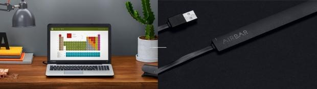
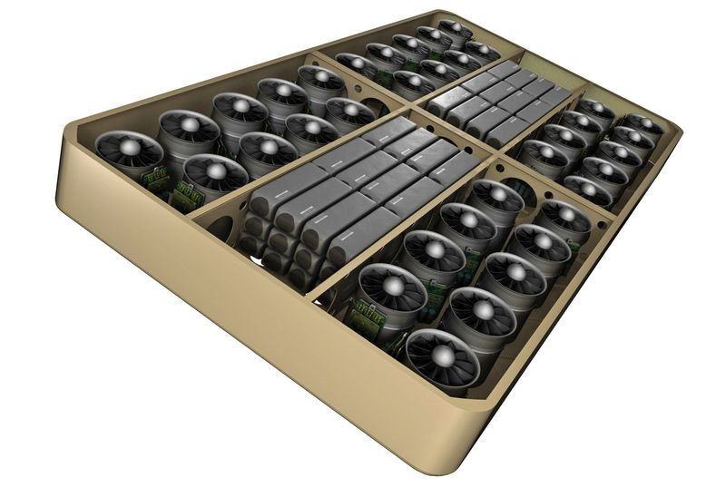
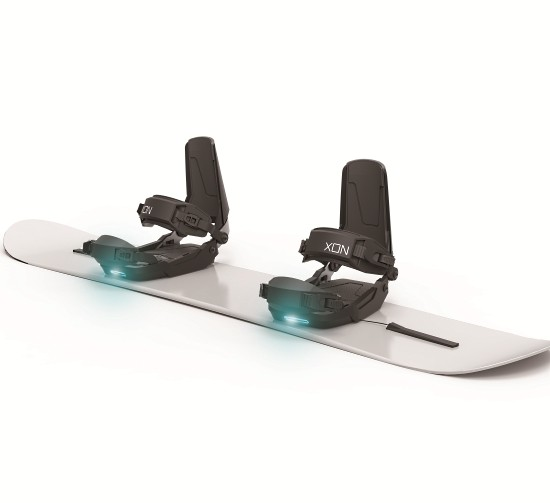
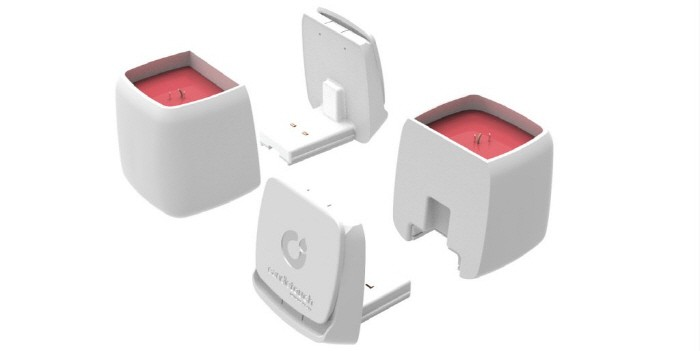
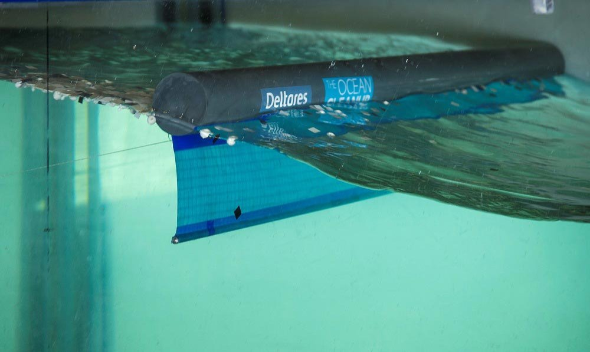

---  
#151228  
> 2015년 주차 **HOT PRODUCT EVERY WEEK**  
>   

---  

1. 노트북 스크린을 터치 스크린으로 만들어주는 기기
막대형태의 기기를 스크린 바로 아래 설치하여 사용.
(제품 홈페이지 주소도 인상적)
http://air.bar

2. 원하는 동작을 쉽게 학습시켜서 다양한 분야에 활용할 수 있는 로봇팔 (7bot)
책상위의 개인 비서로 활용가능할 듯. 가격도 $350 으로 저렴. 
http://www.cnet.com/news/robotic-arm-turns-your-desk-into-an-automated-assembly-line/

3. 전자기장의 변화를 감지하여 손가락의 공간좌표를 얻어내는 기술 
VR의 입력기기로 사용가능.
지금까지 손이나 손가락의 위치 인식은 주로 Camera(depth or vision)를 이용한 인식이었기에 한계가 많았음.
http://www.technologyreview.com/news/544946/in-the-future-magnets-may-track-your-fingers-in-virtual-reality/

4. 휴대용 목 안마기.
http://techholic.co.kr/archives/46011

5. 36개의 전기fan 을 이용해 만든 공중부양 호버보드
6분 비행 기능
http://www.theverge.com/2015/12/24/10663228/arcaspace-arcaboard-hoverboard-skateboard

6. 스마트폰 초음파 측정 악세서리
http://www.trendhunter.com/trends/ultrasound-imaging

7. 심박수를 낮춰서 숙면을 도와주는 기기
http://www.trendhunter.com/trends/sleep-device

8. 스마트 스노우 보드 바인딩 
가속도, 자이로스코프, 하중 센서등을 이용해 각종 정보를 기록.
http://techholic.co.kr/archives/45828

9. 드론에 설치하는 로봇팔 악세서리.
http://techholic.co.kr/archives/45403

10. 촛불을 원격으로 키고 끄는 스마트 캔들
http://techholic.co.kr/archives/43667

11. 거대한 띄를 둘러 해양 쓰레기를 모으는 장치
http://www.theoceancleanup.com/blog/show/item/deltares-tests-confirm-workability-of-boom-design.html

12. 몸에 차고 다니는 웨어러블 킥보드
http://www.earlyadopter.co.kr/67418

13. 스마트폰을 NFC 태그에 접촉함으로 쉽게 다떨어진 생필품을 주문할 수 있는 기기 (티몬 슈퍼태그)
http://corp.ticketmonster.co.kr/?p=962

14. 아웃도어 블루투스 스피커 터치펜 
http://www.podbbang.com/ch/10054?e=21857151

