  
---    
#150906    
> 2015년 36주차 **HOT DEVICE EVERY WEEK**    
>     
  
---    
  
1. 실제 움직이는 스타워즈 BB-8 장난감  
http://toyland.gizmodo.com/sphero-bb-8-review-this-is-the-coolest-star-wars-toy-e-1727067215  
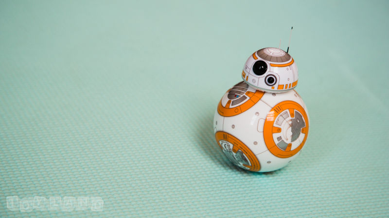  
  
2. 프로젝터로 등고선을 모래위에 투영 시켜주는 기술(UCLA)  
http://newsroom.ucla.edu/stories/make-it-rain-ucla-unveils-augmented-reality-teaching-sandbox  
  
  
3. 일반 전구색 주광색 두가지 색이 출력되는 전구(필립스)  
http://blog.naver.com/philips_led/220453287226  
  
  
4. 한번에 10가지 재료로 출력되는 멀티 3D프린터  
http://techholic.co.kr/archives/39496  
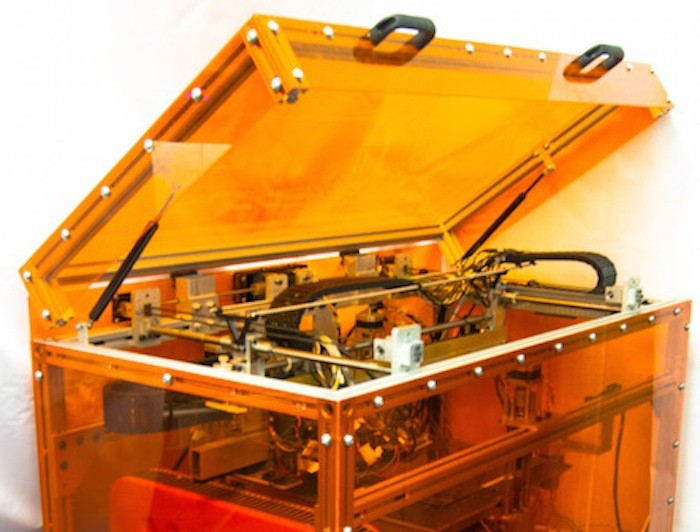  
  
5. TV주변에 비슷한 색상의 영상을 투영함으로써 더욱 몰입감을 주게하는 기기.  
http://gizmodo.com/my-eyes-cant-handle-the-insanity-of-the-philips-ambilux-1728806651?utm_campaign=socialflow_gizmodo_facebook&utm_source=gizmodo_facebook&utm_medium=socialflow  
  
  
6. 휴대용 LP 플레이어  
http://www.earlyadopter.co.kr/63393  
  
  
7. LG전자, 구형 가전을 스마트 가전으로 바꿔주는 센서   
http://biz.chosun.com/site/data/html_dir/2015/08/30/2015083000560.html  
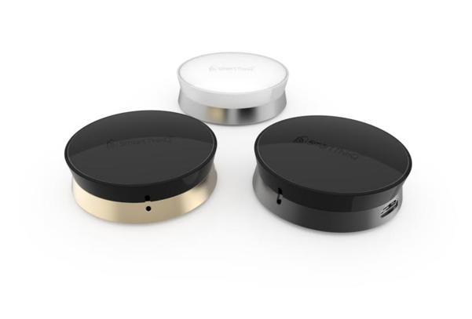  
  
8. 안경없이 3D 영상을 만드는 기술  
http://techholic.co.kr/archives/39476  
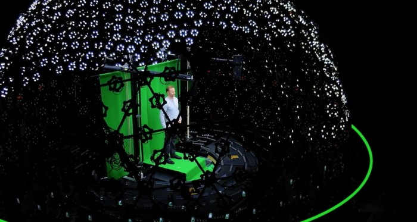  
  
9. 레이져로 드론 격추하는 기기(보잉)  
http://techholic.co.kr/archives/39514  
  
  
10. 전자장치가 시계줄에 내장된 스마트 워치(Sony)  
http://techholic.co.kr/archives/39551  
  
  
11. 스마트폰 음주 측정기  
http://techholic.co.kr/archives/38914  
  
  
12. 작고 가벼워 위급할때 사용할 수 있는 배터리  
http://techholic.co.kr/archives/39063  
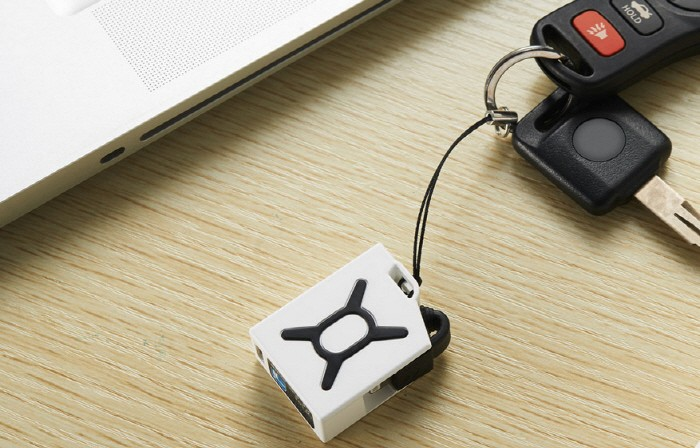  
  
13. 감싸서 신는 새로운 형태의 신발.  
http://funtenna.co.kr/220467075560  
  
  
14. 한개 바퀴로 달리는 스케이트 보드  
http://techcrunch.com/2015/09/01/hoverboard-technologies/?ncid=rss&utm_source=feedburner&utm_medium=feed&utm_campaign=Feed%3A+Techcrunch+%28TechCrunch%29&sr_share=facebook  
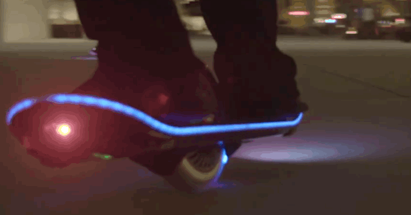  
  
15. 54개의 프로펠러로 만든 사람이 타는 드론  
http://mashable.com/2015/09/01/man-superdrone-54-propellers/?utm_cid=mash-com-fb-main-link  
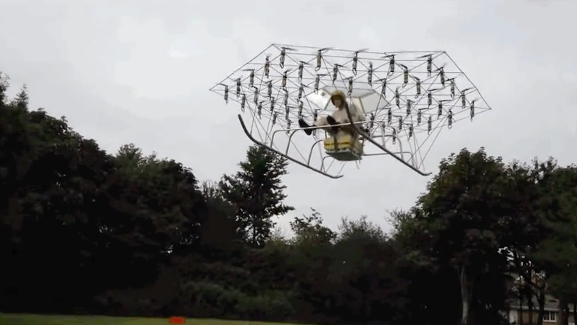  
  
16. 폴라로이드 디지털 즉석 카메라   
http://www.cnet.com/uk/news/polaroid-snap-is-a-pocket-sized-instant-print-camera/  
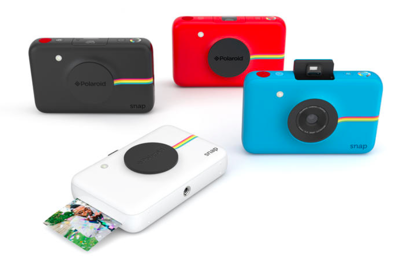  
  
17. 수면 측정 및 트래킹하여 다른 가전제품과 연결하는 기기  
http://www.engadget.com/2015/09/03/samsung-sleepsense/  
  
  
18. 자전거용 네비게이션  
http://techcrunch.com/2015/09/02/meet-haiku-a-nifty-bike-assistant-that-lets-you-keep-your-phone-in-your-pocket/?sr_share=facebook#.ugp8yw:3Tio  
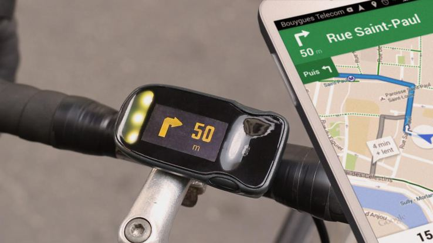  
  
19. 가상으로 화장을 해서 보여주는 스마트 거울  
http://mashable.com/2015/09/04/panasonic-magic-mirror/?utm_cid=mash-com-fb-main-link  
  
  
20. 수영용 피트니스 밴드  
http://www.cnet.com/uk/products/ihealth-wave/  
  
  
21. 가정용 데이터 저장소(WD)  
http://www.engadget.com/2015/09/02/wd-my-cloud-os-3/  
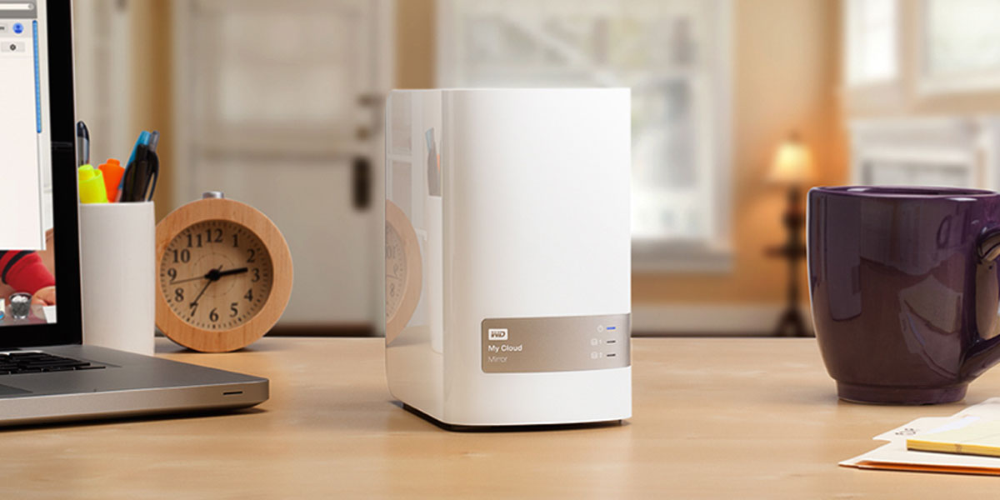  
  
22. 펜과 종이에 작성한 그대로 모바일로 전송해주는 기기(Wacom)  
http://www.engadget.com/2015/09/03/wacoms-bamboo-spark-smart-folio/  
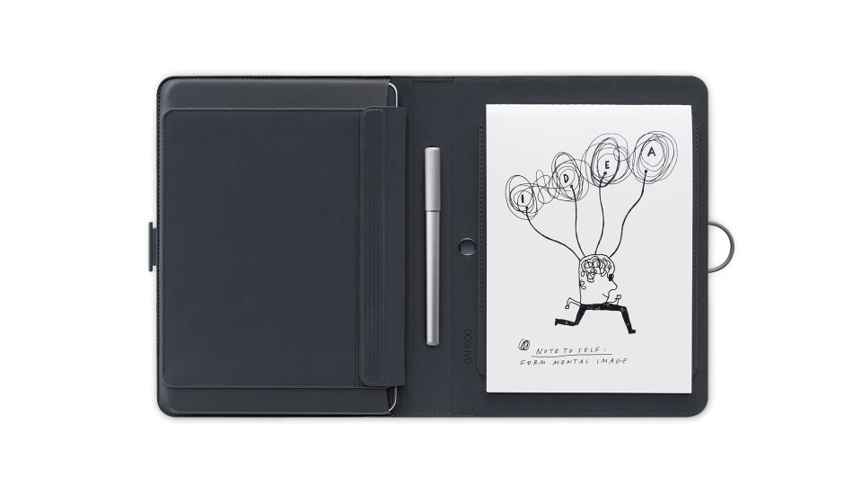  
  

---  
#150831  
> 2015년 35주차 **HOT DEVICE EVERY WEEK**  
>   

---  

1. 유리를 3D 프린팅 하는 기술 (MIT)  
http://matter.media.mit.edu/environments/details/g3dp  
  

2. 돌돌말아서 휴대하는 키보드(LG)  
http://techcrunch.com/2015/08/26/lg-made-a-full-size-keyboard-for-mobiles-that-folds-into-a-stick-to-fit-in-your-bag/?sr_share=facebook#.ugp8yw:OLC2  
  
  
3. 추상표현주의(Abstract Expressionism) 작품을 그리는 로봇청소기  
http://www.psfk.com/2015/08/jackson-pollock-vacuuming-robot-expressionist-painter-mr-head.html  
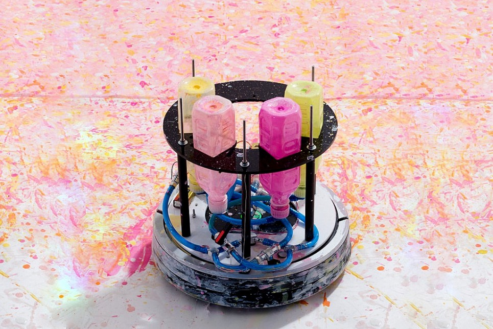  

  
4. 가격이 저렴하고 성능이 우수한 오픈소스 의수  
http://gizmodo.com/cheaper-faster-better-the-plan-to-build-an-open-sour-1726361559?utm_campaign=socialflow_gizmodo_facebook&utm_source=gizmodo_facebook&utm_medium=socialflow  
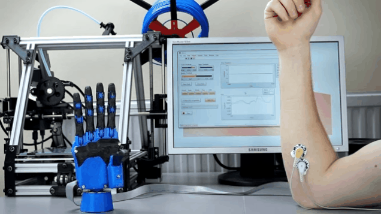  

  
5. 곤충을 모방한 뛰고 걷는 초소형 로봇들(TED)  
http://www.ted.com/talks/sarah_bergbreiter_why_i_make_robots_the_size_of_a_grain_of_rice#t-355218  
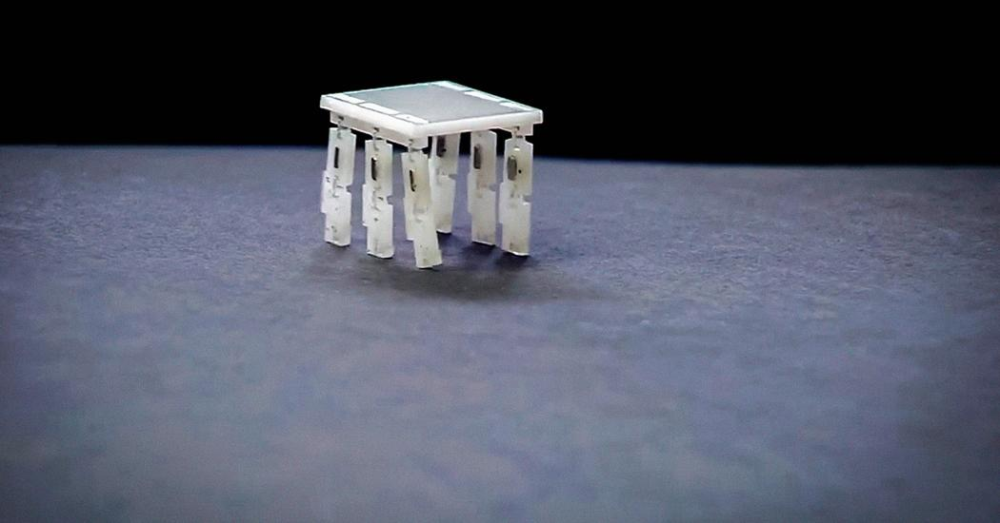  

  
6. 재봉실로 만든 인공근육  
http://techholic.co.kr/archives/34906  
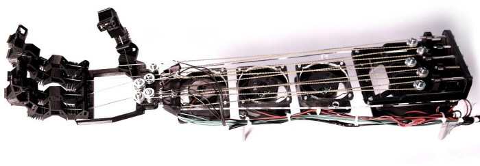  

  
7. Sony가 만든 드론  
http://techholic.co.kr/archives/39209  
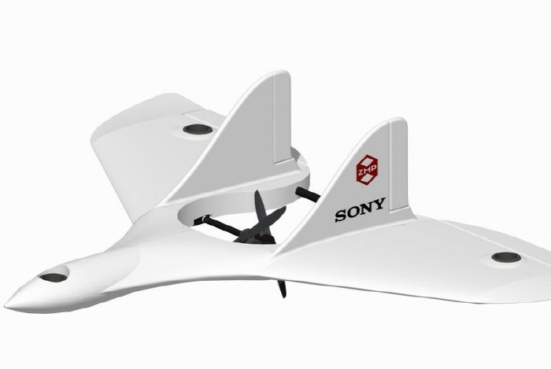  

  
8. 불빛으로 방향을 알려주는 스마트 자전거 악세서리  
http://techneedle.com/archives/22003?utm_source=dlvr.it&utm_medium=facebook  
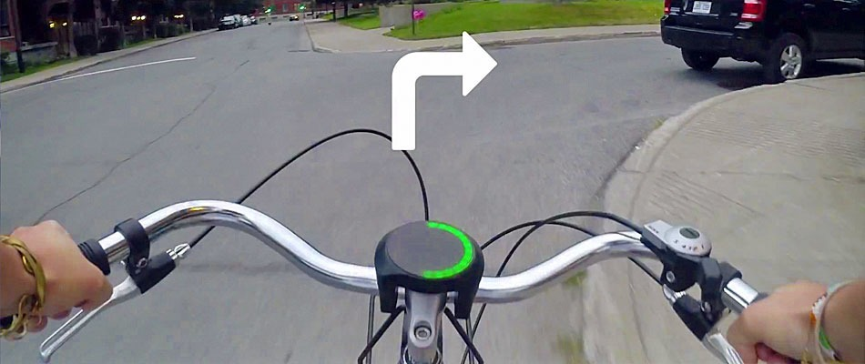  

  
9. 자전거 뒷바퀴에 설치하는 충전기  
http://uncrate.com/stuff/siva-atom-bicycle-usb-charger/  
  

  
10. 전자잉크 디스플레이가 내장된 키보드  
http://techholic.co.kr/archives/39222  
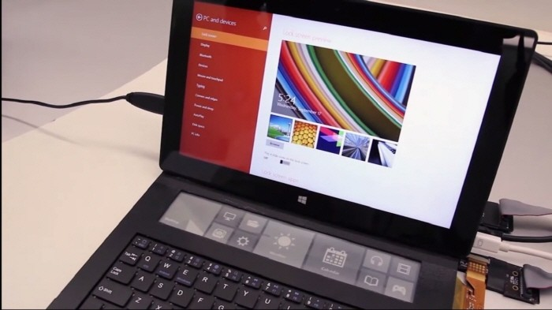  

  
11. $15 짜리 컴퓨터(오렌지 파이)  
http://www.cnx-software.com/2015/08/26/orange-pi-pc-allwinner-h3-board-is-now-available-for-15/  
  

  
12. 암 치료가 얼마나 효과적으로 이뤄지고 있는지 실시간으로 측정할 수 있는 센서  
http://techholic.co.kr/archives/38666  
  

  
13. 무선이어폰, 유선이어폰이 될 수 있는 이이폰  
http://www.earlyadopter.co.kr/63027  
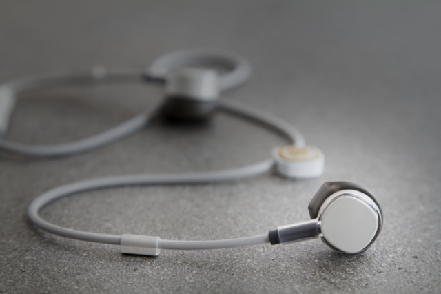  

  
14. 폭스바겐 자율주행 유모차  
http://techholic.co.kr/archives/39044  
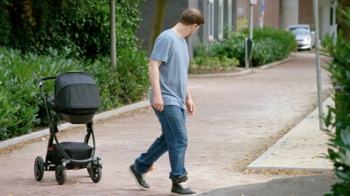  

  
15. 어린이용 스마트 워치  
http://www.engadget.com/2015/08/28/tencent-qq-watch-china/  
  

  
16. 음식 알러지를 테스트 할 수 있는 휴대용 기기  
http://www.psfk.com/2015/08/food-allergens-portable-allergen-sensor-nima.html  
  

  
17. 투명 태양광 패널  
http://www.digitaltrends.com/cool-tech/solar-window-solar-panel/?utm_content=bufferd4b9e&utm_medium=socialm&utm_source=facebook.com&utm_campaign=DT-FB  
  

  
18. 휴대용 스피커 + TV 리모컨  
http://www.geek.com/news/sony-combines-a-portable-speaker-with-a-tv-remote-yes-really-1632118/  
  

  
19. HUD(Head-Up Display) 네비게이션  
https://www.indiegogo.com/projects/exploride-turn-your-car-into-a-smart-car#/story  
  

  
20. Force 터치 패널 모듈  
http://www.wired.com/2015/08/sensel-morph/?mbid=social_fb  
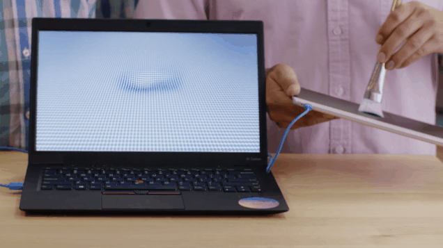  

  

---  
#150824  
> 2015년 34주차 **HOT DEVICE EVERY WEEK**  
>   
---  

  
1. 전자잉크를 이용한 밴더블 스마트와치  
http://www.psfk.com/2015/08/smartwatch-flexible-touch-screen-polyera-wove-band.html  
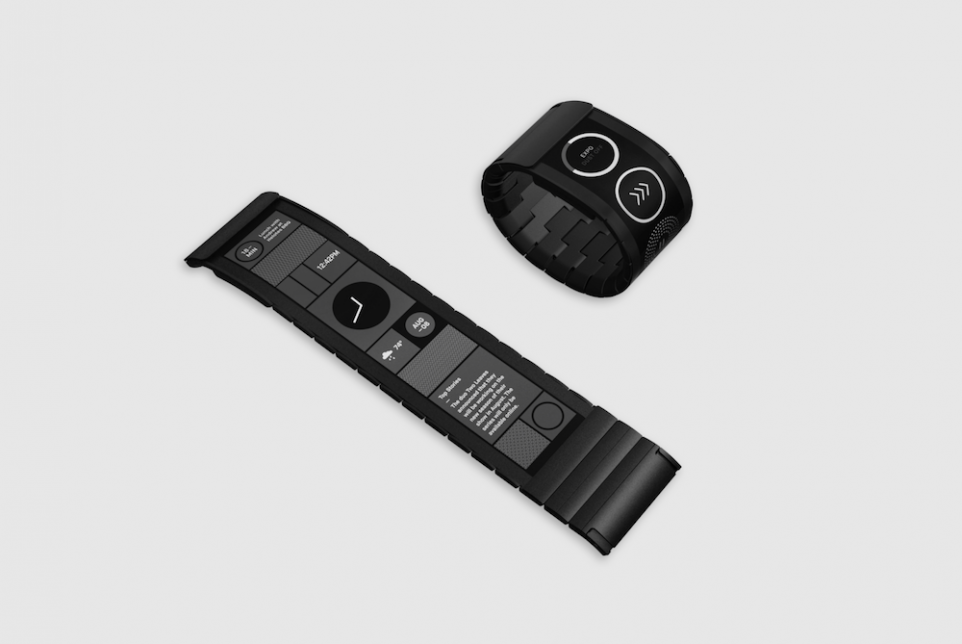  
  
2. 드론용 낙하산  
http://www.opale-paramodels.com/index.php/en/  
  
  
3. 자전거를 전기자전거로 바꿔주는 기기.  
http://www.earlyadopter.co.kr/62371  
  
  
4. 반려동물의 털을 효과적으로 제거하는 청소기 툴(다이슨)  
http://www.earlyadopter.co.kr/62375  
  
  
5. 랄프로렌의 스마트 운동복  
http://www.bloter.net/archives/236610  
  
  
6. 낚시를 위한 액션 카메라. 물고기가 먹이를 낚아채는 순간까지 영상으로 찍어줌.  
http://techholic.co.kr/archives/38210  
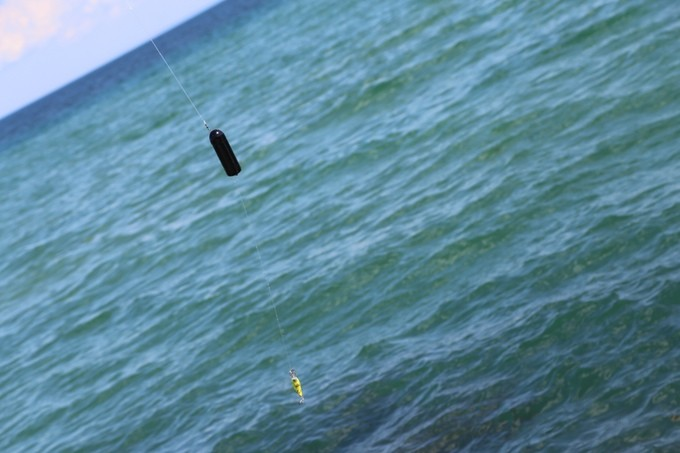  
  
7. 낚시 영상을 실시간으로 볼 수 있는 카메라  
http://www.youtube.com/watch?v=FKC1S0oPTNA  
  
  
  
8. 마치 연처럼 줄에 매달아서 날리는 드론   
https://www.youtube.com/watch?v=DNWedIy2HJ4  
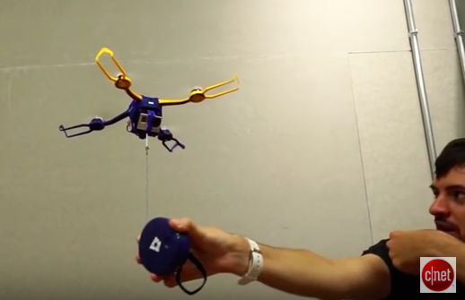  
  
9. 날씨 감지 기기  
http://www.engadget.com/2015/08/19/becoming-a-rain-detective-with-a-backyard-weather-station/  
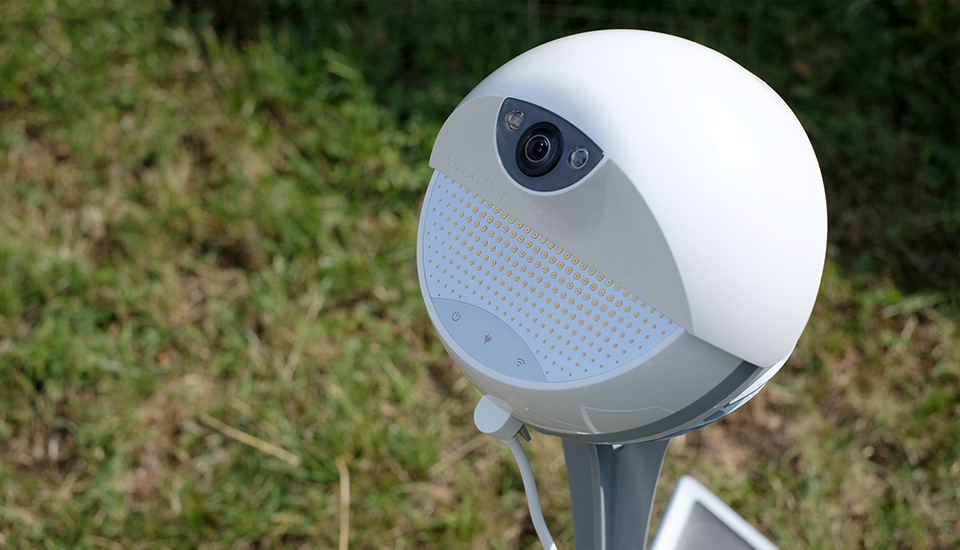  
  
10. 구글의 유무선 공유기  
http://www.cnet.co.kr/view/100141973  
  
  
11. 유아의 수면중 돌연사를 방지하는 수면모니터링 기기  
http://techneedle.com/archives/21867?utm_source=dlvr.it&utm_medium=facebook  
  
12. 찍을때마다 카운트가 올라가는 스탬프  
http://www.funshop.co.kr/goods/detail/34147?t=nl  
  
  
13. 불면증을 위한 스마트 반지  
http://www.earlyadopter.co.kr/62687  
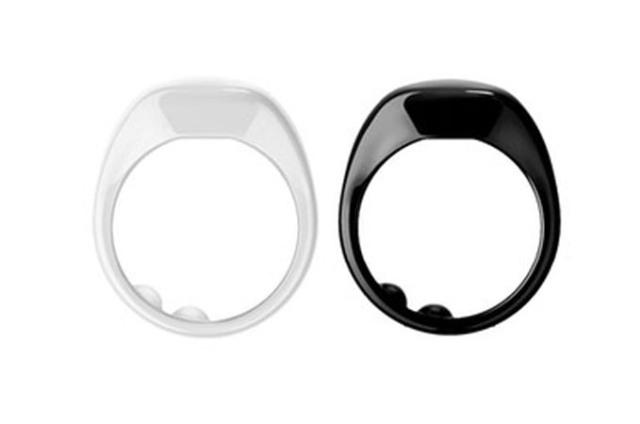  
  
14. 한장으로 오염된 물 100l를 정수하는 책.  
http://news.khan.co.kr/kh_news/khan_art_view.html?artid=201508172157335&code=970100  
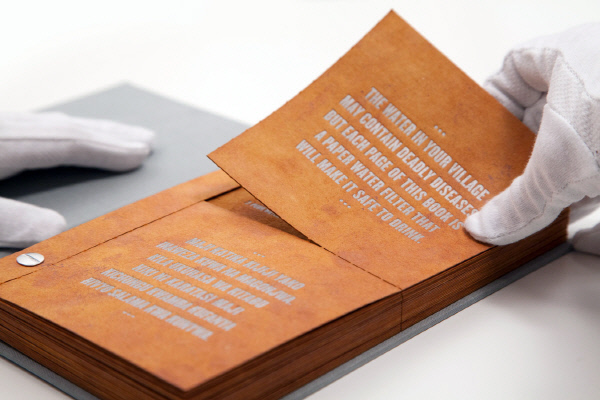  
  
15. 주변 밝기에따라 자동으로 빛밝기가 조절되는 후레시  
http://indefinitelywild.gizmodo.com/petzl-tikka-rxp-review-smart-headlamp-automatically-ad-1724725339  
  
  
16. 드릴날이 수직으로 잘 박히고 있는지 확인할수 있는 도구  
http://gizmodo.com/a-clever-accessory-ensures-youll-always-know-when-youre-1725346667?utm_campaign=socialflow_gizmodo_facebook&utm_source=gizmodo_facebook&utm_medium=socialflow  
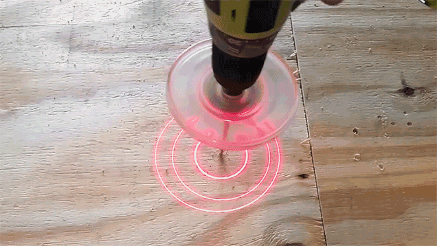  
  
17. 숲속을 자유롭게 걸을수 있는 로봇 (Boston Dynamics - Atlas)  
http://techcrunch.com/2015/08/17/heres-a-video-of-a-6-foot-tall-humanoid-robot-stomping-through-a-forest/?sr_share=facebook#.ugp8yw:8THb  
  
  
18. 이마에 대서 체온, 혈압, 심박수 등을 측정하는 기기  
https://www.scanadu.com/scout/  
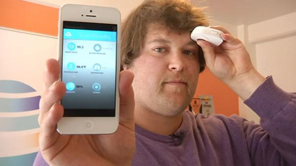  
  
19. 유아용 스마트 좌석밸트  
http://www.cnet.com/products/nabi-car-seat-clip/  
  
  
  
---    
#150817    
> 2015년 33주차 **HOT DEVICE EVERY WEEK**    
>     
---    
  
  
1. AA 건전지를 사용하는 보조 배터리  
http://www.earlyadopter.co.kr/62055  
  
  
2. 햇빛을 자동으로 추적하여 빛이 들어오지 않는 집안에 햇빛을 반사시켜 비춰주는 기기  
http://funtenna.co.kr/220447668740  
  
  
3. 전기가 필요없는 진공 포장기.  
http://www.earlyadopter.co.kr/62003?utm_content=buffer44a9c&utm_medium=social&utm_source=facebook.com&utm_campaign=buffer  
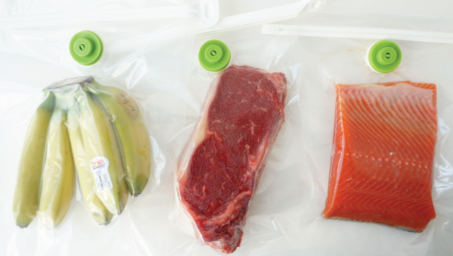  
  
4. TV를 터치스크린으로 만들어주는 기기.  
http://www.digitaltrends.com/home-theater/touchjet-wave-any-tv-giant-android-touchscreen-indiegogo/#/6  
  
  
  
5. 고양이용 노트북, 키보드 대신 스크래쳐  
http://toyland.gizmodo.com/a-laptop-scratching-post-lets-your-cat-create-its-own-v-1723629692  
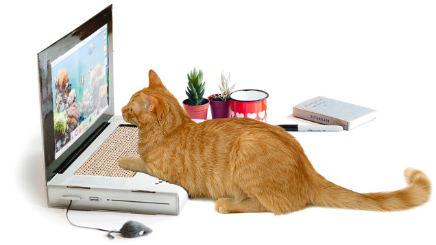  
  
6. 스마트폰용 초소형 헤드폰 앰프  
http://funtenna.co.kr/220449441925  
  
  
7. 하수관의 빠른 물살을 이용해 전기를 발생시키는 발전기 기술.  
http://magazine.good.is/articles/portland-pipeline-water-turbine-power  
  
  
8. 국제우주정거장(ISS)에 설치하여 일반인들도 360전 방향의 우주환경을 경험하게 해주는 VR용 360도 방향 촬영 카메라.  
ISS에 설치할 수 있도록 스타트업이 크라우드 펀딩 받고 있음.  
http://www.cnet.com/news/spacevr-wants-to-take-you-aboard-the-international-space-station/  
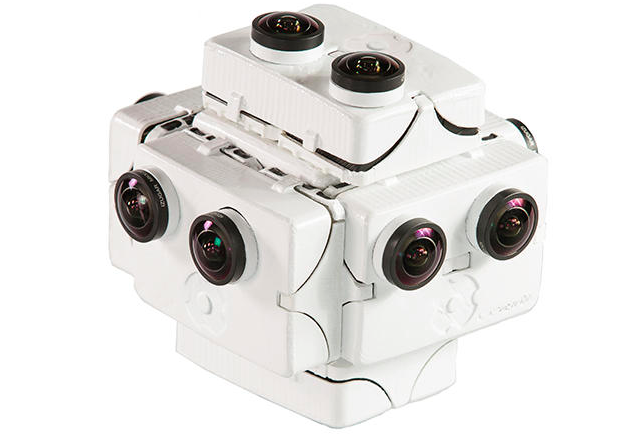  
  
  
9. 하나의 자식 로봇을 창조하는 로봇  
http://www.iflscience.com/technology/robot-evolves  
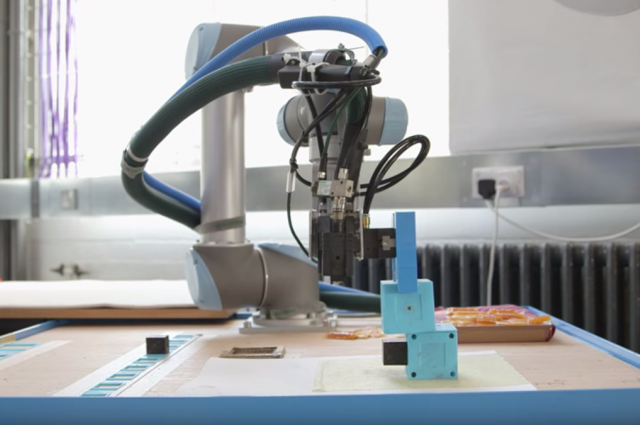  
  
10. 야간에도 불이 들어오는 애견용 스마트 목줄  
http://www.engadget.com/2015/08/14/buddy-smart-dog-collar/  
  
  
11. 다양한 기능이 있는 스마트 지갑.  
디스플래이가 내장되어 있고, 가계부, 위조지폐, GPS기능으로 소비위치 확인등.  
http://www.earlyadopter.co.kr/62226  
  
  
12. 비밀 노크로 문으로 들어올수 있게 해주는 기기  
http://www.digitaltrends.com/home/the-knocki-controls-your-smart-home-with-knocks/?utm_content=buffer4085e&utm_medium=socialm&utm_source=facebook.com&utm_campaign=DT-FB  
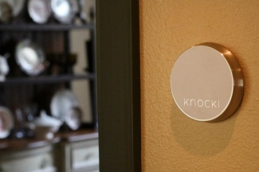  
  
13. 혈당 측정 관리 기기 (Google)  
http://thenextweb.com/google/2015/08/12/google-is-building-tiny-devices-to-help-diabetics/  
  
  
14. 원격으로 사람의 동작을 그대로 따라하는 로봇연구. (MIT)  
http://www.engadget.com/2015/08/09/mit-hermes-robot/  
  
  
15. 소형 오디오 시각화 목걸이형 기기  
http://www.engadget.com/2015/08/09/quantum-vj-audio-visualizer/  
  
  
16. 전기 모터 보트  
https://quadrofoil.com  
  
  
17. 특수소재로 배터리 없이 열을 만들어내는 깔창&장갑.  
https://www.kickstarter.com/projects/1503544150/world-s-first-natural-heat-generating-gloves-and-i?ref=category_newest  
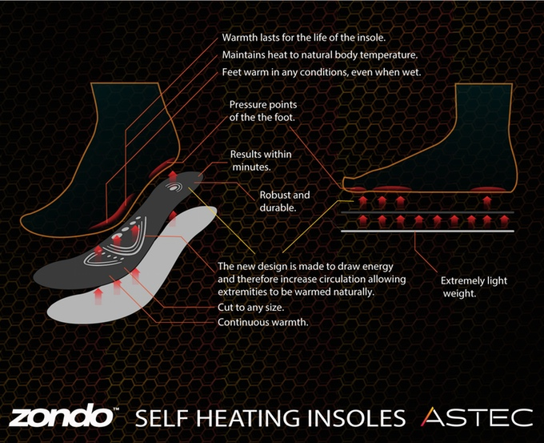  
  
  
18. 스마트홈 기기  
http://www.cnet.com/products/branto/  
  
  
19. 클라우드 전원관리 기기  
http://thenextweb.com/insider/2015/08/13/review-ihome-control-smartplug-offers-homekit-functionality-and-cloud-based-control/  
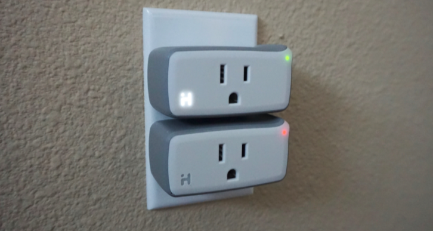  
  
  
20. 잠시동안 SNS나 이메일과 차단을 시켜 주는 버튼.  
http://funtenna.co.kr/220447668740  
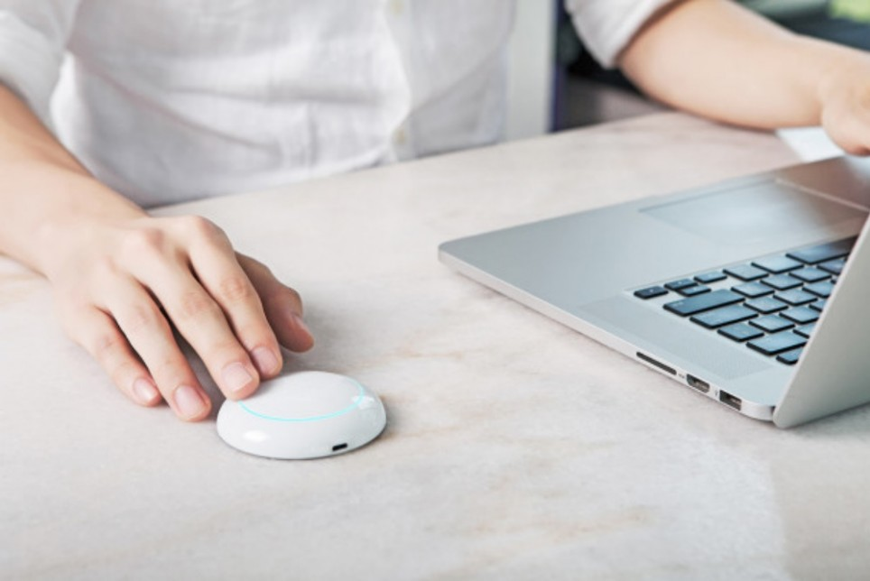  
  
  
---      
#150810      
> 2015년 32주차 **HOT DEVICE EVERY WEEK**      
>       
---      
  
1. 테슬라용 무인 충전기. 뱀모양의 로봇팔이 스스로 충전단자에 연결됨.  
http://techneedle.com/archives/21592?utm_source=dlvr.it&utm_medium=facebook  
  
  
2. 지형의 제약에서 자유로워지는 톡특한 메커니즘의 자동차  
http://www.digitaltrends.com/cars/swincar-spider-electric-car-pictures-specs-video-performance/#/4  
  
  
3. 서서 타고다니는 이동수단.   
https://www.youtube.com/watch?v=XvG_356itPs  
  
  
4. 차량용 공기청정기.  
http://www.earlyadopter.co.kr/61578  
  
  
5. 아침 햇빛 처럼 불빛 으로도 깨워주는 알람시계   
http://www.techinsider.io/i-tried-the-famous-wake-up-light-for-a-week-2015-8?utm_content=buffer54323&utm_medium=social&utm_source=facebook.com&utm_campaign=buffer  
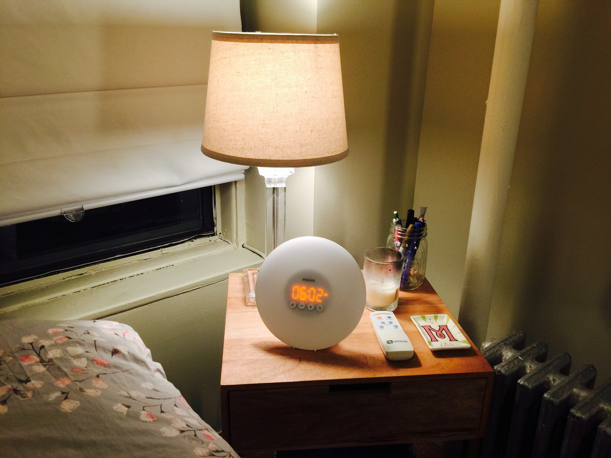  
  
6. 고령자용 웨어러블 엑소슈트. (현대자동차)  
http://m.etnews.com/20150806000237  
  
  
7. 스탠포드대, 차세대 가상현실 기기 공개  
투명 OLED를 이용 VR기기 사용시의 멀미를 줄여주는 기술.  
http://www.bloter.net/archives/235437  
  
  
8. 로봇이 동작을 똑같이 따라하게 만드는 엑소슈트  
https://www.youtube.com/watch?v=A54CBfRBTYU  
  
  
9. 원하는 사운드대로 조립하는 모듈형 스피커.   
크고작은 스피커의 조합으로 원하는 사운드의 스피커 구축.  
http://www.engadget.com/2015/08/02/sparkblocks-modular-speaker/  
  
  
10. 콘센트 플러그만한 애플워치 충전 거치대  
http://www.earlyadopter.co.kr/61644  
  
  
11. 음주 측정을 해야 풀 수 있는 자전거 자물쇠  
http://www.earlyadopter.co.kr/61663  
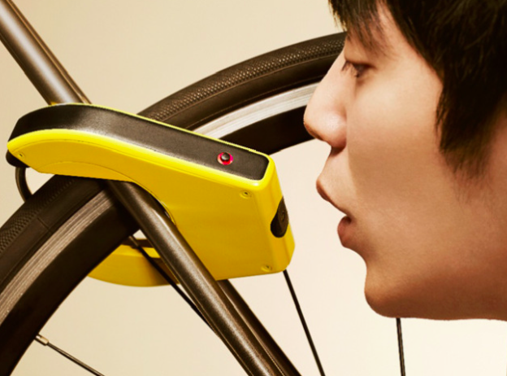  
  
12. 유리에 색칠이 되는 스마트 유리창  
http://www.technologyreview.com/news/539946/smart-windows-just-got-a-lot-cooler/?utm_campaign=socialsync&utm_medium=social-post&utm_source=facebook  
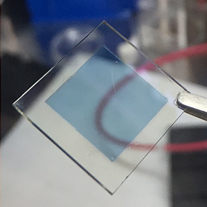  
  
13. 토스터 형태의 스마트폰 살균기  
http://www.earlyadopter.co.kr/61730  
  
  
14. 스쿠터처럼 타고다니는 여행기방  
http://www.earlyadopter.co.kr/61712  
  
  
15. 책상으로변하는 여행가방  
http://www.earlyadopter.co.kr/61480  
  
  
16. 물속에 넣으면 물고기를 모이게해서 낚시를 쉽게 도와주는 기기  
http://www.earlyadopter.co.kr/61803  
  
  
17. 레이져로 날아다니는 모기를 겨추시키는 기기  
http://www.earlyadopter.co.kr/61606  
  
  
  
18. 집에서 제작하는 고사양의 천체망원경.  
http://www.iflscience.com/technology/you-can-now-build-your-very-own-powerful-telescope-home  
  
  
19. 반려동물과 원격으로 소통할수 있게 도와주는 기기.  
http://www.engadget.com/2015/07/27/petzi-treat-cam/  
  
  
20. 세계최초 전자잉크 교통 안내 표지판(시카고)  
http://www.engadget.com/2015/07/27/sydney-e-ink-traffic-signs/  
  
  
21. 집에 가서 PC를 켜지 않아도 사진과 영상을 바로 확인하고 편집도 가능하게해주는 기기.  
http://www.engadget.com/2015/08/07/gnarbox-video-editing-suite/  
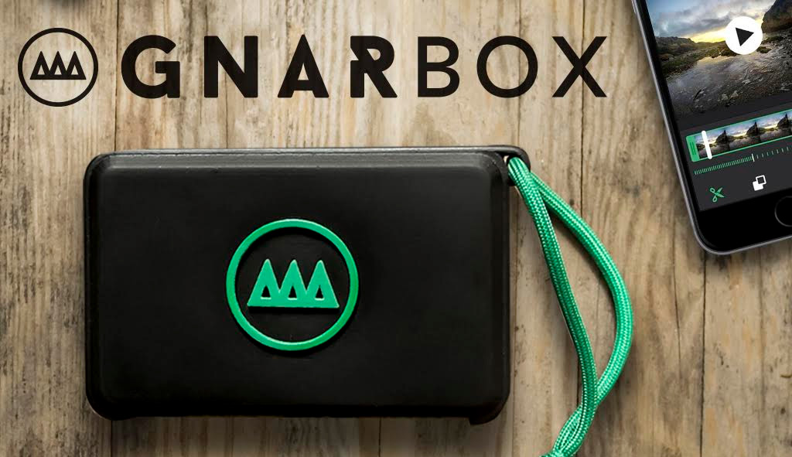  
  
22. 착용하면 얼굴인식 당하지 않아 사생활 보호가 가능한 안경.  
http://gizmodo.com/these-glasses-block-facial-recognition-technology-1722826081?utm_campaign=socialflow_gizmodo_facebook&utm_source=gizmodo_facebook&utm_medium=socialflow  
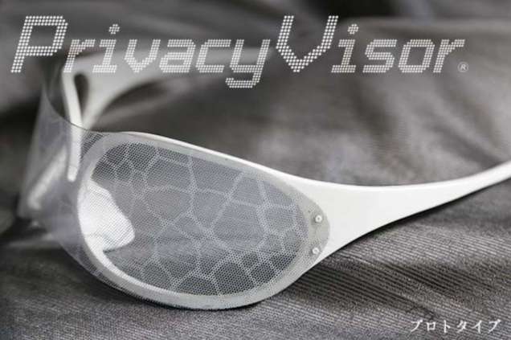  
  
23. 신체의 온도를 측정 관리하는 이어플러그  
https://www.kickstarter.com/projects/1460153872/yono-fertility-friend-a-wearable-basal-thermometer?utm_source=Early+Bird&utm_campaign=12e87803bf-Early_Bird_for_Kickstarter8_3_2015&utm_medium=email&utm_term=0_b6eff9d06a-12e87803bf-137822113  
  
  
---      
#150803     
> 2015년 31주차 **HOT DEVICE EVERY WEEK**      
>       
  
---      
  
1. 점자 스마트 워치  
http://www.iflscience.com/technology/south-korean-tech-company-announces-worlds-first-braille-smartwatch  
  
  
2. 자기 몸 14배 높이 점프하는 소금쟁이 로봇  
http://www.hani.co.kr/arti/science/science_general/702606.html  
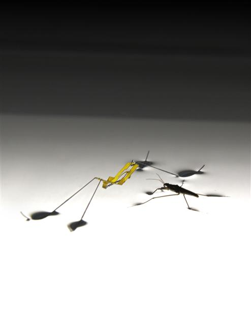  
  
3. 아이팟을 전화기로 바꿔주는 기기.  
USIM카드를 삽입해서 사용.  
http://www.earlyadopter.co.kr/61239  
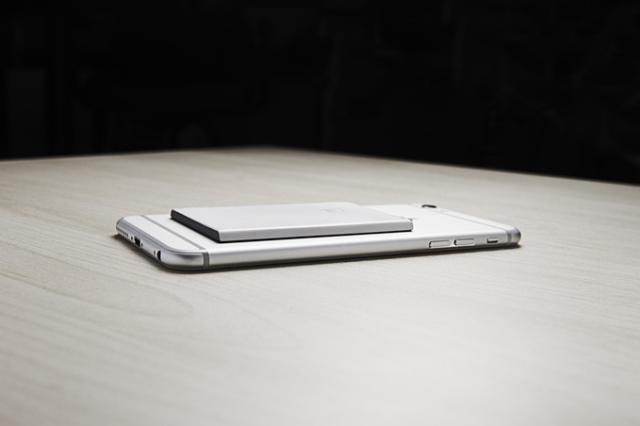  
  
4. 더 잘 뛸수 있게 해주는 웨어러블 슈즈  
http://interestingengineering.com/ostrich-inspired-bionic-boots-let-you-run-at-up-to-25-mph/  
  
  
5. 360방향 가상현실 영화 촬영 장비(노키아)  
http://www.theverge.com/2015/7/28/9064499/nokia-vr-camera-ozo  
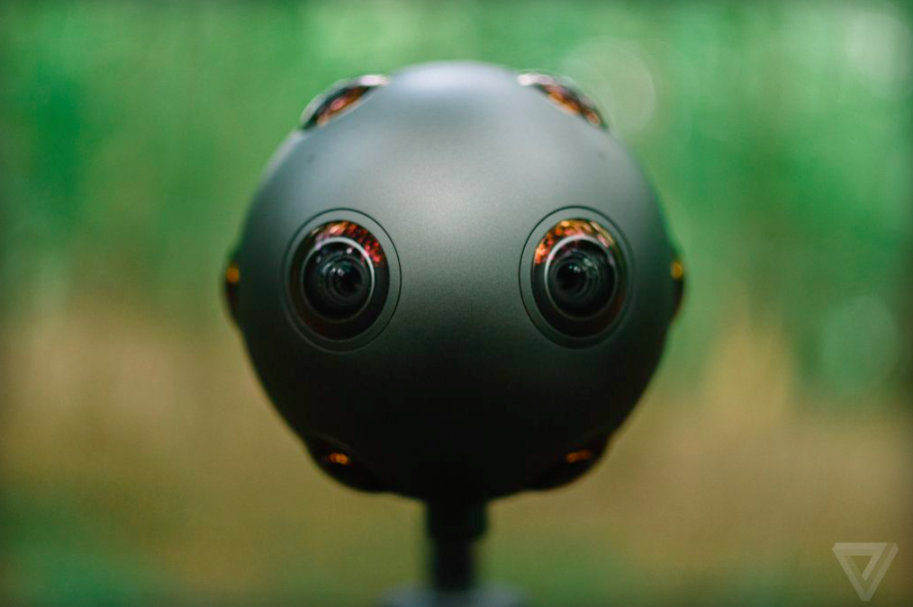  
  
6. 스마트폰과 연동하는 알람시계  
http://techcrunch.com/2015/07/31/justthebell-is-just-the-bell/?sr_share=facebook  
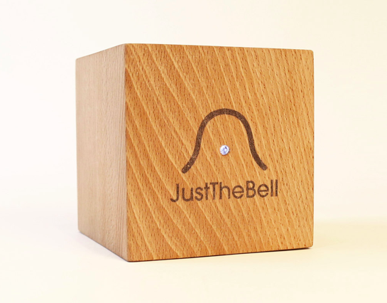  
  
7. 색변경이 가능한 스마트 전구  
http://gizmodo.com/the-latest-color-changing-smart-bulb-turns-life-into-a-1721286686  
  
  
8. 뒷바퀴 휠축에 장착하는 자전거 발전기.  
http://www.earlyadopter.co.kr/61511  
  
  
9. 3D프린팅하는 건축물 재료.  
http://gizmodo.com/the-world-s-biggest-free-form-3d-printer-is-being-used-1720867145  
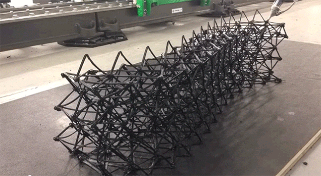  
  
10. 스피커로 변하는 헤드폰  
http://www.earlyadopter.co.kr/61490  
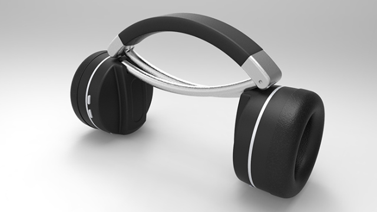  
  
11. 재활용할 수 있는 케이블 타이.  
http://www.earlyadopter.co.kr/61435  
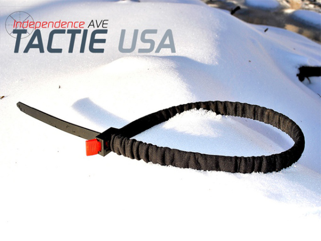  
  
12. 선풍기가 내장된 우산.  
http://www.earlyadopter.co.kr/61430  
  
  
13. 배터리의 수명을 늘려주는 기기  
http://www.earlyadopter.co.kr/61444  
  
  
14. 스마트폰에 장착하는 3D 스캐너 악세서리  
http://www.earlyadopter.co.kr/61205  
  
  
15. 비행기 좌석용 스마트폰 거치대.  
http://gizmodo.com/a-cup-holding-device-mount-makes-flying-slightly-more-b-1720815270  
  
  
16. 천식 및 만성폐쇄성 폐질환 모니터링 기기   
http://techneedle.com/archives/21333?utm_source=dlvr.it&utm_medium=facebook  
  
  
17. GPS 트래커  
http://www.digitaltrends.com/cool-tech/trackerpad-gps-sticker-kickstarter/?utm_content=buffer29918&utm_medium=social&utm_source=facebook.com&utm_campaign=DT-FB#/2  
  
  
18. 트위터나 페이스북등의 like수를 카운트 해주는 기기.  
http://techcrunch.com/2015/07/28/smiirl-seed/?sr_share=facebook#.ugp8yw:ZuKZ  
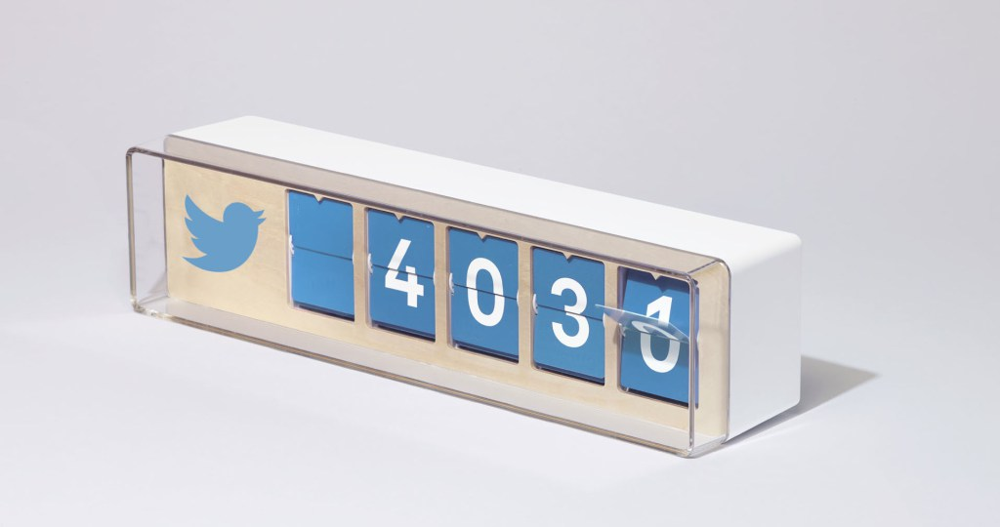  
  
19. 어디 주차했는지 알려주는 기기.  
http://thenextweb.com/insider/2015/07/28/awarecar-will-tell-you-where-you-parked-and-remind-you-to-put-change-in-the-meter/  
  
  
20. 태양광 패널이 없어도 충전을 할 수 있는 플러그.  
https://www.kickstarter.com/projects/1275963200/sunport-plug-into-solar-power-no-panels-required  
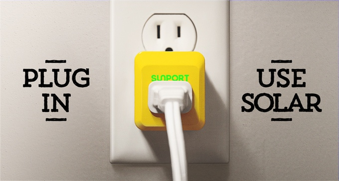  
  
21. 스마트 글래스  
http://www.engadget.com/2015/07/31/recon-gopro-control-app/?sr_share=facebook  
  
  

---      
#150727     
> 2015년 30주차 **HOT DEVICE EVERY WEEK**      
>       
  
---      
  
1. 두껍지않아 불편하지 않은 구명조끼.  
비상시 레버를 당기면 에어백이 터짐. 압축공기 충전으로 재활용가능.  
세일러묵 인사이트 : 지난주에도 압축공기를 터트리는 비슷한 제품이 있었음. 에어백은 물놀이 안전 용품의 새로운 패러다임.  
http://www.earlyadopter.co.kr/60698  
  
  
  
2. 태양에너지를 저장해 발광하는 후레쉬.  
패트병뚜껑 대신 끼워 조명으로도 사용가능.  
https://www.indiegogo.com/projects/suli-your-portable-sun#/story  
  
  
3. 보행 어시스턴스 슈트 (혼다)  
세일러묵 인사이트 : 최근 힘을 보조하는 입는형태의 로봇의 연구가 활발히 진행되고 있고 제품화도 많이 되고 있음.  
특히 고령화가 가속되고 있는 일본에서는 몸이 불편하신 어르신 위주로 수요 폭발할 것으로 예상.  
http://m.irobotnews.com/news/articleView.html?idxno=5330  
  
  
4. 초콜렛을 출력하는 3D프린터기  
이 제품을 만든 3D systems회사는 이미 3D 프린터 제작분야에서 탑클라스 회사.  
https://www.youtube.com/watch?v=8gyKmB6RK-4  
  
  
  
5. 포크나 수저등 식기에 장착하는 소스 주입기.  
http://www.cnet.com/news/fork-mounted-gadget-delivers-hot-sauce-directly-to-every-bite/  
  
  
6. IOS에서 사용하는 열화상 카메라 악세서리  
http://www.cnet.com/uk/products/flir-one/  
  
  
7. 한번에 360방향의 사진을 찍는 카메라, 앞뒤 양면에 하나씩 있는 카메라로 모든방향을 한번에 합성.  
https://theta360.com/en/  
  
  
  
8. Eye 스캐닝 도어락  
http://www.digitaltrends.com/home/iris-scanners-can-lock-and-unlock-your-doors/?utm_source=facebook&utm_medium=socialm&utm_campaign=home  
  
  
  
9. 노안때문에 시각장애가 온 사람들의 시력을 복원하는 생체이식 기기.  
http://www.theverge.com/2015/7/22/9013843/first-patient-with-age-related-vision-loss-receives-bionic-eye-implant  
  
  
  
10. 주변의 깨끗한 화장실을 찾아주는 기기 & App  
http://looie.co/#hey  
  
  
11. 우유가 생했는지 알려주는 3D프린팅 된 뚜껑.  
http://www.engadget.com/2015/07/22/3d-printed-bottle-caps-will-let-you-know-if-your-milk-goes-bad/  
http://www.nature.com/articles/micronano201513  
  
  
  
12. 폭스바겐이 만든 폴더블 전기 스쿠터  
http://www.digitaltrends.com/cars/volkswagen-last-mile-surfer-pictures-specs-news/?utm_content=buffera8b6d&utm_medium=social&utm_source=facebook.com&utm_campaign=DT-FB  
  
  
13. 원격으로 의사에게 진료를 받을 수있는 로봇.  
https://www.youtube.com/watch?v=u1-MFo7_n-Y  
  
  
14. 샤오미 블루투스 스피커(가격 99위안, 한화18000원)  
http://platum.kr/archives/42517  
  
  
15. 필요한 만큼 꽂아 쓰는 모듈형 USB-C 허브  
http://www.earlyadopter.co.kr/60499  
  
  
16. 모바일 기기를 다양한 형태로 거치할 수 있게 해주는 거치대.  
http://www.earlyadopter.co.kr/60535  
  
  
17. 태양광을 이용한 전동 킥보드  
http://www.earlyadopter.co.kr/60560  
  
  
18. 스마트 화분  
https://www.youtube.com/watch?v=7kZap4JunhA  
  
  
19. 개인 피트니스 코치 웨어러블 밴드  
https://www.youtube.com/watch?v=dMJQhhop76Q  
  
  
  
    
---          
#150720         
> 2015년 29주차 **HOT DEVICE EVERY WEEK**          
>           
      
---          
    
1. 기존의 스마트폰에 자석커넥터로 만들어주는 커넥터 단자.    
맥의 MacSafe 자석 커넥터를 폰에서 쓸 수 있게 해줌.    
https://www.kickstarter.com/projects/1041610927/znaps-the-9-magnetic-adapter-for-your-mobile-devic?ref=category_popular    
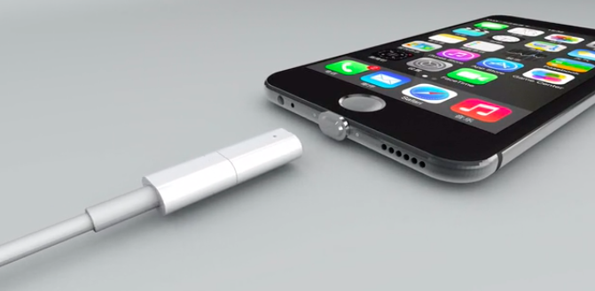    
    
2. 익사 방지용 손목에 차는 비상용 에어 백    
물에 빠졌을때 이산화탄소 가스가 방출되어 바로 물에 뜨는 에어백을 터트릴 수 있음.    
https://www.indiegogo.com/projects/kingii-the-new-standard-in-water-safety#/story    
    
    
3. 모든 방향을 가공할 수 있는 5축CNC 밀링 머신.    
기존의 CNC밀링 머신은 한 평면만 가공이 가능.    
https://www.kickstarter.com/projects/1090944145/pocket-nc-the-first-5-axis-cnc-mill-for-your-deskt?ref=category    
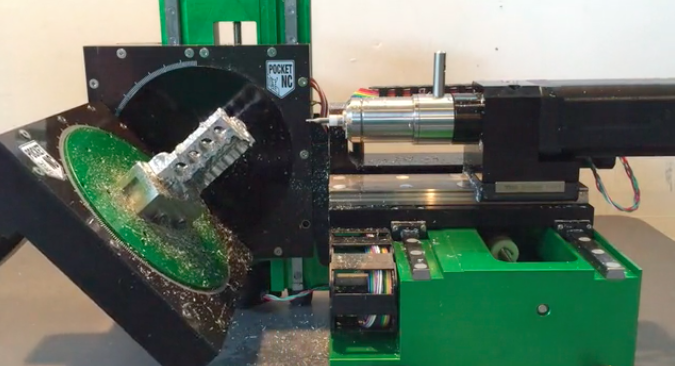    
    
4. 손동작으로 스마트와치나 스마트폰을 컨트롤 할 수 있는 블루투스 장치    
https://www.kickstarter.com/projects/belfio/deus-ex-aria-the-evolution-of-smartwatch-control    
    
    
5. 전자 기타 앰프로 유명한 Marshall에서 만든 스마트폰    
헤드폰 출력단자가 2개이며, 볼륨조절 버튼이 다이얼 방식    
http://www.theverge.com/2015/7/16/8976561/marshall-london-smartphone-images     
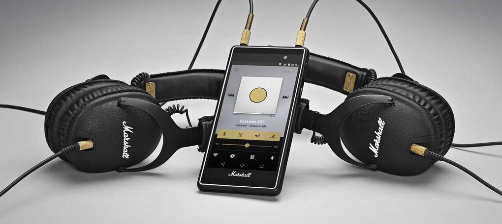    
    
6. 샤오미가 출시한 정수기    
http://thegear.co.kr/8828    
    
    
7. 샤오미가 출시한 스마트 신발    
http://techg.kr/6484    
    
    
8. 카메라를 스트랩이 아닌 몸에 바로 고정시킬 수 있는 홀더.    
https://peakdesign.com/store/capturepro    
    
    
9. 음주측정 스마트폰 악세서리    
http://www.earlyadopter.co.kr/59830    
    
    
10. 양변기에 부착해 물을 자동으로 내려주는 기기    
http://www.earlyadopter.co.kr/60224    
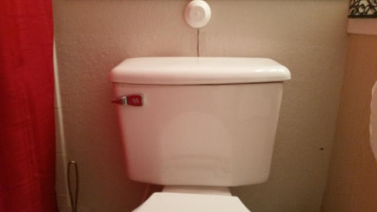    
    
11. 작고 가볍고 접으면 휴대성도 좋은 전기 자전거    
http://www.earlyadopter.co.kr/60194    
    
    
12. 분실 방지 기능이 있는 스마트 우산.    
http://www.earlyadopter.co.kr/60068    
    
    
13. 촛불로 스마트폰을 충전할 수 있는 발전기    
http://www.earlyadopter.co.kr/60024    
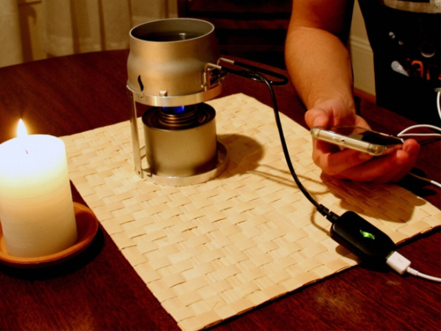    
    
14. 스마트폰을 클래식한 비디오 카메라로 바꿔주는 악세서리    
http://www.earlyadopter.co.kr/59910    
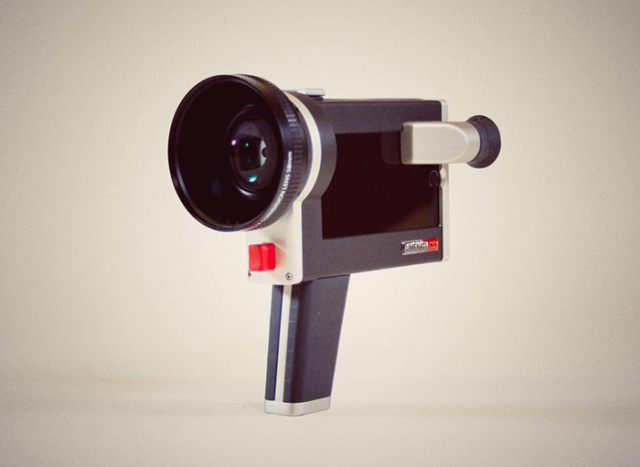    
    
15. 피트니스 트래킹 전자발찌    
http://www.earlyadopter.co.kr/59887    
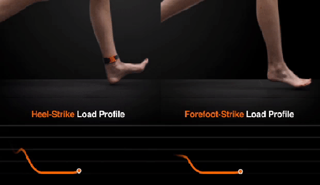    
    
16. 자전거 휠을 디스플레이로 바꿔주는 조명.    
http://www.earlyadopter.co.kr/59886    
    
    
17. 고양이의 수분섭취량을 분석하는 기기.    
http://besuccess.com/2015/07/pura_indiegogo/    
    
    
18. 내장 이어폰이 있는 스마트폰 케이스    
http://www.earlyadopter.co.kr/60145    
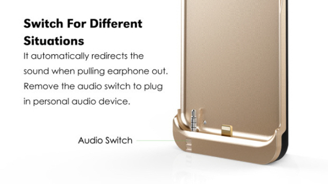    
    
19. 수험생등을 위한 단순한 스마트폰.    
http://www.earlyadopter.co.kr/60125    
    
    
20. 발사이즈가 커지면 크기를 늘릴 수 있는 신발.    
https://www.youtube.com/watch?v=GvMQLYTdYUA    
    
    
21. 증강현실 스마트 안경    
http://www.arm.com/innovation/products/air-3d-smart-glasses.php?sf39360701=1    
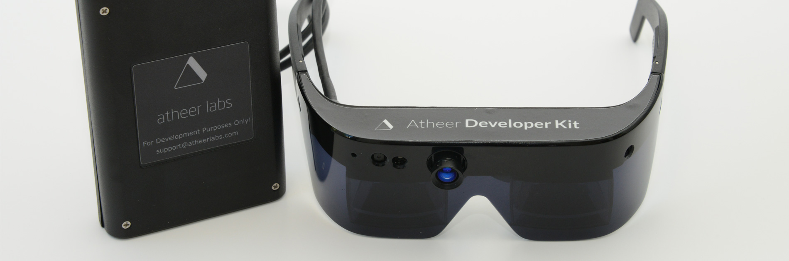    
    
22. 스타벅스에 대기줄이 있는지 미리 알려주는 기기    
http://thenextweb.com/insider/2015/07/13/this-gadget-will-tell-you-if-theres-a-line-at-starbucks-before-you-arrive/    
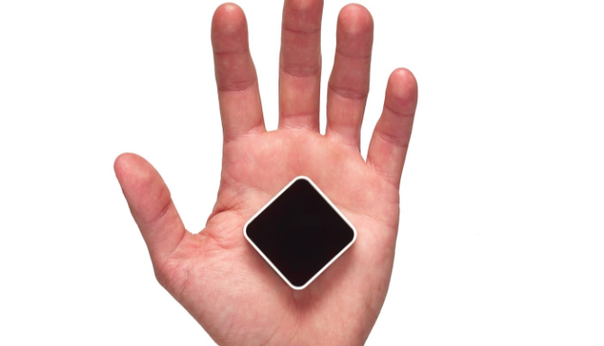    
    
23. 집 방문자가 총이 있는지 알려주는 기기    
http://www.engadget.com/2015/07/15/gundetect/    
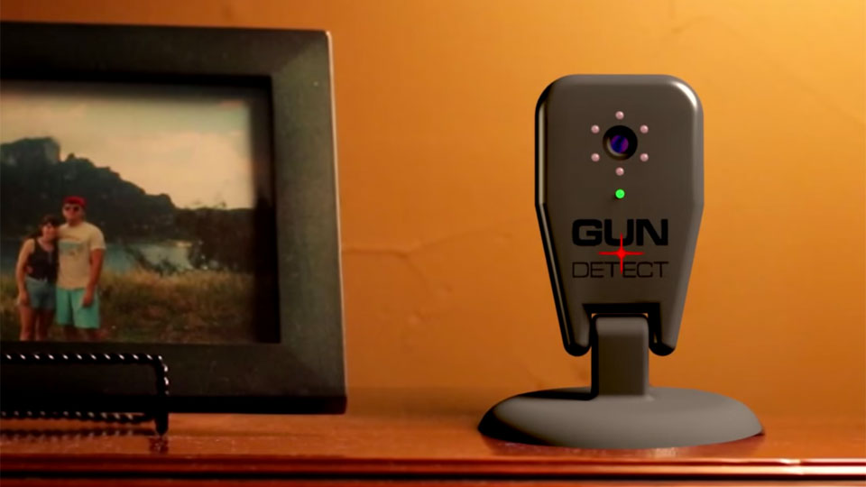    
    
24. 사람과 상호작용할 수 있는 로봇장난감.    
http://toyland.gizmodo.com/someone-at-pixar-built-the-most-adorable-peek-a-boo-pla-1717046545    
    
    
    
      
---            
#150713           
> 2015년 28주차 **HOT DEVICE EVERY WEEK**            
>             
        
---            
  
1. 새로 출시된 고프로 카메라 GoPro Session  
보다 콤팩트하고 저렴함.  
http://9to5toys.com/2015/07/06/gopro-hero4-session-release/  
  
  
2. 영수증 프린터기를 이용해 스마트폰의 여러 컨텐츠를 출력. (사진,웹페이지,TODO리스트 등등을 간편하게 출력)  
http://www.earlyadopter.co.kr/59613  
  
  
3. 휴대용 태양광 발전기 Kalipak  
https://www.youtube.com/watch?v=gQp_2BoN2Cc  
  
  
4. 나무나 종이 표면을 태워서 글자를 새길 수 있는 돋보기  
http://www.earlyadopter.co.kr/59640  
  
  
5. 어디에도 설치가 가능한 방수 블루투스 스피커 (꼬리로 감아서 설치)  
http://www.businessinsider.com/boom-swimmer-waterproof-wireless-bluetooth-speaker-2015-7?utm_content=buffer969a4&utm_medium=social&utm_source=facebook.com&utm_campaign=buffer  
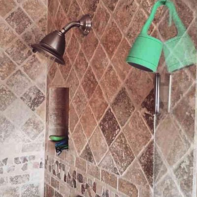  
  
6. 세계 곳곳에 인터넷을 보급할 수 있는 저궤도 위성.  
http://www.ipnomics.co.kr/?p=17261  
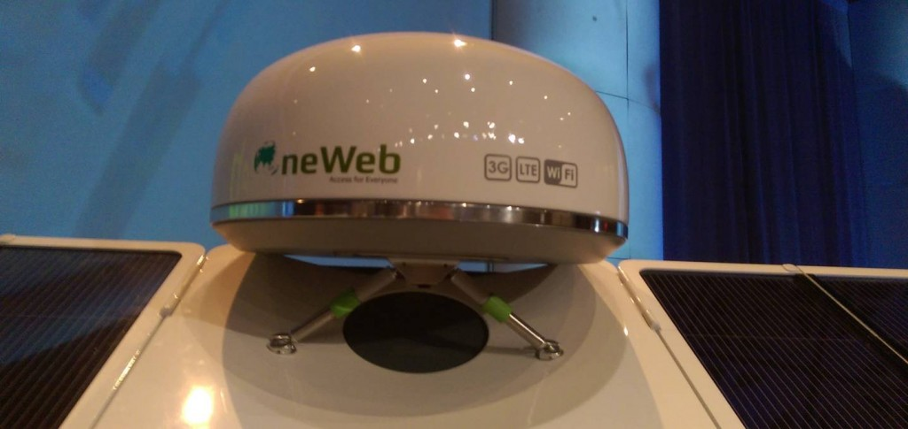  
  
7. 가족과 소통하는 가정용 로봇.  
https://www.indiegogo.com/projects/buddy-your-family-s-companion-robot#/story  
  
  
8. 스키용 에어백, 눈속에 파뭍히지 않게 해주는 용도.  
http://gizmodo.com/mass-recall-of-avalanche-rescuing-airbags-thanks-to-st-1716916800?utm_campaign=socialflow_gizmodo_facebook&utm_source=gizmodo_facebook&utm_medium=socialflow  
  
  
9. 프로그래밍 가능한 로봇 장난감.  
http://www.engadget.com/2015/07/09/vortex-robot-toy-hands-on/  
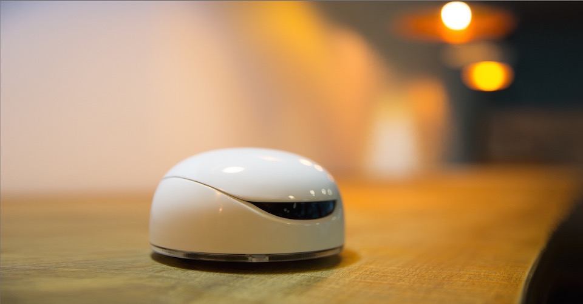  
  
10. 라떼아트를 출력해주는 커피 프린터기  
http://www.earlyadopter.co.kr/59498  
  
  
11. 소녀들을 위한 스마트 팔찌  
http://www.earlyadopter.co.kr/59597  
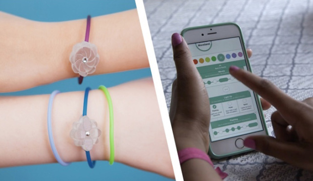  
  
12. 벽을 기어 올라갈수 있는 장치  
http://interestingengineering.com/spider-style-climbing/  
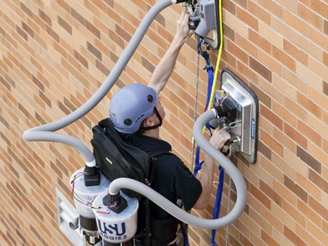  
  
13. 가정 내 수신 감도가 약한 Wi-Fi 지점을 위한 유선 연결 장치.  
Chromecast를 라우터에 직접 연결하여 Chromecast의 연결 속도와 안정성확보.  
https://store.google.com/product/_ethernet_adapter_for_chromecast  
  
  
14. 입는 옷에서 운동 효과를 파악할 수 있는 웨어러블 기기  
http://www.earlyadopter.co.kr/59525  
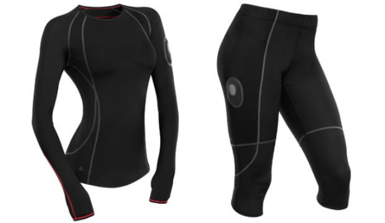  
  
15. 결제가 가능한 손목밴드  
http://thenextweb.com/gadgets/2015/07/07/barclays-bpay-band-convenient-contactless-payments-if-youve-got-the-wrist-space/  
  
  
16. 뒤집어 끼워도 꽂아지는 마이크로 USB단자  
http://www.earlyadopter.co.kr/59523  
  
http://www.cnet.com/news/finally-a-reversible-micro-usb-cable/  
  
17. 얇고 가벼운 태양광 충전기  
http://www.earlyadopter.co.kr/59506  
  
  
18. 셀카 마이크, 인터뷰할때 누가 안찍어줘도 됨  
https://www.indiegogo.com/projects/solocam#/story  
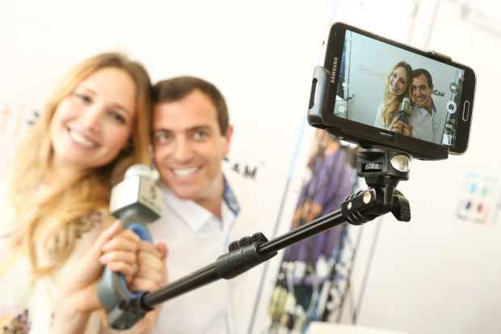  
  
19. 신용카드 크기의 어린이용 장난감 컴퓨터  
http://techcrunch.com/2015/07/07/the-microbit-is-shaping-up-to-be-the-perfect-programming-device-for-kids/?ncid=rss&utm_source=feedburner&utm_medium=feed&utm_campaign=Feed%3A+Techcrunch+%28TechCrunch%29  
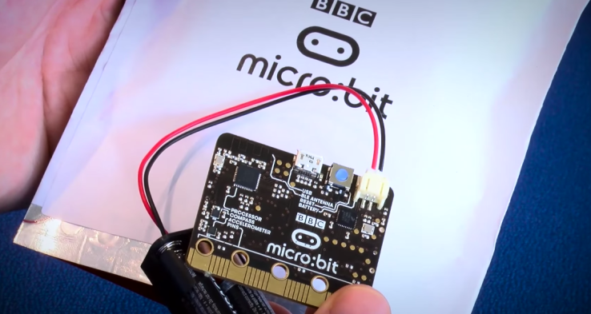  
  
  
20. 스마트폰 화면을 HUD(Head Up Display) 방식으로 볼수 있는 기기  
http://www.earlyadopter.co.kr/59395  
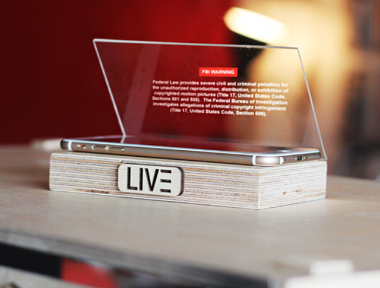  
  
21. DIY 타투 기기  
http://www.earlyadopter.co.kr/59421  
  
  
22. 스트레스 관리 웨어러블 밴드 Wellbe  
https://www.youtube.com/watch?v=p_eDdX_to4I  
  
  
23. 빛을 프린트 하는 3D프린터기  
http://www.engadget.com/2015/07/05/painting-light-with-3d-tech/  
  
  
24. 총을 조준할때 고정되도록 도와주는 엑소 슈트  
http://www.digitaltrends.com/cool-tech/the-army-is-developing-an-arm-mounted-exoskeleton-that-helps-soldiers-aim/  
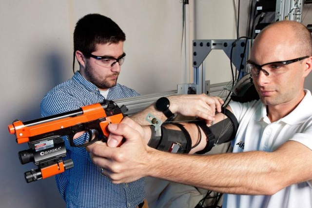  
  
25. 노트북용 보조모니터  
http://www.geek.com/news/triple-your-laptop-display-space-with-slidenjoy-1627138/  
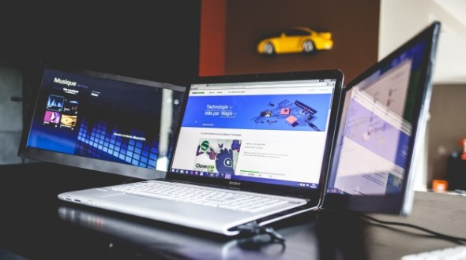  
  
26. 패션에 좀 더 신경쓴 스마트 팔찌  
https://www.indiegogo.com/projects/helen-smart-bracelet-with-custom-straps#/story  
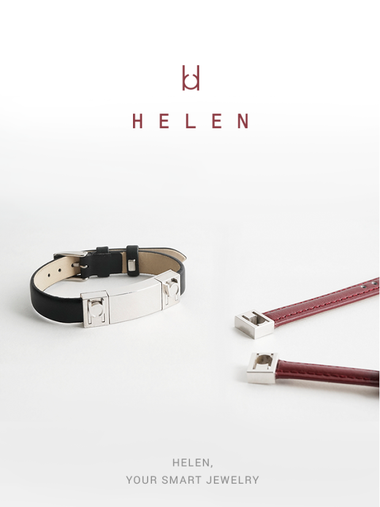  
  
  
        
---              
#150706    
> 2015년 27주차 **HOT DEVICE EVERY WEEK**              
>               
          
---              
  
1. 크라우드 펀딩받는 애플워치 스트랩  
http://www.earlyadopter.co.kr/59010  
  
  
2. 공기중에 디스플레이 & 터치가 되는 기술  
http://www.iflscience.com/technology/scientists-create-holograms-you-can-touch  
  
  
3. 블루투스와 센서가 내장된 목각인형.  
쓰다듬으면 반응하고 원격으로 통신 가능.  
http://techholic.co.kr/archives/36156  
  
  
4. 360도 모든 방향을 촬영하는 카메라  
VR 헤드셋을 쓰고 촬영된 영상을 감상할 수 있음.  
http://techcrunch.com/2015/07/03/sphericam-2-is-a-4k-360-degree-camera-built-for-the-vr-era/#.ugp8yw:QQ2z  
  
  
4.5 안경에 붙이는 탈착형 모바일 디스플레이  
누가 쳐다 보면 안경에서 재빠르게 제거할 수 있다는것이 장점.  
https://www.kickstarter.com/projects/1991375881/vufine-a-handsfree-wearable-display?ref=nav_search  
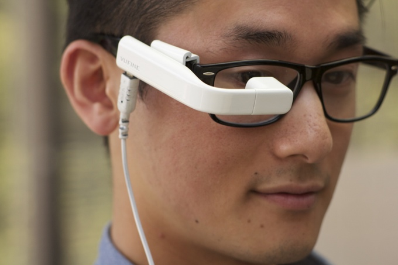  
  
5. 인공위성끼리 데이터를 전송하는 레이져 기술 (Facebook-internet.org)  
저위도 궤도에서 공전하는 인공위성으로 보다 빠른 위성인테넷을 전세계모든 사람들에게 제공할 수 있음.  
http://www.engadget.com/2015/07/01/zuckerberg-facebook-lasers/  
  
  
6. 레고 블럭을 쌓는 3D 프린터기  
http://www.psfk.com/2015/07/hudor-faucet-audi-fraser-leid-hands-free-faucet.html  
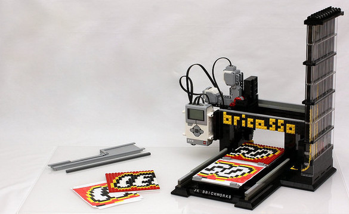  
  
7. 사과 깎는 장치.  
http://www.makesushi.com/product/apple-peeler-and-core-slicer/  
  
  
8. 귓속의 구조를 3D스캔하는 스캐너, 본인귀에 딱맞는 이어폰을 제작할 수 있음.  
http://www.engadget.com/2015/07/02/snugs-3d-scanners-bespoke-buds/  
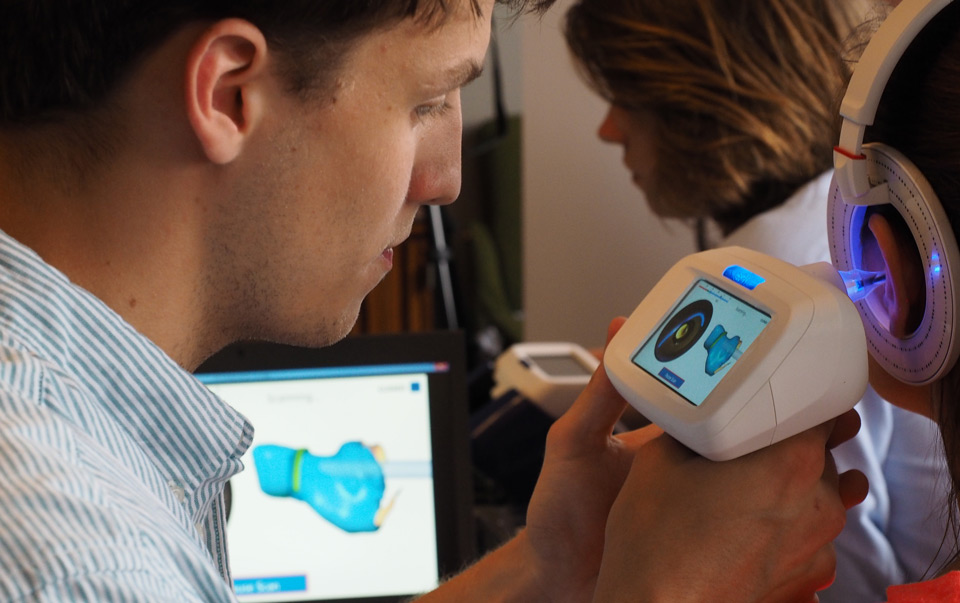  
  
9. 프로젝션 맵핑을 쉽게 도와주는 기술  
https://www.kickstarter.com/projects/theheavymteam/heavym-bring-projection-to-another-level/description  
  
  
10. 한글 시계  
http://www.wadiz.kr/Campaign/Details/1240  
  
  
11. 세그웨이 형태의 1인용 운송기기.  
https://www.indiegogo.com/projects/revobot-the-most-advanced-body-gravity-board#/story  
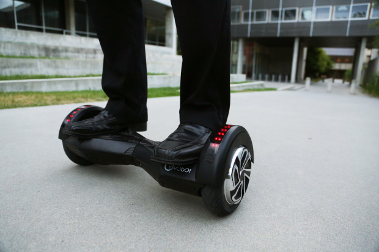  
  
12. 멍멍이들 쉽게 목욕시킬 수 있는 아이디어 제품  
http://www.woofwasher360.com  
  
  
13. 일반 자동차에 설치하면 무인 자동차로 만들어주는 기기.  
http://spectrum.ieee.org/cars-that-think/transportation/self-driving/first-aftermarket-autonomous-cars-hit-the-road-in-california  
  
  
14. 자전거 페달링으로 기기를 충전할 수 있게 만들어주는 악세서리  
http://www.psfk.com/2015/07/beagle-street-black-sun-documentary-gary-tarn-leapsecondmovie.html  
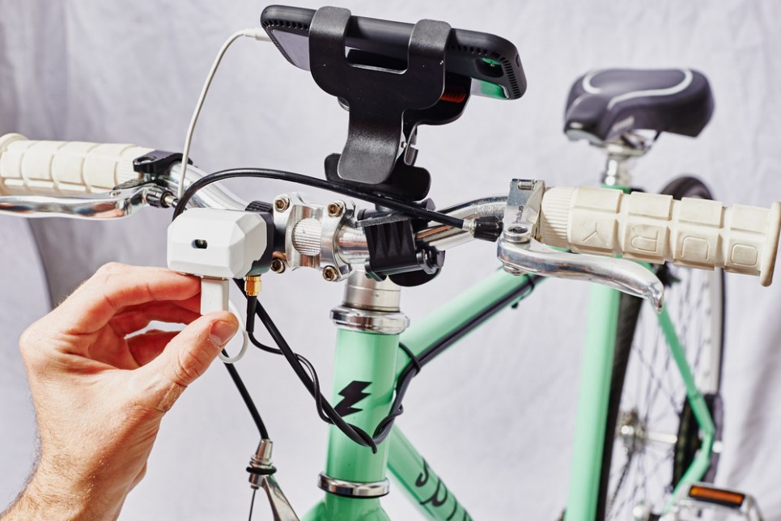  
  
15. 휴대폰 케이블로 충전하는 건전지  
http://www.bloter.net/archives/231392  
  
  
16. 영상촬영에 최적화된 모듈형 스마트폰 케이스  
https://www.kickstarter.com/projects/olloclip/olloclip-studio-an-integrated-mobile-photography-s  
  
  
18. 빛을 내는 미세한 LED를 인쇄하는 기술  
http://www.earlyadopter.co.kr/59334  
  
  
19. 스윙을 분석,트래킹하는 골프 장갑  
http://www.engadget.com/2015/06/30/piq-golf-sensor/  
  
  
20. 헬스 트레이닝을 시켜주는 스마트 거울 디스플레이  
http://techcrunch.com/2015/06/30/smartspot-which-brings-computer-vision-to-gyms-and-trainers-raises-1-85m-from-khosla-signalfire/?ncid=rss&utm_source=feedburner&utm_medium=feed&utm_campaign=Feed%3A+Techcrunch+%28TechCrunch%29  
  
  
21. 오페라에 배우로 출연한 로봇.  
http://www.cnet.com/news/can-a-robot-feel-robot-singer-takes-on-touchy-opera-role/  
  
  
22. 위생적이고 손쉽게 변기를 청소해주는 기기  
http://www.engadget.com/2015/06/30/loogun-toilet-cleaner/  
  
  
23. 살균기능이 있는 텀블러  
http://www.earlyadopter.co.kr/59046  
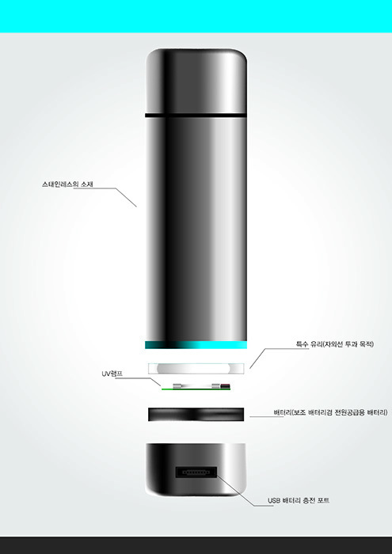  
  
  
          
---                
#150629      
> 2015년 26주차 **HOT DEVICE EVERY WEEK**                
>                 
            
---                
  
1. 가족용 스마트 전화기  
각각의 스마트폰으로 단절된 소통문제를 해결.  
http://www.wired.com/2015/06/landline-inspired-gadget-aims-outdo-smartphone/?mbid=social_fb  
  
  
2. 자동차용 HUD(Head Up Display) 네비게이션  
https://www.indiegogo.com/projects/iris-your-car-and-network-combined#/story  
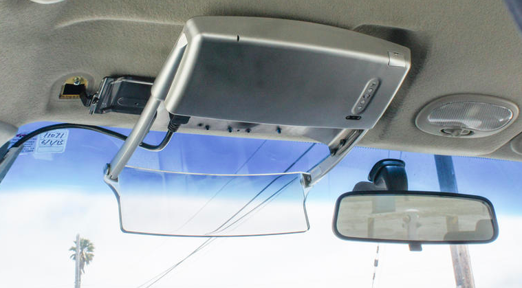  
  
3. 근로자가 무거운 물건을 쉽게 들 수 있게 도와주는 외골격 로봇.  
http://m.irobotnews.com/news/articleView.html?idxno=5154  
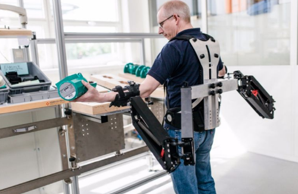  
  
4. 새로운 형태의 보청기.  
http://techcrunch.com/2015/06/25/with-13-million-from-maveron-eargo-is-the-hearing-aid-of-the-future/?ncid=rss&utm_source=feedburner&utm_medium=feed&utm_campaign=Feed%3A+Techcrunch+%28TechCrunch%29#.ugp8yw:482P  
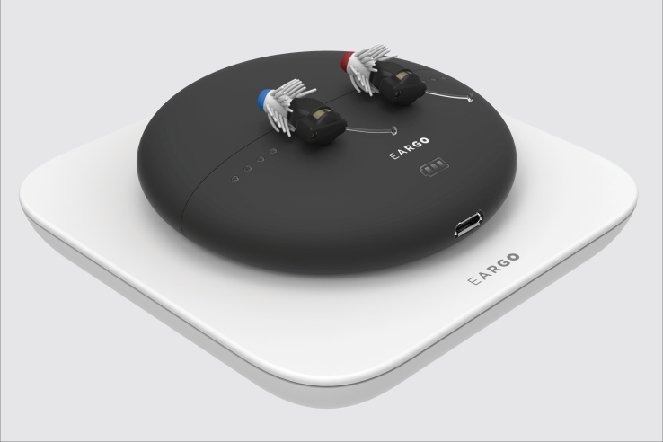  
  
5. 버튼으로 카메라의 방향전환을 할 수 있는 셀카봉  
http://www.earlyadopter.co.kr/45243  
  
  
6. 블루투스 스피커가 내장된 전구  
http://www.theverge.com/2015/6/24/8838297/astro-twist-light-bulb-speaker-apple-airplay  
  
  
7. 테니스 라켓에 끼워서 운동을 분석하는 기기.  
http://www.earlyadopter.co.kr/45198  
  
  
8. 의자에 앉는 것처럼 이동하는 전동 바이크  
http://www.yikebike.com  
  
  
9. 조각품 표면을 쉽게 가공할 수 있는 장갑.  
http://www.psfk.com/2015/06/glove-carving-tools-the-happaratus-wearable-glove.html?utm_content=bufferc7a31&utm_medium=social&utm_source=facebook.com&utm_campaign=buffer  
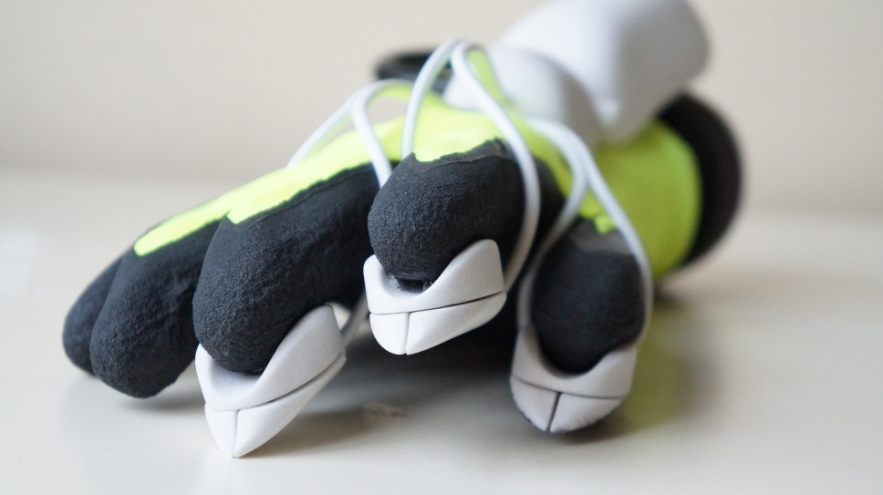  
  
10. 세워서 듣는 LP 턴테이블  
http://www.earlyadopter.co.kr/45161  
  
  
11. 허공의 손짓으로 음악을 만들 수 있는 기기  
http://www.earlyadopter.co.kr/45148  
  
  
12. 친환경 태양광 충전 모듈  
http://www.earlyadopter.co.kr/45710  
  
  
13. 스마트폰으로 찾을 수 있는 물건 추적기.  
https://www.indiegogo.com/projects/trackr-bravo-the-thinnest-tracking-device-ever--2  
  
  
14. 스마트폰,PC등의 작업을 음성명령으로 할수 있게 도와주는 웨어러블 기기.   
https://www.indiegogo.com/projects/myle-tap-wearable-thought-catcher?sf38860332=1#/story  
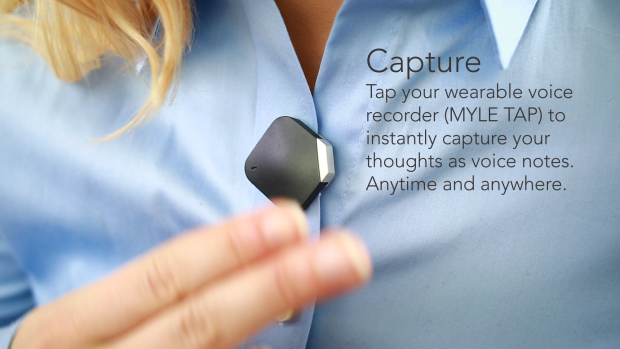  
  
15. 필기용 e잉크 보드 - 스마트폰,웹이랑 sync가능  
http://www.myboogieboard.com/as/products/boogie-board-sync-9.html  
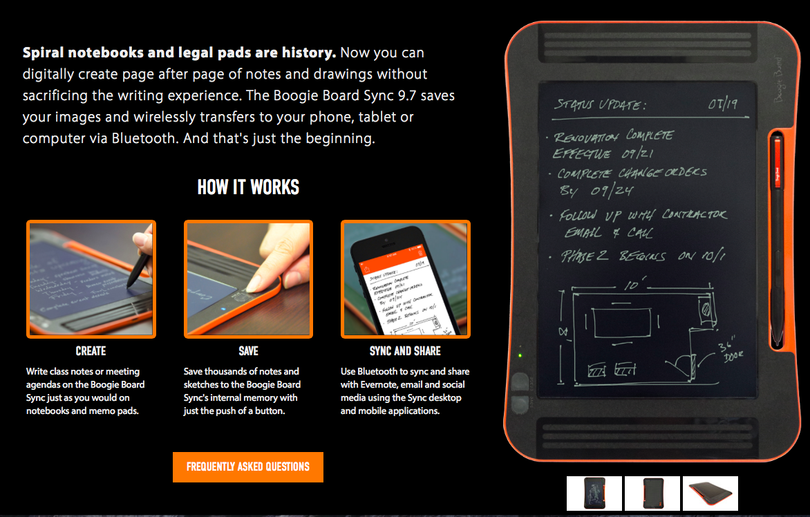  
  
16. 몸이 불편한 사람들을 위한 로봇팔.  
휠체어에 설치하여 필요한 작업들을 대신 해줌.  
http://techcrunch.com/video/kinova-robotics-techcrunch-makers/518897448/  
  
  
17. 가정용 로봇   
http://m.irobotnews.com/news/articleView.html?idxno=5150  
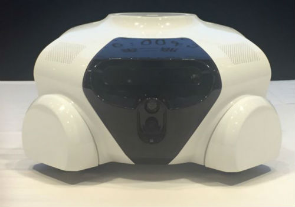  
  
18. VR 헤드셋용 게이밍 장갑(입력장치)  
http://techcrunch.com/2015/06/23/manus-machina-is-building-gaming-gloves-for-vr/?ncid=rss&utm_source=feedburner&utm_medium=feed&utm_campaign=Feed%3A+Techcrunch+%28TechCrunch%29  
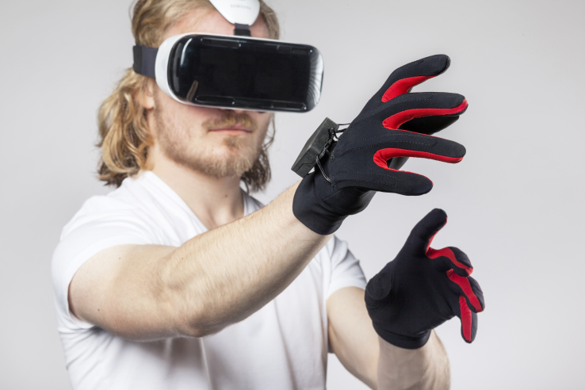  
  
19. Lexus가 만든 공중부양 스케이트 보드.   
http://www.engadget.com/2015/06/23/lexus-slide-hoverboard-magnets-teaser/  
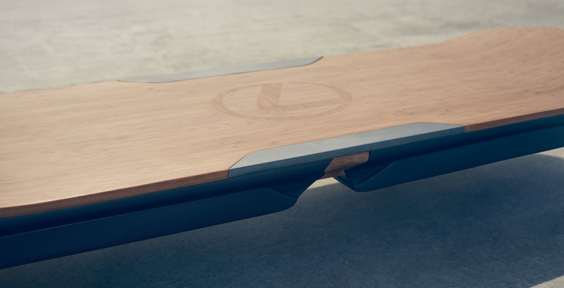  
  
20. 시간을 계산 해야하는 시계  
http://www.earlyadopter.co.kr/45110  
  
  
21. 스윙을 분석해주는 스마트 골프채  
http://thinkingandfate.tistory.com/364  
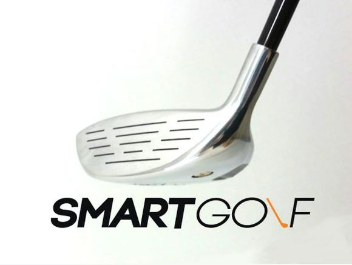  
  
22. 필립스 방수 블루투스 스피커  
http://www.earlyadopter.co.kr/45070  
  
  
23. 라즈베리 파이 공식 케이스  
http://www.engadget.com/2015/06/21/raspberry-pi-case/?utm_source=Feed_Classic_Full&utm_medium=feed&utm_campaign=Engadget&?ncid=rss_full  
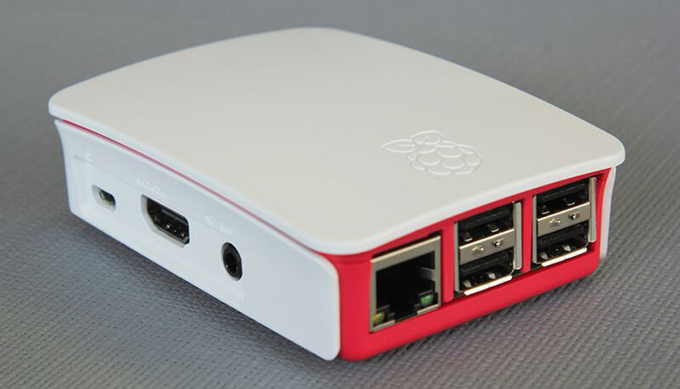  
  
24. $50 이하로 에어컨 만들기 프로젝트  
http://www.businessinsider.com/cooler-and-pvc-pipe-air-conditioner-costs-50-to-make-2015-6?utm_content=buffer82d4b&utm_medium=social&utm_source=facebook.com&utm_campaign=buffer  
  
  
  
            
---                  
#150622        
> 2015년 25주차 **HOT DEVICE EVERY WEEK**                  
>                   
              
---                  
  
1. 감정을 읽고 사람과 소통할 수 있는 로봇 페퍼 출시 178만원 (소프트뱅크)  
http://news.jtbc.joins.com/html/254/NB10933254.html  
  
  
2. 일상의 소리를 쉽게 캡쳐할 수 있는 가장 작은 무선 마이크  
마이크계의 GoPro라고 주장.  
https://www.indiegogo.com/projects/instamic-the-smart-small-gopro-of-microphones#/story  
  
  
3. 다이어터를 위한 칼로리 밥주걱  
http://www.earlyadopter.co.kr/44998  
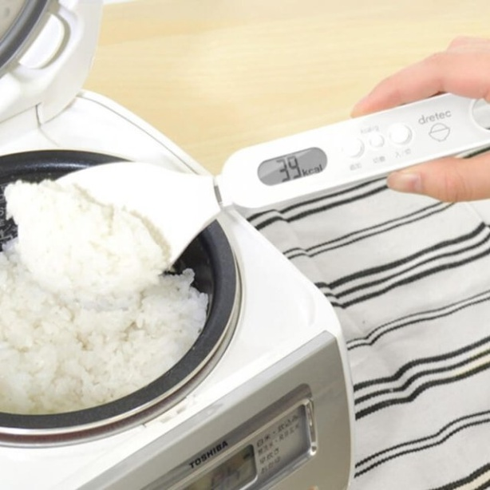  
  
4. 아이폰용 하이앤드 카메라 악세서리  
http://gizmodo.com/this-could-be-best-way-yet-of-turning-your-iphone-into-1712066271  
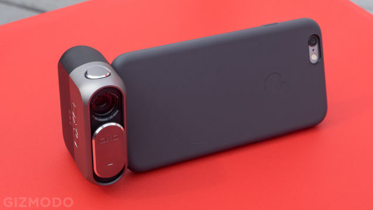  
  
5. 새로운 킨들 페이퍼화이트 출시(e북)  
전 모델보다 해상도가 높아짐.  
http://www.cnet.com/uk/products/amazon-kindle-paperwhite-2015/  
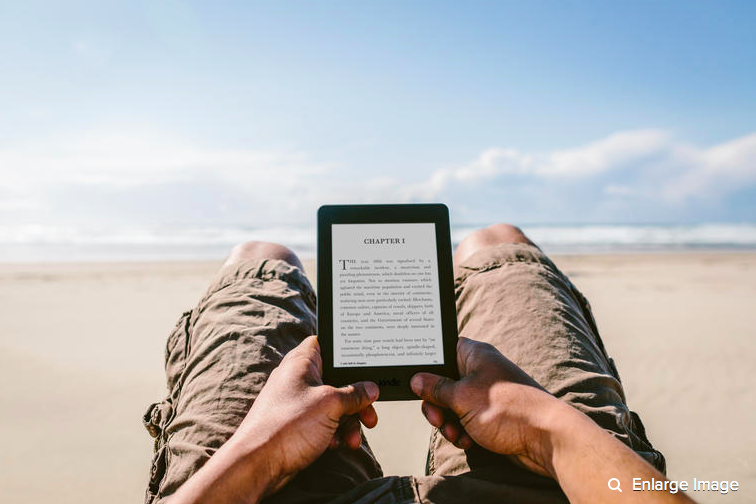  
  
6. 습기를 에너지원으로 사용하는 장치 개발.  
http://gizmodo.com/watch-humidity-power-a-miniature-car-1711930353  
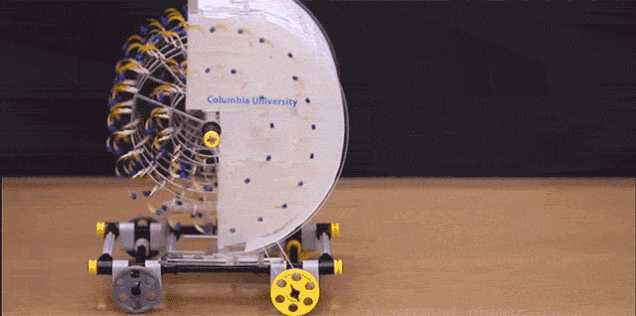  
  
7. 소형 코골이, 수면무호흡증 치료 기기.  
http://www.earlyadopter.co.kr/44836  
  
  
8. 색상을 자유롭게 바꿀 수 있는 신발.  
http://www.earlyadopter.co.kr/44828  
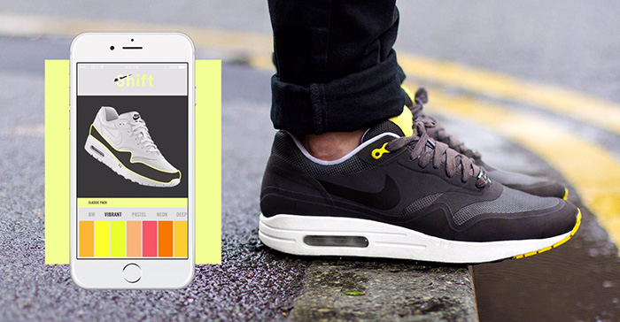  
  
9. 현관문 구멍에 장착하는 카메라  
http://www.earlyadopter.co.kr/44810  
  
  
10. 신체를 각성시키거나 편안하게 해주는 웨어러블 밴드.  
https://www.kickstarter.com/projects/1799505246/doppel-a-new-breed-of-wearable-technology-to-set-y/description  
  
  
11. 실제 주위에 있는 소리를 본인의 귀 위치에서 3D로 녹음하는 녹음기.  
https://www.kickstarter.com/projects/1553305645/openears  
  
  
12. 매우 효율적으로 걷는 로봇.  
2.2KW리튬이온 배터리 한번충전으로 10km를 걸을 수 있음.  
http://www.engadget.com/2015/06/16/ultra-efficient-robot-walks-like-people/?utm_source=Feed_Classic_Full&utm_medium=feed&utm_campaign=Engadget&?ncid=rss_full  
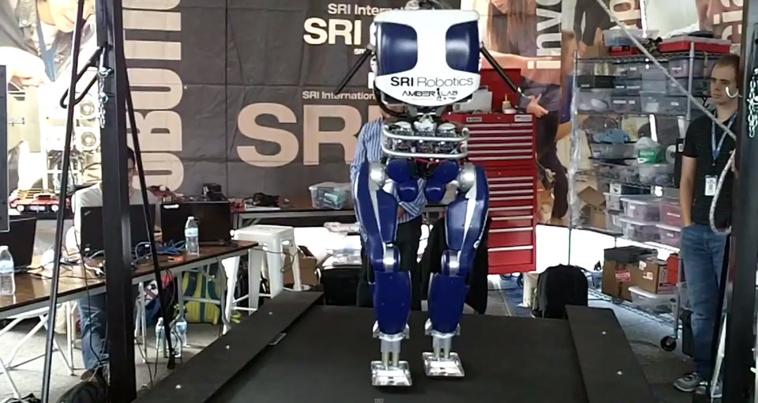  
  
13. 다이슨 LED스탠드.  
http://www.earlyadopter.co.kr/44665  
  
  
14. 방수 블루투스 스피커  
http://www.earlyadopter.co.kr/44918  
  
  
15. 아이폰을 액션캠으로 만들어 주는 케이스  
http://www.earlyadopter.co.kr/44676  
  
  
16. 근육을 수치화 해서 관리해주는 기기.  
http://techholic.co.kr/archives/34355?utm_source=twitterfeed&utm_medium=facebook  
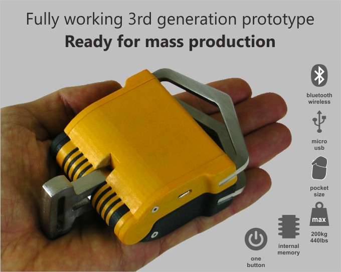  
  
17. 손동작이 불편한 사람들을 위한 로봇 장갑  
http://www.technologyreview.com/news/538181/soft-robotic-glove-could-put-daily-life-within-patients-grasp/  
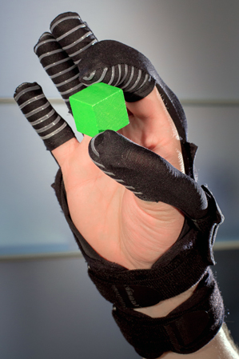  
  
18. 다리를 3D프린팅 하는 프로젝트.  
http://www.cnet.com/news/gravity-defying-3d-printer-to-print-bridge-over-water-in-amsterdam/  
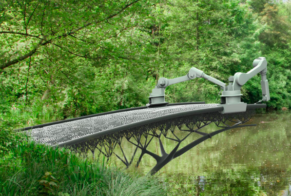  
  
19. 수도꼭지를 원격으로 틀었다 잠갔다 할 수 있는 기기  
http://www.cnet.com/products/wise-orchard/  
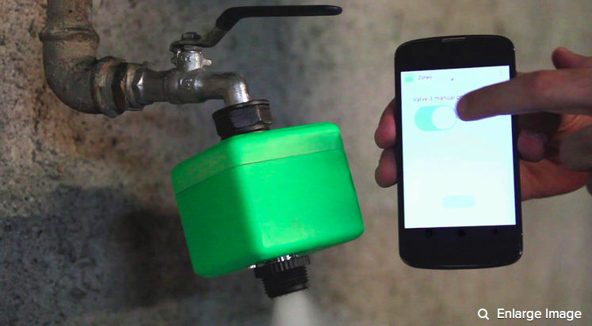  
  
  
              
---                    
#150615  
> 2015년 24주차 **HOT DEVICE EVERY WEEK**                    
>                     
                
---                    
  
1. 한시간이면 조립할 수 있는 오픈소스 전기 자동차 플랫폼.  
누구나 설계도를 받아서 제작할 수 있고, 이 회사는 구글에 인수되었음.  
https://www.osvehicle.com/osv-platform/  
  
  
2. 고프로 잠수함.  
http://www.cnet.com/news/take-your-gopro-for-a-dive-with-the-seawolf-rc-sub/  
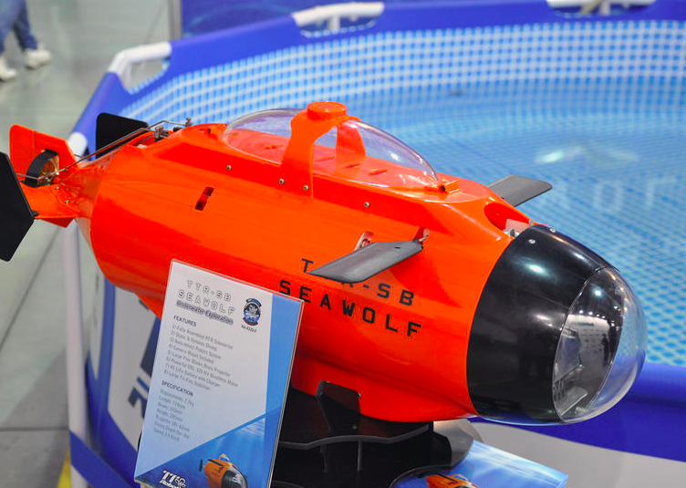  
  
3. 가정용 헬스 케어 로봇.  
http://techcrunch.com/2015/06/12/catalia-health-gets-1-25-million-from-khosla-ventures-for-its-healthcare-robot/?ncid=rss&utm_source=feedburner&utm_medium=feed&utm_campaign=Feed%3A+Techcrunch+%28TechCrunch%29#.ugp8yw:Bkt8  
  
  
4. 성냥갑 크기로 접히는 종이 배터리.  
박테리아의 호흡을 이용해 전기를 만드는 시스템을 종이 위에 구현  
http://biz.chosun.com/site/data/html_dir/2015/06/12/2015061201670.html?outlink=facebook  
  
  
5. 스토리 텔링 대신 해주는 기기.  
주로 조부모님이 손자들을 위해 스토리를 읽어주면 자동으로 자녀들이 가진 기기로 전송되고 들을 수 있음.  
멀리 떨어져있는 가족간의 소통문제를 해결.  
http://www.gizmag.com/storyhome-family-storytelling-device/37947/?sf38625633=1  
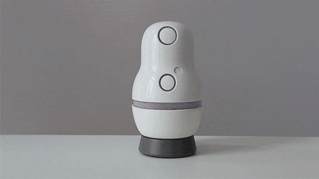  
  
6. 자외선으로 책상위를 살균하는 로봇 살균 청소기.  
http://www.digitaltrends.com/home/uve-robotic-countertop-cleaner-sanitizes-with-ultraviolet-light/?utm_source=facebook+&utm_medium=socialm&utm_campaign=home  
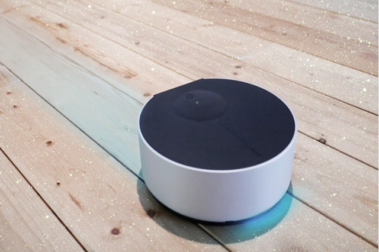  
  
7. 계단을 올라갈 수 있는 휠체어  
http://gizmodo.com/this-incredible-wheelchair-can-climb-stairs-like-a-tank-1710868819  
  
  
8. 드디어 출시된 오큘러스 리프트의 정식 소비자용 VR헤드셋과 컨트롤러.  
지금까지는 개발자용이었음.  
http://news.naver.com/main/read.nhn?mode=LSD&mid=sec&sid1=105&oid=001&aid=0007655456&viewType=pc   
  
http://techcrunch.com/2015/06/11/watch-our-first-look-at-the-new-oculus-rift-and-touch-controller-hardware/?ncid=rss&utm_source=feedburner&utm_medium=feed&utm_campaign=Feed%3A+Techcrunch+%28TechCrunch%29  
  
9. 초소형 로봇 벌.  
http://www.nationalgeographic.com/explorers/explorers-week/explorer-moment-rob-wood-robobee/?utm_source=Facebook&utm_medium=Social&utm_content=link_fb20150611ng-explorermomentwood&utm_campaign=Content&sf9907601=1  
  
  
10. 블루투스 기능이 없는 스피커를 블루투스 스피커로 바꿔주는 기기(차량용)  
http://aboutcar.motorgraph.com  
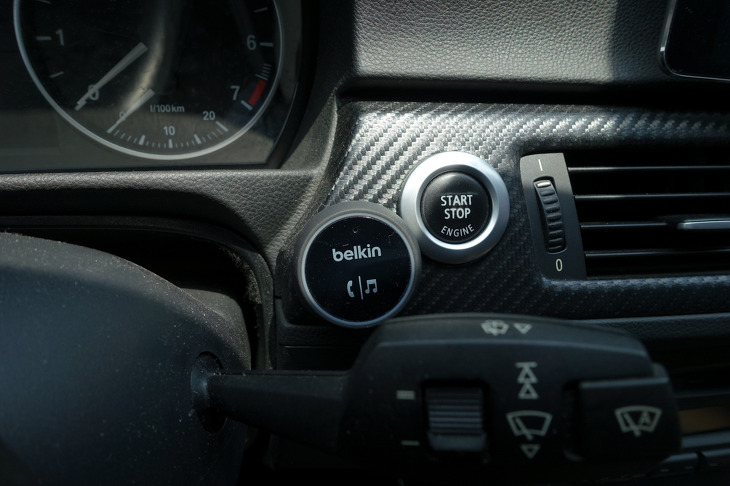  
  
11. 3D홀로그램 출력 기기  
http://techcrunch.com/2015/06/10/holus-is-a-tabletop-device-that-turns-digital-media-into-a-3d-hologram/#.ugp8yw:vsMc  
  
  
12. Nest의 스마트 홈 카메라  
http://www.engadget.com/2015/06/10/nest-camera-leak/?utm_source=Feed_Classic_Full&utm_medium=feed&utm_campaign=Engadget&?ncid=rss_full  
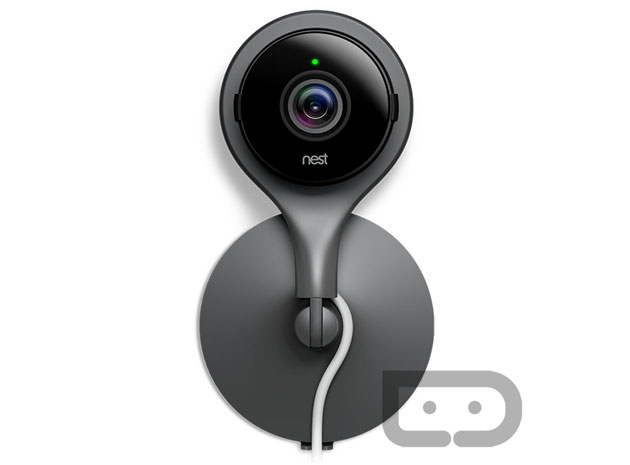  
  
13. 피부암을 조기 진단할 수 있는 스마트폰 악세서리  
http://www.digitaltrends.com/mobile/molescope-skin-cancer-detecting-smartphone-accessory-news/?utm_source=facebook&utm_medium=socialm&utm_campaign=mobile  
  
  
14. 대형 투명 디스플레이 티비  
http://www.cnet.com/uk/news/samsung-shows-retail-ready-transparent-mirrored-oled/  
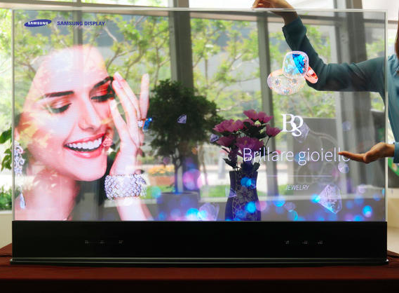  
  
15. 물의 움직임으로 동작하는 컴퓨터  
http://news.stanford.edu/news/2015/june/computer-water-drops-060815.html  
  
  
16. 파스처럼 붙이는 진통 완화기기.  
http://www.zdnet.com/article/cur-wearable-targets-chronic-pain-offering-immediate-relief/  
  
  
17. 샤오미가 출시한 에어컨  
http://www.earlyadopter.co.kr/44434  
  
  
18. 모듈형 사운드 시스템  
https://www.indiegogo.com/projects/kien-the-first-flexible-sound-system#/story  
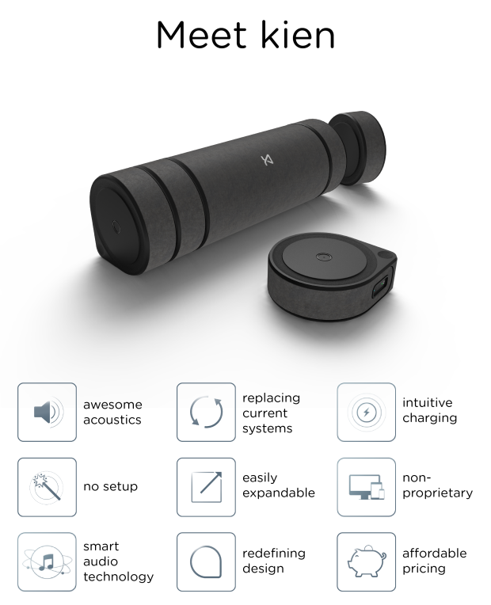  
  
19. 자동차의 HUD방식과 같은 홀로그램 날씨 시계  
http://www.earlyadopter.co.kr/44247  
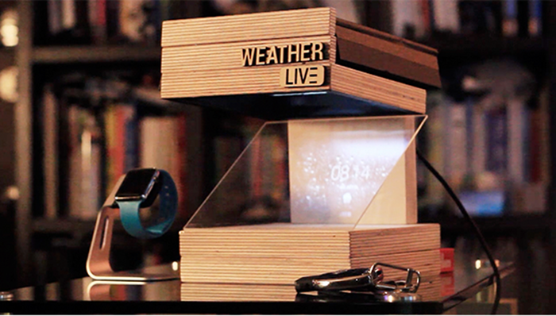  
  
20. 스마트 깔창  
http://www.psfk.com/2015/06/smart-insoles-feet-me-hax-runners-health.html  
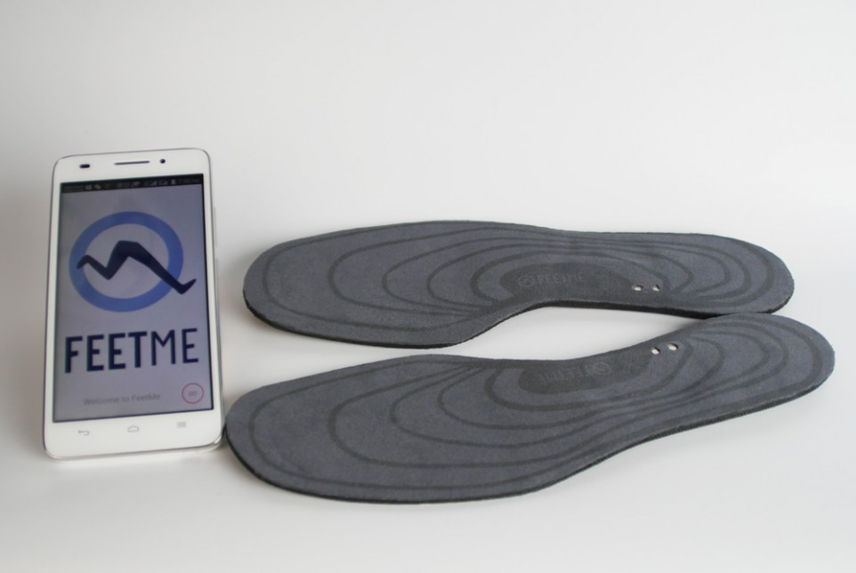  
  
21. 웨어러블 공기 상태 측정기.  
http://www.earlyadopter.co.kr/44173   
  
  
22. 복합적인 기능을 가진 아웃도어용 키트  
http://www.earlyadopter.co.kr/44089  
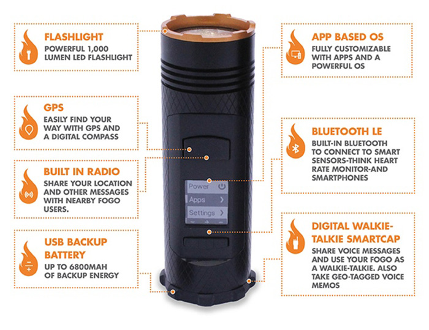  
  
  
                
---                      
#150608    
> 2015년 23주차 **HOT DEVICE EVERY WEEK**                      
>                       
                  
---                      
  
  
1. DRC(DARPA Robotics Chanllenge) 우승한 KAIST팀 로봇 (DRC-HUBO)  
현존 가장 권위있는 로봇 대회라고 볼 수 있으며,  
한국팀이 로봇 최강국인 미국, 일본팀을 제치고 우승을 차지한 것은 놀라울 만한 성과임.  
#robotics  
http://www.theroboticschallenge.org/finalist/kaist  
http://www.nytimes.com/2015/06/07/science/korean-robot-makers-walk-off-with-2-million-prize.html?emc=edit_th_20150607&nl=todaysheadlines&nlid=55481950&_r=0  
  
  
2. 실제 소리에서 듣고싶은 소리만 볼륨을 키우고 원하지 않는 소리는 볼륨을 낮출 수 있는 이어폰.  
https://www.kickstarter.com/projects/dopplerlabs/here-active-listening-change-the-way-you-hear-the  
  
  
3. 병원에서 아이들의 걱정,불안을 감소시켜주는 곰돌이 로봇.  
뒤에서 사람이 원격조정으로 아이들과 대화하며, 아이들은 실제 곰돌이가 말하고 움직이는줄 앎.  
#robotics  
http://www.nytimes.com/2015/06/04/technology/huggable-robot-therapeutic-value-hospitals.html?hp&action=click&pgtype=Homepage&module=photo-spot-region&region=top-news&WT.nav=top-news&_r=1  
  
  
4. 아무 신발에나 부착할 수 있는 롤러 스케이트.  
https://www.kickstarter.com/projects/flaneurz/on-wheelz-walk-and-roll-with-your-favorite-shoes  
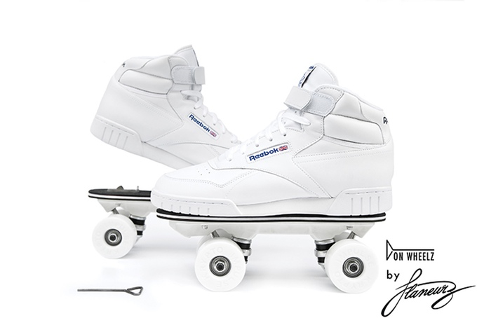  
  
5. 어쿠스틱 기타에 부착하여 여러 sound를 만들어 낼 수 있는 MIDI 컨트롤러  
http://acpad.com/#brief  
  
  
6. 자외선 차단제의 효과를 광고하는 인형(NIVEA)  
http://www.earlyadopter.co.kr/43893  
  
  
7. 프로젝터가 내장되어있는 키보드. 모니터가 필요없음.  
http://www.cnet.com/uk/news/work-anywhere-with-a-wall-with-the-sho-u-kibojet-keyboard-projector/  
  
  
8. 스페이스바에 정전식 터치 패널이 장착된 키보드.  
스페이스바를 이용한 새로운 input동작 가능.  
http://www.engadget.com/2015/06/03/synaptics-smartbar/?utm_source=Feed_Classic_Full&utm_medium=feed&utm_campaign=Engadget&?ncid=rss_full  
  
  
9. WIFI로 전기를 얻는 카메라 모듈  
http://www.geek.com/science/researchers-develop-camera-powered-via-wifi-1624521/  
  
  
10. 나무로 만든 부드러운 배터리  
http://interestingengineering.com/squeezable-soft-body-battery-made-from-wood/  
  
  
11. 로봇 사무라이  
#robotics  
http://www.engadget.com/2015/06/05/robot-and-samurai-face-off-in-an-awesome-sword-duel/?utm_source=Feed_Classic_Full&utm_medium=feed&utm_campaign=Engadget&?ncid=rss_full  
  
  
12. 콘센트에 꽂아 사용하는 Windows돌아가는 PC   
http://www.geek.com/news/these-wall-warts-are-actually-full-windows-pcs-1624377/  
  
  
13. 디지털 Handpan 악기  
http://blog.atmel.com/2015/06/02/oval-is-the-worlds-first-digital-handpan/?sf38467268=1  
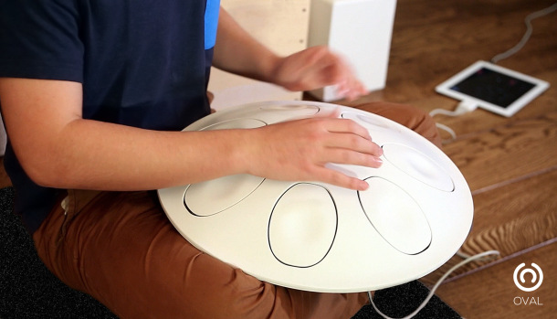  
  
14. 런던 경찰이 착용하게될 body cam, 버스의 블랙박스와 비슷한 개념?  
http://www.engadget.com/2015/06/03/london-police-body-cameras/?utm_source=Feed_Classic_Full&utm_medium=feed&utm_campaign=Engadget&?ncid=rss_full  
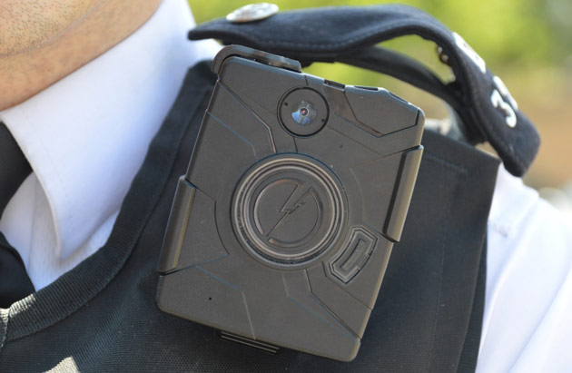  
  
15. 인텔의 스마트종이, 프로젝터와 구멍뚤린 종이를 이용해 유용한 정보를 출력.  
https://www.youtube.com/watch?v=o8Aat7V7OFM&feature=youtu.be  
  
  
16. 내일의 날씨를 알려주는 상자.  
http://www.huffingtonpost.kr/2015/06/02/story_n_7492152.html  
  
  
17. 모든 물병을 스마트 물병으로 만드는 뚜껑.  
http://www.earlyadopter.co.kr/43863  
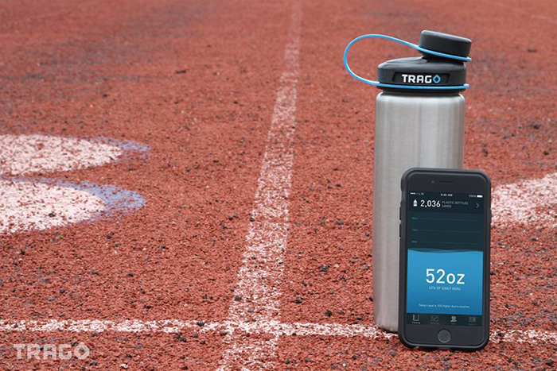  
  
18. 규칙적으로 물을 마시도록 도와주는 스마트 물병  
http://www.earlyadopter.co.kr/43795  
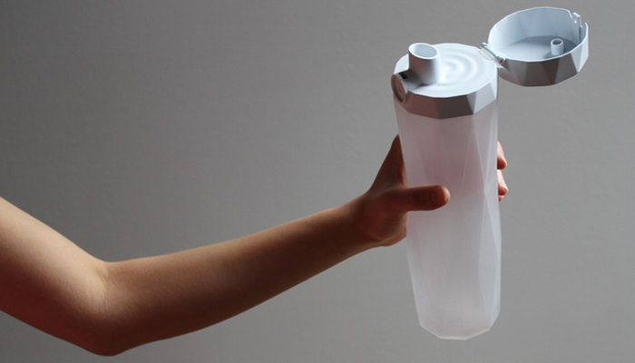  
  
19. 레이져 트랙패드.   
http://www.engadget.com/2015/06/03/laser-projected-mouse-robot-head/?utm_source=Feed_Classic_Full&utm_medium=feed&utm_campaign=Engadget&?ncid=rss_full  
  
  
20. 기분을 전환시켜주는 헤드셋.  
https://bcitechreview1.wordpress.com/2015/06/03/thync의-기분-전환-헤드셋/  
  
  
21. 애플 스마트 홈킷으로 만든 첫번째 스마트홈 제품.  
http://recode.net/2015/06/02/first-apple-smart-home-products-launch-ahead-of-worldwide-developer-conference/  
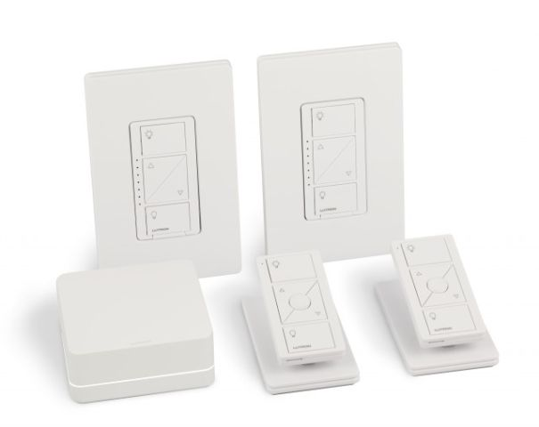  
  
22. Introduce the 바퀴 로봇  
움직일때 귀여움 주의  
#robotics  
http://interestingengineering.com/super-fast-robot-x2-velociroach-can-run-11-miles-per-hour/  
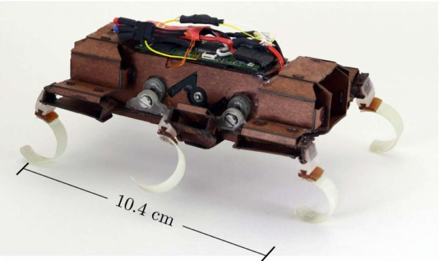  
  
23. 무서운 짐을 사람처럼 밀어서 이동시키는 로봇.  
#robotics  
http://www.engadget.com/2015/06/02/robot-push-heavy-objects/?utm_source=Feed_Classic_Full&utm_medium=feed&utm_campaign=Engadget&?ncid=rss_full  
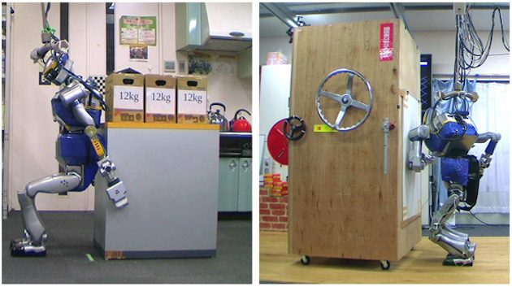  
  
24. 기저귀 상태를 파악하는 스마트 기저귀  
http://www.engadget.com/2015/06/02/acer-diaperpie-intel-edison/?utm_source=Feed_Classic_Full&utm_medium=feed&utm_campaign=Engadget&?ncid=rss_full  
  
  
25. 좀더 안경 같다고 주장하는(?) VR 헤드셋  
http://www.psfk.com/2015/06/virtual-reality-goggles-weigh-four-ounces-dlodlo-vr-goggles.html  
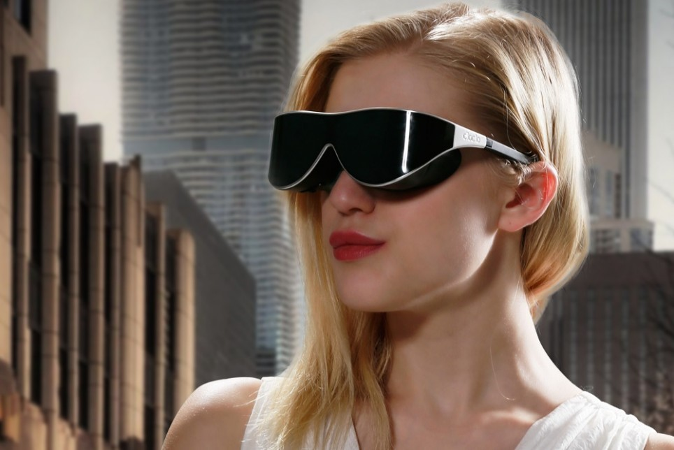  
  
  
  
                    
---                          
#150601       
> 2015년 22주차 **HOT DEVICE EVERY WEEK**       
>       
                      
---                          
    
Google I/O 행사에서 진행된 4가지 프로젝트부터 소개합니다.    
    
1. Google Project #0 VR 3D영상 스트리밍용, 360-degree camera array    
카메라가 많은 이유는 모든 방향의 양안시차가 있는 영상을 만들기 위함임.     
VR기기의 왼쪽눈과 오른쪽눈의 영상이 서로 달라서 공간감을 느낄 수 있음.    
이 카메라 array로 만든 영상을 VR기기를 쓰고 보면 실제 그 장소에 있는것처럼 느낄 수 있음.    
#VR    
http://www.engadget.com/2015/05/28/gopro-360-degree-camera-array-for-vr/?utm_source=Feed_Classic_Full&utm_medium=feed&utm_campaign=Engadget&?ncid=rss_full    
    
    
2. Google Project #1 Project Jacquard    
스마트실. 기존 터치패널이 아닌 천위에서 터치하는 기술.    
옷의 일부를 이 스마트실로 만들고 디바이스를 이 옷 위에서 컨트롤 가능.    
#wearable    
http://www.popsci.com/googles-levi's-computers-clothing-project-jacquard?dom=fb&src=SOC    
http://www.cnet.com/news/google-fabrics-and-fashion-a-peek-at-project-jacquard/    
    
    
3. Google Project #2 Project Tango    
스마트폰으로 3D 공간 지도를 만들어줌.    
#mobile    
http://www.engadget.com/2015/05/29/google-qualcomm-project-tango-phone/?utm_source=Feed_Classic_Full&utm_medium=feed&utm_campaign=Engadget&?ncid=rss_full    
(참고 Tango Tablet, 2014)    
http://www.engadget.com/2015/05/28/google-project-tango-public-release/?utm_source=Feed_Classic_Full&utm_medium=feed&utm_campaign=Engadget&?ncid=rss_full    
    
    
4. Google Project #3 Project Soil    
radar를 이용 손의 제스쳐를 인식함.    
#input_device    
http://www.engadget.com/2015/05/29/atap-project-soli%20/?utm_source=Feed_Classic_Full&utm_medium=feed&utm_campaign=Engadget&?ncid=rss_full    
    
    
5. 키보드위에서 바로 터치패널 이용해 마우스 제어.    
#input_device    
https://www.indiegogo.com/projects/moky-invisible-touchpad-with-keyboard#/story    
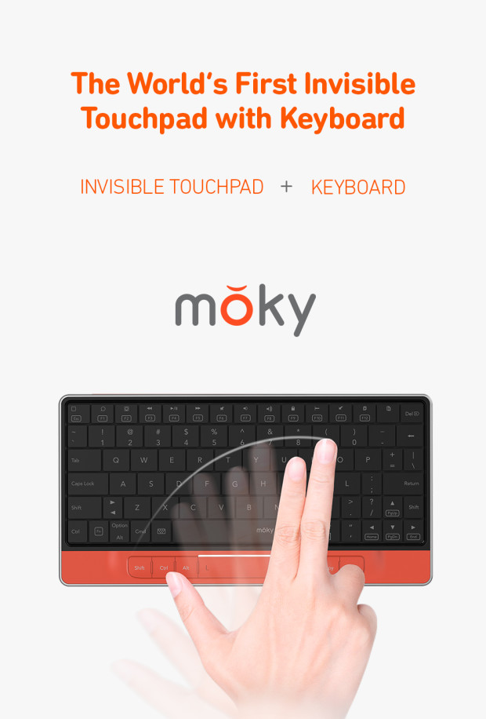    
    
6. 향기로 일어날 수 있는 알람시계    
#smart_home    
http://uncrate.com/stuff/sensorwake-scent-alarm-clock/    
    
    
7. 피자박스 스마트폰 프로젝터 (피자헛)    
피자를 먹으면서 같이 영화볼수 있도록.     
#mobile_accessary    
http://www.engadget.com/2015/05/27/pizza-hut-projector-box/?utm_source=Feed_Classic_Full&utm_medium=feed&utm_campaign=Engadget&?ncid=rss_full    
    
    
8. 디즈니 캐릭터의 걸음걸이를 로봇으로(연구)    
#robotics    
http://thenextweb.com/shareables/2015/05/26/disney-brings-animated-characters-to-life-as-robots/    
    
    
9. 스스로 몸을 접을 수 있는 마이크로 로봇.    
평상시엔 껌종이같이 얇게 펴져있고, 접히면, 기어다닐수 있고 수영도 할 수 있고, 짐을 나르기도 함.    
미친 로봇임.    
#robotics    
http://techcrunch.com/2015/05/29/meet-an-origami-robot-that-can-build-itself-run-around-and-then-dissolve/?ncid=rss&utm_source=feedburner&utm_medium=feed&utm_campaign=Feed%3A+Techcrunch+%28TechCrunch%29    
    
    
10. 집안의 모든 가전을 이 하나의 기기로 제어.    
#smart_home #IoT    
http://www.earlyadopter.co.kr/43452    
    
    
11. 점프해서 허들을 뛰어넘는 치타 로봇(MIT)    
#robotics    
http://www.wired.com/2015/05/watch-terrifying-cheetah-robot-jump-hurdles/?mbid=social_fb    
    
    
12. 날수도 있고 날개로 기어다닐 수 있는 드론(박쥐형태).    
#drone    
http://interestingengineering.com/daler-drone-vampire-bat-can-fly-and-walk/    
    
    
13. GoPro카메라를 360도 전방위를 촬영할수 있게 도와주는 기기.    
#action_cam    
http://www.engadget.com/2015/05/27/gopro-spherical-camera-drone/    
    
    
14. 사용자 얼굴의 표정도 인식이 되는 VR기기 (facebook)    
#VR    
http://www.psfk.com/2015/05/facebook-oculus-rift-facial-performance-sensing-head-mounted-display-hao-li.html    
    
    
15. 실내 공기 상태를 모니터링 해주는 기기.    
#smart_home #IoT    
http://www.engadget.com/2015/05/27/the-awair-helps-you-breathe-easier-by-tracking-air-quality/?utm_source=Feed_Classic_Full&utm_medium=feed&utm_campaign=Engadget&?ncid=rss_full    
    
    
16. 로봇 새를 로봇 바퀴가 날려줌.    
#robotics    
http://www.cnet.com/news/watch-a-robotic-cockroach-launch-a-robotic-bird/    
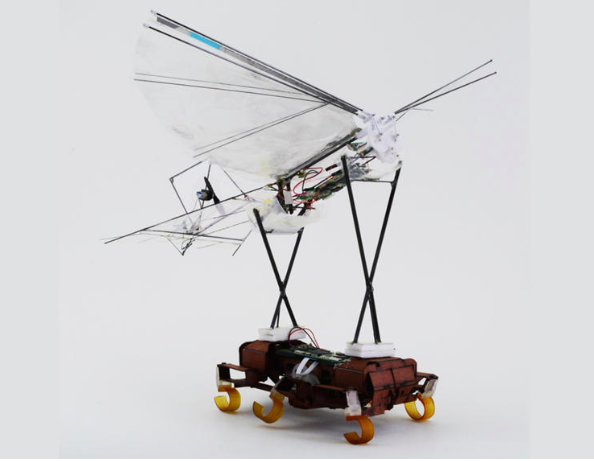    
    
17. 팅커벨 사이즈 군용 스파이캠 드론.    
#drone    
http://www.engadget.com/2015/05/29/us-military-micro-drone/?utm_source=Feed_Classic_Full&utm_medium=feed&utm_campaign=Engadget&?ncid=rss_full    
    
    
18. 프로젝터가 내장된 스마트폰    
#mobile    
http://www.geek.com/mobile/lenovo-smartphone-uses-lasers-to-project-a-touchscreen-onto-any-surface-1623805/    
    
    
19. 스마트 신발(레노보)    
#wearable    
http://www.earlyadopter.co.kr/43567    
    
    
20. 모바일용 DJ mixing & scratching 기기    
#mobile_accessary    
https://www.kickstarter.com/projects/396428272/mixfader-the-worlds-1-connected-object-for-becomin    
    
    
21. 스마트폰용 휴대용 스튜디오    
#mobile_accessary    
http://www.10x10.co.kr/shopping/category_prd.asp?itemid=1078873    
    
    
22. 털을이용한 거울 (미디어 아트)    
#media_art    
http://www.engadget.com/2015/05/26/motion-sensing-pompom-mirror-recreates-your-likeness-in-fur/    
    
    
23. 스마트폰용 소형 헤드폰 앰프    
#mobile_accessary    
http://www.earlyadopter.co.kr/43433    
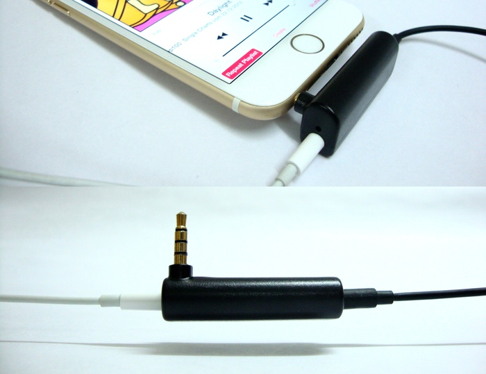    
    
24. 기름으로 움직이는 드론.    
배터리 전원을 사용하는 드론보다 더 많은 시간 빠른속도로 이용가능.    
#drone    
http://www.digitaltrends.com/cool-tech/yeair-gas-powered-drone-kickstarter/?utm_source=facebook&utm_medium=socialm&utm_campaign=cooltech    
    
    
25. 건강한 눈의 3배 시력을 갖게해주는 생체 렌즈    
#biotech    
http://media.daum.net/digital/others/newsview?newsid=20150524104523502    
    
    
26. 새로운 스킬을 사람처럼 학습하는 로봇.(연구)    
#robotics    
http://gizmodo.com/this-robot-learns-new-tasks-by-doing-them-like-a-human-1706567578?utm_campaign=socialflow_gizmodo_facebook&utm_source=gizmodo_facebook&utm_medium=socialflow    
    
    
27. 다리를 다쳐도 스스로 적응하는 로봇(연구)    
#robotics    
http://www.iflscience.com/technology/robots-can-adapt-injury-within-minutes    
    
    
    
                    
---                          
#150525     
> 2015년 21주차 **HOT DEVICE EVERY WEEK**       
>       
                      
---                          
  
  
1. 안드로이드의 뒤로가기 버튼을 아이폰에서도 가능하게 해주는 보호 필름.  
그냥 필름만 붙이면 동작함. 미세한 내부 회로 존재.  
아이폰6의 뒤로가기 버튼이 한손조작이 어려워서 해결한 아이디어.  
http://www.earlyadopter.co.kr/43052  
    
  
2. 전등 스위치 위에 부착하여 원격으로 on/off 할 수 있는 기기   
http://www.wadiz.kr/Campaign/Details/1094  
    
  
3. 잘때 낄 수 있는 부드러운 헤드폰. 수면상태도 모니터링.  
http://www.earlyadopter.co.kr/43186  
    
  
4. 스마트폰 렌즈에 부착하는 스티커형 현미경 렌즈  
http://www.earlyadopter.co.kr/43046  
    
  
5. WIFI 를 먹통으로 만들어버리는 후추통.   
스마트폰에게 빼앗긴 식사시간 대화를 되찾아옴.  
http://www.entrepreneur.com/article/246075  
    
  
6. 손목에 차는 웨어러블 블루투스 스피커  
http://thenextweb.com/gadgets/2015/05/19/this-49-wearable-bluetooth-speaker-actually-sounds-pretty-great/  
    
  
7. 인바디 밴드  
https://www.kickstarter.com/projects/1759511432/inbody-band-see-yourself-change-everyday?ref=nav_search  
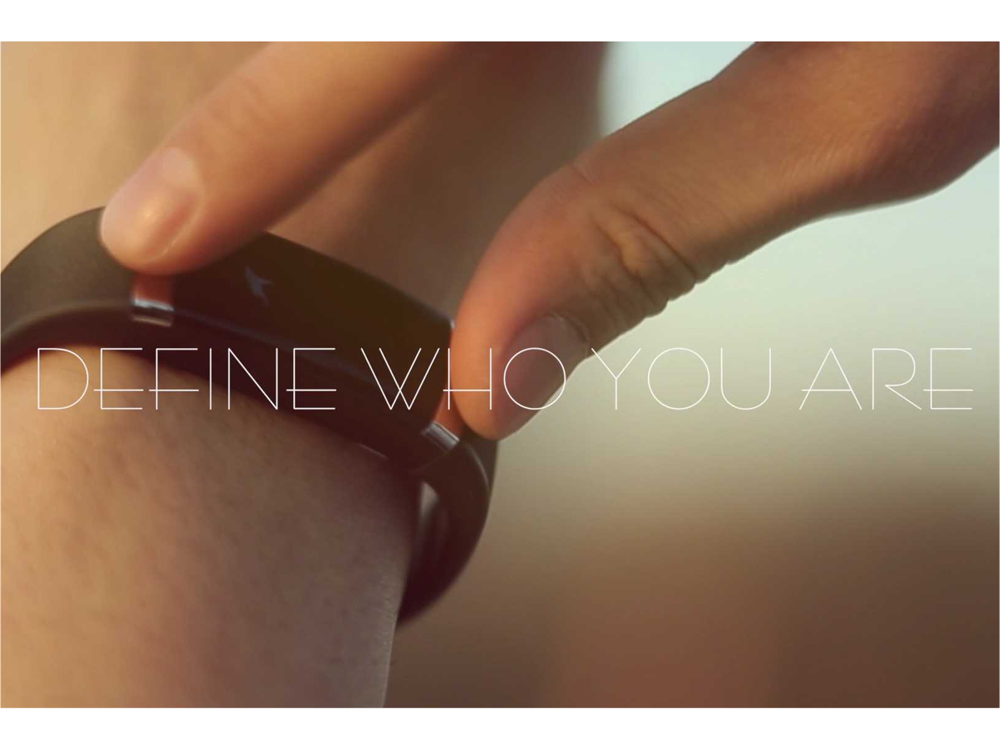    
  
8. 스마트폰 알림을 대신 울려주는 백. 여성은 스마트폰을 가방에 넣고 다니는 경우가 더 많기 때문.  
http://news.naver.com/main/read.nhn?mode=LSD&mid=shm&sid1=101&oid=366&aid=0000268022  
    
  
9. 인공지능 로봇 친구  
https://www.indiegogo.com/projects/musio-your-curious-new-friend#/story  
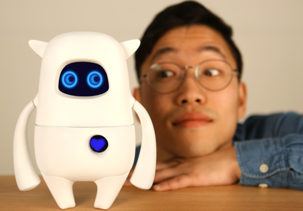    
  
10. 3D Food 데코레이션 Printer   
https://www.kickstarter.com/projects/2028227986/bocusini-worlds-first-plug-and-play-3d-food-printi  
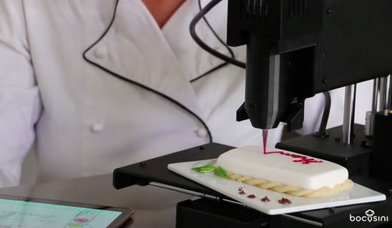    
  
11. 오렌지 껍질 겁나빨리 까는 기계  
http://sploid.gizmodo.com/video-a-machine-robot-peels-an-orange-so-fast-1706057248?utm_campaign=socialflow_gizmodo_facebook&utm_source=gizmodo_facebook&utm_medium=socialflow  
    
  
12. 아이폰6을 6분만에 충전하는 보조배터리  
http://www.earlyadopter.co.kr/43296  
    
  
13. 작고 가벼운 신형맥북용 USB-C 젠더  
http://www.earlyadopter.co.kr/43301  
    
  
14. 반려동물 위치,활동량 추적 기기, 이제 동물도 스마트폰에서 자유로울 수 없음.  
http://www.earlyadopter.co.kr/43222  
    
  
15. 태양광충전 보조 배터리  
http://www.engadget.com/2015/05/20/zerolemon-solarjuice-stackcommerce/  
    
  
16. 목적지만 입력하면 자율 비행으로 최대 6km 까지 비행하는 드론.  
http://www.earlyadopter.co.kr/43162  
    
  
17. 스마트 자전거 자물쇠  
http://uncrate.com/stuff/linka-smart-bike-lock/  
    
  
18. 태양광 충전기  
http://uncrate.com/stuff/solartab-solar-charger/  
    
  
19. 반려견에 장착하는 카메라. 심장박동수로 사진을 찍음  
http://www.psfk.com/2015/05/nikon-asia-dog-camera-heartography.html  
    
  
20. 스마트 도어벨 카메라  
http://techcrunch.com/2015/05/19/vivint-launches-a-new-home-automation-system-complete-with-a-tiny-doorbell-camera/?ncid=rss&utm_source=feedburner&utm_medium=feed&utm_campaign=Feed%3A+Techcrunch+%28TechCrunch%29#.ugp8yw:kbIg  
    
  
21. 보다 쉽게 걸을 수 있는 의족  
http://techcrunch.com/2015/05/20/brain-powered-prosthetics-get-closer-to-becoming-an-everyday-reality/  
    
  
22. 마인드컨트롤 의족  
http://www.digitaltrends.com/cool-tech/mind-controlled-bionic-prosthetics-announced/?utm_source=facebook&utm_medium=socialm&utm_campaign=cooltech  
    
  
23. 모듈형 로봇.  
http://spectrum.ieee.org/automaton/robotics/diy/fable-modular-robotics  
    
  
24. 탄성으로 전기를 생산하는 고무  
http://www.engadget.com/2015/05/18/ricoh-invents-super-efficient-power-producing-rubber/?utm_source=Feed_Classic_Full&utm_medium=feed&utm_campaign=Engadget&?ncid=rss_full  
    
  
25. 진동으로 발전하는 풍력발전기.  
http://www.theverge.com/2015/5/16/8615089/vortex-bladeless-wind-turbines-shake-to-generate-electricity  
    
  
26. 실내온도를 줄여주는 테이블. 별도의 전원 필요없음.  
http://www.wired.com/2015/05/table-sucks-heat-lower-ac-bills/?mbid=social_fb  
    
  
  
  
  
                      
---                            
#150518      
> 2015년 20주차 **HOT DEVICE EVERY WEEK**         
>         
                        
---                            
  
 1주년 기념Week  
매주 월요일 아침 출근길,등교길에   
지난주 가장 HOT 했던 디바이스를 파악해 보세요.  
  
1. 어떠한표면에 작성해도 디지털로 바로 저장이 되는 펜.   
기존제품은 특수 종이가 필요하거나, 펜촉의 위치를 측정하는 추가 장치가 필요했는데  
본 제품은 그런것이 필요없음.  
https://www.kickstarter.com/projects/1958554063/phree-make-the-world-your-paper  
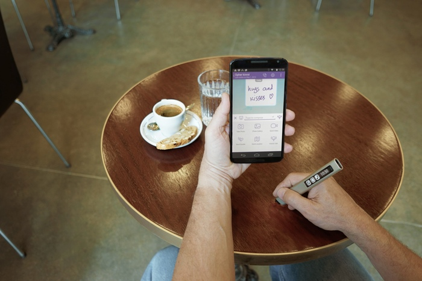  
  
2. 강아지처럼 졸졸 따라다니는 셀캠용 드론.  
몸에 추적 장치를 지니기만 하면 드론이 알아서 대상을 촬영해줌. 그리고 방수임.  
http://www.earlyadopter.co.kr/42848  
  
  
3. 기존에 쓰지않던 스마트폰 배터리를 보조 배터리로 만들어주는 장치.  
https://www.kickstarter.com/projects/betterre/better-re-upcycling-power-pack-reusing-smartphone?ref=nav_search  
  
  
4. 스마트 휴지통 = 휴지통 + 진공청소기  
http://www.earlyadopter.co.kr/42701  
  
  
5. 간단히 끼워서 가구로 만들어주는 탈부착용 다리.  
http://www.funshop.co.kr/funtenna/detail/4095  
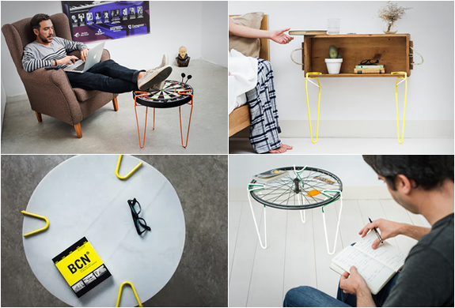  
  
  
6. 컵에 있는 물만 끓일 수 있는 전기포트.  
http://www.earlyadopter.co.kr/42825  
  
  
7. 안개를 이용한 mid-air 디스플레이 장치.  
https://vimeo.com/121979573  
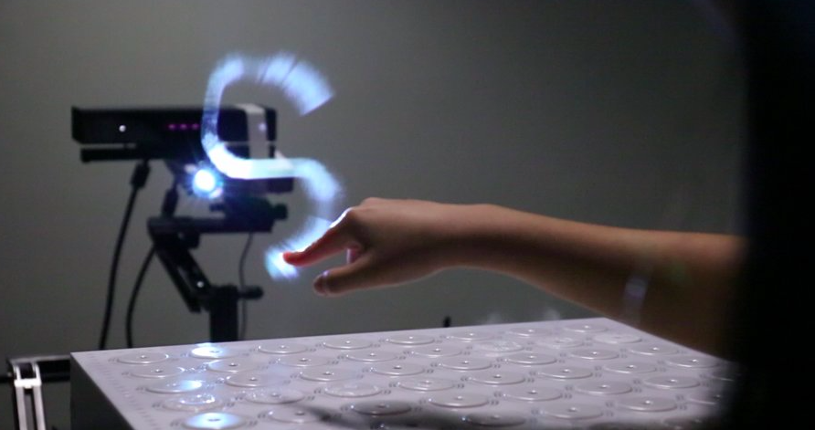  
  
8. LED 전구 블루투스 스피커(sony)  
http://www.theverge.com/2015/5/12/8590159/sony-light-bulb-speaker-announced  
  
  
9. 원격(웹페이지)으로 고양이와 놀아줄수 있는 장난감.  
http://www.cnet.com/news/tease-your-cat-with-remote-control-toys-from-anywhere/  
  
  
10. 도어벨을 누르면 스마트폰에서 누군지 영상으로 확인하고 통화할 수 있는 기기.  
집에 아무도 없어도 바로 스마트폰으로 대화할 수 있음.  
https://ring.com  
  
  
11. 라즈베리 파이용 전자잉크 디스플레이  
http://www.geek.com/chips/papirus-is-a-46-e-paper-display-for-the-raspberry-pi-1622713/  
  
  
12. 딱 전화기능만 있는 심플한 폰. 스마트폰의 각종 알림에서 해방.  
http://www.geek.com/mobile/light-phone-is-a-bright-idea-that-makes-smartphones-less-distracting-1622811/  
  
  
13. 뒷면이 전자 잉크 디스플레이인 스마트폰 요타폰(두번째 버전)  
전자잉크 디스플레이는 전원이 필요없이 마지막 디스플레이 상태를 유지하고 있음.  
http://techneedle.com/archives/20762  
  
  
  
14. 감쪽같은 인공 손가락  
https://www.youtube.com/watch?v=PWvdSP8avhg  
https://handfacts.wordpress.com/2011/06/29/lost-a-finger-upgrade-your-body-with-the-x-finger/  
  
  
15. 머리감겨주는 기계  
https://www.facebook.com/fizikist/videos/801244833257990/  
  
  
16. 타임랩스 촬영을 더 쉽게 해주는 회전 장치  
http://www.earlyadopter.co.kr/42742  
  
  
17. 피부 상태를 분석해주는 기기.  
http://besuccess.com/2015/05/waywearable/  
  
  
18. $9 짜리 컴퓨터  
http://www.huffingtonpost.kr/2015/05/11/story_n_7254232.html?1431325173  
  
  
19. 날씨 측정 해주는 스마트폰 악세서리.  
https://www.kickstarter.com/projects/weatherpoint/weather-point-the-worlds-smallest-weather-station?ref=nav_search  
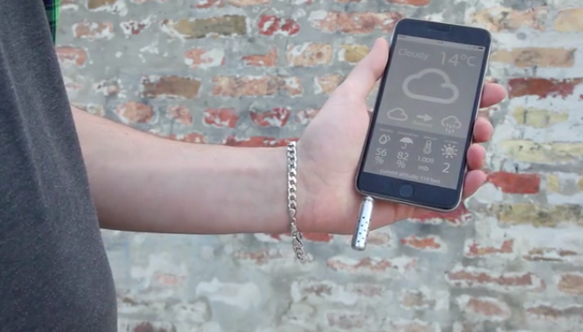  
  
20. 모든것을 버튼으로 만들어주는 기기  
http://www.engadget.com/2015/05/11/makey-makey-go-kickstarter-launch/  
  
  
21. 자전거를 탈때 부는 바람으로 팬을 돌려 전기를 생산하는 $5 짜리 발전기.  
http://www.huffingtonpost.kr/2015/05/10/story_n_7253712.html?ncid=fcbklnkkrhpmg00000001  
  
  
22. 발로 밟아 쉽게 탈수하는 수동 탈수기  
https://www.youtube.com/watch?v=SUgF24GcDi0  
  
  
23. 다리에 착용하여 무거운짐을 쉽게 들수있게 도와주는 웨어러블 엑소슈트.  
http://www.geek.com/news/japanese-banks-now-have-money-grabbing-robotic-exoskeletons-that-are-probably-great-for-bank-robbery-1622425/  
  
  
24. 디스플레이도 되는 스마트 거울  
http://mashable.com/2015/05/15/starwood-technology/?utm_cid=mash-com-fb-main-link  
  
  
25. 피자를 시킬 수 있는 탁상 시계   
http://thenextweb.com/shareables/2015/05/14/what-time-is-it/  
  
  
26. 자물쇠를 30초 안에 해체하는 로봇.  
http://www.wired.com/2015/05/little-3-d-printed-robot-cracks-combination-locks-30-seconds/?mbid=social_fb  
  
  
27. 수돗물을 채워넣고 바로 마실 수 있는 스마트 정수기  
https://drinkcove.com/shop  
  
  
28. 어떤 곳이든 터치스크린으로 만들어주는 프로젝터.  
https://www.indiegogo.com/projects/touchpico-turn-any-surface-into-a-touch-screen  
  
  
  
오늘 부로 #지난주_핫_IT_프로덕트 가 포스팅 1주년을 맞이 하였습니다.  
  
  
                        
---                              
#150511        
> 2015년 19주차 **HOT DEVICE EVERY WEEK**           
>           
                          
---                              
  
오늘부로 딱 1년째 포스팅을 하였습니다.  
지난 1년 52주 동안 총 647개의 흥미로운 제품을 소개 하였습니다.   
저의 포스팅에 지속적으로 관심을 갖고 구독해주신 분들께 감사드리며  
제품에 대한 인사이트와 트렌드를 파악할 수 있는 훌륭한 컨텐츠가 되도록   
앞으로 더욱 열심히 하는건 아니고 계속 이렇게 꾸준히 하겠습니다.  
고맙습니다. 세일러묵 드림.  
  
1. 실제 살아있는 생체 조직을 출력하는 3D프린터  
http://techcrunch.com/2015/05/04/biobots-is-a-3d-printer-for-living-cells/?ncid=rss&utm_source=feedburner&utm_medium=feed&utm_campaign=Feed%3A+Techcrunch+%28TechCrunch%29  
  
  
2. 얼굴인식이 되는 지팡이.  
반경 10m이내의 가족이나 친한 사람의 안면 인식.  
http://www.engadget.com/2015/05/08/xplor-facial-recognition-cane/  
  
  
3. 먹는 음식을 분석하는 스마트 접시  
https://www.kickstarter.com/projects/1816678675/smartplate-instantly-track-and-analyze-everything  
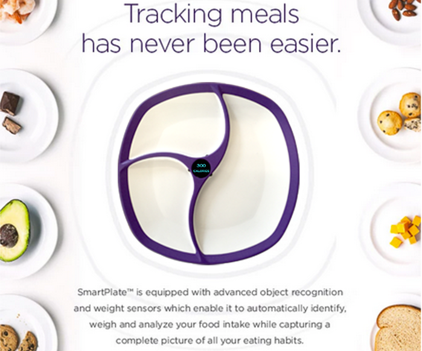  
  
4. 빗물 떨어질 걱정없는 거꾸로 접히는 우산  
https://www.kickstarter.com/projects/kazbrella/kazbrella-revolutionary-inside-out-umbrella  
  
  
5. 압력 센서가 내장된 의자. 앉는 습관 개선 가능.  
http://techcrunch.com/2015/05/05/zami-smart/?ncid=rss&utm_source=feedburner&utm_medium=feed&utm_campaign=Feed%3A+Techcrunch+%28TechCrunch%29  
  
  
6. NFC 카드로 열리는 자물쇠  
http://www.cnet.com/news/hands-on-with-the-quicklock-nfc-padlock/  
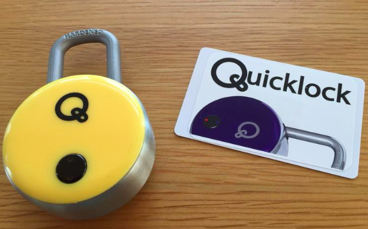  
  
7. 마지막까지 남아있는 내용물을 다 사용할 수 있게 해주는 용기뚜껑.  
http://www.earlyadopter.co.kr/42392  
https://www.kickstarter.com/projects/943577659/zero-waste-cap-easy-to-get-last-bit-of-lotion-from?ref=category_popular  
  
  
8. 가상현실 게임. 실제 세트장에서 VR 헤드셋을 착용하고 즐기는 게임  
https://www.youtube.com/watch?v=cML814JD09g&feature=youtu.be  
  
  
9. 간단한 설치로 일반 자전거를 전기자전거로 바꿔주는 장치.   
http://www.earlyadopter.co.kr/42629  
  
  
10. 스마트 서핑 보드 - 전기 제트모터 내장.  
https://www.kickstarter.com/projects/1529801280/worlds-first-self-inflating-electric-powered-sup-b  
  
  
11. 4cm x 4cm 크기의 초소형 드론  
https://www.indiegogo.com/projects/wallet-drone-world-s-smallest-quadcopter  
  
  
12. 다임러의 무인 주행 트럭. 무인 자동차 세계최초로 정식 주행 허용됨 (미국 네바다주)  
http://www.huffingtonpost.kr/2015/05/08/story_n_7238336.html  
  
  
13. 3D 홀로그램을 보여주는 디스플레이 장치.   
실제 허공에 디스플레이되는것은 아니고 수평유리판 아래에서 디스플레이.  
http://techcrunch.com/2015/05/06/voxiebox-displays-3d-images-just-like-r2d2s-message-from-princess-leia/?ncid=rss&utm_source=feedburner&utm_medium=feed&utm_campaign=Feed%3A+Techcrunch+%28TechCrunch%29  
  
  
14. 음식을 30초 만에 만들어주는 기기. 모든음식은 아니고 회사에서 제공하는 파우더 형태의 포장제품 이용.  
http://www.cnet.com/news/closest-thing-to-star-trek-replicator-makes-meals-in-30-seconds/  
  
  
15. 탄소섬유 소재와 역학적 설계로 무게를 획기적으로 줄인 스케이트 보드.  
https://www.indiegogo.com/projects/gridboard  
  
  
16. 정원을 관리하는 스마트 허브.   
이 장치가 정원을 자동으로 관리할 수 있도록 허브역할. 스마트화분이 정원으로 옮겨간 개념.  
http://www.cnet.com/products/greeniq-smart-garden-hub/  
  
  
17. 바로 꽂아 충전이 되는 액션 카메라.  
http://gizmodo.com/the-coolest-thing-about-tomtoms-new-action-camera-is-it-1702103767  
  
  
18. 모바일에서 카드 결제후 카드로 싸인까지 할 수 있게 해주는 악세서리.  
http://www.cnet.com/news/slivver-adds-a-stylus-to-your-credit-card/  
  
  
19. 스스로 높낮이가 높아졌다 낮아져서 건강하게 해주는 책상.  
http://kr.wsj.com/posts/2015/04/29/책상계의-테슬라-당신의-건강을-책임진다/?mod=WSJKor_WSJKRHome_WhatsNews_4_2_Left  
  
  
20. 태양열 바베큐그릴, 연료가 필요없이 밤에도 조리 가능.  
http://www.geek.com/news/gosun-solar-grill-barbecues-without-fuel-even-at-night-1622001/  
  
  
21. 피보나치 수열로 시간을 표현한 덕후들의 시계   
https://www.kickstarter.com/projects/basbrun/fibonacci-clock-an-open-source-clock-for-nerds-wit?ref=category_newest  
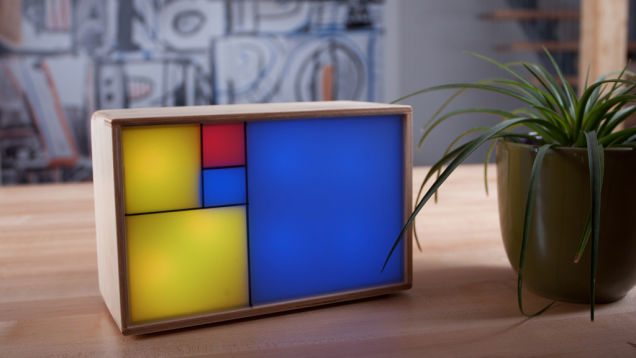  
  
22. 카메라맨 없이 촬영 대상을 스스로 추적하며 촬영해주는 기기.  
http://shop.soloshot.com/#  
  
  
23. 가상현실 기기용 3축으로 제어되는 의자  
https://www.youtube.com/watch?v=ZdhaK9s1RdU  
  
  
  
  
                          
---                                
#150504       
> 2015년 18주차 **HOT DEVICE EVERY WEEK**             
>             
                            
---                                
1. 마이크로 소프트 홀로렌즈, 가장 진보한 형태의 VR + AR 기기  
#VR #AR #wearable   
http://www.engadget.com/2015/04/29/hololens-prototypes/?utm_source=Feed_Classic_Full&utm_medium=feed&utm_campaign=Engadget&?ncid=rss_full  
  
  
2. 컬러 3D프린터기, 하나의 노즐로 여러가지 색을 표현.  
#3D_printer  
https://www.kickstarter.com/projects/wr3d/the-diamond-hotend-single-nozzle-multi-color-3d-pr  
  
  
3. 자동으로 주차를 해주는 로봇.  
각 바퀴에 로봇이 달라붙어 차를 들어올리고 주차위치로 이동시킴.  
#robotics  
http://gizmodo.com/this-gang-of-flat-robots-can-autonomously-steal-or-par-1700680911  
  
  
4. 자신보다 100배 더 무거운 무게를 끌고 벽을 올라갈 수 있는 로봇  
#robotics  
http://www.newscientist.com/article/dn27413-tiny-robots-climb-walls-carrying-more-than-100-times-their-weight.html#.VURhwiQdfq3  
  
  
5. 테슬라 가정용 배터리  
#energy  
http://www.teslamotors.com/powerwall  
  
  
6. LED 불빛으로 정보를 표시해주는 카펫.   
#IoT  
http://www.cnet.com/news/walk-this-way-philips-rolls-out-led-carpets/  
  
  
7. 모듈러 스마트폰 케이스, 스마트폰에서 할수 없었던 다양한 기능의 모듈을 추가로 설치 가능.  
#mobile_accessary  
https://www.kickstarter.com/projects/nexpaq/nexpaq-the-first-truly-modular-smartphone-case  
  
  
8. 학교폭력 방지 명찰, 명찰의 왼편을 누르면 교무실에 알람이 울림.  
#IoT  
http://joongang.joins.com/article/780/17703780.html?ctg=1200&cloc=joongang%7Chome%7Cnewslist1  
  
  
9. 작업자의 작업을 도와주는 엑소슈트 (록히드 마틴)  
#wearable  
http://www.wired.com/2015/04/try-new-exoskeleton-construction-workers/?mbid=social_fb  
  
  
10. 음식을 태우지 않는 조리기구,  타는것을 감지한는 센서가 있음.  
#IoT  
http://techcrunch.com/2015/04/25/slideshow-the-cinder-sensing-cooker-wont-burn-your-food-to-a-crisp/?ncid=rss&utm_source=feedburner&utm_medium=feed&utm_campaign=Feed%3A+Techcrunch+%28TechCrunch%29#.ugp8yw:Fk6Q  
  
  
11. 방구를 감지하는 기기, 심지어 제품명도 CH4 (메탄의 분자식)  
#wearable  
https://www.kickstarter.com/projects/963861855/keep-track-of-your-gases-with-ch4  
  
  
12. 가상현실 헤드셋을 이용, 원격 로봇이 보는 시각을 볼 수 있음.  
#VR #wearable  
http://www.engadget.com/2015/04/29/dora-oculus-rift-telepresence/?utm_source=Feed_Classic_Full&utm_medium=feed&utm_campaign=Engadget&?ncid=rss_full  
  
  
13. 소변검사를 통한 생체정보 측정 기기.  
#medical  
http://besuccess.com/2015/04/scanadu-raises-35m-series-b-to-check-your-pee-and-scan-your-vitals/  
  
  
14. 가정용 에이즈 진단 테스터기.  
#medical  
http://www.engadget.com/2015/04/27/first-hiv-home-test-kit-uk/  
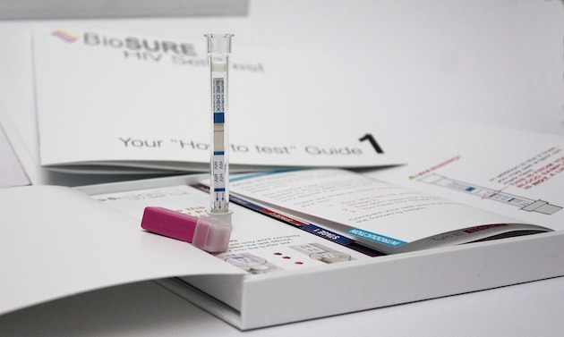  
  
15. 혈액 샘플 채취 기기.  
#medical  
http://interestingengineering.com/hemolink-sampling-device-could-put-an-end-to-needles-for-blood-testing/  
  
  
  
  
                            
---                                  
#150427  
> 2015년 17주차 **HOT DEVICE EVERY WEEK**               
>               
                              
---                                  
  
  
1. 플렉서블하게 고정(Mounting)이 가능한 귀여운 액션캠   
Pixar에서 만든것같이 생겼지만 국내 스타트업 Boud 제품.  
기존 액션캠의 단점인 손쉬운 마운팅 문제를 해결.  
https://www.indiegogo.com/projects/flex-cam-pic-bringing-flexibility-into-your-life  
  
  
2. 공중부양한 상태로 빛이 나오는 전구  
https://www.kickstarter.com/projects/flyte/flyte-levitating-light  
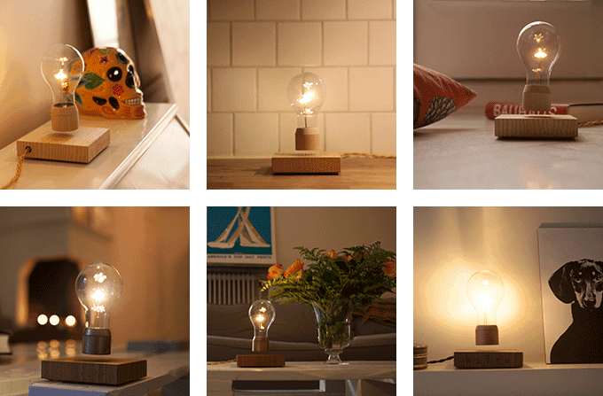  
  
3. 3D프린터로 출력한 제품을 전기도금 할 수 있는 제품.  
구리, 니켈, 팔라듐, 금 등으로 쉽게 도금이 가능한 가정용 기기.  
https://www.kickstarter.com/projects/1499748748/orbit1-a-tabletop-electroplater-turns-your-ideas-i  
  
  
4. 콘센트가 가까이 없어도 소파에서 바로 폰을 충전할 수 있게 해주는 기기  
http://gizmodo.com/put-a-pair-of-usb-ports-where-you-really-need-them-in-1699713364  
  
  
5. 선물을 받은 사람이 상자를 열면 자동으로 선물을 준 사람한테 전화를 걸어주는 선물 상자.  
https://vimeo.com/115299742   
  
  
6. 흙의 상태를 알려주는 센서, 태양광에너지를 사용하여 따로 전원이 필요없음.  
http://www.wired.com/2015/04/edyn-garden-sensor/?mbid=social_fb  
  
  
7. 손톱을 터치 패드로 사용하는 입력장치.  
http://www.engadget.com/2015/04/18/thumbnail-trackpad/?utm_source=Feed_Classic_Full&utm_medium=feed&utm_campaign=Engadget&?ncid=rss_full  
  
  
8. 불이 아닌 전기 스파크로 불을 붙이는 라이터  
http://www.earlyadopter.co.kr/14874  
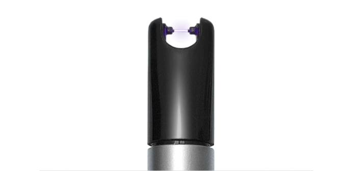  
  
9. 이케아의 미래의 주방 컨셉 (영상)  
부엌 테이블위에서 빔프로젝터로 유용한 정보를 투영시킴.  
http://www.engadget.com/2015/04/20/ikea-concept-kitchen-2025/?utm_source=Feed_Classic_Full&utm_medium=feed&utm_campaign=Engadget&?ncid=rss_full  
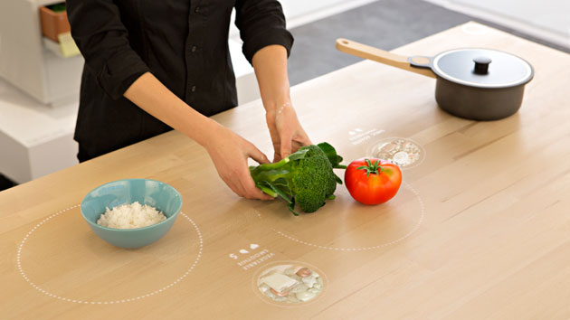  
  
10. 소리가 아닌 조명으로 기상하게 도와주는 기기  
http://www.earlyadopter.co.kr/14965  
  
  
11. 실내에서도 드론이 벽에 부딪혀도 문제없도록 해주는 안전장치  
드론 초보자가 연습하기 좋음.  
https://vimeo.com/125313453  
  
  
12. 디즈니의 스마트폰의 새로운 형태의 입력장치.  
스피커출력에 따른 마이크의 입력을 조절하여 다양한 형태의 사용자의 입력을 감지할 수 있는 입력장치.  
http://techcrunch.com/2015/04/20/disneys-lab-builds-buttons-that-work-by-manipulating-soundwaves-rather-than-electricity/#.n9p80q:eSXc  
  
  
13. 냄새, 바람, 물을 이용해 실제와같이 느길 수 있는 가상현실 마스크  
가상현실 헤드셋과 같이 사용.  
http://techholic.co.kr/archives/32308?utm_source=twitterfeed&utm_medium=facebook  
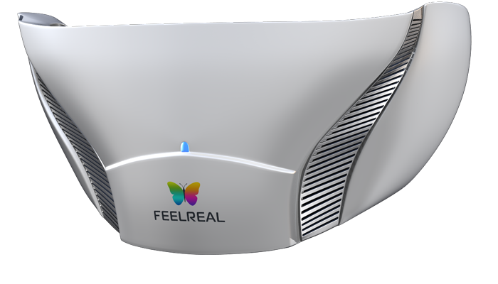  
  
14. 각종 디바이스를 연결하여 스마트홈을 만들어주는 기기  
집 전체를 터치 리모컨 하나로 관리  
http://www.earlyadopter.co.kr/14993  
  
  
15. 3D프린팅 가능한 오픈소스 휴머노이드 로봇  
https://www.kickstarter.com/projects/2107823129/plen2-the-worlds-first-printable-open-source-human?ref=tag  
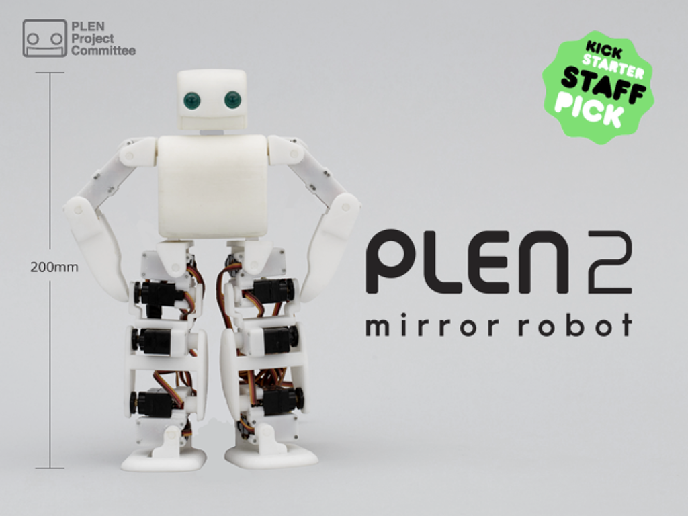  
  
16. 카본 파이버 소재를 사용해 금속을 대체할 수 있는 플라스틱 기어  
http://gizmodo.com/plastic-gears-reinforced-with-carbon-fiber-could-replac-1699417719  
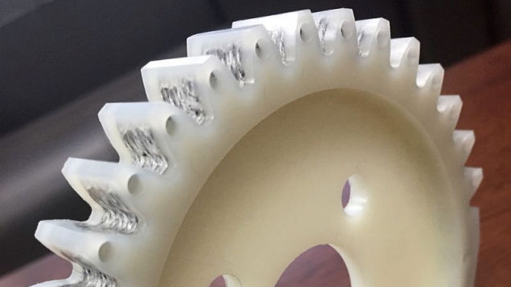  
  
17. 펠트를 재료로 사용하는 3D 프린터기 (디즈니)  
(펠트 : 양모등을 압출해서 만든 부드럽고 두꺼운 천)  
http://www.huffingtonpost.kr/2015/04/18/story_n_7094174.html  
  
  
  
                              
---                                    
#150420  
> 2015년 16주차 **HOT DEVICE EVERY WEEK**                 
>                 
                                
---                                    
  
  
1. 자동화장 머신   
스마트폰앱으로 원하는 스타일을 선택한뒤 기기에 얼굴을 위치시키면 30초 정도면 화장을 끝내줌.  
인체무해한 전용 화장 파우더를 3D 프린팅이 응용된 기술로 얼굴에 인쇄.  
근데 솔직히 뻥같음.  
http://techholic.co.kr/archives/32125  
  
  
2. 어떠한 형태의 물체도 쉽게 잡을(Grip) 수 있는 로봇 손.  
카멜레온의 혀를 모방하여 만듦.   
다섯손가락의 손처럼 정교한 작업을 하기는 어렵겠지만 단순 집는 용도의 로봇손으로는 정말 획기적인 기술.  
https://youtu.be/m7l-87r4oOY  
  
  
3. 할일을 까먹지 않게 도와주는 기기  
해야할 물건이나 장소에 기기를 붙여놓으면 정해진 시간에 알림이 울림. 버튼을 눌러야 꺼짐.  
http://www.earlyadopter.co.kr/14591  
  
  
4. 맥북의 USB-C 단자를 표준 USB 단자로 바꿔주는 소형 어댑터  
http://macnews.tistory.com/m/post/3284  
  
  
5. 요리 해주는 로봇손.   
현재는 프로토타입 수준이며 2017년에 출시 예정  
http://www.geek.com/news/you-may-be-able-buy-a-robot-personal-chef-in-a-couple-years-1620317/  
  
  
  
6. 각 큐브형 모듈이 스스로 움직여 특정형태로 조립이 되는 로봇.  
https://www.youtube.com/watch?v=6aZbJS6LZbs  
http://newsoffice.mit.edu/2013/simple-scheme-for-self-assembling-robots-1004  
  
  
7. 손에끼는 블루투스 리모컨  
http://www.earlyadopter.co.kr/14404  
  
  
8. 따로 전원이 필요없이 무한정 동작하는 카메라.   
http://spectrum.ieee.org/tech-talk/consumer-electronics/audiovideo/selfpowered-video-camera-could-run-indefinitely-in-bright-light  
  
  
9. 주사바늘 없는 주사기  
http://www.cnet.com/news/simple-but-ingenious-invention-from-rice-university-takes-the-ouch-out-of-injections/  
  
  
10. 앉아서 운전하는 형태의 자전거  
https://www.indiegogo.com/projects/babel-bike#home  
  
  
11. 손가락에 착용하여 각종 디바이스를 제어할수 있는 입력기기  
http://www.sharedots.com/this-invention-from-india-is-going-to-change-way-we-live-forever-165.html  
  
  
12. 도난,분실 방지 기능이 달린 스마트 지갑  
http://www.earlyadopter.co.kr/14606  
  
  
13. 드럼을 이용한 music remix 머신   
http://www.wired.com/2015/04/clever-drum-machine-blends-physical-digital/?mbid=social_fb  
  
  
14. 칼싸움놀이 하는 로봇  
http://interestingengineering.com/sword-fighting-robot/  
  
  
  
15. 자동차에서 얼굴,표정,동작 등을 인식하여 안전사고를 미리 예방.  
http://www.engadget.com/2015/04/16/brains4cars-safety-system/?utm_source=Feed_Classic_Full&utm_medium=feed&utm_campaign=Engadget&?ncid=rss_full  
  
  
16. 스마트 무인 택배함  
https://www.kickstarter.com/projects/boxillion/boxillion-the-smartest-way-to-receive-deliveries?ref=category_newest  
  
  
17. 보다 리얼하게 스크린 골프를 즐길 수 있도록 스윙을 계산해주는 기기  
http://www.engadget.com/2015/04/17/optishot2-IRL/?utm_source=Feed_Classic_Full&utm_medium=feed&utm_campaign=Engadget&?ncid=rss_full  
  
  
18. 광 시야각을 가진 스마트폰용 VR 기기.   
본 기기 :150도/ 기어 VR : 60도   
https://www.kickstarter.com/projects/wearality/wearality-sky-limitless-vr?ref=category  
  
  
19. VR(가상현실) + AR(증강현실)  
전면 3D센서로 전방 손이나 물체를 감지하고 VR 기기에서 실제 증강현실을 보여줌.  
https://www.kickstarter.com/projects/impressionpi/impression-mobile-vr-ar-with-gesture-position-trac  
  
  
  
                                
---                                      
#150413    
> 2015년 15주차 **HOT DEVICE EVERY WEEK**                   
                  
                                  
---                                      
  
  
1. 진짜 나비처럼 날아다니는 로봇 (독일기업 Festo)   
영상참고. 대단하다는 말밖에.  
https://www.youtube.com/watch?v=1gu3z7w4Vc8  
  
  
2. 불세기를 자동으로 조절해 주는 스마트 스토브  
온도를 측정하여 음식이나 레시피에 따라 자동으로 불 조절을 해줌.  
기존 불조절 손잡이를 쉽게 교체.  
http://techneedle.com/archives/20521  
  
  
3. 뮤지션을 위한 몸에 착용하는 진동 메트로놈   
https://www.indiegogo.com/projects/soundbrenner-pulse-wearable-device-for-musicians/  
  
  
4. 허리를 곧게 펴서 앉을 수 있게 도와주는 제품  
우리는 하루에 9시간 이상을 앉아있지만 올바른 자세로 앉지 않아 허리의 건강이 매우 위험한 수준에 달해 있어 이 문제를 해결.  
http://www.earlyadopter.co.kr/14142  
https://www.kickstarter.com/projects/1123408990/betterback-perfect-posture-effortlessly?ref=category_popular  
  
  
5. 자전거 거치용 레버 형태의 공기 펌프  
쉽게 설치가 가능하며, 후미등, 타이어제거 공구도 됨.  
https://www.kickstarter.com/projects/1295071512/kickstand-pump-combines-4-bike-tools-into-one?ref=category_location  
  
  
6. 사진이 아닌 소리를 찍는 사운드 카메라  
http://www.bizion.com/bbs/board.php?bo_table=insight&wr_id=253  
  
  
7. 스마트 화분  
http://techholic.co.kr/archives/31866  
https://www.kickstarter.com/projects/gynapse/planty-the-smart-way-to-connect-with-nature  
  
  
8. 레이져 포인터 처럼 사용하는 마우스  
http://www.earlyadopter.co.kr/14272  
  
  
9. 바퀴에 태양광 패널이 탑재된 전기 자전거  
http://www.engadget.com/2015/04/06/the-solarbike-is-a-very-real-thing/?hc_location=ufi  
  
  
10. 스마트 휴대용 램프(필립스)  
http://www.earlyadopter.co.kr/14229  
  
  
11. 파킨슨 병을 조기에 검출하는 키보드   
키보드 입력 패턴을 분석  
http://www.engadget.com/2015/04/03/keyboard-diagnosis-parkinsons-disease-mit/?hc_location=ufi  
  
  
12. 플라스틱 종이컵을 재활용하여 재료로 사용하는 3D프린터  
http://www.perpetualplasticproject.com/#ppp1  
  
  
13. 스마트워치의 진동을 이용한 진보된 햅틱 피드백 터치 기술  
https://vimeo.com/124604407  
  
  
  
  
                                  
---                                        
#150406      
> 2015년 14주차 **HOT DEVICE EVERY WEEK**                     
                    
                                    
---                                        
  
  
1. 미세먼지 99.95% 없애주는 선풍기(다이슨)  
http://www.earlyadopter.co.kr/14019  
  
  
2. 전기 스케이트 보드  
https://www.indiegogo.com/projects/bolt-the-world-s-most-portable-electric-vehicle  
  
  
3. 버튼 클릭한번으로 집안의 일용품을 주문해주는 아마존 대쉬 버튼  
http://www.wired.com/2015/03/amazon-dash-2/?mbid=social_fb  
  
  
4. 손이 떨리는 환자가 보다 쉽게 글씨를 쓸수 있는 진동 하는 펜  
http://www.engadget.com/2015/03/31/arc-vibrating-pen-parkinsons/?utm_source=Feed_Classic_Full&utm_medium=feed&utm_campaign=Engadget&?ncid=rss_full  
http://www.psfk.com/2015/03/parkinsons-the-arc-pen-dopa-solutions.html  
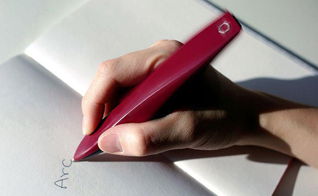  
  
5. 지향성 스피커와 조명으로 배우자는 깨우지 않고 알람을 울려주는 기기  
http://www.earlyadopter.co.kr/14121  
  
  
6. 필요한 키만 따로 뽑아 쓰는 키보드  
http://www.earlyadopter.co.kr/14072  
  
  
7. 밤에 빛이 반사되는 페인트 스프레이(볼보) - 오토바이, 자전거 운전자에게 뿌려서 안전한 운행 가능.  
http://www.huffingtonpost.kr/2015/04/01/story_n_6982900.html?ncid=fcbklnkkrhpmg00000001  
  
  
8. 자석으로 쉽게 탈착/분리 되는 이어폰 커넥터  
http://www.earlyadopter.co.kr/14100  
  
  
9. 조립형 3D 프린터. 로봇, 자동화 장치등을 쉽게 조립하여 만들수 있음.  
https://www.kickstarter.com/projects/uberblox/uberblox-welcome-to-a-whole-new-way-of-making?ref=video  
  
  
10. 간단하게 설치할 수 있는 USB 충전 겸용 콘센트  
http://techneedle.com/archives/20480  
  
  
11. 태양광 에너지를 바로 회전에너지로 변환시키는 장치(엔진)  
http://3dprint.com/54456/solar-powered-stirling-engine/  
  
  
12. 서로 협업하는 로봇 개미(Festo: TED 로봇새로 유명한 회사)  
http://www.psfk.com/2015/03/bionic-ants-hannover-messe-bionicants-festo-future-of-work.html  
  
  
13. 야옹이가 지루해 하지 않는 스마트 장난감  
https://tumblbug.com/catchcats  
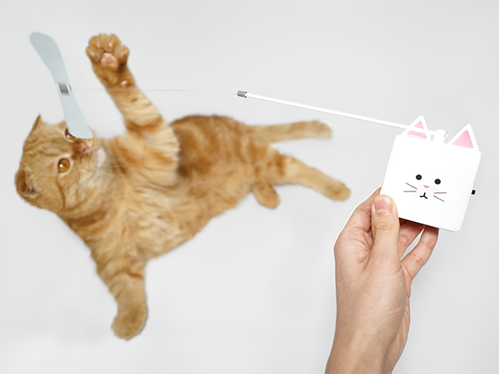  
  
14. 스트레스를 측정하는 스마트 워치  
http://www.earlyadopter.co.kr/13912  
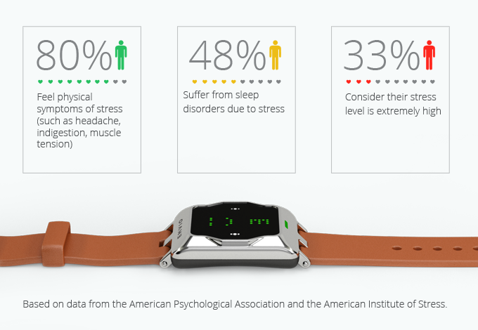  
  
15. 코골이를 줄여주는 배게  
http://www.earlyadopter.co.kr/13936  
  
  
16. 숙면을 위한 스마트 배게  
https://www.kickstarter.com/projects/polegame/sliip-less-snoring-better-sleep?ref=category_newest  
  
  
17. 스마트 커피 머신(Quiky) - 아마존 대쉬 버튼으로 커피 주문 가능  
http://www.cnet.com/products/poppy-pour-over/  
  
  
18. VR 헤드셋의 발동작으로 입력을 받는 input 장치  
https://www.kickstarter.com/projects/stompz/stompz-the-world-of-virtual-reality-at-your-feet  
  
  
19. 모듈형태의 오픈 소스 로봇  
http://www.open-electronics.org/grobotz-modular-open-source-robots-they-grow-up-with-you-on-kickstarter/?utm_content=buffer93623&utm_medium=social&utm_source=facebook.com&utm_campaign=buffer  
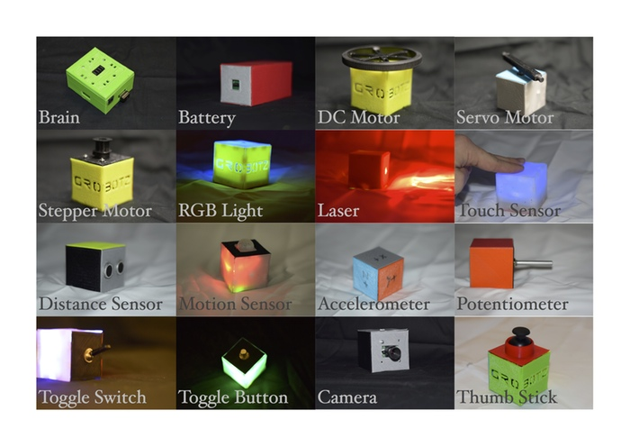  
  
20. 3차원 도표를 실제 3차원으로 보여주는 기기  
http://gizmodo.com/will-the-next-generation-of-displays-be-3d-1695708988?rev=1428181613675&utm_campaign=socialflow_gizmodo_facebook&utm_source=gizmodo_facebook&utm_medium=socialflow  
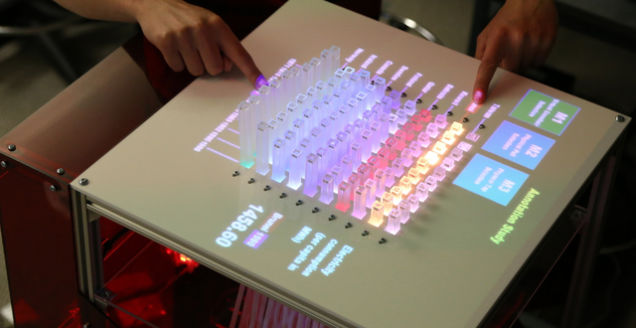  
  
  
    
---      
#150330    
> 2015년 13주차 **HOT DEVICE EVERY WEEK**     
     
        
---    
  
  
1. 운전중에도 안전하게 스마트폰을 사용하게 해주는 기기  
알림이 오면 음성으로 안내해주고 핸들에 장착하는 리모컨으로 주행중 스마트폰을 안전하게 조작  
https://www.indiegogo.com/projects/raygo-never-be-blind-to-the-road  
  
  
2. 전등 스위치를 스마트폰으로 제어하게 바꿔주는 기기. 쉽게 설치가능.  
https://www.indiegogo.com/projects/switchmate-smart-lighting-made-simple  
  
  
3. 남은 팔근육의 전기신호를 이용해 움직일 수 있는 의수  
http://www.engadget.com/2015/03/23/this-300-cybernetic-arm-gets-its-smarts-from-your-cellphone/?ncid=rss_truncated  
  
  
4. PC용 지문인식 스캐너 - USB포트에 끼워 노트북에서 사용.  
번거로운 ID/PW입력을 지문 스캔한번으로 끝낼수 있음.  
https://www.kickstarter.com/projects/1952513384/itouch-id-worlds-smallest-usb-fingerprint-scanner?ref=nav_search  
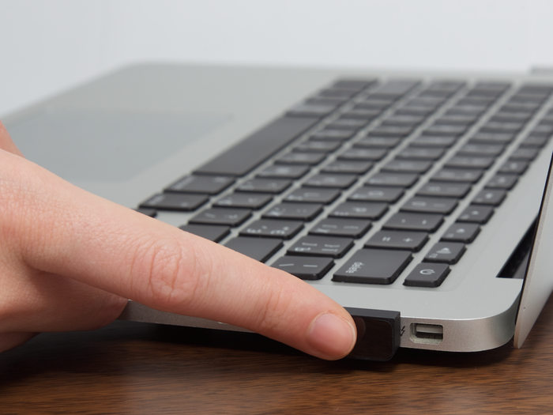  
  
5. 사용자와 상호 작용이 가능한 Interactive 프로젝터  
프로젝터에서 사용자의 움직임등을 감지하여 입력을 받을 수 있음.  
https://www.indiegogo.com/projects/lumo-interactive-projector  
  
  
6. 충돌 직전에 터지는 외장형 에어백 (구글특허)  
앞 범퍼에서 에어백이 터져 충돌 시 보행자의 안전을 지키는 용도.  
http://www.earlyadopter.co.kr/13829  
http://www.digitaltrends.com/cars/google-wants-to-stick-airbags-on-the-outside-of-its-driverless-car/  
  
  
7. 실내 공기질을 모니터링 해주는 장비  
http://www.earlyadopter.co.kr/13743  
  
  
8. 오지에서도 인터넷 통신을 가능하게 만드는 태양광 드론 (Facebook)  
http://www.cnet.com/news/facebooks-solar-powered-drones-to-take-flight-this-summer/  
  
  
9. 개인이 문에 설치하는 무인 택배함.  
http://m.aving.net/?page_id=7&a_num=1244745  
  
  
10. 가상현실과 결합하여 실제로 새처럼 나는 경험을 하게 해주는 장비  
https://vimeo.com/91069214  
  
  
11. 음파를 이용한 소화기  
http://gizmodo.com/this-glorified-speaker-blows-out-fires-with-bass-1693816866  
  
  
12. 하나의 포트로 무한히 확장해 쓸수 있는 USB케이블   
http://www.earlyadopter.co.kr/13667  
  
  
13. 투명 PCB 아두이노   
http://blog.atmel.com/2015/03/25/creating-a-see-through-arduino-with-an-atmega328p/  
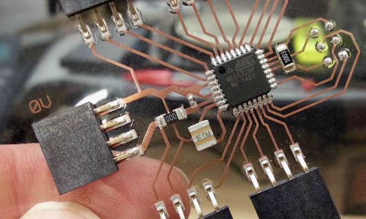  
  
14. 눈동자 추적 VR 헤드셋  
http://www.theverge.com/2015/3/25/8285355/fove-eye-tracking-headset-hands-on  
  
  
15. 잠금장치가 있는 스마트 상자.  
다른사람이 내 과자를 뺏어먹지 못하게 할 수 있음.  
http://www.engadget.com/2015/03/24/ksafe-smart-cookie-jar/?ncid=rss_truncated  
  
  
  
      
---        
#150323      
> 2015년 12주차 **HOT DEVICE EVERY WEEK**       
       
          
---      
  
  
지난 한 주간 흥미로웠던 H/W 프로젝트를 소개하고 있습니다.  
댓글 및 메시지 피드백 환영 합니다.  
  
1. 안쓰는 구형 아이폰을 라디오로 만들어주는 기기.  
https://www.kickstarter.com/projects/1294556862/i-ready-o-retrofying-your-unused-iphones  
  
  
2. 몸에 부착하여 아무때나 앉을 수 있는 웨어러블 의자 (아우디)  
http://www.insight.co.kr/view.php?ArtNo=16503  
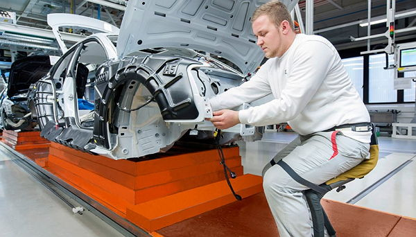  
  
3. 현존하는 가장 빠른 새로운 방식의 3D프린터  
http://mnews.joins.com/news/article/article.aspx?total_id=17376869  
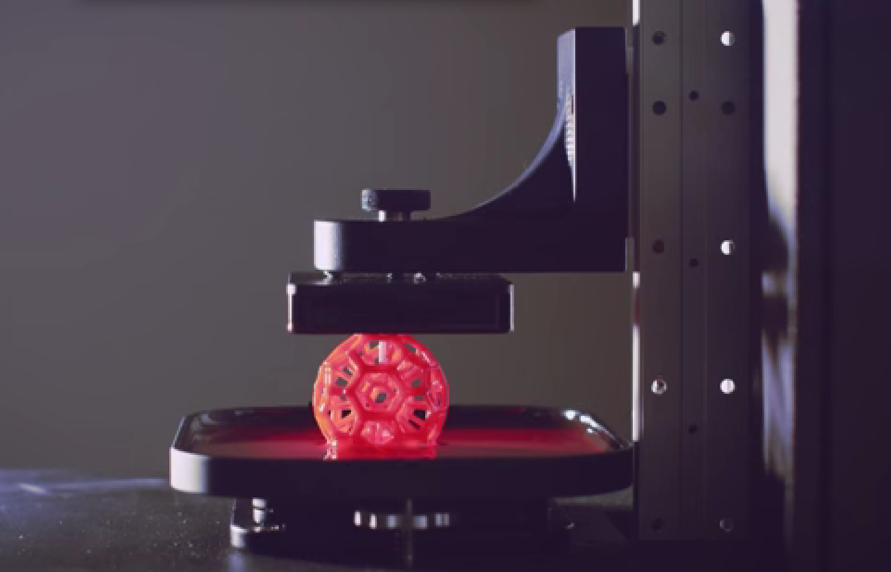  
  
4. 오픈 소스로 조립 가능한 인공 관절   
http://blog.naver.com/anatzblog/220304214553  
  
  
5. 소형의 친인간적인 산업용 로봇   
http://www.engadget.com/2015/03/19/rethink-robotics-sawyer/?utm_source=Feed_Classic_Full&utm_medium=feed&utm_campaign=Engadget&?ncid=rss_full  
  
  
6. 페블의 모듈러 스마트 워치, 심박센서등 원하는 기능을 시계줄에 선택적으로 탑재.  
http://www.etnews.com/20150320000137  
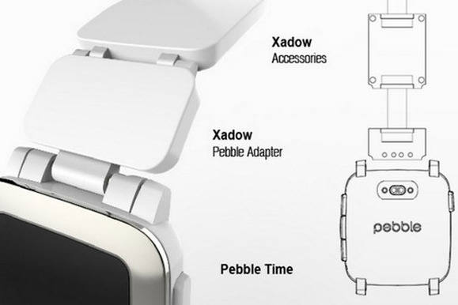  
  
7. 임산부에게 매일 조언을 해주는 기기  
http://techholic.co.kr/archives/29702?utm_source=twitterfeed&utm_medium=facebook  
  
  
8. 스마트폰과 PC에서 동시에 사용할 수 있는 128G USB메모리  
http://www.pkparis.com/en/prods/kisauve/  
  
  
9. 뇌졸증 환자치료에 도움을 주는 음악 장갑  
https://www.flintrehabilitation.com/learn/  
  
  
10. 손으로 직집 컨트롤하는 증강 현실 헤드셋  
http://mashable.com/2015/03/16/impression-pi/?utm_cid=mash-com-fb-main-link  
  
  
11. 보드 없이 바퀴만 존재하는 스케이트 보드  
http://www.cnet.com/uk/news/post-modern-skateboard-has-no-board-just-two-wheels/  
  
  
12. 신발에 장착하는 LED 조명  
http://www.gizmag.com/night-runner-shoe-lights/36634/  
  
  
13. 주변 사물을 촬영하여 사물의 진동을 분석 무슨말을 했는지 알아내는 기술  
http://mnews.joins.com/news/article/article.aspx?total_id=17376870  
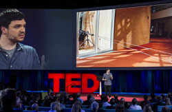  
  
  
        
---          
#150316       
> 2015년 11주차 **HOT DEVICE EVERY WEEK**         
         
            
---        
  
  
1. 칠판에 필기하는 대로 바로 저장되는 스마트 보드마카  
http://techcrunch.com/2015/03/11/the-equil-smart-marker-records-everything-you-write/  
  
  
2. 글루건과 레고의 조합으로 만든 3D 펜  
http://blog.naver.com/anatzblog/220294989519  
  
  
3. 9V배터리로 스마트폰을 충전할 수 있게 해주는 젠더.  
http://gizmodo.com/this-tiny-multi-function-cube-can-save-a-dying-smartpho-1687067995?utm_campaign=socialflow_gizmodo_facebook&utm_source=gizmodo_facebook&utm_medium=socialflow  
  
  
4. 손가락으로 가리킨곳의 글을 읽어 주는 디바이스  
http://www.cnet.com/news/this-finger-mounted-camera-helps-the-blind-to-read/  
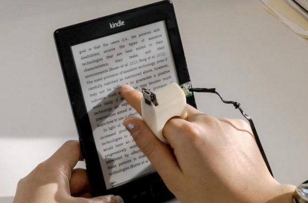  
  
5. 팬케익 3D 프린터  
http://9to5toys.com/2015/03/10/worlds-first-custom-pancake-printer-bot/  
  
  
6. 레고블럭을 실시간으로 3D모델로 보여주는 시스템  
http://www.psfk.com/2015/03/lego-bricks-lego-x-gravity-studio-3d-models.html  
  
  
7. 스티커를 이용 프로그래밍을 가르치는 시스템  
http://phys.org/news/2015-03-preschoolers-sticker-based.html  
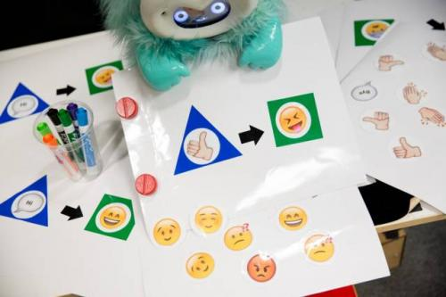  
  
8. 제스쳐를 이용해 음악을 만들 수 있는 키보드  
http://www.psfk.com/2015/03/keys-keyboard-led-lights-gestures-idan-beck-music-making-instrument.html?utm_content=bufferf7186&utm_medium=social&utm_source=facebook.com&utm_campaign=buffer  
  
  
9. 해의 움직임을 본떠 만든 조명  
http://www.psfk.com/2015/03/luminous-lamp-natural-spectrum-light-bulbs.html?utm_content=buffera078f&utm_medium=social&utm_source=facebook.com&utm_campaign=buffer  
  
  
10. 디즈니랜드 에서 사용하는 스마트밴드  
http://www.extremetech.com/electronics/200665-researchers-create-glasses-free-3d-display-with-tiny-spherical-lenses   
  
  
11. 발로 차도(약하게) 넘어지지 않는 2족 보행 로봇.  
http://techcrunch.com/2015/03/10/atrias-the-bipedal-robot-keeps-standing-even-after-you-sweep-the-leg/  
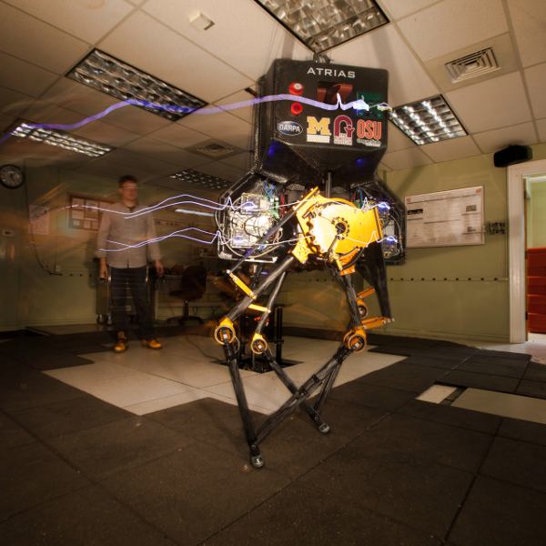  
  
12. 청각/시각 장애인이 쉽게 모바일로 메시지를 작성할 수 있게 도와주는 장갑 입력장치.  
http://mashable.com/2015/03/13/mobile-lorm-glove/?utm_cid=mash-com-fb-main-link  
  
  
13. 안경이 필요없는 3D 디스플레이 기술 소개  
http://www.extremetech.com/electronics/200665-researchers-create-glasses-free-3d-display-with-tiny-spherical-lenses  
  
  
  
150316 <tech>  
세일러묵 드림.  
          
---            
#150309         
> 2015년 10주차 **HOT DEVICE EVERY WEEK**           
           
              
---          
  
  
1. 전구 소켓에 끼울 수 있는 빔 프로젝터.  
http://www.earlyadopter.co.kr/12363  
  
  
2. 하나의 기기로 여러가지 악기를 연주할 수 있는 전자악기.  
http://www.theverge.com/2015/3/3/8144193/artiphon-instrument-1-kickstarter-campaign  
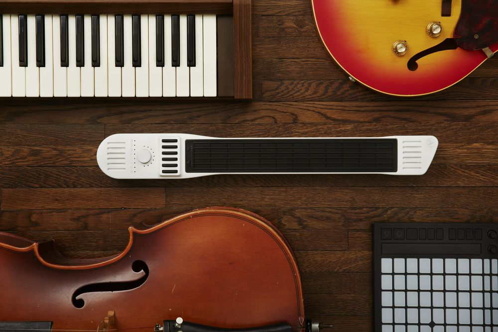  
  
3. 전자렌지에 돌리면 썻던 내용을 reset 할 수 있는 노트.  
https://www.indiegogo.com/projects/rocketbook-cloud-integrated-microwavable-notebook  
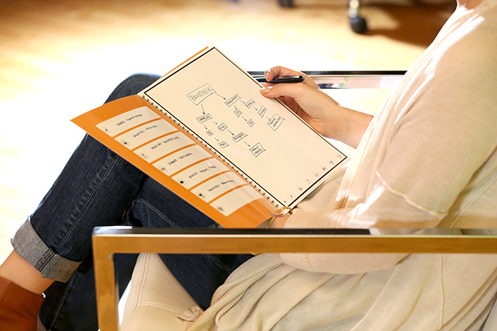  
  
4. 사용자 명령을 수행하는 스피커 (Sony)  
http://www.earlyadopter.co.kr/12793  
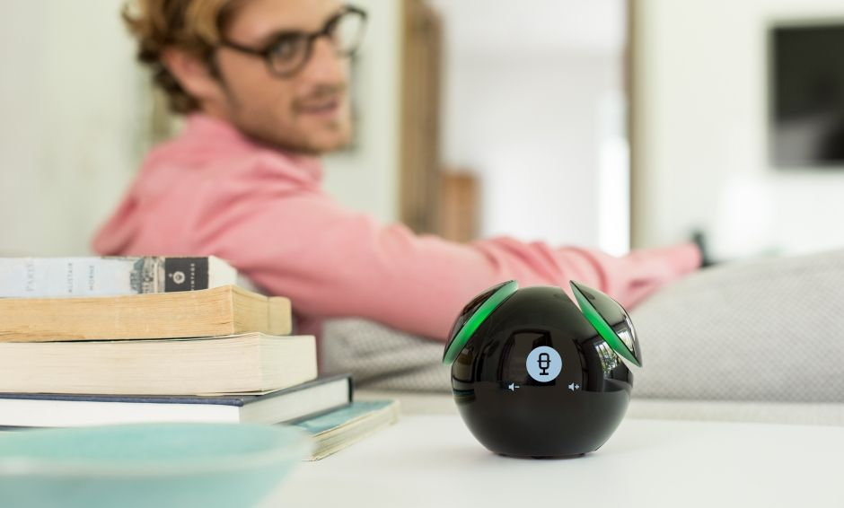  
  
5. VR기기를 더 실감나게 체험 하도록 회전하는 의자.  
http://www.engadget.com/2015/03/05/roto-virtual-reality-chair/  
  
  
6. Eye Tracking 기기, 눈의 움직임을 PC나 모바일 기기의 입력으로 받음.  
https://theeyetribe.com/  
  
  
7. 태블릿 pc에 설치하는 홀로그램 기기.  
http://www.psfk.com/2015/03/holocube-hc-tablet-ipad-projection-3d-holograms.html?utm_content=bufferb184d&utm_medium=social&utm_source=facebook.com&utm_campaign=buffer  
  
  
8. 배변시간을 미리 알려주는 웨어러블 기기.  
http://mashable.com/2015/03/03/d-fee-poop-predictor/  
  
  
9. 책상 표면에 디스플레이가 되는 책상.  
http://techholic.co.kr/archives/27782?utm_source=twitterfeed&utm_medium=facebook  
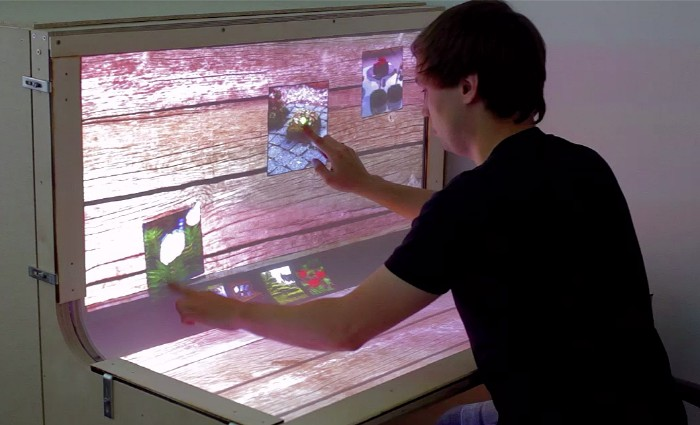  
  
  
10. VR용 손동작 입력 악세서리.  
http://mashable.com/2015/03/02/realm-vr-controller/?utm_cid=mash-com-fb-main-link  
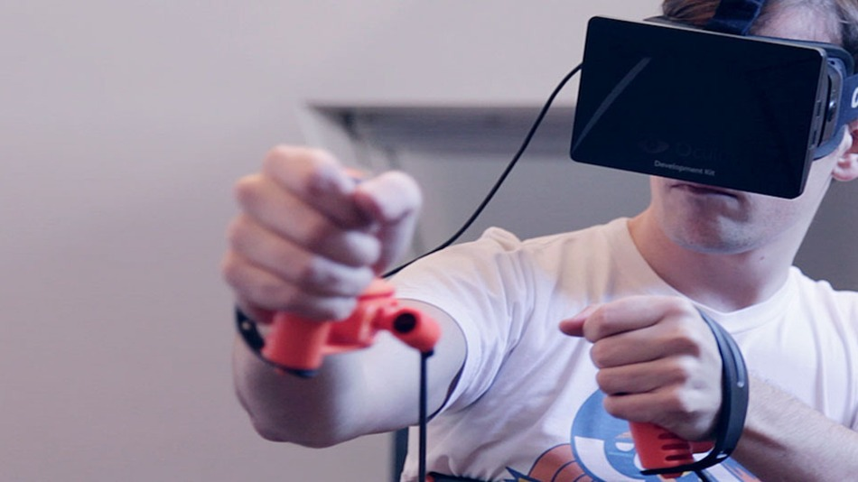  
  
11. 포스트잍 같은 접착제 없이 어느 표면에나 붙일수 있는 메모지  
http://www.psfk.com/2015/03/magnetic-sticky-notes-statically-charged-sticky-notes-tesla-amazing.html?utm_content=buffer3ebd8&utm_medium=social&utm_source=facebook.com&utm_campaign=buffer  
  
  
12. 부착형 원격 셀카 카메라.  
http://www.earlyadopter.co.kr/12744  
  
  
13. 분실 방지 기능이 있는 우산.  
http://www.earlyadopter.co.kr/12717#.VPUg6Qse8FE.facebook  
  
  
14. 7만원 짜리 고프로(샤오미)  
https://www.techinasia.com/xiaomi-gopro-yicamera/  
  
  
15. 강물로 배터리를 충전할 수 있는 휴대용 수력발전기.  
http://www.earlyadopter.co.kr/12940#.VPk-YV41O5E.facebook  
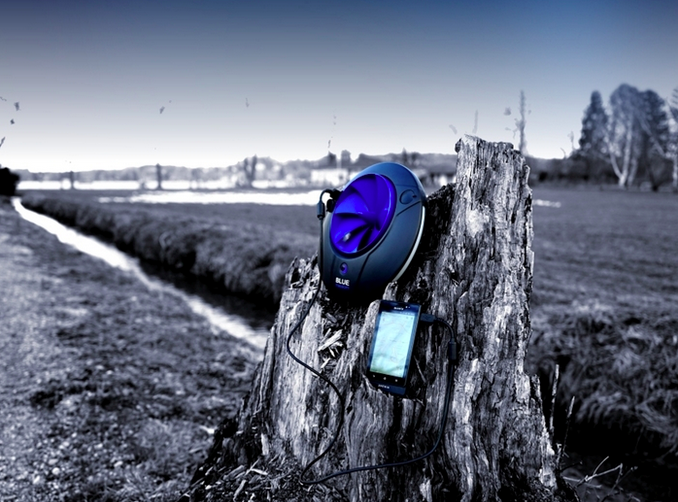  
  
  
16. 이케아 무선 충전 가구  
http://www.earlyadopter.co.kr/12664  
  
  
17. 벌의 방해없이 벌꿀을 채취 할수 있는 벌통  
https://www.indiegogo.com/projects/flow-hive-honey-on-tap-directly-from-your-beehive  
  
  
18. 바이올린 연주 로봇  
http://gizmodo.com/ro-bow-is-a-violin-paying-robot-that-actually-sounds-pr-1687311126?utm_campaign=socialflow_gizmodo_facebook&utm_source=gizmodo_facebook&utm_medium=socialflow  
  
  
  
            
---              
#150223           
> 2015년 8주차 **HOT DEVICE EVERY WEEK**             
             
                
---            
  
  
1. 구형태의 로봇  
http://www.geek.com/news/us-military-is-testing-rolling-eyeball-robots-originally-designed-for-mars-1616153/  
  
  
2. 최근 삼성이 인수한 모바일 결제 시스템 LoopPay 기술.  
카드의 마그네틱 신호를 무선으로 전송하여 카드를 물리적으로 긁는 것과 동일한 효과가 나타남.  
https://www.youtube.com/watch?v=bw1l149Rb1k&feature=youtu.be  
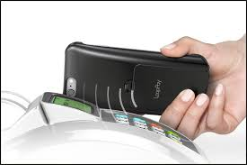  
  
3. IBM 왓슨의 인공지능 기술이 탑재어 대화가 가능한 인형  
http://thenextweb.com/gadgets/2015/02/16/talking-dinosaur-brain-powered-ibms-watson-supercomputer/  
  
  
4. 전자잉크를 이용한 상점의 가격 tag  
http://www.engadget.com/2015/02/19/sainsburys-e-ink-pricing-labels/?utm_source=Feed_Classic_Full&utm_medium=feed&utm_campaign=Engadget&?ncid=rss_full  
  
  
5. 새처럼 나는 로봇 (나비의 날개짓과 유사)  
http://thecreatorsproject.vice.com/blog/watch-a-robot-fly-like-a-real-bird?utm_source=tcpfbus  
  
  
6. 3배 확대되는 콘택트 렌즈  
http://www.iflscience.com/technology/scientists-develop-telescopic-contact-lenses-can-zoom-3x  
  
  
7. 어깨넘어로 가르쳐주는 웨어러블 선생님.  
http://www.engadget.com/2015/02/22/grasp-remote-teaching-device/  
  
  
8. 아두이노의 모든 기능이 포함된 손톱크기의 칩.  
http://techholic.co.kr/archives/29347?utm_source=twitterfeed&utm_medium=facebook  
  
  
9. 동물의 눈을 대신해서 가상 체험해볼수 있는 헬멧  
http://techholic.co.kr/archives/28653?utm_source=twitterfeed&utm_medium=facebook  
  
  
10. 스마트 줄자  
http://techcrunch.com/2015/02/17/xyze/?ncid=rss&utm_source=feedburner&utm_medium=feed&utm_campaign=Feed%3A+Techcrunch+%28TechCrunch%29&utm_content=FaceBook  
  
  
11. 집안에서 아기의 데이터를 모니터링 할 수 있는 카메라  
http://techcrunch.com/2015/02/17/evoz-debuts-a-connected-monitor-offering-baby-data-tracking-cry-alerts-and-more/?ncid=rss&utm_source=feedburner&utm_medium=feed&utm_campaign=Feed%3A+Techcrunch+%28TechCrunch%29&utm_content=FaceBook  
  
  
12. 줄넘기 횟수가 자동으로 카운트 되는 스마트 줄넘기.  
http://www.cnet.com/news/smart-skipping-rope-tracks-your-jumps/  
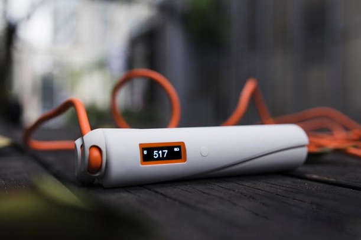  
  
13. 스마트폰용 카드 리더기 악세서리.  
http://thenextweb.com/eu/2015/02/17/izettle-launches-first-free-entry-level-chip-pin-card-reader/  
  
  
  
14. 스마트폰과 연동되는 Oral B 스마트 칫솔  
http://www.psfk.com/2015/02/oral-b-oral-b-pro-7000-smart-toothbrush.html?utm_content=buffer9589f&utm_medium=social&utm_source=facebook.com&utm_campaign=buffer  
  
  
15. 게임을 이용한 재활치료 기기  
http://www.fraunhofer.de/en/press/research-news/2015/february/fitness-game-for-the-physically-impaired.html  
  
  
  
            
---              
#150216           
> 2015년 7주차 **HOT DEVICE EVERY WEEK**             
             
                
---            

1. 스마트 줄넘기, 줄넘기 횟수가 줄의 LED 잔상을 통해 디스플레이됨.
영상 참고. (탱그램 디자인 연구소)
http://www.psfk.com/2015/02/tangramfactory-smart-rope-led-jumprope.html?utm_content=buffer9cbe6&utm_medium=social&utm_source=facebook.com&utm_campaign=buffer

2. 물체에 부딪혀도 추락하지 않게 설계된 드론
바깥 구체가 독립적으로 회전하여 장애물과 부딪혔을때 추락하지않고 장애물을 타고 돌아감. 건물탐색 재해인명구조 응용가능.
처음으로 실내에서 사용할수있는 쓸만한 드론 등장.
http://www.theverge.com/2015/2/9/8006509/bouncy-ball-drone-flyability-gimball

3. 보행 로봇분야 최고 기술력을 갖춘 Boston Dynamics의 새로운 4족 보행 로봇 Spot
https://www.youtube.com/watch?v=M8YjvHYbZ9w

4. 잔을 들고 춤을춰도 쏟아지지 않게해주는 기기. (영상 꼭 보셔요)
http://goodoilfilms.com/spill-proof-beer

5. 2층 PCB를 출력하는 3D 프린터
https://www.kickstarter.com/projects/voltera/voltera-your-circuit-board-prototyping-machine

6. 터치 스크린 표면의 물리 키보드를 만들어주는 케이스
http://thenextweb.com/insider/2015/02/12/the-phorm-ipad-mini-case-gives-you-an-on-demand-physical-keyboard/

7. 전선에 사람들이 원하는 기능을 입히는 프로젝트 (MIT)
집안에서 쓰는 거의 모든 전자제품에는 전기코드선이 달려 있지만, 오랜기간동안 큰 변화나 발전이 없었다.  매듭짓기/꼬집기/압력감지/구부리기/잡아당기기.
http://techneedle.com/archives/20063

8. TAG를 이용 특정장소에 있는것처럼 보이게 해주는 VR 기기
http://www.view-master.com/

9. 지퍼를 자동으로 올려주는 로봇
옷 뿐만아니라. 새로운 자동 결합형태로 응용 가능할 듯.
http://www.theverge.com/2015/2/9/8005131/zipperbot-mit-wearable-zipper-robot-video

10. 버튼이 아니라 터피 및 모션으로 조작이 되는 스피커
https://www.kickstarter.com/projects/1350952796/sugr-cube-touch-to-stream-and-share-music

11. 사용자의 시선을 자동으로 추적하는 기기. 게임 컨트롤러 응용가능. 
http://techholic.co.kr/archives/28902?utm_source=twitterfeed&utm_medium=facebook

12. 의사가 원격으로 진찰을 할 수 있는 기기.
http://techcrunch.com/2015/02/12/cliniclouds-bluetooth-enabled-stethoscope-and-thermometer-lets-doctors-check-your-vitals-from-the-cloud/

13. 마인드 컨트롤 되는 3D프린팅 의수
http://interestingengineering.com/19-year-old-builds-350-mind-controlled-robot-arm/

14. 로봇제작을 쉽게 도와주는 core 모듈
http://techcrunch.com/2015/02/11/robocore-is-a-core-for-your-robo/?ncid=rss&utm_source=feedburner&utm_medium=feed&utm_campaign=Feed%3A+Techcrunch+%28TechCrunch%29#vJH3qt:2Gi

15. 열감지 디스플레이 전자렌지 
http://www.cnet.com/news/heat-map-microwave-gives-thermal-view-while-nuking-your-food/

16. 전자잉크로 표면 디자인을 변경할 수 있는 팔찌
https://www.indiegogo.com/projects/tago-arc-one-e-ink-bracelet-with-endless-designs

17. 쉽게 데이터를 저장/공유할 수 있는 개인용 웹 서버
http://www.psfk.com/2015/02/eggcyte-storage-device-the-egg-personal-server.html?utm_content=buffer8be59&utm_medium=social&utm_source=facebook.com&utm_campaign=buffer

부록. 13가지 갓난아기를 위한 IoT (Internet of Toddlers)
http://community.arm.com/groups/internet-of-things/blog/2015/02/12/14-smart-products-for-the-internet-of-toddlers?utm_content=sf36246507&utm_medium=spredfast&utm_source=facebook&utm_campaign=ARM+Social+Media&sf36246507=1

              
---                
#150209             
> 2015년 6주차 **HOT DEVICE EVERY WEEK**               
               
                  
---              
  
  
1. 한장의 카드로 모든 카드를 이용가능  
http://techneedle.com/archives/19844  
  
  
2. 스캐너 기능이 있는 마우스  
https://www.indiegogo.com/projects/zcan-wireless-world-s-1st-wireless-scanner-mouse  
  
  
3.. WIFI통신을 이용한 무선 Guitar Jack  
http://blog.atmel.com/2015/01/27/jack-is-the-first-guitar-device-to-stream-using-wi-fi/?sf35859148=1  
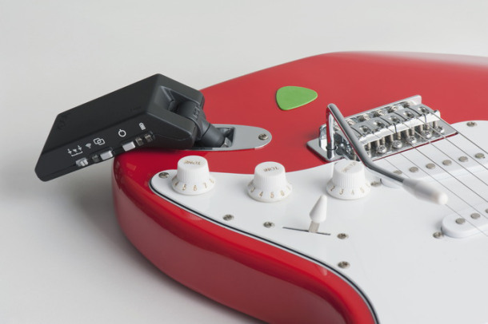  
  
4. 레이져 빛을 품은 스마트 이어폰  
http://www.huffingtonpost.kr/2015/02/02/story_n_6592004.html  
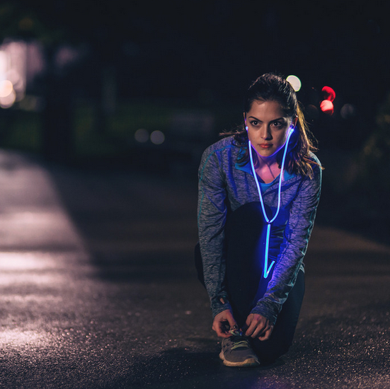  
  
  
5. 온도측정기 스마트폰 악세서리  
https://www.kickstarter.com/projects/531680546/wishbone-the-worlds-smallest-smart-thermometer  
  
  
  
6. 라즈베리파이 2 공개  
/성능향상(윈도우 10 구동됨)/ 전 모델과 같은가격  
http://www.engadget.com/2015/02/02/windows-10-is-coming-to-the-raspberry-pi-2/?ncid=rss_truncated  
  
  
7. 몸의 동작을 특정 기기의 입력 수단으로 만들어주는 웨어러블 기기, 신체 활동 측정  
https://www.indiegogo.com/projects/hiris-the-first-wearable-computer-for-everyone  
  
  
8. 요리하는 로봇  
http://www.engadget.com/2015/01/08/cooki-robot-chef/  
  
  
  
9. WIFI 공유기간 연결로 한 공유기의 범위를 확장해줌.  
http://techneedle.com/archives/19947  
  
  
10. 소방용 휴머노이드 로봇  
http://www.engadget.com/2015/02/05/us-navy-firefighting-saffir-robot/?ncid=rss_truncated  
  
  
11. 질병 감염여부 진단 스마트폰 악세서리  
http://medicalxpress.com/news/2015-02-smartphone-accessory-rapid-diagnosis-infectious.html  
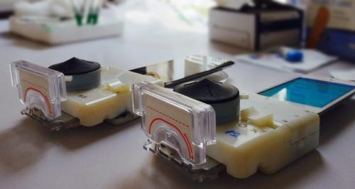  
  
12. 자동차용 카메라가 판단하여 운전자에게 위험 알람등을 울려줌.  
https://gigaom.com/2015/02/05/indiegogo-project-carvi-puts-a-drive-camera-into-older-cars/?utm_medium=social&utm_campaign=socialflow&utm_source=facebook&utm_content=indiegogo-project-carvi-puts-a-drive-camera-into-older-cars_912873  
  
  
13. 수비드(Sous-Vide) 요리를 도와주는 블루투스 기기  
http://www.psfk.com/2015/01/ge-bluetooth-sous-vide-device-home-firstbuild.html  
  
  
14. 팔찌형 웨어러블 멀티툴 (25가지 공구)  
http://www.earlyadopter.co.kr/11233  
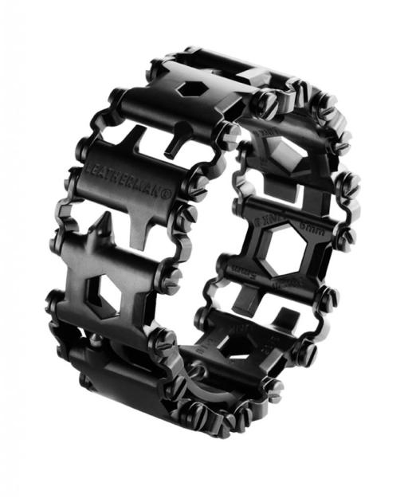  
  
15. 반려동물과 놀아주는 기기 +급식  
http://ballready.com/  
  
  
  
                
---                  
#150126               
> 2015년 4주차 **HOT DEVICE EVERY WEEK**                 
                 
                    
---                
  
  
1. 증강현실 헤드셋 홀로렌즈(Microsoft)  
http://m.blog.naver.com/appifystudio/220248179103  
  
  
2. 세제와 옷과 함께 물속에 넣어 놓으면 초음파를 이용해 세탁을 하는 기기  
https://www.indiegogo.com/projects/dolfi-next-gen-washing-device#description  
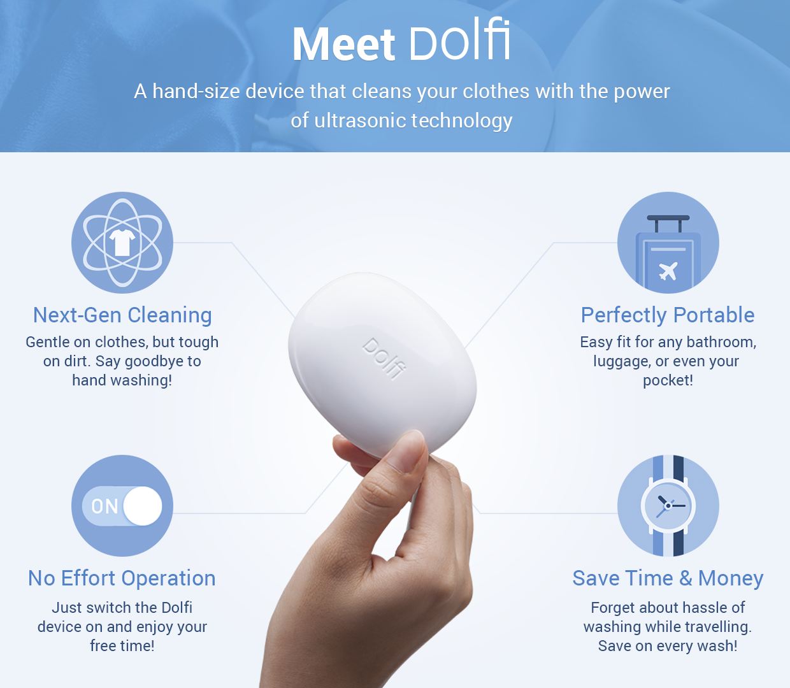  
  
3. 전자잉크를 이용해 간단한 알림을 표시해줄 수 있는 소형 보조 디스플레이 기기  
http://techcrunch.com/2015/01/22/displio/?ncid=rss&utm_source=feedburner&utm_medium=feed&utm_campaign=Feed%3A+Techcrunch+%28TechCrunch%29&utm_content=FaceBook  
  
  
4. 허리에 차는 노인용 에어백  
http://www.huffingtonpost.kr/2015/01/23/story_n_6529504.html  
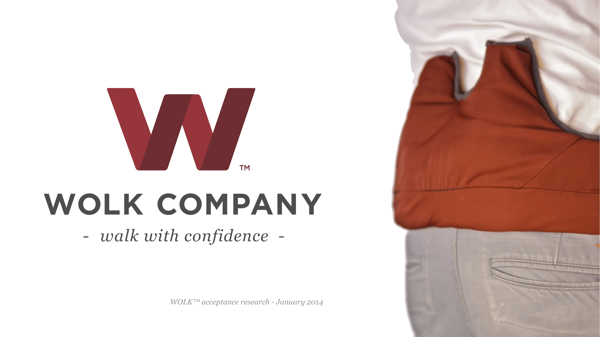  
  
  
5. 80년대 NASA가 만든 가상현실 헤드셋  
https://www.youtube.com/watch?v=NAuytnYU6JQ  
  
  
6. 차에서 사각지대에 있는 대상(자전거,오토바이, 사람등) 감지 및 디스플레이 기술 (재규어)  
http://www.earlyadopter.co.kr/10936  
  
  
  
7. 뇌파를 이용해 조정 가능한 헬멧  
http://behnazfarahi.prosite.com/204244/5572755/gallery/synapse  
  
  
  
8.  타인에게 현재 대화가능한 상태인지 아닌지 알려주는 간단한 LED 인디케이터  
https://www.kickstarter.com/projects/914874115/luxafor-your-ultimate-productivity-device  
  
  
9. 혀를 이용해 소리를 들을 수 있는 제품   
http://www.engadget.com/2015/01/19/braille-for-the-mouth-could-help-deaf-people-hear/?ncid=rss_truncated  
  
  
10. 마우스 + PC 일체형  
http://interestingengineering.com/mouse-box-is-fully-working-pc/  
  
  
11. 스마트홈 세트(샤오미)  
http://www.etnews.com/20150119000169?SNS=00002  
  
  
12. 그림 그리는 것을 도와주는 기기  
http://thecreatorsproject.vice.com/blog/these-machines-will-teach-you-to-draw-whether-you-like-it-or-not?utm_source=tcpfbus  
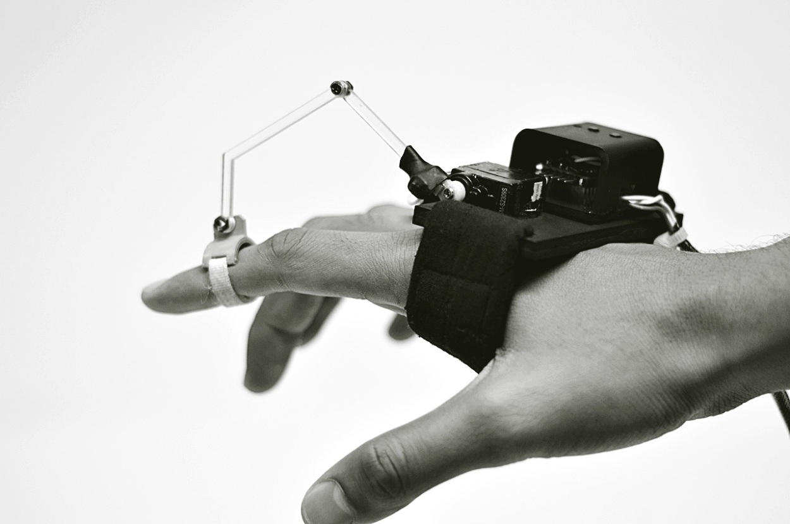  
  
13. Boston Dynamics의 휴머노이드 로봇 ATLAS 최신  
http://www.darpa.mil/NewsEvents/Releases/2015/01/20.aspx  
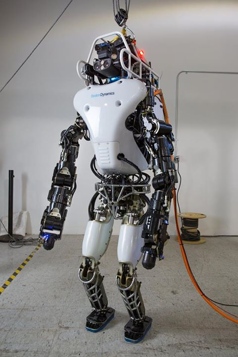  
  
14. 레고를 이용해 만든 점자 프린터  
http://www.huffingtonpost.kr/2015/01/21/story_n_6513298.html  
  
  
  
                  
---                    
#150119           
> 2015년 3주차 **HOT DEVICE EVERY WEEK**                   
                   
                      
---                  
  
  
  
1. 새로운 형태의 매우 작은 휴대용 무선 키보드  
http://techneedle.com/archives/19745  
  
  
2. 스마트 자전거 손잡이 (햅틱으로 네비게이션 기능)  
https://www.indiegogo.com/projects/smrtgrips-world-s-first-connected-bike-grips  
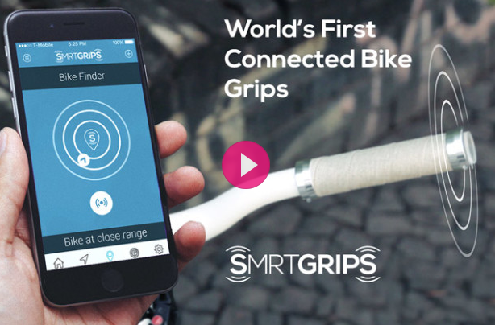  
  
3. 손글씨 로봇 (저장된 사용자의 손글씨체를 로봇이 대신 적어줌)  
http://sploid.gizmodo.com/robot-imitates-your-handwriting-using-a-fountain-pen-1679656771?utm_campaign=socialflow_gizmodo_facebook&utm_source=gizmodo_facebook&utm_medium=socialflow  
  
  
4. 보다 나은 킥을 할수 있도록 코치해주는 축구공(adidas 주의)  
https://www.youtube.com/watch?v=VJwR4C9QjKM  
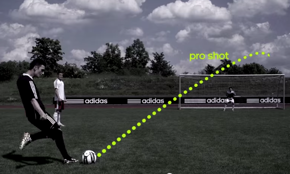  
  
5. 사용자가 원하는 다양한 기능을 설정하여 다양한 곳에 사용할 수 있는 독립 센서  
https://sen.se/store/mother/  
  
  
6. 입은 옷의 색상을 바꾸어 볼 수 있는 스마트 거울  
http://www.engadget.com/2015/01/13/neiman-marcus-memory-mirror/  
  
  
  
7. 커넥티드 LED 전구  
http://www.geek.com/news/cree-adds-15-connected-led-bulbs-to-the-wink-ecosystem-1613396/  
  
  
8. 물고기의 지느러미를 본따서 어떤 방향이든 이동할 수 있는 수중 로봇.  
http://www.engadget.com/2015/01/14/sepios-cuttlefish-robot/  
  
  
9. 쉽게 프로그래밍 할 수 있는 블럭 형태의 프로그래밍 툴 #bitcube  
https://www.indiegogo.com/projects/bitcube-innovative-simple-easy-programming-fun#home  
  
  
  
10. 손가락 동작으로 입력이 가능한 반지형 입력기기  
http://www.engadget.com/2015/01/13/fujitsu-handwriting-ring/?ncid=rss_truncated  
  
  
  
11. 태양광 스마트 워치  
http://www.funshop.co.kr/funtenna/detail/3468  
  
  
  
12. 모듈 형식의 인공위성을 만들 수 있는 로봇.  
http://www.pcmag.com/article2/0,2817,2475070,00.asp  
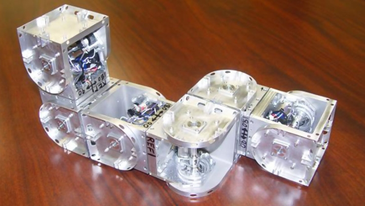  
  
  
                    
---                      
#150112             
> 2015년 2주차 **HOT DEVICE EVERY WEEK**                     
                     
                        
---                    
  
  
CES 특집 - 흥미로운 37 가지의 제품을 소개합니다.  
  
1. 스마트폰에 설치하는 셀카용 플래쉬  
http://www.theverge.com/2015/1/5/7491573/lenovo-selfie-flash-ces-2015  
  
  
2. 스마트 자전거 패달  
http://www.theverge.com/2015/1/4/7491885/connected-cycle-bike-pedal-prevents-stealing-track-movement  
  
  
  
3. 자녀의 체온을 부모에게 전달하는 스티커형 패치   
http://www.theverge.com/2015/1/4/7492519/ces-2015-blue-spark-temperature-temptraq  
  
  
4. 버튼 사이즈 웨어러블 기기 모듈  
http://www.theverge.com/2015/1/6/7505423/ces-2015-intel-curie-module-wearables  
  
  
5. 스마트홈 오브  
http://techcrunch.com/2015/01/07/branto/?ncid=rss&utm_source=feedburner&utm_medium=feed&utm_campaign=Feed%3A+Techcrunch+%28TechCrunch%29&utm_content=FaceBook  
  
  
6. 아기 모니터링 기기  
http://techcrunch.com/2015/01/07/naptime-baby-monitor-saves-parents-from-late-night-arguments/?ncid=rss&utm_source=feedburner&utm_medium=feed&utm_campaign=Feed%3A+Techcrunch+%28TechCrunch%29&utm_content=FaceBook  
  
  
7. 모니터에 꽂는 컴퓨터 스틱  
http://techneedle.com/archives/19657  
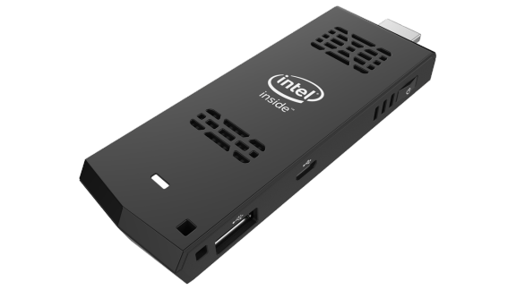  
  
8. 스마트 침대  
http://www.engadget.com/2015/01/06/rest-smart-bed/?ncid=rss_truncated  
  
  
9. 조립식 스마트 워치  
http://ces.gizmodo.com/this-modular-smartwatch-could-have-as-many-days-of-batt-1678389628?utm_campaign=socialflow_gizmodo_facebook&utm_source=gizmodo_facebook&utm_medium=socialflow  
  
  
  
10. 셀프조립 의자  
http://thecreatorsproject.vice.com/blog/premiere-mit-chair-builds-itself?utm_source=tcpfbus  
  
  
11. 열화상 카메라 스마트폰 악세서리  
http://www.engadget.com/2015/01/06/flir-one-2015-hands-on/?ncid=rss_truncated  
  
  
12. 스마트 칫솔  
http://www.cnet.com/news/oral-b-smartseries-700-bluetooth-toothbrush-coming-to-the-us-in-february/  
  
  
13. lcd 사이드 미러  
http://www.engadget.com/2015/01/07/maserati-of-the-future-has-cameras-and-displays-not-mirrors/?ncid=rss_truncated  
  
  
14. 전자잉크 밴드  
http://techcrunch.com/2015/01/06/looksee-an-e-ink-smart-bracelet-will-always-fit-your-mood/?ncid=rss&utm_source=feedburner&utm_medium=feed&utm_campaign=Feed%3A+Techcrunch+%28TechCrunch%29&utm_content=FaceBook  
  
  
15. 문앞에 있는 대상을 촬영하여 폰으로 보내줌.  
http://techcrunch.com/2015/01/06/peeple-is-a-smart-peephole-to-upgrade-your-door-with-caller-id/  
  
  
16. 스마트 음주 측정기  
http://tcrn.ch/1tRJGDM  
  
  
  
17. 누가 집에 왔는지 알려주는 커넥티드 카메라.  
http://www.engadget.com/2015/01/04/netatmo-welcome-camera/?ncid=rss_truncated  
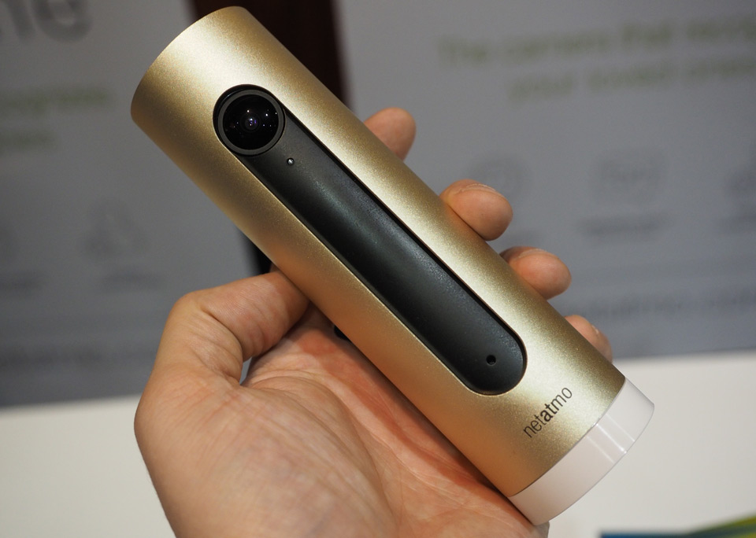  
  
18. 반려동물이 집에 안전하게 잘있는지 알려주는 기기  
http://www.engadget.com/2015/01/04/tagg-alarm-smart-pet-monitoring/?ncid=rss_truncated  
  
  
19. 피부상태 측정기  
http://tcrn.ch/14vgZ3C  
  
  
  
20. 3d 프린터 - 액체형  
http://formlabs.com/en/  
  
  
21. 간단한 전자 회로까지 프린팅하는 3d 프린터  
http://hackaday.com/2015/01/06/3d-printing-circuits-gets-rid-of-the-box-altogether/  
  
  
22. 폴라로이드 휴대용 사진 프린터기  
http://www.cnet.com/products/polaroid-zip-mobile-printer/  
  
  
23. 터치스크린이 달린 자동차 키  
http://gizmodo.com/bmws-new-key-fob-is-a-touchscreen-device-in-its-own-rig-1677710054?utm_campaign=socialflow_gizmodo_facebook&utm_source=gizmodo_facebook&utm_medium=socialflow  
  
  
24. 스트레스 완화 기기  
http://phys.org/news/2015-01-paris-based-team-stress-cutting-gear-ces.html  
  
  
25. 프로그래밍 가능한 소형 라인트레이서  
http://techcrunch.com/2015/01/05/ozobots-tiny-robots-use-squiggly-lines-and-googles-blockly-to-teach-kids-to-code/?ncid=rss&utm_source=feedburner&utm_medium=feed&utm_campaign=Feed%3A+Techcrunch+%28TechCrunch%29&utm_content=FaceBook  
  
26. 종이 위를 이동하며 프린트하는 로봇 - 판매 시작  
http://mashable.com/2015/01/05/zutas-printer-pre-order/?utm_campaign=Mash-Prod-RSS-Feedburner-All-Partial&utm_cid=Mash-Prod-RSS-Feedburner-All-Partial&utm_medium=feed&utm_source=feedly&utm_reader=feedly  
  
  
27. 소니 스피커 + 전구  
http://www.theverge.com/2015/1/5/7497911/sonys-symphonic-light-speaker-ces-2015  
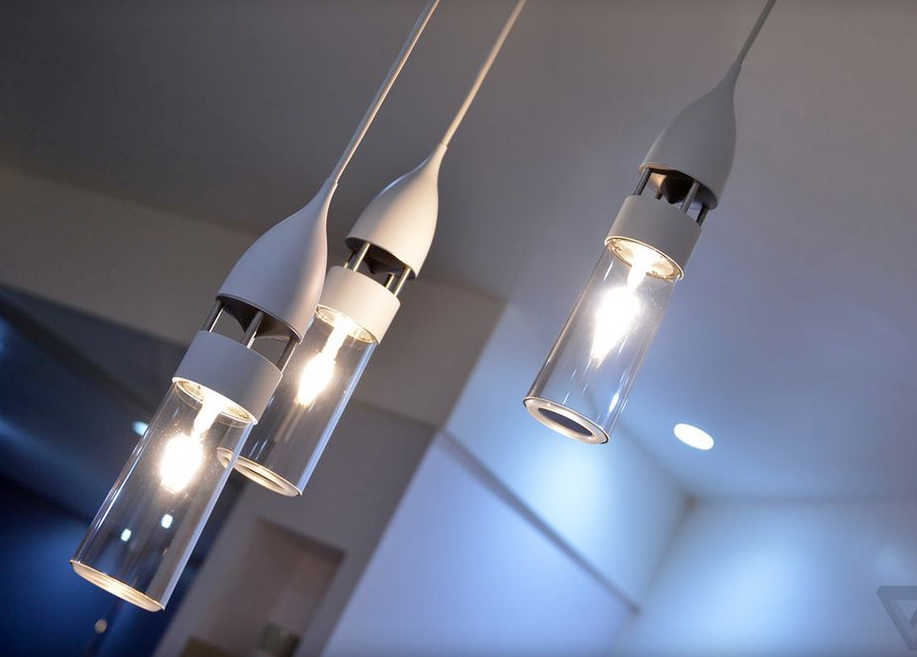  
  
  
28. 구글 에어 플레이 - 오디오를 위한 크롬 캐스트  
http://www.theverge.com/2015/1/5/7482719/google-cast-audio-streaming-speakers-availability-ces-2015  
  
  
29. 휴대용 클라우드 저장소  
http://www.cnet.com/products/lima/  
  
  
30. 허리부착 요통 감시 기기  
http://techcrunch.com/2015/01/04/the-valedo-helps-you-train-back-pain-away/?ncid=rss&utm_source=feedburner&utm_medium=feed&utm_campaign=Feed%3A+Techcrunch+%28TechCrunch%29&utm_content=FaceBook  
  
  
31. 일상을 기록하는 라이프 로그 카메라  
http://www.cnet.co.kr/view/124570  
  
  
32. 스스로 사이즈를 정하는 벨트  
http://gizmodo.com/the-only-gadget-the-world-really-needs-is-a-self-adjust-1677432880?utm_campaign=socialflow_gizmodo_facebook&utm_source=gizmodo_facebook&utm_medium=socialflow  
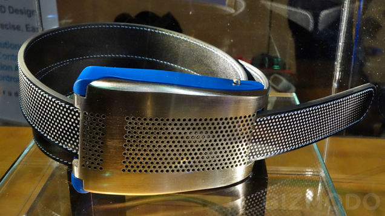  
  
33. 구 형태의 디스플레이  
https://vine.co/v/OpIYKOQUnYr  
  
  
34. 스마트 줄자.  
http://www.engadget.com/2015/01/04/e-tape-measure-metric-imperial-bluetooth-hands-on/?ncid=rss_truncated  
  
  
35. 조금 덜 똑똑한 시계  
http://mashable.com/2015/01/04/withings-activite-pop-watch/?utm_campaign=Mash-Prod-RSS-Feedburner-All-Partial&utm_cid=Mash-Prod-RSS-Feedburner-All-Partial&utm_medium=feed&utm_source=feedly&utm_reader=feedly  
  
  
36. 스마트 화분  
http://www.engadget.com/2015/01/04/parrot-h2o-pot/?ncid=rss_truncated  
  
  
  
37. 웨어러블 밴드 56종 (링크 클릭)  
http://venturebeat.com/2015/01/07/i-tried-on-56-wearables-today-heres-a-photo-of-every-single-one-of-them/  
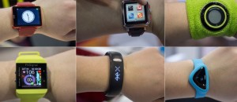  
  
  
  
  
                      
---                        
#150105               
> 2015년 1주차 **HOT DEVICE EVERY WEEK**                       
                       
                          
---                      
  
  
  
1. 반려동물과 원격으로 놀아줄 수 있는 기기. 카메라+레이져포인터+스피커  
https://gigaom.com/2014/12/23/spying-on-your-pet-is-now-easy-and-addictive-with-petcube/?utm_campaign=socialflow&utm_source=facebook&utm_medium=social  
  
  
2. 집안의 오래된 스피커를 블루투스 스피커로 바꿔주는 기기  
http://www.psfk.com/2014/12/vamp-music-bluetooth-speakers-vinyl-aficionados.html  
  
  
3. 몽블랑의 스마트 시계줄  
http://www.earlyadopter.co.kr/10255  
  
  
4. 주변에 사용 가능한 WIFI 신호가 있으면 푸른빛을 내는 검. (반지의 제왕 주의)  
http://interestingengineering.com/hobbit-inspired-sword-lights-up-in-presence-of-open-wifi-networks/  
  
  
5. 360도 방향 모두에서 들을 수 있는 스피커  
http://www.engadget.com/2014/12/29/samsung-ring-radiator-speakers/?ncid=rss_truncated  
  
  
6. 각 물리 버튼의 아이콘을 변경 시킬 수 있는 키보드.  
http://www.jaasta.com/  
http://www.earlyadopter.co.kr/10198  
  
  
7. 작은 스크린이 내장된 블루투스 스마트 반지  
http://gizmodo.com/unlike-all-those-dumb-crowdfunding-campaigns-this-smar-1676567712?utm_campaign=socialflow_gizmodo_facebook&utm_source=gizmodo_facebook&utm_medium=socialflow  
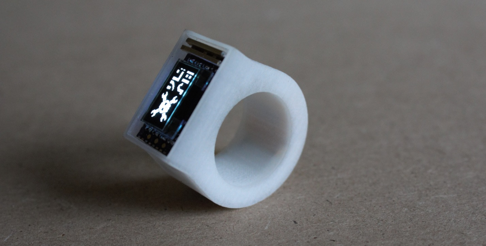  
  
8. 네비게이션이 내장된 오토바이 헬멧  
http://techcrunch.com/2014/12/28/russian-startup-livemap-lands-300k-grant-for-its-motorcycle-helmet-with-built-in-navigation/  
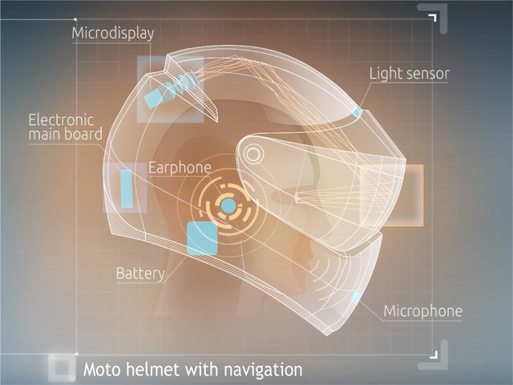  
  
9. HI-FI  오디오가 내장된 아이폰 케이스  
https://www.indiegogo.com/projects/hifi-skyn-iphone-case-for-audiophiles/  
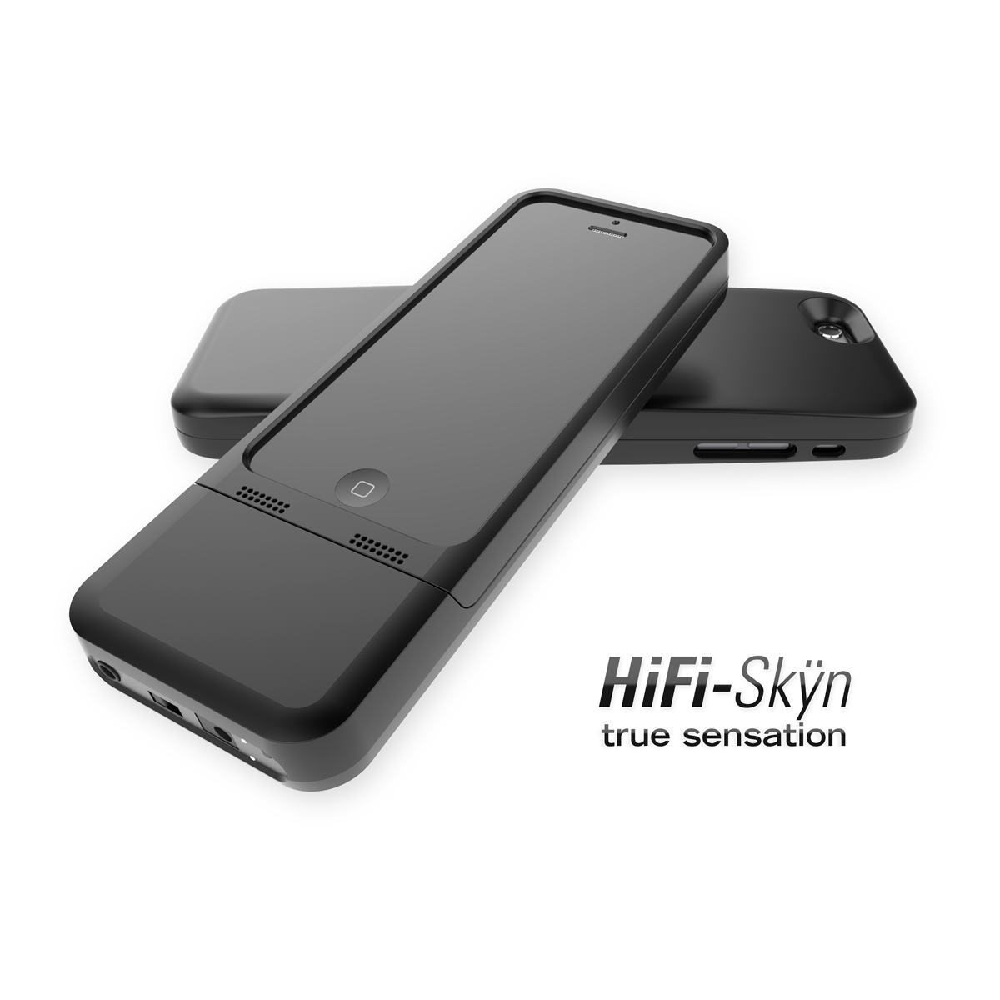  
  
10. 3D 스캐너  
http://techcrunch.com/2014/12/30/matter-and-forms-3d-scanner-is-inexpensive-and-promising/?ncid=rss&utm_source=feedburner&utm_medium=feed&utm_campaign=Feed%3A+Techcrunch+%28TechCrunch%29&utm_content=FaceBook  
  
  
  
                        
---                          
#141229                 
> 2014년 52주차 **HOT DEVICE EVERY WEEK**                         
                         
                            
---                        
  
  
  
1. 영수증 용지에 바로 사진을 출력해주는 즉석 카메라  
http://thenextweb.com/creativity/2014/12/24/this-instant-camera-will-print-images-on-a-receipt-paper-roll/  
  
  
2. 엄마가 바라보는 아기, 아기가 바라보는 엄마의 모습을 동시에 영상으로 기록하는 카메라.   
둘 사이의 거리가 가까워지면 자동으로 영상을 기록.  
http://www.bloter.net/archives/216157  
  
  
3. 강아지 목에 착용함으로서 주인과 통화 할수 있는 기기. 서로 멀리 떨어져 있어도 강아지가 주인의 목소리를 들을 수 있음.   
https://www.kickstarter.com/projects/wuf/meet-wuf-the-worlds-smartest-dog-collar  
  
  
4. 목건강을 관리해 주는 웨어러블 목걸이  
http://www.bizion.com/bbs/board.php?bo_table=product&wr_id=1194  
  
  
5. 실내 외 공기 상태를 실시간으로 측정하는 기기  
http://www.zdnet.co.kr/news/news_view.asp?artice_id=20141130153536  
  
  
6. 펜형태의 보조 배터리 충전기  
http://interestingengineering.com/this-is-the-worlds-first-pen-with-an-integrated-smartphone-battery-charger/  
  
  
7. 신체의 비타민과 미네랄 등의 상태를 측정해주는 기기.  
https://www.indiegogo.com/projects/vitastiq-a-smart-device-for-vital-advice  
  
  
8. 수륙양용 드론  
http://www.gizmag.com/hexh20-amphibious-drone/35347/  
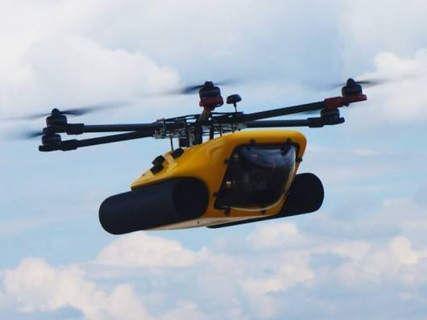  
  
  
9. USB가 결합된 멀티탭  
http://www.gizmag.com/powercube-4-outlets--dual-usb-port-for-all-charging--power-needs--free-shipping/35325/  
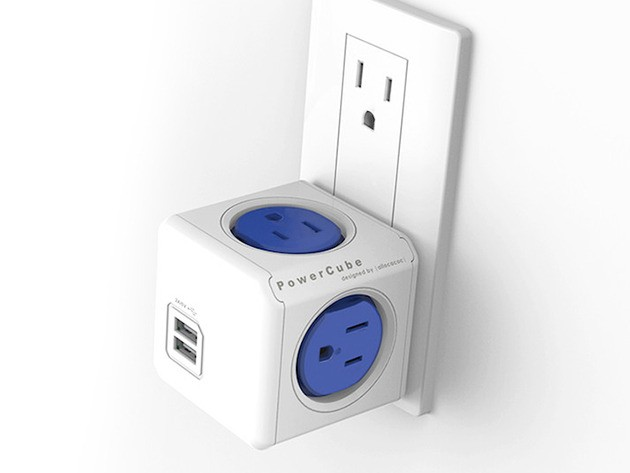  
  
10. 나무와 3D 프린터가 만난 시계  
https://www.indiegogo.com/projects/jelwek-watch  
  
  
  
11. 열면 발신자에게 전화가 걸리는 크리스마스 카드  
http://www.bizion.com/bbs/board.php?bo_table=marketing&wr_id=209  
  
  
  
  
                          
---                            
#141222                   
> 2014년 51주차 **HOT DEVICE EVERY WEEK**                           
                           
                              
---                          
  
  
1. 뒷면에 전자잉크 디스플레이가 탑재된 아이폰6 케이스  
http://techholic.co.kr/archives/24592?utm_source=twitterfeed&utm_medium=facebook  
  
  
2. 기존 출력물을 갈아서 새 3D프린터 재료(필라멘트)로 만들어 주는 기기  
https://www.indiegogo.com/projects/protocycler-free-sustainable-3d-printer-filament  
  
  
3. 회의 내용을 스마트폰으로 보내주는 스마트 화이트보드  
http://www.earlyadopter.co.kr/9775  
  
  
4. 칼로리ㆍ성분 알려주는 스마트 텀블러  
http://www.insight.co.kr/view.php?ArtNo=11230  
  
  
  
5. 호흡을 가다듬게 해주는 기기  
http://www.huffingtonpost.kr/2014/12/19/story_n_6352798.html?1418980966  
  
  
6. 모든 자전거를 전기자전거로 만드는 바퀴  
http://www.earlyadopter.co.kr/9892  
  
  
7. 키 구성을 원하는 대로 바꿀 수 있는 터치 키보드  
https://www.kickstarter.com/projects/620560346/101touch-the-new-generation-of-keyboard?ref=category_popular  
  
  
8. 노트 필기가 바로 디지털로 저장됨.  
http://www.neosmartpen.com/  
  
  
  
  
  
  
---     
#141215     
> 2014년 50주차 **HOT DEVICE EVERY WEEK**     
     
                                
---    
  
  
  
1. 보다 진보한 펜 형태의 무선 마우스   
http://www.psfk.com/2014/12/penclic-is-a-next-generation-computer-mouse-for-lefties-and-righties.html?utm_content=buffer1a71e&utm_medium=social&utm_source=facebook.com&utm_campaign=buffer  
  
  
2. 고양이를 위한 로봇 장난감  
http://community.arm.com/groups/embedded/blog/2014/12/11/the-kickstarter-cat-toy-that-just-raised-over-100k?et=notification.mention.place&utm_content=sf34613666&utm_medium=spredfast&utm_source=facebook&utm_campaign=ARM+Social+Media&sf34613666=1  
  
  
3. 플라스틱 용접기. 플라스틱을 녹여서 접착시키고 UV led로 바로 굳힘.  
http://interestingengineering.com/bondic-is-the-liquid-plastic-welder-with-uv-led/  
  
  
4. 라떼 위에 그림을 그릴수 있는 펜  
http://www.huffingtonpost.kr/2014/12/09/story_n_6292384.html  
  
  
5. 파란색 LED로 피부질환을 치료하는 웨어러블 디바이스 (Philips)  
http://www.engadget.com/2014/09/30/philips-bluecontrol/  
  
  
  
6. 실제 피부처럼 느낄 수 있는 인공 피부로된 의수  
http://www.cnet.com/news/prosthetic-smart-skin-can-feel-all-of-the-things/  
  
  
7. 공중부양 블루투스 스피커  
https://www.indiegogo.com/projects/mars-by-crazybaby-a-levitating-bluetooth-speaker  
  
  
  
  
8. 샤오미가 출시한 공기청정기  
http://www.earlyadopter.co.kr/9535  
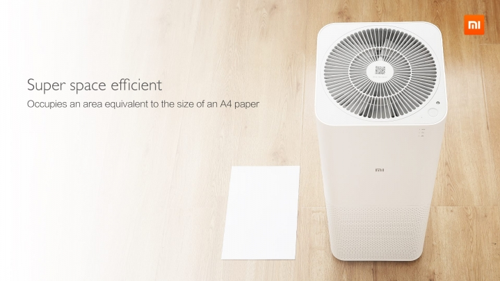  
  
9. 스마트폰과 연동해 무선으로 집안의 기기전원을 관리해 주는 장치.  
https://www.kickstarter.com/projects/2097793904/linkio?ref=category_recommended  
  
  
10. 집안의 곳곳에 이동하면서 사용 가능한 램프  
http://www.psfk.com/2014/12/24hrs-light-is-a-mobile-lamp-with-no-cable-or-button.html?utm_content=bufferbc963&utm_medium=social&utm_source=facebook.com&utm_campaign=buffer  
  
  
11. 다양한 용도로 사용이 가능한 블루투스 스피커(카메라 무선 리모콘, 분실 방지 알람 등)  
http://www.earlyadopter.co.kr/9576  
  
  
12. 앉아서 생활하는 직장인의 건강과 자세를 관리해주는 기기  
http://www.businessinsider.com/prana-gadget-helps-you-maintain-proper-posture-and-breathe-better-2014-12?utm_content=buffere5c8e&utm_medium=social&utm_source=facebook.com&utm_campaign=buffer  
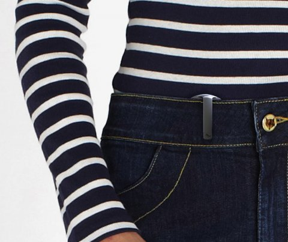  
  
141215 월요일 <Tech>  
세일러묵 드림.  
    
---       
#141208       
> 2014년 49주차 **HOT DEVICE EVERY WEEK**       
       
                                  
---      
  
  
  
1. 손가락에 끼워서 사용하는 제스쳐 기반 마우스(작년 펀딩 성공하고 판매시작)  
https://www.kickstarter.com/projects/mycestro/mycestrotm-the-next-generation-3d-mouse  
  
  
2. 배터리, 스크린, 메인보드가 분리/교체되는 스마트폰  
http://www.earlyadopter.co.kr/9277  
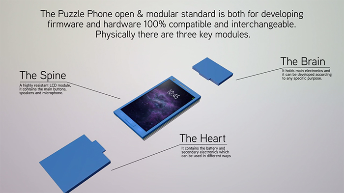  
  
3. 집안의 모든 스피커를 같은 음악으로 동기화 해주는 허브  
https://www.thisisbeep.com/  
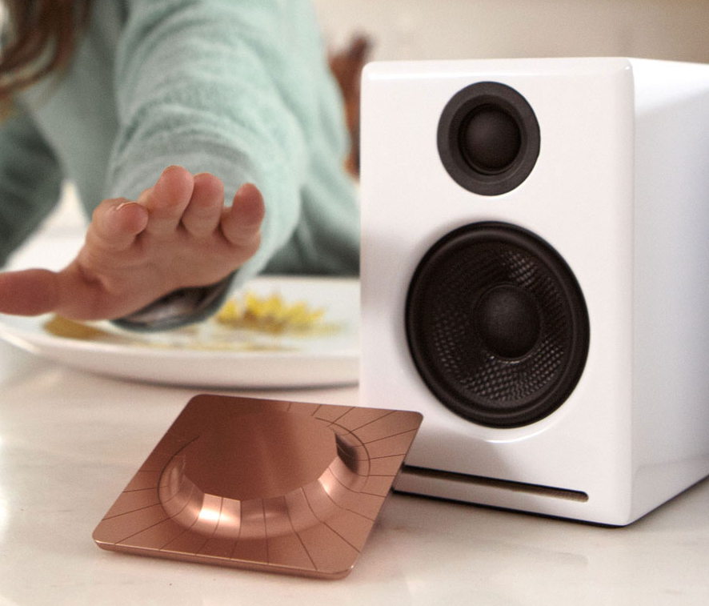  
  
4. 9v 배터리로 충전이 가능하게 해주는 어댑터  
http://interestingengineering.com/use-a-9-volt-battery-to-charge-your-device-thanks-to-plan-v/  
  
  
5. 바이두 에서 만든 스마트 자전거  
http://www.earlyadopter.co.kr/9207  
  
  
6. 아이나비의 증강현실 기반 네비게이션  
http://www.earlyadopter.co.kr/9258  
  
  
7. 스마트 이어플러그 (소음 차단하고 화이트노이즈 재생)  
http://www.huffingtonpost.kr/2014/12/05/story_n_6273824.html?utm_hp_ref=tw  
  
  
8. 소음 제거 이어플러그  
http://techcrunch.com/2014/12/05/dubs-bring-down-the-noise-in-night-clubs/?ncid=rss&utm_source=feedburner&utm_medium=feed&utm_campaign=Feed%3A+Techcrunch+%28TechCrunch%29&utm_content=FaceBook  
  
  
9. 태양광 충전 자켓 (Tommy Hilfiger)  
http://www.cnet.com/news/tommy-hilfiger-launches-solar-power-jackets-to-charge-your-phone/  
  
  
10. 허공에서도 어떤 형태의 촉감을 느끼게 해주는 기술  
http://www.engadget.com/2014/12/04/new-tech-uses-ultrasound-to-create-haptics-you-can-see-and-tou/?ncid=rss_truncated  
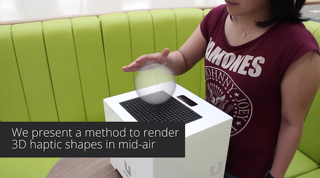  
  
11. 스마트전구  
http://www.cnet.com/products/green-creative-br30-cloud-led/  
  
  
12. 스마트 수도절약 기기  
http://www.cnet.com/products/amphiro-b1/  
  
  
  
  
  
      
---         
#141201         
> 2014년 48주차 **HOT DEVICE EVERY WEEK**         
         
                                    
---        
  
  
  
이번주 추천 프로젝트 : 1, 2, 3, 9번  
  
1. 뒷바퀴에 설치하여 1분안에 전기 자전거로 만들어주는 기기.  
3시간충전시 최대 40km 주행가능, 최고 속도 25km/h  
https://www.kickstarter.com/projects/1732543648/rubbee-the-electric-drive-for-bicycles?ref=discovery  
  
  
2. 지정해놓은 기능이 바로 실행되는 물리 버튼.  
스마트폰의 무자비한 기능들을 쉽고 간단하게 접근할 수 있는 참신하고 방법.  
http://www.wired.com/2014/11/real-world-button-controlling-favorite-apps/?mbid=social_fb  
  
  
3. 무선 제스쳐 컨트롤러.  
오른쪽엔 마우스, 좌측엔 이 기기를 놓으면 편리할듯.  
http://thecreatorsproject.vice.com/blog/look-ma-no-mouse-a-wireless-gesture-controller-could-change-the-way-you-scroll  
  
  
4. 전선없는 크리스마스 트리  
https://www.kickstarter.com/projects/1034423012/aura-the-first-ever-wirelessly-powered-christmas-l?ref=nav_search  
  
  
5. 레진을 재료로 사용하는 3D프린터  
http://www.open-electronics.org/ibox-nano-the-worlds-smallest-resin-3d-printer-just-got-funded-on-kickstarter/?utm_content=buffer5f1a7&utm_medium=social&utm_source=facebook.com&utm_campaign=buffer  
  
  
6. 측정 도구의 디지털화  
http://techcrunch.com/2014/11/27/mocaheart/?ncid=rss&utm_source=feedburner&utm_medium=feed&utm_campaign=Feed%3A+Techcrunch+%28TechCrunch%29&utm_content=FaceBook  
  
  
7. 심장 건강상태를 측정,관리 해주는 기기.  
http://techcrunch.com/2014/11/27/mocaheart/?ncid=rss&utm_source=feedburner&utm_medium=feed&utm_campaign=Feed%3A+Techcrunch+%28TechCrunch%29&utm_content=FaceBook  
  
  
8. 시계줄이 스마트워치, 가지고 있는 시계를 스마트하게 바꿔줌.  
http://www.earlyadopter.co.kr/8826  
  
  
9. 초소형 드론  
https://deals.thenextweb.com/sales/the-skeye-nano-drone?utm_medium=referral&utm_source=thenextweb.com&utm_campaign=skeyenanodrone  
  
  
10. 초소형 드론 2  
http://techcrunch.com/2014/11/27/zano-kickstarter/?ncid=rss&utm_source=feedburner&utm_medium=feed&utm_campaign=Feed%3A+Techcrunch+%28TechCrunch%29&utm_content=FaceBook  
  
  
11. 조본업(Jawbone Up) 피트니스 트래커 (새버전)  
http://www.youtube.com/watch?v=wmfYnJb11cw  
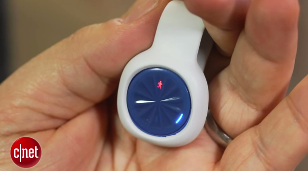  
  
12. 장애인을 위한 안구 마우스 (삼성)  
http://www.cnet.com/news/samsungs-eyecan-lets-your-eyes-control-your-computer/  
  
  
13. 무선 스피커 + 물병.  
http://www.cnet.com/news/splish-splash-its-the-wireless-speaker-water-bottle/  
  
  
  
        
---           
#141124           
> 2014년 47주차 **HOT DEVICE EVERY WEEK**           
           
                                      
---          
  
  
  
2, 3, 4, 5, 9번 -> 매우 재미있는 프로젝트입니다. 링크의 영상을 꼭 확인해 보세요.  
  
1. 긴급상황시 사용할 수 있는 소형 보조 배터리.   
(Reddot award 2014 winner)  
http://thecreatorsproject.vice.com/blog/a-cardboard-pill-a-day-keeps-dead-smartphone-batteries-away  
http://www.red-dot.sg/en/online-exhibition/concept/?code=1269&y=2014&c=17&a=0  
  
  
2. 전자잉크를 사용한 손목시계.  
http://www.youtube.com/watch?v=rdWQQjmsuTo  
  
  
3. 하루에 단 한번만 조작이 가능한 게임기기.  
http://www.wired.com/2014/11/experimental-videogame-consoles-let-make-one-move-day/?mbid=social_fb  
  
  
4. 인공위성을 통해 언제,어디서나 무료 인터넷이 사용가능한 기기.  
https://www.indiegogo.com/projects/lantern-one-device-free-data-from-space-forever  
  
  
5. 가상현실 헤드셋에서 손동작을 인식하는 기기.  
https://www.kickstarter.com/projects/nimblevr/nimble-sense-bring-your-hands-into-virtual-reality  
  
  
6. 조리방법을 알려주는 스마트 프라이팬  
http://www.earlyadopter.co.kr/8545  
  
  
7. 스마트폰을 접촉해야 알람이 꺼지는 스마트알람시계   
http://www.earlyadopter.co.kr/8437  
  
  
  
8. 원자를 직접 움직이며 만든 스톱모션 영상(IBM)  
http://interestingengineering.com/the-worlds-smallest-movie-made-with-atoms/  
  
  
9. 공기중에 이미지를 그리는 진정한 3D 홀로그램 디스플레이  
아직 초기단계의 미미한 모습이지만 엄청난 잠재력이 있는 기술.  
http://interestingengineering.com/this-laser-can-project-3-d-display-in-mid-air-during-daylight/  
  
  
10. 아이들에게 코딩을 알려주는 10달러짜리 로봇   
http://www.wired.com/2014/11/10-dollar-education-robot/?mbid=social_fb  
  
  
  
          
---             
#141117             
> 2014년 46주차 **HOT DEVICE EVERY WEEK**             
             
                                        
---            
  
  
  
1. 가상현실 헤드셋 용 원격 3D 카메라  
17개의 카메라로 360도 모든방향의 3D영상을 기어 VR로 전송해 멀리서도 그 장소에 있는것처럼 느낄 수 있음. 실시간 스트리밍 가능. 양안시차를 이용해 depth를 느낄 수있는 3D영상.  
http://www.huffingtonpost.kr/2014/11/13/story_n_6149220.html?utm_hp_ref=korea  
  
  
2. WIFI가 내장된 9V배터리로 다양한 기기들을 스마트하게.  
https://www.kickstarter.com/projects/roost/the-roost-smart-battery-smarten-your-smoke-alarms  
  
  
3. 백팩에 들어가는 전기 자전거  
http://www.earlyadopter.co.kr/8251  
  
  
4. 지향성 스피커. 한사람만 소리를 들을 수 있음.  
http://interestingengineering.com/directional-speakers-focuses-sounds-like-lasers/  
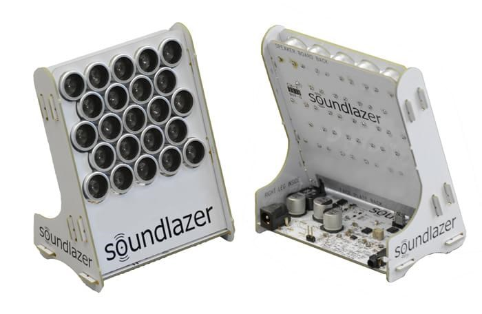  
  
5. 공기중에서 수분을 채취해 물병에 담아주는 기기  
http://www.businessinsider.com/this-water-bottle-can-generate-water-from-the-air-2014-11?utm_content=bufferc8d43&utm_medium=social&utm_source=facebook.com&utm_campaign=buffer  
  
  
6. 자세를 바로 잡는 피트니스 밴드  
http://www.earlyadopter.co.kr/8288  
  
  
7. 공중부양 젠가. 공중에 떠있는 판이 무너지지 않게 쌓아올리는 게임.  
http://www.earlyadopter.co.kr/8296  
  
  
8. 스마트폰으로 찍은 사진을 바로 폴라로이드 사진으로 출력하는 케이스  
http://techcrunch.com/2014/11/13/the-prynt-case-turns-your-smartphone-into-a-polaroid-camera/  
  
  
9. 피사체를 보고 그리는 로봇  
http://thecreatorsproject.vice.com/blog/this-robot-draws-like-a-human  
  
  
  
10. 플라즈마를 이용 실내 공기를 정화시키는 기기  
http://www.cnet.com/news/portable-squair-uses-cold-plasma-to-clean-your-air/  
  
  
11. 발레리나의 동작을 트래킹 하고 코칭해주는 기기  
http://makezine.com/2014/11/06/e-traces-ballet-slippers-that-make-drawings-from-the-dancers-movements/  
  
  
12. 식사습관을 분석하고 코칭해주는 기기   
귀에 장착하여 씹는 패턴을 분석함.   
http://www.cnet.com/news/bitbite-stick-this-thing-in-your-ear-to-lose-weight/  
  
  
13. 발열패드를 내장한 스마트 웨어  
http://www.earlyadopter.co.kr/8340  
  
  
  
14. 30%의 연료를 아낄 수 있도록 도와주는 자동차용 기기  
http://www.earlyadopter.co.kr/8408  
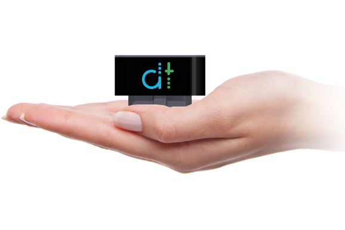  
  
15. 작은 크기의 드론  
http://thenextweb.com/offers/2014/11/11/46-extreme-micro-drone-2-0-aerial-camera-free-worldwide-shipping/  
  
  
  
16. 한발로 균형을 잡는 휴머노이드 로봇  
http://www.youtube.com/watch?v=UH0k2hFHzyc&feature=youtu.be  
  
  
17. 보안 경비 로봇.  
http://www.technologyreview.com/news/532431/rise-of-the-robot-security-guards/?utm_campaign=socialsync&utm_medium=social-post&utm_source=facebook  
  
  
  
  
            
---               
#141110               
> 2014년 45주차 **HOT DEVICE EVERY WEEK**               
               
     
---              
  
  
1. 집에서 사용하는 음성인식 로봇 (아마존 에코)  
http://www.earlyadopter.co.kr/8163  
  
  
2. 새처럼 날아다니는 드론  
http://techcrunch.com/2014/11/05/bionic-bird/  
  
  
3. 아이에게 말을 가르치는 인형  
http://www.earlyadopter.co.kr/8137  
  
  
4. 원격으로 물체의 표면 형태와 질감을 느낄 수 있는 기기  
http://www.wired.com/2014/11/robot-ghost/?mbid=social_fb  
  
  
5. 쉽게 핏줄을 찾을 수 있게 도와주는 기기  
http://techcrunch.com/2014/11/02/this-device-could-make-it-easier-to-find-your-veins/?ncid=rss&utm_source=feedburner&utm_medium=feed&utm_campaign=Feed%3A+Techcrunch+%28TechCrunch%29&utm_content=FaceBook  
  
  
6. 원 휠 스케이트 보드.  
http://www.engadget.com/2014/11/03/onewheel-handson/?ncid=rss_truncated  
  
  
7. 무전기의 재해석  
http://www.engadget.com/2014/11/05/onyx-communicator/?ncid=rss_truncated  
  
  
  
              
---                 
#141104                 
> 2014년 44주차 **HOT DEVICE EVERY WEEK**                 
                 
       
---                
  
  
  
1. 모니터 + 빔프로젝터 + 카메라 가 합쳐지면? (HP)  
새로운 형태의 입/출력 장치를 가진 PC.  
모니터 하단에 빔프로젝터를 쏘고 손이나 펜 등등 제스쳐등을 카메라로 인식함.   
일단 영상 ㄱㄱ  
http://www.engadget.com/2014/10/29/hp-reveals-sprout/?ncid=rss_truncated  
  
  
2. 귀에 꽂아도 보이지 않는 세계 최소 크기 보청기 프로젝트  
https://www.indiegogo.com/projects/nanoplug-the-world-s-first-invisible-hearing-aid  
  
  
3. 모터가 아닌 공기 압력을 이용해 움직이는 로봇 팔 (Disney 주의)  
http://www.youtube.com/watch?v=p3XAi-yR73w&feature=youtu.be  
  
  
4. Vision시스템과 AR(증강현실) 이용한 능동형 자동차 HUD(Head Up Display)   
실제 자동차의 HUD 정보가 운전자의 시야를 방해한다는 연구가 있음.  
더 큰문제는 눈의 초점은 가까이 있는 HUD정보와 유리창 밖의 사물과 동시에 초점이 맞지 않는다는 점.  
이런 문제들을 해결해야 진정한 능동형 자동차 HUD가 될 수 있을 듯.  
http://www.wired.com/2014/10/hud-brings-ghost-cars-to-the-track/?mbid=social_fb  
  
비슷하게 아래 프로젝트는 AR을 이용한 실내용 HUD (참고)  
[영상] http://www.youtube.com/watch?v=cTAYJBfbOCE&list=UU0ME4Nbp4a-9Vdo9GlKr0VQ  
  
  
  
5. 360도 방향이 촬영되는 액션 카메라 (코닥)  
http://www.engadget.com/2014/10/30/kodak-pixpro-sp360-action-cam/?ncid=rss_truncated  
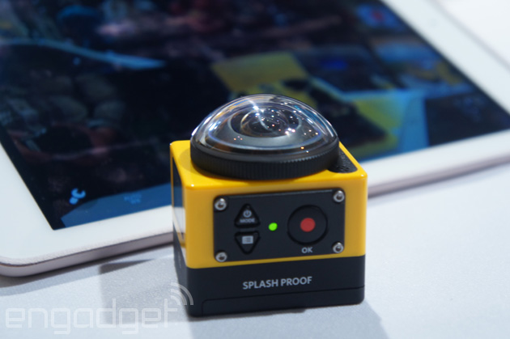  
  
6. 홀로그램 터치 디스플레이 기술.  
실제로는 공기중에 터치하지만 실제 디스플레이를 터치하는것 같이 느낄 수 있음.  
전혀 보지 못했던 새로운 기술 등장.  
http://www.extremetech.com/extreme/193032-haptic-holographic-display-turns-thin-air-into-a-touchscreen  
  
  
7. 최대 시속 40km 로 달릴 수 있는 생체공학 신발.  
http://m.news.naver.com/read.nhn?mode=LSD&sid1=001&oid=081&aid=0002479456  
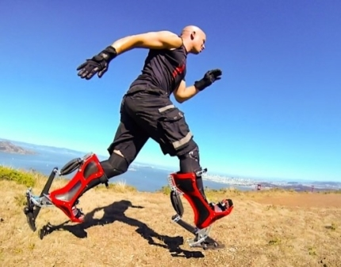  
  
8. 찬물과 뜨거운 물의 이동속도 차이를 이용해 만든 엔진.  
http://blog.naver.com/anatzblog/220165577890  
  
  
  
  
                
---                   
#141027                 
> 2014년 43주차 **HOT DEVICE EVERY WEEK**                   
                   
         
---                  
  
  
  
1. 스티커 형식의 블루투스 전등 스위치. 집안의 원하는 위치에 부착시켜 점/소등.  
http://www.engadget.com/2014/10/21/avi-on-dimmer-switch/?ncid=rss_truncated  
  
  
2. 놀이기구를 게임컨트롤러로 만들어주는 기기.  
놀이 기구에 부착시켜 실제 물리적인 움직임을 통해 모바일에서 게임이 가능.  
http://www.engadget.com/2014/10/23/hybrid-play-indiegogo/?ncid=rss_truncated  
  
  
3. 살균이 필요없는 가습기 (Dyson 주의)  
http://www.huffingtonpost.kr/2014/10/20/story_n_6012688.html?utm_hp_ref=korea  
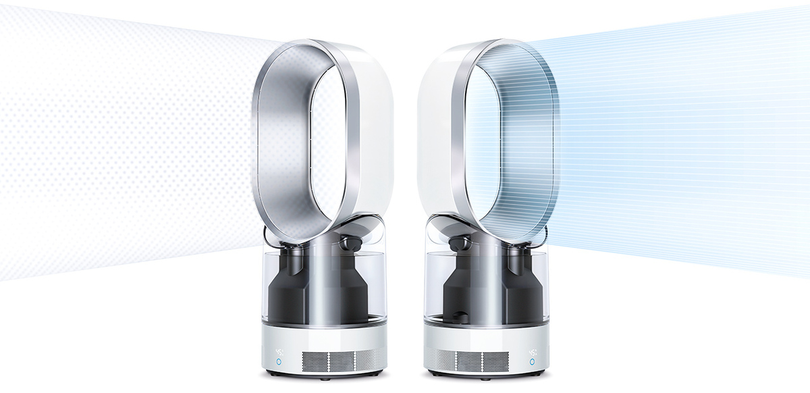  
  
4. 케이블 위에 질량이 있는 추를 이동시키는 방식으로 매우 편리하게 사용할 수 있는 USB 충전 케이블.   
http://www.cnet.com/news/finally-the-phone-charging-cable-youve-been-waiting-for/  
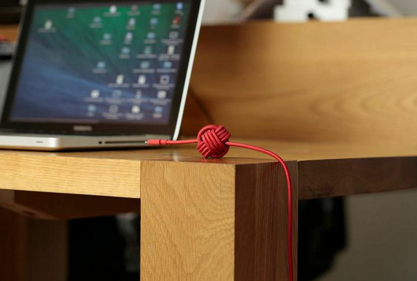  
  
5. 스마트  캐리어 백.  
위치 추적/배터리내장-스마트폰충전/디지털락/여행 데이터 기록  
http://www.engadget.com/2014/10/20/bluesmart-connected-luggage-indiegogo-campaign/?ncid=rss_truncated  
  
  
6#. 심장에 부착하여 환자의 상태를 모니터링 할 수 있는 디바이스  
http://venturebeat.com/2014/10/20/how-a-small-wearable-device-is-improving-care-and-saving-money-for-hospitals/  
  
  
6. 냄비 하단에 가상의 불꽃을 그려주는 인덕션  
http://www.theverge.com/2014/10/26/7070865/samsungs-new-stovetop-projects-virtual-flames-onto-pots-and-pans  
  
  
7. 작고 간편한 기능을 사용할 수 있는 휴대폰 이 포함되어 있는 스마트폰 케이스.  
http://www.cnet.com/news/huh-mini-phone-attaches-to-the-phone-you-already-have/  
  
  
  
8. 가상현실 헤드셋 + 헤드폰  
평상시엔 헤드폰으로 사용 하다가 영상이 보고싶을때 내리면됨.  
http://www.engadget.com/2014/10/22/avegant-glyph-personal-theater-headset/?ncid=rss_truncated  
  
  
9. 자석으로 원하는 위치에 쉽게 설치가 가능한 보안 카메라.  
http://www.theverge.com/2014/10/21/7026079/homeboy-the-magnetic-security-camera  
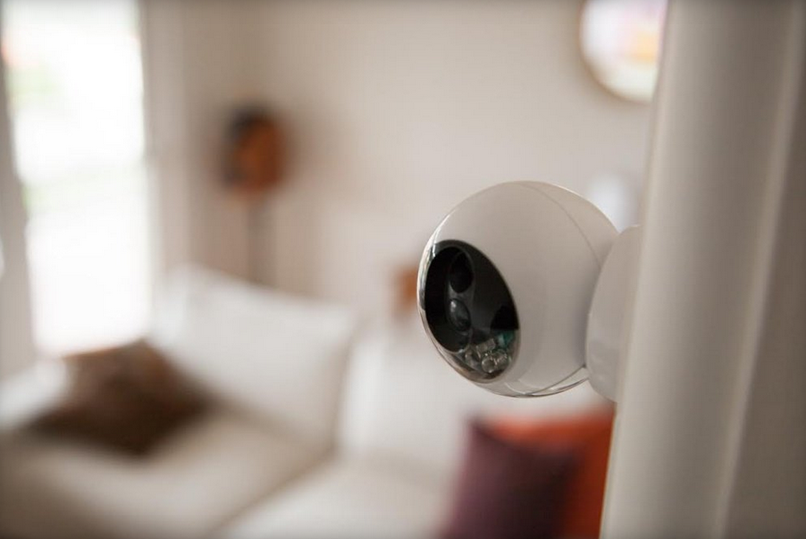  
  
  
10. 오픈소스 스마트 칫솔  
http://www.engadget.com/2014/10/22/goodwell-smart-toothbrush/?ncid=rss_truncated  
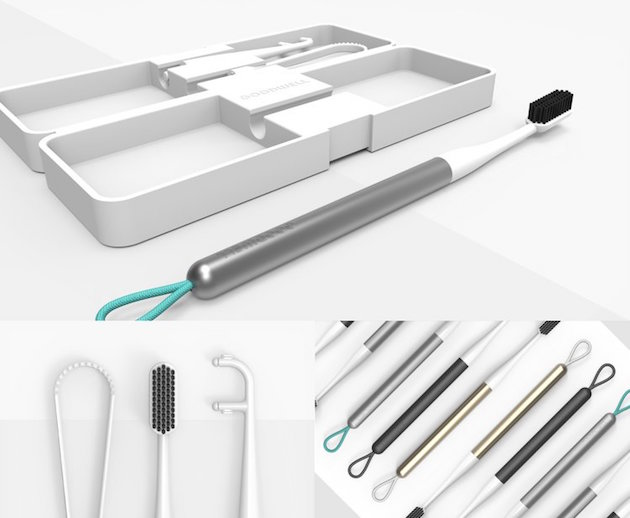  
  
  
11. 유져의 사용 패턴을 학습하는 뮤직 플레이어  
https://www.kickstarter.com/projects/prizm/prizm-turn-your-speakers-into-a-learning-music-pla  
  
  
  
12. 모바일용 신용 카드 리더기.  
http://www.engadget.com/2014/10/23/etsy-card-reader/?ncid=rss_truncated  
  
  
  
13. 휴대용(?) 레이져 커팅 기계  
http://www.cnet.com/news/torch-through-stuff-on-the-fly-with-portable-laser-cutter/  
  
  
14. 새로운 방식의 잡는(grab) 매커니즘이 적용된 로봇  
http://www.engadget.com/2014/10/25/robotic-hand-electrostatic-attraction/?ncid=rss_truncated  
  
  
  
  
                  
---                     
#141020              
> 2014년 42주차 **HOT DEVICE EVERY WEEK**                     
                     
           
---                    
  
  
  
1. 어느장소에나 스크린을 쏴주는 로봇.  
TV, 태블릿, 스마트폰 등의 컨텐츠를 로봇을 통해서 더 넓고 공간의 제약이 없는 환경에서 감상 할 수 있음.  
(Insight) 로봇 청소기에서 벗어난 새로운 종류의 가정용 로봇 등장.  
https://www.kickstarter.com/projects/keecker/keecker-the-worlds-first-homepod  
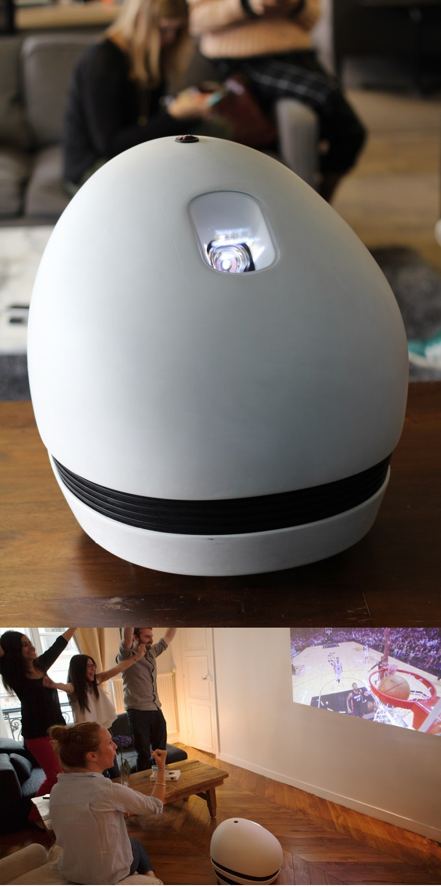  
  
2. 공기를 분사해 빗물을 막아주는 우산  
https://www.kickstarter.com/projects/1243275397/air-umbrella  
  
  
3. 이어폰 단자에 꽂아 사용하는 물리버튼.  
사진촬영, 플래시, 와이파이on, 현재위치 전송, 등 자기가 원하는 동작을 한 버튼으로 바로 실행.  
https://www.kickstarter.com/projects/556341540/pressy-the-almighty-android-button  
  
  
4. 손목 주변이 터치 스크린이 되는 스마트와치  
http://www.geek.com/mobile/this-smartwatch-makes-your-arm-a-touchscreen-1607126/  
  
  
5. 안쓰는 구형 스마트폰을 스마트홈 허브로(온도조절)  
http://www.cnet.com/products/bemo-smart-home-system-and-smart-thermostat/  
  
  
  
6. 주변 360도 방향을 캡쳐하는 옷.  
http://www.engadget.com/2014/10/17/surveillance-blazer/?ncid=rss_truncated  
  
  
7. 손가락으로 가리키는 부분을 음성으로 읽어주는 디바이스  
http://bigthink.com/design-for-good/let-your-finger-do-the-reading-with-this-great-device-from-mit-media-la  
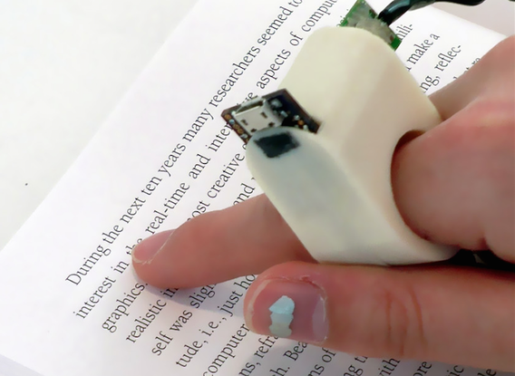  
  
8. 몸의 움직임을 에너지로 전환하여 저장하는 보조 배터리.  
http://www.cnet.com/news/ampy-motion-powered-backup-battery-stores-kinetic-energy/  
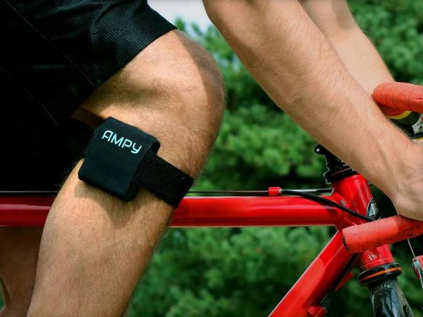  
  
9. pixel art로 알람을 알려주는 led 큐브  
http://www.engadget.com/2014/10/15/dotti-pixel-art-led-block/?utm_source=Feed_Classic_Full&utm_medium=feed&utm_campaign=Engadget&%3Fncid=rss_full  
  
  
10. 테슬라 모델 D  
사륜구동 전기자동차, 자동 운전 보조 기능.  
http://techneedle.com/archives/18735  
  
  
  
                    
---                       
#141013             
> 2014년 41주차 **HOT DEVICE EVERY WEEK**                       
                       
             
---                      
  
  
  
  
1. 펜글씨를 디지털로 옮겨 주는 스마트펜 + 센서    
http://techcrunch.com/2014/10/07/the-equil-smartpen-puts-your-physical-notes-and-doodles-in-the-cloud/  
  
  
2. 쓰지않는 스마트폰을 스마트홈 허브로 만들어주는 기기  
http://www.digitaltrends.com/home/turn-old-smartphone-smart-home-hub-rico/?sf32156421=1  
  
  
3. 양말에 착용하는 피트니스 트래커  
http://www.theverge.com/2014/10/9/6951929/sensoria-running-fitness-tracker  
  
  
4. 에어컨을 스마트하게 바꿔주는 기기. 실내온도 자동 조절.  
https://www.kickstarter.com/projects/ambi-labs/ambi-climate-the-smart-add-on-for-your-air-conditi  
  
  
  
  
5. 엄지부분을 좌/우로 비틀면서 방향을 알려주는 네비게이션 기기  
http://www.engadget.com/2014/10/10/ntt-docomo-yubi-navi/?ncid=rss_truncated  
  
  
6. 쿨러와 히터로 사용 가능한 손목 밴드 형태의 웨어러블 디바이스   
http://www.cnet.com/news/regulate-your-bodys-temperature-with-this-wearable-bracelet/  
  
  
  
  
7. 간단한 혈액검사만으로 암을 발견하는 기기  
http://www.wired.com/2014/10/miroculus/?mbid=social_fb  
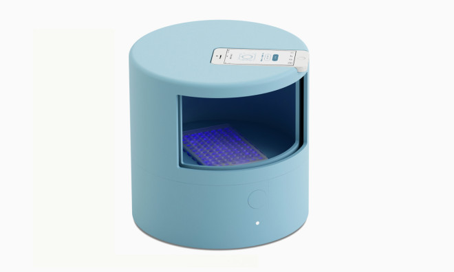  
  
8. 터치 감각을 느낄 수 있는 인공 팔  
http://www.engadget.com/2014/10/10/prosthetic-limbs-sense-of-touch/?ncid=rss_truncated  
  
  
9. 빔 프로젝터가 달려있는 태블릿 PC  
http://thenextweb.com/gadgets/2014/10/09/lenovo-unveils-trio-new-yoga-tablets-8-inch-10-inch-lte-13-3-inch-model/  
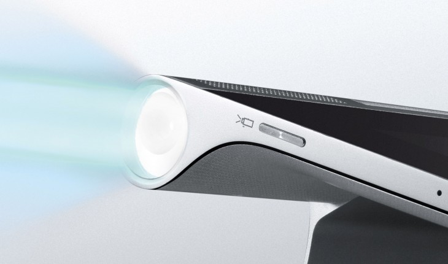  
  
10. HTC 에서 출시한 액션 카메라.  
http://www.engadget.com/2014/10/08/htc-re-camera/?ncid=rss_truncated  
  
  
11. 제스쳐로 자신의 기기를 제어할 수 있는 반지형 웨어러블 제품.  
http://www.cnet.com/news/16lab-concept-smart-ring-keeps-all-of-your-devices-within-reach/  
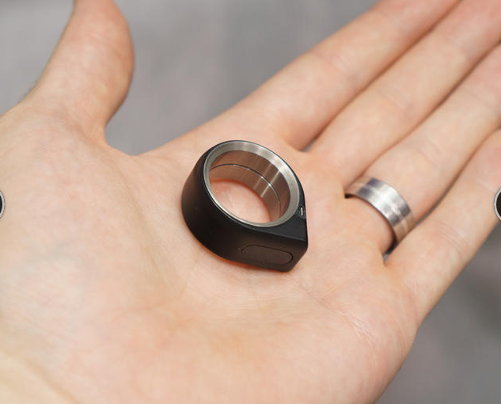  
  
12. 가상현실 헤드셋으로 제어하는 로봇.  
http://www.engadget.com/2014/10/08/robot-oculus-project-ceatec2014/?ncid=rss_truncated  
  
  
  
13. 작은 스크린을 이용해서 자신이 필요한 다양한 디바이스를 만들 수 있음.  
http://techcrunch.com/2014/10/07/tinyscreen-lets-you-put-a-tiny-screen-on-it/?ncid=rss&utm_source=feedburner&utm_medium=feed&utm_campaign=Feed%3A+Techcrunch+%28TechCrunch%29&utm_content=FaceBook  
  
  
14. 바닥에 쏘는 프로젝터를 이용 실내공간을 비디오 게임으로.  
(1) http://www.engadget.com/2014/10/07/romocart-turns-your-living-room-into-a-video-game/?ncid=rss_truncated  
(2) http://www.earlyadopter.co.kr/7527  
  
  
  
                    
---                       
#141006             
> 2014년 40주차 **HOT DEVICE EVERY WEEK**                       
                       
             
---                      

1. 고프로 4
http://ko.shop.gopro.com/APAC/cameras

2. 손에 촉감을 느끼게 해주는 기기 (가상현실 에서 사용)
http://www.extremetech.com/extreme/191404-this-weird-exoskeleton-adds-the-sensation-of-touch-to-virtual-reality

3. 손목에 착용하는 드론
http://techcrunch.com/2014/09/28/a-wearable-drone-that-launches-off-your-wrist-to-take-your-selfie/
http://www.huffingtonpost.kr/2014/09/30/story_n_5904700.html?utm_hp_ref=korea

4. 사물인터넷을 위한 키트
https://www.kickstarter.com/projects/1842650056/sam-the-ultimate-internet-connected-electronics-ki

5. 앱손 글래스
http://www.engadget.com/2014/10/04/epson-moverio-bt-200/?ncid=rss_truncated

                      
---                         
#140929               
> 2014년 39주차 **HOT DEVICE EVERY WEEK**                         
                         
               
---     
  
  
1. 반복을 통해 학습이 가능한 로봇과 OS 개발 (BrainOS)  
프로그래밍을 통해 새로운 기능을 추가하는게 아니라 마치 강아지를 키우는것 처럼 반복 학습을 시킴.  
http://www.technologyreview.com/news/530871/robots-that-learn-through-repetition-not-programming/?utm_campaign=socialsync&utm_medium=social-post&utm_source=facebook  
  
  
2. 자동차도 3G 통신이 가능하게 해주는 모듈  
https://gigaom.com/2014/09/23/mojio-will-launch-its-connected-car-gadget-over-att-and-telus-networks/?utm_medium=social&utm_campaign=socialflow&utm_source=facebook&utm_content=mojio-will-launch-its-connected-car-gadget-over-att-and-telus-networks_875303  
  
  
  
3. 볼을 이용해 움직이는 로봇    
http://www.theverge.com/2014/9/24/6841595/murata-cheerleaders-dancing-robots  
  
  
4. 물이 부족하면 기우는 스마트 화분.  
http://www.earlyadopter.co.kr/7269#imageclose-2  
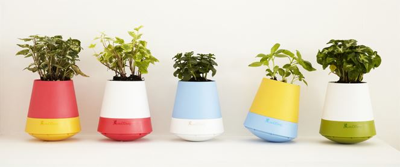  
  
5. 스마트폰용 보조 플래쉬 악세서리  
https://gigaom.com/2014/09/24/iblazr-external-led-flash-for-iphone/?utm_medium=social&utm_campaign=socialflow&utm_source=facebook&utm_content=iblazr-external-led-flash-for-iphone_875761  
  
  
6. 무선 신호의 간섭으로 스마트폰에서 손동작을 감지하는 기술.   
http://www.technologyreview.com/news/530811/radio-waves-offer-cheap-gesture-detection-on-smartphones/  
  
  
7. 스마트폰에서 사용하는 열화상 카메라 악세서리  
http://www.geek.com/chips/seek-thermal-a-199-thermal-cam-add-on-for-ios-and-android-1605350/  
  
  
8. 스마트폰에서 바로 타 기기를 충전할 수 있는 케이블  
http://www.engadget.com/2014/09/24/samsung-power-sharing-cable/?utm_source=Feed_Classic_Full&utm_medium=feed&utm_campaign=Engadget&%3Fncid=rss_full  
  
  
  
9. 무선 모니터(HDMI) 케이블 (microsotf)  
http://www.cnet.com/products/microsoft-wireless-display-adapter/  
  
  
10. 스케이트 보드 + 충전기 + 스피커  
바퀴의 회전에너지로 충전  
http://www.cnet.com/news/skateboard-charges-devices-triples-as-a-boom-box/  
  
  
11. HTC에서 출시(할) 액션 카메라  
http://www.theverge.com/2014/9/24/6840545/htc-teases-video-camera-ahead-of-october-event  
  
  
  
  
12. 로봇팔이 달린 드론  
사람이 작업하기 어려운 위치에서의 작업이 가능.  
http://gizmodo.com/this-drone-is-armed-but-not-like-you-might-imagine-1639410829  
[영상] https://www.youtube.com/watch?v=sag34FBVpVk  
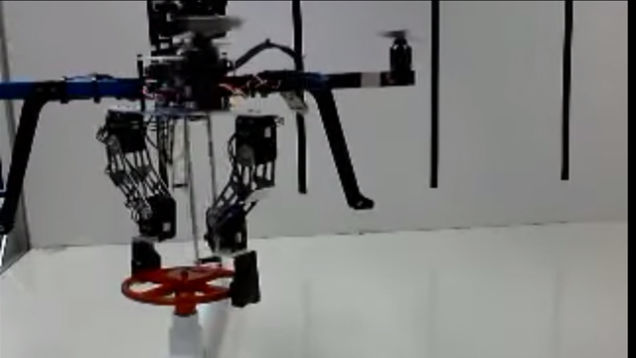  
  
13. DHL 에서 서비스하는 배달용 드론 (실제 서비스 중)  
http://www.engadget.com/2014/09/24/dhl-paketkopter-delivery-drone/?ncid=rss_truncated  
  
  
14. 천(fabric) 재질의 로봇 , 요즘 'soft' 로봇이 연구 트렌드인듯?  
http://www.engadget.com/2014/09/24/robotic-fabric/?ncid=rss_truncated  
  
  
15. 문어의 움직임과 똑같이 움직이는 soft 로봇!  
  
[영상] http://www.youtube.com/watch?v=azumXwStahM  
http://www.engadget.com/2014/09/23/octopus-robot/?ncid=rss_truncated  
  
  
16. 직접 만지는것과 똑같은 촉감을 만들어주는 (haptic feedback) 기기  
http://interestingengineering.com/new-robotic-glove-gives-you-the-sensation-of-touching-boobs/  
  
  
  
  
  
                        
---                           
#140922                 
> 2014년 38주차 **HOT DEVICE EVERY WEEK**                           
                           
                 
---       
  
  
1. PC/스마트폰/태블릿PC를 하나의 키보드로 타이핑  
http://www.logitech.com/en-us/product/multi-device-keyboard-k480  
  
  
2. 눈의 피로를 풀어주는 마사지 기계  
http://www.earlyadopter.co.kr/6781  
  
  
3. 근육통을 감소시켜주는 디바이스 + 스마트폰 컨트롤  (Philips)  
http://www.engadget.com/2014/09/17/philips-app-controlled-pain-reliever/?ncid=rss_truncated  
  
  
4. 아이들을 위한 웨어러블 tracing 비콘 , 아이 위치 찾기가능  
https://www.indiegogo.com/projects/lineable-5-smart-wristband-for-children  
  
  
5. 팔찌형 보조배터리  
http://www.earlyadopter.co.kr/6021  
  
  
6. iPad를 가상현실 헤드셋으로 만들어주는 기기.  
http://www.theverge.com/2014/9/16/6256729/airvr-attach-your-ipad-directly-to-your-face  
  
  
7. Polaroid에서 출시한 인스타그램 로고 카메라 (사진 프린트 가능)  
http://www.engadget.com/2014/09/16/polaroid-socialmatic-hands-on/?ncid=rss_truncated  
  
  
8. 손소독기가 달려있는 문손잡이  
http://www.pullclean.com/  
  
  
9. 3D 프린트 가능한 UAV(무인항공기)  
http://www.wired.com/2014/09/military-grade-drone-can-printed-anywhere/?mbid=social_fb  
  
  
10. 매우 sensitive한 로봇의 fingertip 센서 연구 (MIT주의)  
기존의 로봇손이 하기 어려운 작업이 가능해짐.  
http://newsoffice.mit.edu/2014/fingertip-sensor-gives-robot-dexterity-0919  
  
  
11. 점프/달리기가 가능한 치타로봇   
http://www.geek.com/science/mits-cheetah-robot-gets-let-off-the-leash-to-run-and-jump-outdoors-1604561/  
  
  
12. 열을 이용해서 표면의 형태를 자유롭게 변형시키는 메커니즘.  
http://www.wired.com/2014/09/a-new-concept-for-shape-shifting-architecture-that-responds-to-heat/?mbid=social_fb  
  
  
  
<#지난주_핫_IT_프로덕트>

1. 손을 심하게 떠는 사람을 위한 숟가락.
기기의 진동으로 손의 떨림이 상쇄됨.
링크의 영상을 꼭 보세요!
http://www.engadget.com/2014/09/10/lift-labs-google-x-vibrating-spoon/?ncid=rss_truncated

2. 중력을 이용해 불을 밝혀주는 장치.
10kg정도 무게 한번에 30분정도 LED점등
http://m.blog.naver.com/PostView.nhn?blogId=ksc12545&logNo=220113214998

3. 우산꼭지에 끼워서 비오는날 우산이없는 사람들과 우산을 공유하도록 도와주는 기기.
https://www.kickstarter.com/projects/1369020620/umbrella-here-light-up-your-umbrella-for-sharing

4. 등에 설치하는 제트엔진. 매우빠르게 달릴수 있음 군용으로 응용 가능.
http://mobile.geek.com/latest/254631-darpa-uses-a-jetpack-to-get-all-soldiers-running-4-minute-miles

5. 실제 증강현실로 디스플레이되는 스마트안경.
http://m.blog.naver.com/eomtank/220117429769

6. 먹으려고 하는 음식에 알레르기가있는지 검사해주는 기기.
http://techcrunch.com/2014/09/11/6sensor-labs/?utm_campaign=fb&ncid=fb

7. 거의 모든음식을 완벽하게 구워주는 스마트 그릴.
재료를 알아서 분석해서 구워줌.
http://techcrunch.com/2014/09/09/palate-is-a-smart-grill-that-takes-the-work-out-of-cooking/?ncid=fb&utm_source=feedburner&utm_medium=feed&utm_campaign=fb

8. 인터넷연결없이도 잃어버린 짐을 찾아주는 기기.
https://gigaom.com/2014/09/08/open-garden-is-using-firechat-to-build-a-network-for-the-internet-of-things/?utm_medium=social&utm_campaign=socialflow&utm_source=facebook&utm_content=open-garden-is-using-firechat-to-build-a-network-for-the-internet-of-things_871160

9. 가상현실 헤드셋에 필요한 영상촬영용 카메라.
360도 모든방향이 한번에 촬영됨
http://www.engadget.com/2014/09/11/nextvr-red-virtual-reality-camera-system/?ncid=rss_truncated

10. 스마트홈 허브.
https://gigaom.com/2014/09/10/wigwag-intros-new-lights-and-a-platform-for-the-internet-of-things/?utm_medium=social&utm_campaign=socialflow&utm_source=facebook&utm_content=wigwag-intros-new-lights-and-a-platform-for-the-internet-of-things_872108

11. 체온에 맞게 따듯한 옷도가 유지되는 옷.
https://www.indiegogo.com/projects/fuelwear-the-first-smart-heated-base-layer

12. 부드러운 재질의 엑소슈트.
근육의 움직임을 분석하여 다리의 움직임에 따라  힘이 적게들어가도록 힘을 적절히 분배함
http://www.engadget.com/2014/09/12/darpa-harvard-soft-exosuit/?ncid=rss_truncated

13. 엑소슈트 군용.
http://www.digitaltrends.com/cool-tech/darpa-invests-super-light-exoskeleton-soldiers/

14. 소리를 진동으로 느끼게해주는 조끼.
http://www.engadget.com/2014/09/11/vest-translates-sound-into-vibration-for-the-hearing-impaired/?ncid=rss_truncated

15. 소프트하게 움직이는 로봇 (공압을 이용한 새로운 메커니즘)
https://gigaom.com/2014/09/10/forget-terminator-the-robots-of-the-apocalypse-could-be-squishy/?utm_medium=social&utm_campaign=socialflow&utm_source=facebook&utm_content=forget-terminator-the-robots-of-the-apocalypse-could-be-squishy_871890

140915 월요일 <Tech>
세일러묵 드림.
<지난주 핫 IT 프로덕트>

1. Dyson이 출시한 로봇청소기 ,
턱을 자유자재로 넘나들음, 강력한 흡입.
http://blogs.wsj.com/personal-technology/2014/09/04/dyson-debuts-first-robot-vacuum-cleaner-the-eye-360/

2. 측면까지 디스플레이가 되는 스마트폰
http://www.theverge.com/2014/9/3/6097297/samsung-galaxy-note-edge-wraparound-display

3. 스마트 젓가락 , 먹는 음식의 성분 분석, 
http://thenextweb.com/asia/2014/09/04/smart-chopsticks-analyze-quality-food-youre-eat/

4. 색캡쳐 스타일러스 , 현실의 책을 캡쳐해서 태블릿에서 바로 이용.
http://techcrunch.com/2014/09/02/mozbii/?ncid=rss&utm_source=feedburner&utm_medium=feed&utm_campaign=Feed%3A+Techcrunch+%28TechCrunch%29&utm_content=FaceBook

5. 스마트폰을 이용한 가상현실 헤드셋 (오큘러스VR+삼성전자)
http://www.theverge.com/2014/9/3/6101247/samsung-gear-vr-hands-on

6. Motorola 무선 이어폰 + 충전기  케이스
http://bgr.com/2014/09/05/moto-hint-and-power-pack-micro/

7. 스마트 링
반지에 디스플레이 장치가 있어서 스마트폰 알림 표시
http://www.engadget.com/2014/09/06/mota-smartring-indiegogo/?ncid=rss_truncated

8. 스마트 홈을 제어하는 팔찌
http://www.cnet.com/products/playtabase-reemo/

9. 얼굴인식, 공기오염 감지 홈 카메라
http://www.wired.com/2014/09/a-smart-nanny-cam-with-facial-recognition-and-air-pollution-sensors/?mbid=social_fb

10. 스마트 럭비공 , 럭비공의 방향과 위치를 측정
http://www.engadget.com/2014/09/05/magneto-track-footballs-know-where-they-are-and-what-direction-t/?ncid=rss_truncated

11. 시속 22km/h로 달리는 스마트폰 조종 장난감.
http://www.theverge.com/2014/9/4/6105449/ollie-sphero-smartphone-controlled-racer-drives-14-mph

12. 새로운 방식의 도어락 , 쉬운 설치.
http://techcrunch.com/2014/09/03/haven-keeps-your-doors-locked-without-keys/?ncid=fb&utm_source=feedburner&utm_medium=feed&utm_campaign=fb&utm_content=FaceBook

13. 골키퍼 트레이닝 디바이스, 각종 정보 측정
http://www.wired.com/2014/09/recording-the-frenzy-of-soccer-goalkeeping-1000-times-a-second/

14.핸드믹서기 + 알뜰주걱
http://gizmodo.com/a-tiny-battery-powered-beater-that-mixes-better-than-a-1629533383

15. 달리기가 가능한 2족보행 로봇
http://www.engadget.com/2014/09/02/achires/?utm_source=Feed_Classic_Full&utm_medium=feed&utm_campaign=Engadget&%3Fncid=rss_full

16. 천장으로 움직이는 로봇
http://gizmodo.com/this-robotic-bridge-inspector-was-originally-a-disney-c-1627998821

17. 계단으로 무거운 짐을 날라주는 로봇
http://gizmodo.com/a-robotic-dolly-means-youll-never-carry-anything-up-sta-1629507866

지난주는 대기업 제품이 많았네요.

140908 월요일 아침 <Tech>
세일러묵 드림.

<지난주 핫 IT 프로덕트>

1. 구글에서 만든 배달용 드론 "Project Wing"
유사제품 : Prime Air(아마존) 보다 더 빠름
http://www.engadget.com/2014/08/28/google-x-project-wing/?ncid=rss_truncated

2. Dyson 에서 로봇 청소기 만드는중 (티져영상) 
http://gizmodo.com/dyson-teases-upcoming-secret-project-its-probably-a-ro-1627892075

3. 립모션 + 가상현실헤드셋 = 가상현실속 손동작 인식가능
http://www.engadget.com/2014/08/28/leap-motion-s-next-sensor-is-designed-specifically-for-virtual-r/?ncid=rss_truncated

4. 구 형태의 디스플레이 기기
3D 입체 이미지를 사방에서 확인 가능
http://www.cnet.com/news/spheree-lets-you-watch-animated-images-in-full-3d/

5. 멀리 떨어져있어도 서로 물리적인 소통을 가능하게 하는기기
http://www.engadget.com/2014/08/20/things-unsaid/?ncid=rss_truncated

6. 휴대용 음주 측정기 (이어폰 잭에 꽂아 사용)
http://techcrunch.com/2014/08/30/drinkmate/?ncid=fb&utm_source=feedburner&utm_medium=feed&utm_campaign=fb&utm_content=FaceBook

7. 걸을 수 있도록 만들어주는 엑소슈트
http://interestingengineering.com/3d-printing-offers-new-hope-to-walk-again/

8. 두개의 스마트폰으로 디제잉을 할 수있는 스마트폰 악세서리
http://www.engadget.com/2014/08/30/openmix-kickstarter/?ncid=rss_truncated

9. 웨어러블 자세+활동 Tracker
http://www.lumobodytech.com/
http://www.cnet.com/products/lumo-lift/

10. 가정용 온도조절기
유사제품 : NEST
http://gigaom.com/2014/08/29/heres-a-slightly-more-budget-friendly-beautiful-connected-thermostat/?utm_medium=social&utm_campaign=socialflow&utm_source=facebook&utm_content=heres-a-slightly-more-budget-friendly-beautiful-connected-thermostat_868654

11. 스마트 칫솔 
치아 건강 관리, 양치 습관개선
https://www.kickstarter.com/projects/2134904849/kolibree-the-worlds-first-connected-electric-tooth

12. Connected Hat(스마트 모자?)
http://www.cnet.com/news/forget-smartwatches-heres-the-connected-hat/

13. 스마트폰 케이스 형태의 건강 체크 기기 
혈압,심박수,폐활량,ECG등 체크가능
https://azoi.com/

140901 월요일 아침 <Tech>
세일러묵 드림.

1.블루투스로 열리는 자물쇠
http://www.engadget.com/2014/08/18/noke-bluetooth-padlock-kickstarter/?ncid=rss_truncated

2.물병에 장착하여 물을 언제먹야할지 코치해주는 기기
https://www.kickstarter.com/projects/caktus/track-your-water-intake-and-hydrate-better-with-th?ref=category

3.분사시 사진이 찍히는 호신용 스프레이
카메라가 촬영되고 
http://www.cnet.com/news/pepper-spray-goes-digital-with-the-defender/

4.신발에 부착하여 운동정보를 알려주는 디바이스 
https://www.kickstarter.com/projects/1103510338/runscribe-wearable-for-the-data-driven-athlete

5.스마트 테니스 센서 
http://www.cnet.com/products/smart-tennis-sensor/

6.운동을 억지로 시키는 340볼트의 전기 밴드
http://www.earlyadopter.co.kr/5572

7.모듈형 스마트워치
https://www.kickstarter.com/projects/343910040/atomwear?ref=category_popular

8.노인을 위한 스마트 밴드
http://www.carepredict.com/

9.가상현실 헤드셋과 함께사용하는 악세서리 
모션컨트롤러
https://www.kickstarter.com/projects/316228545/trinity-magnum-precision-motion-control-for-vr?ref=category

10.자동차안에서 아기가 베이비시트를 벗어났는지 알려주는 기기
https://www.kickstarter.com/projects/mattbsheets/starfish?ref=category_popular

11.초음파를 이용한 공중 부양 장치
https://www.kickstarter.com/projects/richardhaberkern/ultrasonic-levitation-machine-learn-the-science-of?ref=category_popular

12.웨어러블 의자
엑소 슈트 처럼 다리에 착용하여 의자처럼 앉을 수 있음.
The invisible chair that you can wear
http://edition.cnn.com/2014/08/20/tech/innovation/the-chairless-chair/index.html?hpt=hp_c4

13.로봇 물고기 + 전용 어항
http://www.earlyadopter.co.kr/5720

14.스티커형 블루투스 Beacon
http://gigaom.com/2014/08/21/estimote-launches-a-bluetooth-beacon-sticker-to-add-context-to-the-internet-of-things/?utm_medium=social&utm_campaign=socialflow&utm_source=facebook&utm_content=estimote-launches-a-bluetooth-beacon-sticker-to-add-context-to-the-internet-of-things_866773

15.스스로 위치를 변경하여 어떤 모양을 만들어내는 1000개의 로봇
http://techcrunch.com/2014/08/14/watch-a-thousand-micro-robots-self-assemble-into-wild-shapes/?ncid=rss&cps=gravity

16. 스마트 헬멧
http://www.earlyadopter.co.kr/5167

140825 월요일 아침 <Tech>
세일러묵 드림.

<지난주 핫 IT 프로덕트>

1. 허공에 떠 있는 블루투스 스피커
http://www.cnet.com/news/om-one-levitating-bluetooth-disco-ball-speaker-defies-gravity/

2. 접으면 USB가되는 카드
PC에 꽂자마자 바로원하는 정보가 실행됨 이를테면 본인이 작성한 구글닥스 페이지 같은것이
http://mobile.geek.com/mobile/254312-swivelcard-smart-business-card-impresses-with-tasteful-thickness-subtle-off-white-coloring

3. 폴라로이드에서 출시한 깜찍한 큐브 카메라
http://www.engadget.com/2014/08/11/polaroid-cube-camera/?ncid=rss_truncated

4. 프로젝터를 이용한 HCI (Human–computer interaction)
http://www.ozy.com/rising-stars-and-provocateurs/james-patten-frontiers-of-the-human-digital-interface/33116.article?utm_source=outbrain&utm_medium=cpc&utm_campaign=socialwins&utm_content=27369746

5. 피부에서 발산하는 땀으로부터 전기를 만들어내는 1회용 문신형 배터리
http://www.engadget.com/2014/08/13/rtemporary-tattoo-sweat-power/

6. 스마트폰 카메라로 저렴하게 키넥트 같은 동작인식 구현
적외선 LED와 적외선 필터 사용.
http://www.engadget.com/2014/08/11/microsoft-research-project-turns-a-smartphone-camera-into-a-chea/

7. 농구코트 바닥을 Display기기로 바꾸어 선수들의 움직임에 따라 바닥에 표시되는 정보가 바뀜 
http://www.engadget.com/2014/08/15/nikes-led-basketball-court/

8. 호텔 룸 서비스 로봇.
http://t-robotics.blogspot.kr/2014/08/ieee.html#.U_C3P_l_t8E

9. 3만원짜리 스마트폰용 빔 프로젝터
http://www.earlyadopter.co.kr/4907

140818 월요일 아침 <Tech>
세일러묵 드림.
140811

1. 맥북의 자석형 커넥터가 아이폰으로
http://www.earlyadopter.co.kr/4597

2. 종이처럼 스스로 접히는 로봇
펼쳐져있다가 스스로 동작가능한 형태로 접혀서 움직임
(Insight) 최근들어 종이접기가 응용된 로봇이 몇몇 등장함
http://mobile.theverge.com/2014/8/7/5975463/transforming-origami-robot-builds-itself-by-folding

3. 아기 건강 모니터링 기기
아이 키우시는 분들 가끔씩 아이로 부터 자유로워 지고 싶을때 필요할듯
http://www.sproutling.com/

4. 엑소슈트(exosuit) , 조선소에서 테스트완료
http://www.cnet.com/news/robotic-exosuit-gives-shipbuilders-a-strength-boost/

5. 차량용 HUD
컨셉영상뿐, 아직 working prototype이 존재하지 않는듯.. 그래도 펀딩은 많이 받음.
http://mobile.theverge.com/2014/8/5/5970705/this-tiny-projector-puts-smartphone-apps-on-your-cars-windshield

6. 대형(?) 디지털 액자
모니터 같이 생긴것이 아니라 액자같이 생긴점이 특징
http://www.earlyadopter.co.kr/3796

7. 자동 귀이개
전동 코털깎이 같은거... 왜 이제 나왔지?..
https://www.indiegogo.com/projects/the-oto-tip-4-reasons-to-quit-q-tips-today

8. WIFI신호를 이용 벽을 투시하는 로봇
두개의 로봇이 서로 신호를 주고받으며 볼수없는 벽면뒤의 혹은 건물안의 대락적인 구조 파악
http://mobile.theverge.com/2014/8/7/5979723/x-ray-vision-using-wi-fi-on-robots
,
9. 안경이나 렌즈를 착용하지 않아도 사용자 시력에 맞게 디스플레이되는 기술 (MIT주의)
http://www.wired.com/2014/08/mit-develops-a-phone-screen-that-corrects-poor-vision/?mbid=social_fb

140804

1. 스마트 슈즈
목적지에 다다르기 까지 갈 방향을 진동으로 알려줌
http://techcrunch.com/2014/07/28/smartshoemadeinindia/?utm_campaign=fb&ncid=fb

2. 허공에 그리는 3D pen
이전 3D Doodler와 다른점은 자외선으로 응고시킴 잉크로 색상표현가능
https://www.indiegogo.com/projects/creopop-the-world-s-first-3d-pen-with-cool-ink

3. 터치가 가능한 빔 프로젝터
아무 벽이나 터치스크린으로 만듦
http://mashable.com/2014/07/28/touchpico-touchjet/?utm_cid=mash-com-fb-main-linkhttp%3A%2F%2Fmashable.com%2F2014%2F07%2F28%2Ftouchpico-touchjet%2F%3Futm_cid%3Dmash-com-fb-main-link

4. 팔 근육의 움직임을 이용한 입력장치 Myo new type
http://mashable.com/2014/07/29/myo-motion-control-armband-hands-on/?utm_cid=mash-com-fb-main-link

5. 프로젝션 시계
아직까진 working prototype은 없음.
Indigogo 에서 펀딩중
https://www.indiegogo.com/projects/ritot-the-first-projection-watch#description

6. Zepp takes a swing at baseball with its tiny data analyzer
http://www.engadget.com/2014/07/22/zepp-baseball-swing-analyzer/

7. 로봇이 다리하나가 고장났을때 나머지 다리로 어떻게 걸어야하는지 스스로 알아냄. (2분안에)
http://mobile.geek.com/latest/254199-robot-with-broken-leg-figures-out-how-to-walk-again-in-under-2-minutes

8. 눈동자 추적이되는 HMD(Head Mount Display)
http://techneedle.com/archives/17772

9. 시동이 걸리면 SMS 가 차단되는 기기
http://www.geek.com/mobile/straight-talks-new-car-accessory-disables-sms-while-the-engine-is-running-1600992/

140728

1. 모듈 조립식 와치 
http://www.engadget.com/2014/07/08/blocks-modular-smartwatch/

2. 마셔도 안위험한지 체크해주는 기기
조선시대 왕이 사용했으면 좋았을듯
http://www.engadget.com/2014/07/21/pdid-indiegogo-drink-spiking-device/

3. 글씨 쓰는 로봇
​The Big Picture: A Robot writing the Torah in longhand
http://www.engadget.com/2014/07/14/the-big-picture-a-robot-writing-the-torah-in-longhand/

4. 고양이 러닝머신
https://www.kickstarter.com/projects/620439316/one-fast-cat-exercise-wheel

5. 오토바이 헬멧 HUD
http://indefinitelywild.gizmodo.com/hands-on-with-the-worlds-first-hud-motorcycle-helmet-1608590926?utm_campaign=socialflow_gizmodo_facebook&utm_source=gizmodo_facebook&utm_medium=socialflow

6. 취침 모니터링 기기
https://www.kickstarter.com/projects/hello/sense-know-more-sleep-better/

7. 휴대폰 신호를 감지하여 사람을 찾는 드론
http://gigaom.com/2014/07/25/this-drone-can-find-lost-or-stranded-people-by-picking-up-their-mobile-phone-signals/?utm_medium=social&utm_campaign=socialflow&utm_source=facebook&utm_content=this-drone-can-find-lost-or-stranded-people-by-picking-up-their-mobile-phone-signals_860597

2014년 7월21일 월요일 
세일러묵이 드리는 저녁 반찬 <Tech>

지난주 핫 IT 프로덕트!

1. 가정용 로봇 JIBO (MIT)
본격적인 가정용 로봇의 시대가 온 느낌
Jibo could be the robot assistant you fall in love with | The Verge
http://mobile.theverge.com/2014/7/16/5909625/robot-assistant-jibo

2. 시각장애인에게 책을 읽어주는 핑거리더(FingerReader)
http://besuccess.com/2014/07/fingerreader/

3. Go tenna
와이파이, 데이터 없이도 메세지 전송이 가능한 기기
http://gigaom.com/2014/07/17/no-signal-gotenna-has-a-messaging-gadget-that-will-work-in-the-middle-of-nowhere/?utm_medium=social&utm_campaign=socialflow&utm_source=facebook&utm_content=no-signal-gotenna-has-a-messaging-gadget-that-will-work-in-the-middle-of-nowhere_858398

4. 고양이에게 먹이를 주는 기기
얼굴인식기능으로 어느 고양이가 먹는지, 얼만큼의 사료를 줘야할지 판단. 식단조절
http://mobile.theverge.com/2014/7/15/5901489/can-haz-self-control-feline-facial-recognition-Bistro-cats-less-fat

5. 두개의 로봇손가락으로 인간의손을 보조해주는 로봇
http://mobile.extremetech.com/latest/221700-mit-upgrades-human-hand-with-two-extra-robot-fingers-but-why-stop-there

6. 아이스크림 3d프린터 (MIT)
http://techcrunch.com/2014/07/16/mit-students-create-an-ice-cream-printer/

7. 아이폰 스타일러스 펜
The best iPad stylus is now for sale in Europe
http://mobile.theverge.com/2014/7/16/5904115/ipad-stylus-pencil-europe

8. 스마트폰 낚시 입질 감지기.
http://m.news.naver.com/read.nhn?mode=LSD&mid=sec&sid1=105&oid=030&aid=0002288453

9. 혼다 아시모(new)
http://gizmodo.com/hondas-asimo-robot-gets-a-little-bit-better-a-whole-lo-1605866213

10. ‘Magsafe for iPhone’ adapter 
http://9to5mac.com/2014/07/17/kickstarter-campaign-offers-magsafe-for-iphone-apple-lawsuit-incoming-in-3-2-1/

11. 새로운형태의 드론
http://www.popsci.com/article/technology/drone-dangerous-missions?src=SOC&dom=fb
2014년 7월14일 월요일 
세일러묵이 드리는 저녁 반찬 <Tech>

지난주 핫 IT 프로덕트!

1. 스마트폰의 주변공간을 단축키처럼 활용하게하는 가상버튼
스마트폰이 책상위에 올려져있을때는 화면을 터치하는것보다 주변 영역을 대충 터치하는게 더 쉬움.
별도의 장치없이 내장된 마이크를 활용, 두드린소리를 감지하여 두드린 위치파악.
http://vimeo.com/m/86478640

2. 스마트폰을 HMD로 만들어줌
3D로 AR도 가능
https://www.kickstarter.com/projects/706938033/cmoar-smartphone-viewer

3. 사진을 촬영할때 조명이 달린 드론이 움직여 최적의 라이팅을 제공.
http://techcrunch.com/2014/07/11/mit-researchers-build-drones-that-automatically-provide-picture-perfect-lighting-for-photographers/?utm_campaign=fb&ncid=fb

4. 생각만으로 구글글래스를 제어하는 구글 글래스 앱+세서리
http://besuccess.com/2014/07/mindrdr/

5. 자동차에 설치하여 무인주행을 가능하게하는 센서
http://fw.to/iFu5tfF

6. 공항에서 짐을 찾을때 분실의 염려를 덜어주는 블루투스 태그
http://www.fasttrackcompany.com

7. 해수욕장에서 아이가 부모로부터 거리가 멀어지면 알람을 울려주는 스마트 밴드 (NIVEA)
http://youtu.be/9HrRniRr1-M
2014년 7월7일 월요일 
세일러묵이 드리는 저녁 반찬 <Tech>

지난주 핫 IT 프로덕트!

1. 내용물을 인지하는 스마트 컵
http://techneedle.com/archives/17321

2. The final Oculus Rift developer kit is shipping now
http://mobile.theverge.com/2014/7/1/5862900/oculus-rift-developer-kit-2-shipping-now

3. LuminAR: 책상을 디스플레이로
http://youtu.be/XV5V-dQW8CI

4. 자전거 후방 감지
http://techcrunch.com/2014/07/01/backtracker-helps-bikers-keep-from-being-rear-ended/?utm_campaign=fb&ncid=fb

5. 에너지 모으는 디바이스
http://www.wired.com/2014/07/a-maraca-that-could-power-lamps-for-people-without-light/?mbid=social_fb

6. 당신이 살 수있는 best 블루투스 스피커 (기사)
http://mobile.theverge.com/2014/7/2/5861556/best-bluetooth-speaker

7. 시계줄에 부착하는 스마트 악세서리
https://www.kickstarter.com/projects/1742184757/glance-worlds-first-smart-accessory-for-your-watch

8. 스마트 디바이스 거치대 
발표자의 움직임을 따라 방향이 자동으로 전환됨
http://www.swivl.com

9. 스마트폰 주변공간을 입력장치로 바꿔주는 케이스
http://fuffr.com

2014년 6월29일 월요일 
세일러묵이 드리는 저녁 반찬 <Tech>

지난주 핫 IT 프로덕트!

1. 1600만 컬러를 표현하는 펜
http://www.getscribblepen.com/index.html#newsletter

2. Perching 로봇 , 새처럼 나뭇가지에 앉을수있는 로봇
http://techcrunch.com/2014/06/24/this-perching-robot-could-point-to-the-future-of-flying-drones/?ncid=fb&utm_source=feedburner&utm_medium=feed&utm_campaign=fb

3. 골판지로 만든 가상 현실 헤드셋 (Google)
Cardboard lift
http://thenextweb.com/google/2014/06/26/googles-wacky-new-cardboard-project-could-help-take-virtual-reality-mainstream/

4. 자신을따라오며 촬영하는 드론
http://spectrum.ieee.org/automaton/robotics/aerial-robots/drones-that-follow-you#.U6wi2s4Xnfs.facebook

5. 축구광을 위한 스마트워치
관심있는 팀을 지정해주면 현재 스코어 시간등을 표시함
http://besuccess.com/2014/06/hotblack/

6. 타자기를 닮은 기계식 키보드
https://www.kickstarter.com/projects/954250822/the-qwerkywriter-typewriter-inspired-mechanical-ke

7. 자전거용 투명헬멧
http://m.insight.co.kr/news.php?Idx=4040&Code1=002

8. 구글 프로젝트 ARA
http://www.extremetech.com/extreme/185417-google-turns-on-the-worlds-first-modular-smartphone-reveals-more-juicy-details-about-project-ara

9. 처음보는 악기를 연주하는 장갑
http://www.earlyadopter.co.kr/2064

10. 도트픽셀로 이루어진 탁상용 스마트 시계
스마트폰과 연동하여 메일,시간,일정,페이스북정보,피트니스 정보등을 표시
https://www.kickstarter.com/projects/smartatoms/lametric-customizable-smart-ticker-for-life-and-bu?ref=discovery

140623

1. 아마존 스마트폰 
앞면 4개의 카메라로 사용자얼굴추적 ,3D UI 효과
http://techcrunch.com/gallery/heres-what-the-amazon-fire-phones-crazy-3d-head-tracking-looks-like/slide/8/

2. adobe가 출시한 스마트 자(smart ruler)
http://www.wired.com/2014/06/adobe-michael-gough/?mbid=social_fb

3. 냄새를 공유하는 디바이스
http://m.huffpost.com/kr/entry/5501599?utm_hp_ref=korea

4. 반려동물을 위한 웨어러블 디바이스
http://www.earlyadopter.co.kr/1912

5. 12가지 흥미로운 H/W 스타트업의 디바이스
http://gigaom.com/2014/06/18/a-connected-grill-smart-textiles-and-the-perfect-keyboard-make-up-highway1s-latest-startup-class/

6. 자기자신을 따라다니면서 촬영해주는 드론
http://besuccess.com/2014/06/airdog/

7. 10억초 분의 1초동안 640TB의 데이터를 연산 할수있는 새로운 타입의 컴퓨터
http://www.iflscience.com/technology/new-type-computer-capable-calculating-640tbs-data-one-billionth-second-could

8. 바퀴크기가 변경되는 로봇
접혔다펴지는 종이로 구성된 바퀴
http://spectrum.ieee.org/automaton/robotics/robotics-hardware/robots-get-flexible-and-torqued-up-with-deformable-origami-wheels#.U580aj_g6dg.facebook

<지난주 핫 IT Poduct>

스마트홈 관련 기기 많이 등장. 
애플이 스마트홈 관련 제품or서비스 시작할때부터 스마트홈 전쟁이 본격적으로 시작될것으로 생각됨

1. 신발깔창 발전기
8Km걸으면 아이폰 완충, 1억걸음이상 내구성
https://www.kickstarter.com/projects/764467377/solepower-power-by-walking-0?ref=discovery

2. 뉴스가 인쇄되어 나오는 티슈
Paper Towel Dispenser News: http://youtu.be/sfjFgFYBEmA

3. 초고속 배터리 충전 기술
갤럭시 S4 30초만에 충전
Charging Smartphone in 30S: StoreDot Flash-Batter…: http://youtu.be/9DhJZAhjbcI

4. 음성으로 가전제품을 중앙관리하는 기기
https://www.kickstarter.com/projects/athom/homey-the-living-room-talk-to-your-home

5. 포터블 SIM카드 기기
폰을 들고다니지 않아도 웨어러블디바이스에서  데이터통신을 가능하게 하기위함
http://mobile.theverge.com/2014/6/10/5792024/docomo-portable-sim-wearable-authentication

6. 간편하게 집에서도 의료검진을 받을수있는 기기
http://mobile.theverge.com/2014/6/13/5801022/cue-hopes-to-be-your-portable-personal-health-testing-lab

7. 물 위에서 타는 호버-보드
http://www.cnet.com/news/hello-mcfly-you-need-this-real-life-hoverboard/

8. 플렉서블 회로기판(PCB) 
플렉서블 디스플레이와 활용한다면 진정한 플렉서블 기기 구현가능
Printoo Kickstarter video: http://youtu.be/Xgsp_xm08W8

9. 보석악세서리+IT
Ringly | Pre-order now: http://youtu.be/C5c06ayfTYs

10. 괜찮은 스마트홈 제품 정리(기사)
http://mobile.theverge.com/2014/6/7/5786668/the-best-smart-home-products-you-havent-heard-of

<지난주_핫_IT_Poduct>

기존의 전등 보일러 제어에서 벗어난 스마트홈 up

1. 비누방울을 이용한 신개념 입력장치
SensaBubble: A Chrono-Sensory Mid-Air Display of …: http://youtu.be/JGUmf4HqTxM

The best smart home product
http://mobile.theverge.com/2014/6/7/5786668/the-best-smart-home-products-you-havent-heard-of

2. 어깨에 설치되어 작업을도와주는 로봇팔(MIT주의)
http://spectrum.ieee.org/automaton/robotics/industrial-robots/heres-that-extra-pair-of-robot-arms-youve-always-wanted

3. 감정 인식 로봇 (소프트뱅크)
http://www.bloter.net/archives/195061

4. 자이로스코프가 내장되어 옆으로 쓰러지지않는 자전거
http://www.cnet.com/news/auto-balancing-jyrobike-never-falls-over/?ttag=fbwp

5. 360도를 촬영하는 카메라 (오큘러스 리프트와 연동하여 실제 그장소에 있는것같이됨)
http://www.cnet.com/news/360-degree-camera-shoots-vr-movies-for-oculus-rift/?ttag=fbwp

6. 플랙서블 배터리(작은크기가중요한 스마트와치에서 시계줄을 배터리로 만들수 있음)
http://www.engadget.com/2014/06/04/watch-band-batteries/

7. 홀로그램 가능 부품 제작중
http://www.engadget.com/2014/06/03/smartphone-3d-holograms-2015/

8. 웨어러블 안경 제작중 (Dyson사)
http://mashable.com/2014/06/02/dyson-google-glass-precursor/#:eyJzIjoiZiIsImkiOiJfamhreHBrbXplMGcyM3UxMCJ9

9. 스마트홈 ㅡ 주방
http://gigaom.com/2014/06/03/drop-launches-a-connected-kitchen-scale-and-a-rethink-for-recipes/

10. 하나의 버튼만 있는 Product
원하는 기능을 지정하여 빠르게 실행
http://bt.tn

2014.06.02 월요일
세일러 묵이 드리는 점심 반찬 <Tech>

< 지난주 핫 IT 제품 >

# 모든링크에는 영상이 포함되어있습니다. (영상만 봐도 충분함)

1. 태양광 도로 - 구성하는 각 셀은 LED가 내장되어있어 차선,횡단보도,위험요소등을 직접 표시할 수 있음
http://www.extremetech.com/extreme/183130-solar-roadways-passes-1-4-million-in-crowdfunding-just-short-of-the-56-trillion-required-but-not-bad-for-a-crazy-idea

2. Eye Scanning Device (지문인식 대체)
http://mashable.com/2014/01/06/eyelock-myris/

3. 스마트폰을 3D 카메라로 만들어주는 악세서리
https://www.kickstarter.com/projects/332648737/lazeeeye-turn-your-smartphone-into-a-3d-camera?ref=category

4. 스마트폰화면 허공에서도 터치가 가능한 디바이스 (손가락 끝의 공간위치 측정으로 새로운 메커니즘의 터치 구현)
http://vimeo.com/92972949

5. 에어컨을 스마트하게 만들어주는 디바이스 (에어컨에 간단하게 부착)
http://www.theverge.com/2014/5/30/5763708/sensibo-smart-air-conditioner-indiegogo

6. Lomo Instant Camera
로모카메라 + 즉석인화 + 다양한 렌즈 + 다양한 효과
http://mobile.theverge.com/2014/5/27/5755436/lomography-lomoinstant-instant-camera

7. 구글 무인 자동차 New Concept (핸들,패달 없음)
http://www.theverge.com/2014/5/27/5756436/this-is-googles-own-self-driving-car

8. 그 자체가 거치대인 스마트폰 충전 케이블
http://mashable.com/2014/05/27/this-magic-iphone-stand-makes-your-smartphone-levitate-sort-of/#:eyJzIjoiZiIsImkiOiJfamhreHBrbXplMGcyM3UxMCJ9

9. 새로운 형태의 스노클링 마스크 
http://www.huffingtonpost.kr/2014/05/25/story_n_5387962.html?utm_hp_ref=tw

10. 레고 블럭을 이용한 3D 프린터 (재료가 래고 블럭) - 빠른 프로토타입 제작
http://makezine.com/2014/02/08/legofy-it-3d-printing-lego-for-fast-prototyping/
2014.05.26 월요일
세일러 묵이 드리는 점심 반찬 <Tech>

< 지난주 핫 IT 제품 >

카메라관련 다양한 제품 + 앱세서리 등장
# 모든링크에는 영상이 포함되어있습니다. (영상만 봐도 충분함)

1. 열감지 터치 
손가락으로 터치이후 물체에 남아있는 잔존 열을 감지하여 터치를인식 하는 증강현실
http://gigaom.com/2014/05/22/metaio-unveils-thermal-touch-technology-for-making-user-interfaces-out-of-thin-air/

2. 안경없이 3D 영상을 시청할 수 있는 기술 (MIT 주의)
http://gizmodo.com/mit-is-building-an-affordable-hologram-at-home-system-1578384078

3. 자가 조립 가구 로봇 
http://motherboard.vice.com/read/self-assembling-transformer-furniture-robots-put-ikea-to-shame

4. gif 카메라 - 촬영하면 바로 움짤로 나옴
https://www.kickstarter.com/projects/1598272670/meet-otto-the-hackable-gif-camera

5. (어린이용) 태블릿+카메라 이용 스크린 밖에서 게임을 할수 있는 앱+악세서리
http://gigaom.com/2014/05/22/the-ipads-next-killer-app-osmo-connects-ios-kids-games-with-the-real-world/

6. 360도 모든 방향으로 영상 촬영되는 카메라
http://gigaom.com/2014/05/21/the-virtual-reality-cameras-are-coming-360cam-passes-kickstarter-goal-in-a-day/

7. 스마트폰으로 쉽게 캡쳐를 도와주는 앱세서리
http://vimeo.com/95749073

8. 프리즘을 이용하여 앞에있는 대상을 똑같이 그리도록 도와주는 툴 
http://youtu.be/OAbPW8duYWk

9. 반려견 위치추적 디바이스
http://youtu.be/NrgC51s8db0

10. 트래킹기록 + 신체 센서 + 무선 이어폰 (이어폰에 선만없는 형태)
https://www.kickstarter.com/projects/hellobragi/the-dash-wireless-smart-in-ear-headphones

11. 전후 좌우 모든 방향으로 걸을 수 있는 러닝머신
http://www.engadget.com/2014/05/20/this-treadmill-lets-you-walk-in-any-direction/

12. 텔레프레즌스 로봇 - 원격지에서 상대방 얼둘을 보면서 대화하고 움직일 수 있는 로봇 아바타 
http://techholic.co.kr/archives/16822
http://homeofthefuture.gizmodo.com/exploring-the-great-outdoors-from-a-remote-control-ipad-1577985867/+ericlimer

140519  첫번째 <#지난주_핫_IT_프로덕트>

청소기 이후에 집에서 만날수 있는 로봇은 로봇 장난감이 될듯
아기,반려동물등을 타겟 한 IT 제품이 많아지는 추세

1. 공룡 로봇 장난감 (매우 귀여움)
http://youtu.be/FcWpJq-4VuQ

2. 아기들을 위한 스마트 양말
http://www.owletcare.com/

3. 새로운 매커니즘의 달리는(빠르게) 로봇
https://www.kickstarter.com/projects/138364285/outrunner-the-worlds-most-advanced-running-robot

4. 허공에 그릴 수 있는 3D 펜 (이전 3Doodler 보다 정교해짐)
https://www.kickstarter.com/projects/lix3d/lix-the-smallest-3d-printing-pen-in-the-world

5. 아이폰 아이패드에서 사용가능한 USB 메모리
https://www.kickstarter.com/projects/hypershop/isticktm-usb-flash-drive-with-lightning-for-iphone

6. 최초로 FDA 승인된 Mind-controlled 로봇팔 (의수)
http://www.entrepreneur.com/article/233800

7. 2017년에 출시되는 첫번째 Hover Bike
http://youtu.be/-A4ut_4fG6A

8. 던지는 물건을 빠르게 잡는 로봇팔 (영상)
http://www.dvice.com/2014-5-13/speedy-robotic-arm-can-catch-stuff-better-major-leaguer

9. 반려견을 위한 게임기
http://mysocialpet.it/news/mostra/curiosita/cleverpet-la-prima-console-per-cani

